[🏠 Document Start](../../../README.md) / [MetaTrader 5 Trading Platform](../../../MetaTrader-5-Trading-Platform.md) / [Platform Components](../../Platform-Components.md) / [Gateways](../Gateways.md) / MOEX Derivatives

[Previous](MOEX-Securities.md) | [Next](DGCX.md)

# MetaTrader 5 Gateway to MOEX Derivatives (#metatrader-5-gateway-to-moex-derivatives)

MetaTrader 5 Gateway to MOEX Derivatives allows trading futures and options on the derivatives market of the Moscow Exchange.

[The futures and options market](https://moex.com/s96) of OJSC "Moscow Exchange MICEX-RTS" is a leading trading venue for derivatives in Russia and Eastern Europe. The market combines the advanced infrastructure, reliability and guarantees of OJSC "Moscow Exchange MICEX-RTS" as well as state-of-the-art technologies for futures and options trading with more than ten years of the stable and successful market development.

The essential part of any transaction in derivatives is the settlement of a contract on a certain day in the future under fixed conditions. [The market participants](https://moex.com/ru/members.aspx?tid=35) are reliable large cap investment companies and banks.

The derivatives market offers more than 150 different futures contracts. Their full list can be viewed on the [Moscow Exchange's official website](https://moex.com/ru/derivatives/contracts.aspx).

To start your activity on the market, you should [connect to it](https://moex.com/s38), as described on the exchange's website. Brokerage and clearing companies can work on the market.

## MetaTrader 5 Gateway to MOEX Derivatives (#metatrader-5-gateway-to-moex-derivatives)

MetaTrader 5 Gateway to MOEX Derivatives is a separate MOEXDerivativesGateway64.exe file that uses Gateway API for its operation. Gateway module is originally included in the platform delivery set. After purchasing the gateway, the trading platform license will automatically update via LiveUpdate system. This allows you to start using MetaTrader 5 Gateway to MOEX Derivatives without any limitations.

> [Order MetaTrader 5 Gateway to MOEX Derivatives](https://support.metaquotes.net/en/market/product/271)

## How the gateway works (#how-the-gateway-works)

MetaTrader 5 Gateway to MOEX Derivatives uses Plaza 2 protocol, which is the official software package for providing access to the exchange. Plaza 2 package has two main components:

  * P2MQRouter module is a module providing connection to exchange servers, receiving and sending messages, data encryption and decryption, as well as participant's authentication in the exchange's network. In fact, this module is an intermediate component between the exchange and a third-party software connected to it.
  * [CGate](ftp://ftp.moex.com/pub/FORTS/test/CGate/cgate_ru.pdf) library is an official program interface provided to third-party companies to create a software.

Both components are already included in MetaTrader 5 Gateway to MOEX Derivatives. Thus, no third-party software (P2MQRouter module) is required to use it. When the gateway is enabled in the terminal, P2MQRouter with necessary settings is launched on a local server. It provides a comprehensive interface for connecting MetaTrader 5 Gateway to MOEX Derivatives to the exchange.

By default, the gateway receives aggregated Market Depth from Plaza 2 streams: from FORTS_FUTAGGR*_REPL with a frequency of 10 ms or from FORTS_FUTAGGR*_FASTREPL with a frequency of 3 ms. Use the High Frequency Replication parameter to switch between them.

The gateway can optionally build the Market Depth using the journal of anonymous orders broadcast by Moscow Exchange through the FAST Multicast service in the ORDERS-LOG data channel. Unlike other data channels of the Exchange derivatives section, here the order book is broadcast in real time, which enables creation and display of the most up-to-date Market Depth. The enable this mode, fill in each of the four MarketFeed* parameters.

  * No third-party software is required to provide MetaTrader 5 Gateway to MOEX Derivatives operation.

  * Please contact the exchange to connect FAST Multicast services of the derivatives market to your servers in the collocation zone.

  
---  
  

## Configuring the gateway (#common)

To start working, add [the new gateway configuration](../../Platform-Setup/Gateways.md):

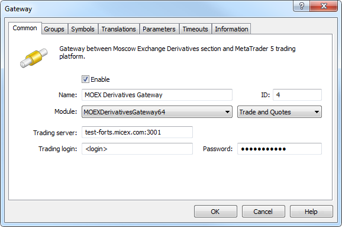

The following parameters on the "Common" tab should be set:

  * Module — MOEXDerivativesGateway. After that the gateway default parameters installation must be allowed in the dialog request.
  * ID — unique dealer identifier, on whose behalf the trade requests will be processed. Requests are routed to the gateway according to this identifier.
  * Trading server — address for connection to the exchange (not to P2MQRouter module) should be specified here in "address:port" format. In the above example, it is "test-forts.micex.com:3001" address for developers.
  * Trading login — user ID for connection to the exchange.
  * Password — password for connection to the exchange.

  * ID value must be unique in the field of manager logins and gateway identifiers.
  * Connection data (address, login and password) are provided by the exchange during the agreement conclusion.

  
---  
  
Set additional configuration parameters on the Parameters tab:

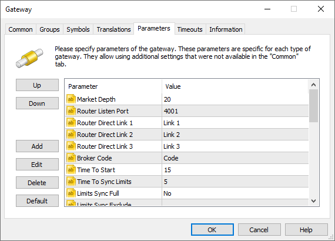

The following additional parameters are available for the gateway:

  * Trading Calendar Holidays — the exchange may have working and non-working days that are different from the MetaTrader 5 parameters for working days and holidays. This parameter redefines working/non-working days for the gateway. To add a non-working day, specify a value of the form +DDMMM. The date is specified as two digits, the month is specified as the first three letters of the month name in English. For example, +01JAN. To add a working day, specify a value of the form -DDMMM, for example, -07FEB. You can specify multiple working/non-working days, separated by semicolons, for example, + 01JAN;-07FEB.
  * Market Depth — depth of the transmitted depth of market. Depth of 5 and 20 requests are supported. The depth of 5 is used unless otherwise specified.
  * Router Listen Port — port on a local PC (127.0.0.1), where P2MQRouter module is launched by the gateway. This is the port where P2MQRouter module will accept connections from the gateway.
  * Router Direct Link1/2/3 — additional IP addresses for connection to the exchange. They are used to receive data from different streams in parallel. All addresses are provided by the exchange. The order of specifying additional addresses does not matter. For test area, use addresses test-forts.micex.com:3000, test-forts.micex.com:3003 and test-forts.micex.com:3004.
  * Broker Code — unique alphanumeric identifier of your company as the market participant. The identifier consists of three parts XXYYZZZ, where XX is a clearing company code, YY — brokerage company code, ZZZ — client code. When representing a clearing company, broker's code is specified as 00, while client's code is removed (for example, Q100, where Q1 is a clearing company code). When representing a brokerage company, client's code is specified as 000 (for example, Q1DU000, where Q1 is a clearing company code, while DU is a brokerage company one). Broker Code is provided by the exchange and used to assign numbers to client accounts.
  * Time To Start — by default, the gateway starts connecting to the exchange's server 15 minutes before the start of the main trading session (9:45 GMT+3). Some brokers may need to change this parameter. To do this, use Time To Start parameter to specify in how many minutes before the session the gateway should start connection. For example, if connection is to start at 9:35, the parameter's value should be 25.
  * Time To Sync Limits — the gateway receives fund limits by clients from the exchange and synchronizes the client balances in MetaTrader 5 appropriately before the start of a trading session. By default, the limits start arriving 5 minutes before the start of the main trading session (9:55 GMT+3). Some brokers may need to change this parameter. To do this, use Time To Sync Limits parameter to specify in how many minutes before the session the gateway should start receiving the limits. For example, in order to receive the limits at 9:50, the parameter's value should be 10. If the exchange allocates an additional morning session on a certain day, the gateway will automatically determine such a session and will synchronize data 5 minutes (or the number of minutes specified in "Time To Sync Limits" if you use a custom value) before the session start.
  * Environment — the gateway uses Plaza 2 protocol, which is the official software system providing access to the exchange. The exchange has three areas - test, learning (for practice) and real (for trading) ones. Different versions of Plaza 2 protocols are applied at each of the areas. If you connect to the learning area, set Game value for this parameter to allow the gateway to use the appropriate version of the protocol. Select Real to connect to real trading area. Set Test to connect to test area.
  * FTP Statistic Process — after the end of a trading session, the gateway downloads the official report of the exchange concerning all performed deals from the special FTP server. This report is used for control and correction of historical data in MetaTrader 5. If you want to disable the monitoring of historical data by reports, set this parameter to No.
  * Spreads Allow — inter-month spreads (security deposit benefits) are applied to some futures contracts on the derivatives market. For example, when purchasing the closest quarterly futures and the futures for the next quarter, the funds limit is decreased by the maximum value of the security deposit for both contracts. The full list of futures can be found in the ["Futures inter-month spreads" table on the exchange's website (#futures)](https://moex.com/s206#futures). The gateway automatically imports the necessary spread settings if Yes is specified in Spreads Allow parameter.
  * Symbols Path — path for importing the exchange symbols. By default, if this parameter is absent, the gateway imports the exchange's trading symbols to \Preliminary subdirectory with trading ability disabled. A system administrator should manually relocate imported symbols to the proper group and allow trading for them. If this parameter is present, the gateway imports trading symbols following the specified path. The ability to trade the symbols is enabled immediately. Thus, the administrator has no need to additionally configure the symbols. For example, if MOEX is specified in the parameter, then futures contracts are automatically added to MOEX\FORTS\*, Standard section contracts are added to MOEX\Standard\*, while expired contracts are automatically transferred to MOEX\FORTS\Expired\*.
  * Symbols Path Expired — path for transferring the expired symbols. By default, if this parameter is not specified, all expired contracts are moved to \Expired subdirectory of the folder specified in Symbols Path parameter. In the above example, it is MOEX\FORTS\Expired\*. This parameter allows re-configuring the path for transferring the expired contracts.
  * Options Allow — in addition to futures, the derivatives market allows trading options as well. If Yes, the gateway automatically imports available options to \FORTS\Options subdirectory of the directory set in the Symbols Path parameter. The gateway also handles trade requests for these symbols.
  * TP Coverage As Limit Order — the policy of passing the activation of a take profit level to the exchange. If set to Yes, an opposite limit order corresponding to the take profit activation level is passed to the exchange. If set to No, an opposite limit order at the minimum or maximum price (depending on the order direction) is passed to the exchange when a take profit is activated. For buy orders, current session's [highest price (#prices)](../../Platform-Setup/Symbols/Symbol-Settings/Trade.md#prices) is used; for Sell orders the lowest price is used. For example, when the Take Profit of a long position triggers, a limit sell order at the symbol's lowest price as of the current moment is sent.
  * Limits Sync Full — if Yes, clients' positions on the exchange are automatically imported to MetaTrader 5 in the morning, before the main trading session. Positions in MetaTrader 5, which differ from exchange positions, will be modified to conform to exchange positions (in case of a divergence, existing positions are completely closed and new ones are opened). This option has been added to automatically fix emergency possible out of sync state.
  * High Frequency Replication — Moscow Exchange provides the ability to receive market data with [high frequency](https://moex.com/n4171) — once per 3 ms instead of once per 10 ms. In order to use this ability, enable the appropriate additional service at the exchange and set the High Frequency Replication parameter to Yes. Also, replace the trade server address with the one, from which the high-frequency data is to be received. The address is provided by the exchange when enabling the service.
  * Limits Sync Exclude — allows disabling synchronization of positions and balances for the specified client groups. The platform allows transmitting trading operations from one account through different gateways. To do this, multiple accounts in external systems corresponding to different gateways are registered in the account. There are three gateways for the Moscow Exchange. Each of them synchronizes the trading state and limits. The possibility to disable synchronization allows to prevent overwriting of data about positions and limits during simultaneous operation through these gateways. Specify the list of groups for which the gateway should not synchronize positions and balances in this parameter. Groups can be specified using the "*" mask.
  * Trade Limit allows setting the overall limitation on the number of trades sent per second for the gateway. If 0 (default), no check is performed. The maximum possible value is 16384. In case of a greater value, no check is performed.
  * Trade Limit Default allows setting the limitation on the number of trades sent by separate clients. For example, if 50 is specified, then each client can send no more than 50 trades per second via the gateway (unless the client limit is overridden by the Trade Limit <account> type parameter). If 0 (default), no check is performed.
  * Trade Limit <account> parameters allow setting the limitation on the number of trades per second sent by certain clients. You can set several parameters of that kind. For example: Trade Limit 10008628 = 7, Trade Limit 10008589 = 5. The exchange account code without a broker's code (set in the Broker Code parameter) is used in <account> — on the platform side, this code is set in the client record as an [account number in the external trading system (#trade-accounts)](../../Platform-Setup/Accounts/Editing-Account.md#trade-accounts). If 0 (default), no check is performed for the specified client. The maximum possible value is 256 trades per second. Also, no check is performed if a larger value is specified.  
Before issuing a trade request to the exchange, the gateway checks the limitation on the client account and throughout the entire gateway (brokerage account). If the check fails, the gateway does not send the client's trade and returns the MT_RET_REQUEST_TOO_MANY response code. The following entries are made in the gateway journal:

2017.11.27 18:26:21.224 Gateway account HO00001 trade transactions per second limit (5) exceeded   
2017.11.27 18:26:21.572 Gateway gateway trade transactions per second limit (7) exceeded  
---  
  
  * Password Change — this parameter determines whether the gateway should generate for the current login a new password for connecting to the exchange if the old password expires in less than 7 days. The parameter is set to No by default which means that the function is disabled. Please see Password Change for further details.
  * NewsCategory — the name of the category of news received from this data feed. Further this category name can be used to specify news to be received by separate [groups](../../Platform-Setup/Groups.md).
  * Quotes Delay — delay of transmitted quotes in seconds. The maximum duration of quotes delay is 20 minutes (1200 seconds). The flow of delayed quotes is neither thinned out, nor changed. A quote is passed to MetaTrader 5 History Server only after the expiration of delay period since the quote has arrived to Gateway API. If the temporary delay parameter is not defined, the quote delay is not used. Changes in depth of market and price statistics are delayed together with the quotes flow.
  * Quotes Tickstats Sample — the minimum frequency of sending price statistics in milliseconds. This parameter allows thinning out updates of price statistics reducing the traffic.
  * Quotes Ticks Sample — the minimum frequency of sending quotes in milliseconds. This parameter allows thinning out updates of quotes reducing the traffic. It is recommended for use on demo servers only.
  * Quotes Books Sample — the minimum frequency of depth of market updates in milliseconds. This parameter allows thinning out updates of the depth of market reducing the traffic. It is recommended for use on demo servers only.

This group of parameters is used for setting up the receipt of anonymous requests via the FAST Multicatst service:

  * Market Feed Config Url — channel parameters for receiving market data from the exchange are described in XML files. These files are available on the [FTP server of the exchange](https://ftp.micex.com/pub/FAST/Spectra/templates/MOEX/). Specify here the path to the file, which describes connection to the ORDERS-LOG channel (separate configuration files are available for real and testing data). Configuration file can be copied to a local server. In this case, the appropriate path should be specified in this field.
  * Market Feed FAST Templates Url — data transmitted via FAST protocol are unpacked using the special template. Specify here the path to the template file, it is available on the [Exchange's FTP server](https://ftp.micex.com/pub/FAST/Spectra/templates/MOEX/). You can specify the FTP path or copy the file to a local server and specify the appropriate local path to it.

> Market channel parameters and template files downloaded via FTP are saved in the directory [gateway folder]\downloads. If the gateway fails to download updated files, it will use earlier downloaded files stored in this folder. The following rules apply here:

  * Market Feed A Bind — the address of the local interface the connection will be bound to, to receive market data through channel A (all data from the Exchange are duplicated on two channels).
  * Market Feed B Bind — the address of the local interface the connection will be bound to, to receive market data through channel B (all data from the Exchange are duplicated on two channels).

If at least one of the above parameters is not filled, the gateway will receive Market Depth data from Plaza 2 streams.

Also, the gateway automatically switches to receiving of Market Depth data from Plaza 2 in the following situations:

  * If it is unable to subscribe to FAST Multicast newsletter
  * In case of issues while reading the incoming data stream
  * If the status of order journal of an instrument cannot be restored after an error, for more than 5 minutes

Appropriate messages are written to the gateway log in this case:

2019.02.07 09:58:12.350 Gateway failed to initialize FAST Market Data service, service will not work  
  
2019.02.07 09:58:48.856 Gateway FAST Market Data service stopped, market depth changes will be received from Plaza2  
  
2019.02.07 09:58:59.657 Gateway can not recover FAST market data state more than 300 seconds, number: 64512, feed: ORDERS-LOG, instrument: 582383  
2019.02.07 09:58:59.657 Gateway failed to apply FAST Market Data transaction, market depth will be received from Plaza2  
---  
  
> Please contact the exchange to connect FAST Multicast services of the derivatives market to your servers in the collocation zone.

On the Groups tab, specify the mask for the groups of clients who will trade in the derivatives market. The gateway will only receive trade requests from the clients included in the allowed groups list.

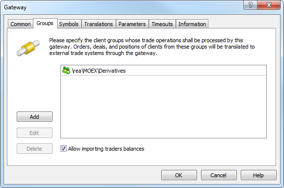

If you configure importing the limits via the gateway, make sure to enable "Allow importing traders balances" option. This will allow the gateway to synchronize clients' balances in MetaTrader 5 with exchange account limits.

Limits are synchronized in the following cases:

  * launching/re-launching the gateway during a trading session;
  * five minutes before the start of the main trading session;
  * after the trading session when the clearing data is ready;
  * in case funds are withdrawn/accrued on the client's stock account.

> A group of clients trading in the derivatives market should be configured correctly.

On the Symbols tab, specify the symbols available for the gateway. The gateway will receive quotes and perform trade operations for these symbols. Also, the settings will be automatically updated for them in case import of symbols is allowed:

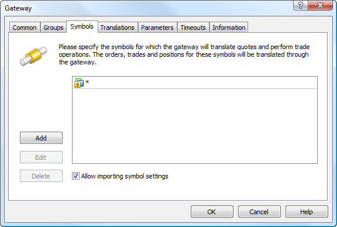

It is recommended to enable all symbols at this tab (*). Also, make sure to enable "Allow importing symbol settings" option. MetaTrader 5 Gateway to MOEX Derivatives adds necessary symbols and manages their settings on its own.

  * If the Symbols Path parameter is set, the gateway will import all new symbols to the subgroup specified in it. The trading ability is enabled immediately for all symbols. 
  * If the Symbols Path parameter is not set, the gateway will import symbols to the "\Preliminary" subgroup. In this case, the system administrator must move imported symbols to the proper subgroup and allow trading for them.
  * In case the gateway transmits configuration for the symbol that is already present in the platform, the configuration is updated. In this case the symbol is not transferred and its trading ability is not turned off.
  * In case some changes are implemented to the Depth of Market parameter of the symbol settings, the gateway and a history server must be restarted to let the changes take effect. In fact, restart is required after any change in the symbol settings.

  * On Moscow Exchange's Derivatives Market, an instrument cannot be traded during the evening session of the day on which it appeared. At an attempt to trade such an instrument, the gateway will return the "market closed" error.
  * The gateway supports conversion of symbols and quotes. For details, please view the [Symbol and Price Translation](../../Platform-Setup/Gateways/Symbol-and-Price-Translation.md) section.

  
---  
  

## Groups Configuration and Using Profit/Loss for the Current Trading Session (#config-groups)

According to the exchange rules, profit obtained during a trading day cannot be used before clearing is performed. In fact, only clearing determines the financial results of all transactions during the day. The profit received by a client during the current trading session is accumulated during the trading session and released only after intermediate or main clearing becoming available for use by the client for further trade.

In order to avoid a situation in which a client who suffered losses will try to continue trading, fixed loss is withdrawn immediately.

In this regard, the following parameters should be specified in "Profit/loss in free margin" block of Margin tab in the settings of the group that will operate on the derivatives market:

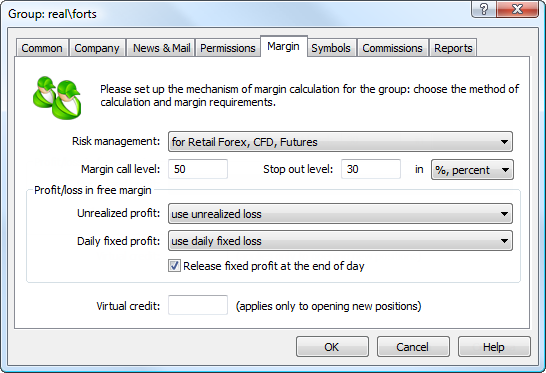

Stop Out value specified in this tab does not matter. Orders and positions created via the gateway are not removed/not closed on MetaTrader 5 side when Stop Out is triggered. Find more information on margin settings in the [appropriate section (#margin)](../../Platform-Setup/Groups/Group-Settings.md#margin).

All financial accounting on the derivative market is done in Russian rubles. Thus, Russian rubles (RUR) should be specified as deposit currency in the group settings:

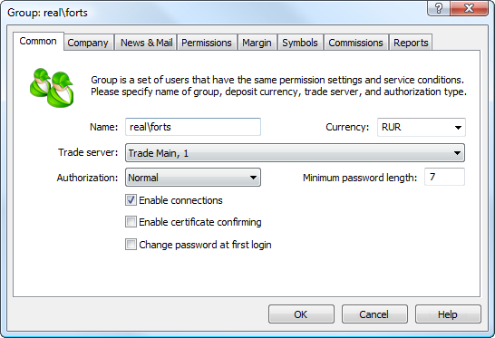

## Configuring trade requests routing (#configuring-trade-requests-routing)

To direct client requests concerning derivatives market symbols to the gateway, the [routing rules](../../Platform-Setup/Routing.md) should be set. Examples can be found in the articles concerning the gateways to other trading systems, for example: [GBOT (#routing)](https://support.metaquotes.net/en/articles/332#routing), [DGCX (#routing)](https://support.metaquotes.net/en/articles/330#routing), etc.

## Configuring trading accounts (#configuring-trading-accounts)

Each client on MetaTrader's side should be provided with a corresponding separate trading account on the exchange. After an account is opened at the exchange, it should be connected with the account within the platform. Open the appropriate client account and move to Account tab:

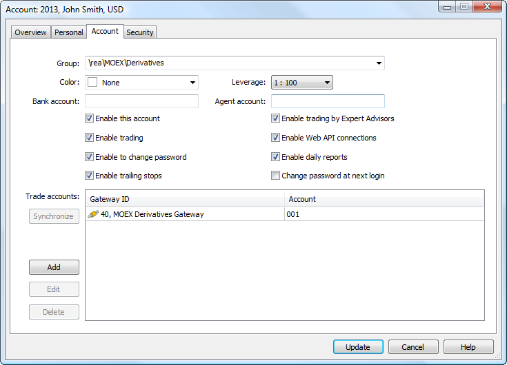

A new entry should be added in "Trade accounts" section. Select MetaTrader 5 Gateway to MOEX Derivatives in "Gateway ID" field. Specify the client code in "Account" field. The prefix corresponding to Broker Code parameter in the gateway settings is removed from the client code. During the gateway operation, the final client's code is generated using Broker Code and the client code. For example, if Broker Code is Q1DU, while client code is 001, then the client account at the exchange is Q1DU001. Similarly, if Broker Code is Q1 and the client code is ST005, then the client account at the exchange is Q1ST005.

### Risk management system (#risk-management-system)

Considering trading status of each client account allows the exchange to perform client-by-client risk management. Such control is an addition to the conventional risk management system of MetaTrader 5 platform. Thus, the ability of an end customer to perform each trading operation is controlled both on MetaTrader 5 and exchange's levels.

The gateway imports trading symbols with the appropriate settings, so that the collateral calculation algorithm for orders and positions fully corresponds to the exchange calculation algorithm.

MetaTrader 5 risk management system provides control of client positions and their collateral in real time both on client terminal's and trade server's sides. Besides, the platform allows [accounting total positions](https://support.metaquotes.net/en/docs/mt5/manager/interface/toolbox/toolbox_summary) of all clients of a brokerage company via MetaTrader 5 Manager terminal. The system controls occurrence of [Margin Call and Stop Out](https://support.metaquotes.net/en/docs/mt5/manager/margin_calls) status for each client sending appropriate notifications both to a client and brokerage company managers if necessary.

### Processing of Market orders (#processing-of-market-orders)

Since placing of market orders on the Moscow Exchange derivatives market is not supported, the gateway forwards market orders as limit orders with the minimum or maximum price depending on the order direction. The current session [highest price (#prices)](../../Platform-Setup/Symbols/Symbol-Settings/Trade.md#prices) is used for Buy orders, while the lowest price is used for Sell orders.

### Synchronizing trading status (#synchronizing-trading-status)

If a client's exchange account already has a fund limit and/or open positions at the time of the gateway launch, the account status should be synchronized with MetaTrader 5. To do this, highlight the line of the gateway and the corresponding number of the account at the exchange in "Trade accounts" section. Then click Synchronize and Synchronize All.

After that, the balance and the client's open positions will be brought in line with the exchange. Synchronization of pending orders is not supported. Below is an example of a trading account in MetaTrader 5 client terminal after synchronization:

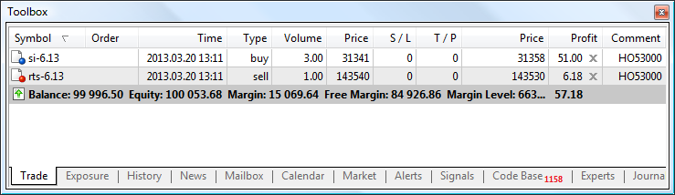

This example shows that two open positions have appeared at the account after the synchronization. Client's account at the exchange is shown in Comment column. The balance and account limit at the exchange have also been synchronized. The lower line of Trade tab displays the current status of the client's account:

  * Balance — client limit, not accounting for the results of currently open positions;
  * Equity — money on the client account regarding financial results of currently open positions;
  * Margin — amount of funds reserved on the client's account as a collateral;
  * Free Margin — amount of free funds that can be used for trading. This parameter is calculated as Equity - Margin;
  * Margin Level — percentage of the account equity to the margin volume (Equity / Margin * 100).

As a result of the account synchronization with the exchange, deals marked by special comments appear in the client's history:

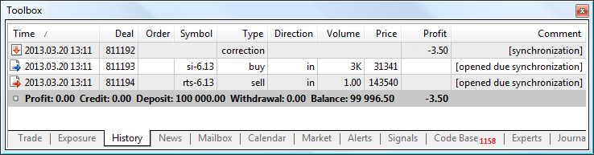

In the example above, the client's exchange account had a limit equal to 100 000 RUR, as well as two positions. After synchronization, four entries have appeared in the history:

  * The "balance" type deal used for synchronizing the client's balance and account limit at the exchange. The deal marked as "Synchronization".
  * The "correction" type deal used for synchronizing the client's balance and account limit at the exchange. The deal marked as "Synchronization".
  * The deal for buying si-6.13 symbol marked as "opened due synchronization".
  * The deal for selling rts-6.13 symbol marked as "opened due synchronization".

### Charging variation margin (#charging-variation-margin)

The variation margin is charged based on the results of intermediate and main clearing. The next example shows the deals in the client history that are created as a result of charging the variation margin.

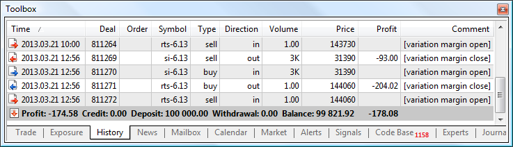

Two pairs of deals are displayed in the example:

  * closing positions at a settlement price for si-6.13 and rts-6.13 symbols with [variation margin close] comment;
  * re-opening positions at a settlement price for si-6.13 and rts-6.13 symbols with [variation margin open] comment.

### Profit for the Current Session (#profit-for-the-current-session)

The profit received by a client during the current trading session is unavailable for re-investing. It is accumulated during the trading session and released only after intermediate or main clearing becoming available for use by the client for further trade.

Below is an example of closing a profitable trading position during the trading session.

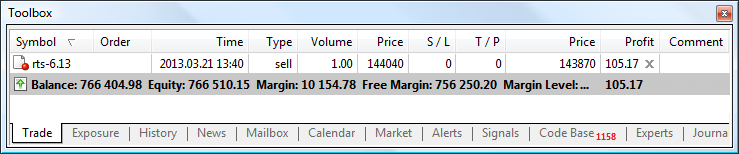

Profit received after closing the position will be shown in the balance but it will not be available for use till the intermediate or main clearing. The total accumulated profit is displayed in "Blocked" field of the trading status line:

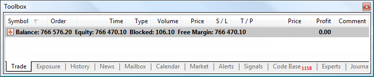

"Blocked" field value is reset to zero after the clearing.

### Depositing/Withdrawing Funds from the Account (#depositingwithdrawing-funds-from-the-account)

When depositing or withdrawing the funds from the account, the limit at the exchange is synchronized with the client's balance on MetaTrader 5 side. The appropriate balance operations with comments like "FORTS, account XXX", where XXX is the number of the client's account, appear in the client's deals history.

Updating the account limit in MetaTrader 5 does not lead to the account limit update at the exchange, as such a mechanism is currently not provided.

## Charging commissions (#charging-commissions)

The exchange charges commission for each performed deal. Commission value is received by the gateway and added to the description of each deal performed at the exchange in Commission field.

Brokerage companies can take account of their own commissions in any way. In actual practice, commission is usually considered at the broker's back-office level and affects the client limits before the start of the trading session. However, it is impossible to identify this commission in the history of client deals, because there is no clear indication that this is exactly a broker's commission in balance operations performed during the synchronization of limits.

Besides, broker's commission can be additionally taken into account by means of MetaTrader 5. More details are available in the ["Commission settings"](../../Platform-Setup/Groups/Commission-Settings.md) section. In this case, commission will also be considered at the back-office level and affect client limits before the start of the trading session but the amount of the commission will be shown in real time in the client terminals.

Accounting of commissions in MetaTrader 5 should strictly comply with accounting at the broker's back-office level.

## Delivery of futures contracts (#delivery-of-futures-contracts)

All futures contracts delivery deals are displayed in clients' history as special technical deals performed by the exchange.

  * Settlement contracts — positions are closed at a settlement price and the appropriate profit/loss is deposited/withdrawn.
  * Equity futures — upon delivery, technical deals of positions closing are performed. An appropriate position is opened for a client on the market.

## History Data Synchronization (#history-data-synchronization)

During the conventional gateway operation, time and prices used to generate bars strictly correspond to the exchange data. All charts are generated using the prices and time of actual deals executed at the exchange.

After the end of a trading session, the exchange publishes the official report on the performed deals. This report is used by the gateway for data management. In case of any discrepancies, historical data is corrected in accordance with the report.

If the gateway is temporarily stopped and then relaunched again during the trading session, missing fragments of historical data are automatically restored (synchronized).

During the initial installation in MetaTrader 5, the gateway automatically imports historical data for all symbols for the last year since the launch of the gateway.

## Password change (#password-change)

In accordance with the Exchange policy, the account password for connection to MOEX must be changed every 90 days. Logging in with an expired password is impossible.

To avoid an unexpected interruption of your gateway due to an expired password, it can use a special mechanism for automatic password change. The mechanism is controlled via the "Password Change" parameter.

If the "Password Change" parameter is disabled (the value is "No"), then 30 days before the expiration of the current password the gateway starts displaying an appropriate message, prompting to change the password. This message will appear in the log every day, before the trading start time:

Gateway password for current exchange login 'TradingLogin' will expire in 15 days at 2020.12.30 12:00, please change current password manually or enable gateway parameter 'Password Change'  
---  
  
If the parameter is enabled (the value is "Yes"), then 30 days before the password expires, the gateway starts displaying a warning every day before the start of trading, notifying that the password will be changed automatically 7 days before its expiration:

Gateway password for current exchange login 'TradingLogin' will expire in 14 days at 2020.12.29 12:00, password will be changed automatically 7 days before expiration  
---  
  
7 days before password expiration, the gateway sends a password change request to the exchange. The new password is generated randomly. It will be displayed twice in the gateway log: before sending a request to the exchange and after receiving a password change confirmation:

Gateway password for current exchange login 'TradingLogin' will expire in 6 days at 2020.12.21 12:00, password will be changed   
Gateway change password request sent, new password: NE@1fFtt   
Gateway current password for login 'TradingLogin" on spectra-t1.moex.com:3001 changed, new password: NE@1fFtt  
---  
  
After the password is changed, the gateway will start using the new password value for further connections, and this no additional action is required.

  * The new password is saved to the settings.dat file in the gateway working directory. If this file is deleted, enter the new password manually in gateway settings. It can be found in the gateway log as described above.
  * When the password is changed using third-party software or upon request to the exchange, specify a new password in gateway settings. This is enough for further gateway operation.

  
---  
  

## Gateway Operation Management (#gateway-operation-management)

To receive data on the gateway operation, request its logs via MetaTrader 5 Administrator. Select the gateway and move to Journal tab.

The following entries indicate that the gateway started its operation successfully:

Gateway  synchronized with FORTS server  
---  
  
The following entry indicates successful synchronization of the clients' limits:

Gateway clients limits synchronized  
---  
  
Use "session" keyword to request data on trading session completion. Session ID (4293 in the example), as well as time of its completion (2013.04.09 12:45:00) are specified in such entries.

Gateway  trade session 4293 on SEBM-4.13 finished at 2013.04.09 12:45:00  
---  
  
To receive data on the session's settlement price, request the journal using "variation margin" key phrase. In the example below, the settlement price for RTS-6.13 symbol is equal to 139750:

Gateway execution sending complete - variation margin for RTS-6.13, settlement price: 139750, account 'XO0'  
---  
  
The following special entries are made in the gateway journal to analyze operations processing speed:

Gateway  order #736398 - message process time: 31.322 ms (gateway time: 0.331 ms, exchange time: 30.991 ms)  
---  
  
The following parameters are shown here:

  * message process time - total time between sending a message to the exchange and receiving an answer;
  * gateway time - time spent by the gateway to send a message;
  * exchange time - time spent by the exchange to process a message and send an answer to the gateway.

Apart from the gateway journal, P2MQRouter module operation journal can also be analyzed in case of any issues. This module is launched by the gateway when starting its operation. Its operation journals are located at the history server in \Gateways\FORTS Gateway\\[gateway configuration name]\Plaza 2\logs directory.

## Gateway Service Operations (#operations)

The gateway can perform various service operations on accounts during operation.

Deals with the type "Correction" and with the comment "[synchronization]" are formed in the following cases:

  * When you manually synchronize an account from the Administrator terminal
  * When synchronizing limits Time To Sync Limits minutes before the start of the morning session, if the Limits Sync Full parameter is enabled

Deals with the type "Correction" and with the comment "FORTS, account XXXXX" are formed in the following cases:

  * When synchronizing limits Time To Sync Limits minutes before the start of the morning session, if the Limits Sync Full parameter is enabled
  * When synchronizing limits, if the gateway is launched during the trading session or later than "Time To Sync Limits" minutes before the start of the trading session
  * When synchronizing limits after the completion of the main clearing

Deals with the type "Balance" and with the comment "FORTS, account XXXXX" are formed in case the balance on the exchange is changed during the trading session: In this case, you should contact the exchange to find out the reasons for balance changes. This is usually associated with replenishment/withdrawal of funds on the exchange account.
