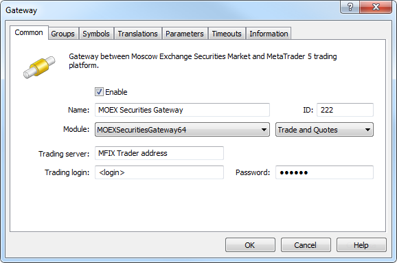
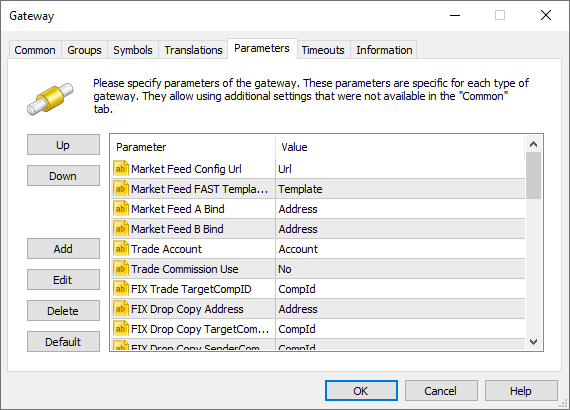
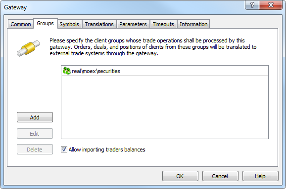
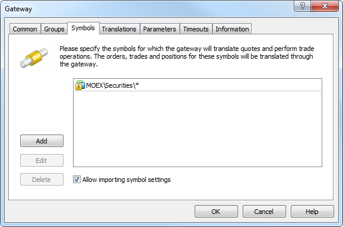
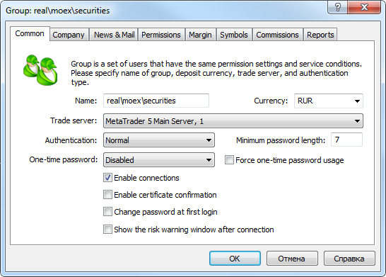
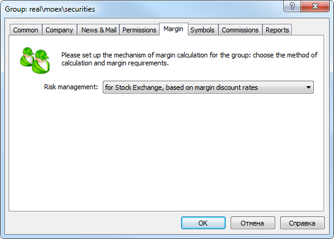
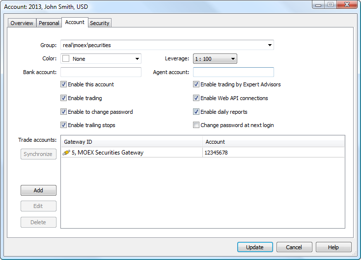

[🏠 Document Start](../../../README.md) / [MetaTrader 5 Trading Platform](../../../MetaTrader-5-Trading-Platform.md) / [Platform Components](../../Platform-Components.md) / [Gateways](../Gateways.md) / MOEX Securities

[Previous](MOEXFX.md) | [Next](MOEX-Derivatives.md)

# MetaTrader 5 Gateway to MOEX Securities (#metatrader-5-gateway-to-moex-securities)

MetaTrader 5 Gateway to MOEX Securities allows trading stocks and bonds on the [Moscow Exchange Equity and Bond Market](https://moex.com/s338).

It includes two markets:

  * Equity Capital Market — Russian and foreign shares, depositary receipts, fund shares, ISUs, and ETFs. The main trading mode is T+2 order book (Main Trading Mode T+). Trading is performed with a central counterparty, partial collateral and deferred execution. Settlement and delivery are performed two days after a trade is conducted (T+2).  
The gateway supports only shares.
  * Debt Capital Market — federal loan bonds (OFZs), regional and municipal bonds, Russian corporate bonds (including exchange ones) denominated in rubles and foreign currency, corporate Eurobonds and sovereign Eurobonds of the Russian Federation.  
The gateway supports only OFZs. Trading is performed with a central counterparty, partial collateral and deferred execution. The main trading mode for OFZ is T+1 order book (Main Trading Mode T+). Settlement and delivery are performed the next day after a trade is conducted (T+1).

## MetaTrader 5 Gateway to MOEX Securities (#metatrader-5-gateway-to-moex-securities)

MetaTrader 5 Gateway to MOEX Securities is a separate MOEXSecuritiesGateway64.exe file that uses Gateway API for its operation. Gateway module is originally included in the platform delivery set. After purchasing the gateway, the trading platform license will automatically update via LiveUpdate system. This allows you to start using MetaTrader 5 Gateway to MOEX Securities without any limitations.

> [Order MetaTrader 5 Gateway to MOEX Securities](https://support.metaquotes.net/en/market/product/273)

## Common trading principles and their implementation in MetaTrader 5 (#general)

Trading in the market is regulated by the exchange rules: [Trading Rules of the Closed Joint-Stock Company "MICEX Stock Exchange".](https://fs.moex.com/files/926) Let's consider some of the key features and examples for more clarity.

In the stock market, the result of a transaction is immediately displayed on the client trading status: an open position appears, and an appropriate amount of funds is withdrawn from the balance. Depending on the instrument, the actual settlement may occur the next day or the second day after the position was opened (T+). However, unlike the FX section, positions are not moved between symbols with different calculation periods (for example, from USDRUB_TOM to USDRUB_TOD). Position on the same instrument is displayed on MetaTrader 5 side, while all operations related to moving and swapping are carried out on the exchange side. The resulting client status is then imported via the limit files.

Groups of instruments

Securities market Instruments are divided by [type and trading mode](ftp://ftp.moex.com/pub/ClientsAPI/ASTS/docs/ASTS_Markets_and_Boards.pdf):

  * TQBR — T+, Shares and debt warrants (DW);
  * TQDE — T+, [D Bonds](https://moex.com/s1858);
  * TQIF — T+, Investment units;
  * TQOB — T+, Bonds;
  * TQQI — T+, [mode for qualified investors](https://moex.com/s1434);
  * TQTF — T+, foreign exchange traded funds (ETFs);
  * AUCT — Auction;
  * SPEQ — technical transactions.

The instrument groups the gateway is to work with are defined by the Trades Mode parameter. By default, all groups are enabled, except for AUCT. SPEQ transactions are transmitted by the gateway regardless of the settings.

The same instruments can be traded in different modes. Execution results are displayed on the same position. For example, it is possible to buy shares by auction and in the order book, and this affects the unified position for the instrument.

Repo transactions

MetaTrader 5 Gateway to MOEX Securities does not allow repo deals, though it correctly imports the appropriate transactions to MetaTrader 5 from the external system. Thus, clients are able to see the current status and history of accounts in their terminals.

Repo deals are marked "repo leg 1" and "repo leg 2" in trading history for each transaction party. Target repo transactions are marked "target repo leg 1" and "target repo leg 2".

Auction

Before the start and after the end of each trading session, an auction is performed in the securities market to determine the fair instrument price. [Opening auction](https://moex.com/s1647) starts at 9:50 and ends at 10:00 (exchange time). [Closing auction](https://moex.com/s1173) is held from 18:40 to 18:50.

Transactions performed during an auction on MetaTrader 5 side are not marked in any particular way.

Bonds

The gateway supports trading OFZs only. The bonds have two key parameters:

  * Face value — initial value set by an issuer.
  * Accrued interest — accumulated coupon interest (part of the coupon interest calculated in proportion to the number of days since the coupon bond issuance or the last coupon interest payment).

Profit on MetaTrader 5 side is calculated as the difference between the prices of a position at the time of opening and closing. Position price is defined as follows:

Price/100 * Face value * Volume in lots * Contract size + Accrued interest * Volume in lots * Contract size  
---  
  
The price is divided by 100 since bond prices are passed as a face value percentage.

The current floating profit at bonds is calculated without an accrued interest:

Price/100 * Face value * Volume in lots * Contract size  
---  
  
At the end of a trading session, profit by positions can be corrected according to the exchange data.

Margin trading

Trade is marginal and contractual obligations are delayed in time. Until the time of settlement of obligations, the margin is locked on the client's account. The margin is defined by [discounts](../../Platform-Setup/Symbols/Symbol-Settings/Margin-Rates.md) relative to the current price of the instrument. Discounts are set by the broker, however they cannot be lower than the values ​​determined by [National Clearing Centre](https://www.nkcbank.com/viewCatalog.do?menuKey=36) (NCC). Due to the discounts, clients can make transactions with a leverage, i.e. open positions investing a larger sum than is available on their account.

## How the gateway works (#principles)

The gateway receives market data on trading on Moscow Exchange via Multicast. This is a UDP protocol that allows packets to be transmitted to multiple recipients. Find the details of the protocol in ["Market Data Multicast Ver3.3 User Guide"](https://ftp.micex.com/pub/FAST/ASTS/docs/Archive/Rus_Market_Data_Multicast_User_Guide_Ver3.3.3.pdf). The system administrator must configure the server where the gateway is running to receive data.

The UDP protocol does not have built-in methods to ensure reliability, ordering, or data integrity, which on the one hand makes it unreliable. But on the other hand, it saves time and money required to deliver data to clients. This provides data delivery to clients with minimum delay. All transmitted data are doubled to control their integrity. The gateway receives market data from the Exchange in four tables:

  * Trades executed on the Exchange.
  * Trade statistics.
  * Depth of Market.
  * List of instruments.

To deliver each data type, four connections are created: two connections for the incremental channel where only changes relative to the previous state are transmitted, and two for the so-called snapshots (the state at a certain time).

For committing trade operations and receiving the trading status of clients, the gateway uses three FIX services, for each of which a separate connection is created:

  * MFIX Trade - entering and canceling orders and receiving order execution reports.
  * MFIX Drop Copy - receiving the stream of orders and deals from other terminals (other than MetaTrader 5).
  * MFIX Trade Capture - sending all trades of all accounts bound to the current FIX identifier of the broker.

Accordingly, three FIX IDs are required. Read more about the FIX services in ["Moscow Exchange public FIX 4.4 interface specification for Securities and FX markets"](ftp://ftp.micex.com/pub/FIX/ASTS/docs/public_fix44_interface_in_russian_v_4.pdf). If any of the services FIX is not required, it can be omitted. Simply do not specify its address in the gateway settings.

## Integration with broker's back office (#integration)

The relevant trading client state in MetaTrader 5 is maintained using the client limiting interface provided by the gateway. Limiting is implemented through import of limit files in the QUIK format. The detailed format description is available in the [QUIK WorkStation reference](https://www.quik.ru/depot/quikref.zip). This format has been selected due to the fact that the platform is currently used by most of the brokers that provide access to Moscow Exchange, and therefore such an approach is the most simple and convenient one to move to MetaTrader 5.

In the gateway settings, specify the address (ftp or local address), from which the gateway shall automatically read the limit and correction files and synchronize client states in MetaTrader 5. The limit file can be used at any moment of gateway operation. Once the administrator adds a file to the specified directory, the gateway will process it and will set the client status in accordance with it. This behavior can also be used to recover client states in case of failures.

Limit correction files are used to reflect the limit changes in the broker's back-office system. The gateway processes them only in trading hours (10:00 to 23:50 Moscow time). Correction files are processed in accordance with the following algorithm:

  * When the correction file is updated, the gateway starts analyzing it.
  * It parses all the correction entries from the file one by one.
  * The gateway finds the entry with LIMIT_ID (the correction identifier is unique within a file and within one trading day) equal to LIMIT_ID_LAST (the identifier of the last processed correction).
  * All subsequent entries are processed and applied to the clients' trading states. While each subsequent entry is processed, the value of LIMIT_ID_LAST is updated to avoid repeated application of corrections.
  * As soon as processing is over, the gateway uploads the file with the correction results. The file is of the QUIK system format. The file is uploaded at the address specified in the [gateway settings (#param)](https://support.metaquotes.net/en/articles/411#param).
  * At the beginning of each trading day, the ID of the last processed correction is reset.

## Configuring the gateway (#configuring-the-gateway)

To start working, add [the new gateway configuration](../../Platform-Setup/Gateways.md):

The following parameters on the "Common" tab must be set:

  * Module — MOEXSecutitiesGateway64. After that the gateway default parameters installation must be allowed in the dialog request.
  * ID — unique dealer identifier, on whose behalf the trade requests will be processed. Requests are routed to the gateway according to this identifier.
  * Trading server — address for connection to the MFIX Trade service.
  * Trading login — login (FIXTradeSenderCompID) for connection to MFIX Trade.
  * Password — password for connection to MFIX Trade.

  * ID value must be unique in the field of manager logins and gateway identifiers.
  * Connection data (address, login and password) are provided by the exchange.

  
---  
  
Additional configuration parameters must be set on the Parameters tab:

The following additional parameters are available for the gateway:

  * Trading Calendar Holidays — each exchange works in accordance with its own trading calendar. By default, non-working days for the gateway are Saturday and Sunday. Using this option, you can override the working/non-working days for the gateway. To add a non-working day, specify a value of the form +DDMMM. The date is specified as two digits, the month is specified as the first three letters of the month name in English. For example, +01JAN. To add a working day on Saturday or Sunday, specify a value of the type -DDMMM, for example, -07FEB. You can specify multiple working/non-working days, separated by semicolons, for example, + 01JAN;-07FEB.
  * Market Feed ConfigUrl — parameters of channels for receiving market data from the exchange are described in the XML file. This file is available on the [Exchange's FTP server](https://ftp.micex.com/pub/FAST/ASTS/config/). Specify the path to the file, depending on what data you want to receive (real or test). Configuration file can be copied to a local server, the appropriate path should be specified in this field. The gateway reads data for connection to the following channels (set by the connection_id parameter in the file):

  *     * OBR and OBS — an incremental channel and a channel of snapshots for transmitting the depth of market.
    * TLR and TLS — an incremental channel and a channel of snapshots for transmitting trading operations.
    * MSR and MSS — an incremental channel and a channel of snapshots for transmitting trade statistics.
    * IDF — a channel for transmitting the list of financial instruments.
  * Market Feed FAST Templates Url — all market data are transmitted through the FAST protocol. Transmitted data are unpacked using the special FAST template. Specify here the path to the template file, it is available on the [Exchange's FTP server](https://ftp.micex.com/pub/FAST/ASTS/template/). You can specify the FTP path or copy the file to a local server and specify the appropriate local path to it.

> Market channel parameters and template files downloaded via FTP are saved in the directory [gateway folder]\downloads. If the gateway fails to download updated files, it will use earlier downloaded files stored in this folder. The following rules apply here:

  * Market Feed A Bind — the address of the local interface the connection will be bound to to receive market data through channel A (all data from the Exchange are duplicated on two channels).
  * Market Feed B Bind — the address of the local interface the connection will be bound to to receive market data through channel B (all data from the Exchange are duplicated on two channels).
  * Trade Account — the account used for registering the transaction performed through the gateway on the exchange.
  * FIX Trade TargetCompID — FIX messages heading standard parameter used for a message recipient identification for the MFIX Trade service. The remaining connection parameters are specified on the "Common" tab in the gateway settings.
  * Trade Commission Use — this parameter sets the use of commissions from the exchange. The commissions are specified in each transaction received from the exchange. If the parameter is set to "Yes", this value is used in the platform. If set to "No" (default), the broker can [configure commission calculation](../../Platform-Setup/Groups/Commission-Settings.md) directly in MetaTrader 5 based on the commission calculation formula used on the exchange.
  * FIX Drop Copy Address — address for connection to the MFIX Drop Copy service. The gateway can work without connection to the service. In that case, leave this parameter empty.
  * FIX Drop Copy TargetCompID — FIX messages heading standard parameter used for a message recipient identification for the MFIX Drop Copy service.
  * FIX Drop Copy SenderCompID — FIX messages heading standard parameter used for a message sender identification for the MFIX Drop Copy service.
  * FIX Drop Copy Password — password for connection to MFIX Drop Copy.
  * FIX Trade Capture Address — address for connection to MFIX Trade Capture.
  * FIX Trade Capture TargetCompID — FIX messages heading standard parameter used for a message recipient identification for the MFIX Trade Capture service.
  * FIX Trade Capture SenderCompID — FIX messages heading standard parameter used for a message sender identification for the MFIX Trade Capture service.
  * FIX Trade Capture Password — password for connection to the MFIX Trade Capture service.
  * Limits Url — local or FTP address of limit files to be imported to MetaTrader 5.
  * Limits Corrections Url — local or FTP address of limit correction files to be imported to MetaTrader 5.
  * Limits Corrections Result Url — local or FTP address where the files of limit correction import results will be exported.

> In order to download and import the limits and corrections, the gateway requires all three parameters filled: Limits Url, Limits Corrections Url and Limits Corrections Result Url. If any of them is not filled or absent, the gateway will not download and import the files.

  * Limits FTP Login — if limit files are received from the FTP server, specify the login and password for connection to it.
  * Limits FTP Password — if limit files are received from the FTP server, specify the login and password for connection to it.
  * Symbols Path \- path for importing the exchange symbols. By default, if this parameter is absent, the gateway imports the exchange's trading symbols to \MOEX\Securities\ subdirectory with trading ability disabled. A system administrator should allow trading for them after the import. If this parameter is present, the gateway imports trading symbols following the specified path.
  * Limits Kind — specify a type of limits imported from the limits file (Limits Kind = LIMIT_KIND from the file). For the securities market, the default value is "2" (corresponds to the T+2 limits).
  * Trades Mode — specify the markets (for example, TQBR, TQDE, TQIF) the gateway is to work for. The mode codes are used to define the markets. The values can be comma-separated or entered via the "*" and "!" masks. Do not specify the "*" mask (all markets) because the same instruments (the ones having similar names) with different quotes can be traded on different markets. In MetaTrader 5, symbol names are unique, and all quotes are merged into a single stream.
  * Execution Reports Mode — specify the markets, for which Execution Reports are processed. This parameter is reserved for future use. You do not need to specify it.
  * Short Limits Enabled — if "Yes", the gateway checks global limits by clients' short positions (by QUIK limit files). Brokers have certain assets for each trading instrument (for example, a certain number of shares). To avoid calculation issues, they should not allow their traders to sell more assets than they have. When the check is enabled, the gateway keeps internal statistics of short positions for each instrument opened by traders during the day. When reaching the limit, further requests for opening short positions are rejected. The gateway also considers traders' long deals — if a long position is opened after a short one for the same instrument and with the same volume, the limit returns to its original state. If only a long position is opened, the total limit is not increased.  
The gateway keeps an internal record of short positions during the session even if ShortLimitsEnabled is disabled. Thus, if the parameter is enabled during a trading session, the gateway does not need time for calculations. If the limit is already exceeded at the time of connection, further short operations are immediately rejected. By default, the check is disabled ("No").
  * FIX Heartbeat Interval — Heartbeat messages are used in the FIX protocol for monitoring the status of connection between the Exchange and the gateway. If the gateway does not receive any data from the Exchange or Heartbeat messages during the FIX Heartbeat Interval, the connection is considered to be lost and the gateway tries to restore it. The default value of FIX Heartbeat Interval is 30 seconds. The valid range of values is from 10 to 60 (the number of seconds).
  * External Account Required — if the external system account is not specified for the client on the MetaTrader 5 side, the client's requests are sent to the exchange on behalf of the broker, not on behalf of the client. To disable sending of requests from such clients to the exchange, set "Yes" for the External Account Required parameter. The gateway will immediately reject such requests. "No" is used by default, which means requests from clients without the external account are sent to the exchange.
  * Margin Calculation Mode — [calculation type (#calculation)](../../Platform-Setup/Symbols/Symbol-Settings/Trade.md#calculation) used for the financial instruments imported by the gateway into the platform. If "Common", symbols are imported with the "Exchange Stocks" and "Exchange Bonds" types. If the value is "MOEX", symbols are imported with the "Exchange MOEX Stocks" and "Exchange MOEX Bonds" types (margin calculation is performed according to the rules adopted at the exchange on July 1st, 2019).
  * Time To Start — by default, the gateway starts connecting to the exchange's server 35 minutes before the start of the main trading session (9:25 GMT+3). Some brokers may need to change this parameter. To do this, use Time To Start parameter to specify in how many minutes before the session the gateway should start connection. For example, if connection is to start at 9:35, the parameter's value should be 25. The maximum possible value for the parameter is 250.
  * Money Currency Codes — currencies of money limits for which import from the limits file is allowed. The default is "SUR,USD": money limits for all currencies except the Russian Ruble and the US Dollar are skipped. The value corresponds to the "CURR_CODE" tag from the limits file.
  * Quotes Delay — delay of transmitted quotes in seconds. The maximum duration of quotes delay is 20 minutes (1200 seconds). The flow of delayed quotes is neither thinned out, nor changed. A quote is passed to MetaTrader 5 History Server only after the expiration of delay period since the quote has arrived to Gateway API. If the temporary delay parameter is not defined, the quote delay is not used. Changes in depth of market and price statistics are delayed together with the quotes flow.
  * Quotes Tickstats Sample — the minimum frequency of sending price statistics in milliseconds. This parameter allows thinning out updates of price statistics reducing the traffic.
  * Quotes Ticks Sample — the minimum frequency of sending quotes in milliseconds. This parameter allows thinning out updates of quotes reducing the traffic. It is recommended for use on demo servers only.
  * Quotes Books Sample — the minimum frequency of depth of market updates in milliseconds. This parameter allows thinning out updates of the depth of market reducing the traffic. It is recommended for use on demo servers only.

> How to change password for FIX services

On the Groups tab, specify the group of clients who will trade in the FX Market. The gateway will only receive trade requests from the clients included in the allowed groups list.

To import the limits via the gateway, enable the "Allow importing traders balances" option. This will allow the gateway to synchronize clients' balances in MetaTrader 5 with exchange account limits.

> A group of clients trading in the FX Market should be configured correctly.

On the Symbols tab, specify the symbols available for the gateway. The gateway will receive quotes and perform trade operations for these symbols. Also, the settings will be automatically updated for them in case import of symbols is allowed:

Specify here the group of symbols the gateway will operate with. Also, "Allow importing symbol settings" should also be enabled. MetaTrader 5 Gateway to MOEX Securities adds necessary symbols and manages their settings on its own.

The symbols imported by the gateway are put to the "\MOEX\Securities" symbols subgroup.

> The gateway supports conversion of symbols and quotes. For details, please view the [Symbol and Price Translation](../../Platform-Setup/Gateways/Symbol-and-Price-Translation.md) section.

## Configuration of groups (#group)

A separate group should be created for the clients working in the securities market. Specify RUR as the deposit currency in the group settings:

In the "Margin" tab, choose the risk management mode "for Stock Exchange, based on margin discount rates". In this mode, pre-trade control is based on discounts specified in [symbol settings](../../Platform-Setup/Symbols/Symbol-Settings/Margin-Rates.md). Discounts are set by the broker, however they cannot be lower than the values ​​determined by [National Clearing Centre](https://www.nkcbank.com/viewCatalog.do?menuKey=36) (NCC).

For separate clients based on risk policies, create different groups for them. In these groups, [you can override symbol discount settings](../../Platform-Setup/Groups/Group-Symbol-Settings/Margin.md).

## Configuring trade requests routing (#configuring-trade-requests-routing)

To direct client requests concerning the securities market symbols to the gateway, the [routing rules](../../Platform-Setup/Routing.md) should be set. The examples can be found in the articles about the gateways to other trading systems, like: [GBOT (#routing)](https://support.metaquotes.net/en/articles/332#routing), [DGCX (#routing)](https://support.metaquotes.net/en/articles/330#routing), etc.

## Configuring trading accounts (#account)

Each client on MetaTrader 5 side should be provided with a corresponding separate trading account on the exchange. After an account is opened at the exchange, it should be connected with the account within the platform. Open the appropriate client account and move to Account tab:

A new entry should be added in "Trade accounts" section. Select MetaTrader 5 Gateway to MOEX Securities in "Gateway ID" field. Specify the client code in "Account" field (client code on the exchange).

> If the external system account is not specified for the client, the client's requests are sent to the exchange on behalf of the broker, not on behalf of the client. You may use the External Account Required parameter to disable sending of requests from such clients to the exchange.

## The configuration of the gateway is complete. To control the gateway operation, use the [Journal](../../Platform-Setup/Gateways/Journal-of.md). (#the-configuration-of-the-gateway-is-complete-to-control-the-gateway-operation-use-the-journalplatform-setupgatewaysjournal-ofmd)

## Gateway launch specifics (#gateway-launch-specifics)

To avoid an excessive load, the amount of attempts to connect the gateway to the exchange is limited. If the gateway is unable to connect the exchange immediately, it repeats connection attempts for approximately 5 minutes (about 15 attempts). If all the attempts fail, the gateway stops and writes the following entry in the journal:

reached the maximum number of connection attempts (16), gateway stopped  
---  
  
In order for the gateway to continue connection attempts, the administrator should restart the gateway.

## Running in Quote Receiving Mode (#quotes-only)

This mode allows using the gateway only for receiving quotes from the exchange, without processing trading operations. Leave the value of the following parameters blank:

  * Trade server
  * FIX Drop Copy Address
  * FIX Trade Capture Address

The gateway will only connect to FAST channels to receive a list of symbols and quotes.

> In this mode, the gateway continues processing limit files, but does not process correction files.

## Gateway Service Operations (#operations)

The gateway can perform various service operations on accounts during operation.

  * Deals with the type "Correction" and with the comment "[synchronization]" are formed when synchronizing limits of the account with the QUIK limit file
  * Deals with the comment "limit correction, 'XXXXX'" are formed when limits are corrected according to the corresponding QUIK file
  * Deals with the comment "[swap close deal]" and "[swap reopen deal]" are formed when processing a swap deal arriving though the Trade Capture channel
  * Deals with the comment "[target repo leg 1]" and "[target repo leg 2]" are formed when processing a targeted repo trade arriving through the Trade Capture channel on the Securities Market
  * Deals with the comment "[target deal]" are formed when processing a targeted deal arriving through the Trade Capture channel on the Securities Market
  * Deals with the comment "[repo leg 1]" and "[repo leg 2]" are formed when processing a targeted repo trade arriving through the Trade Capture channel on the Securities Market
  * Deals with the comment "[technical deal]" are formed when processing a technical deal on the Securities Market

