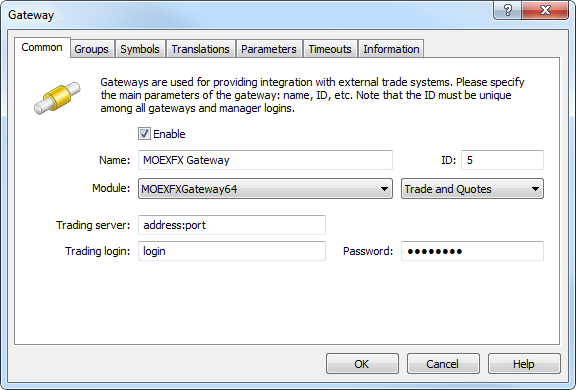
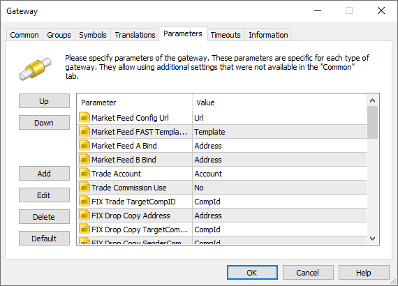
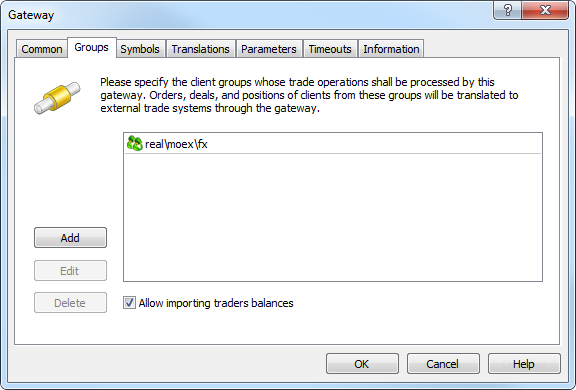
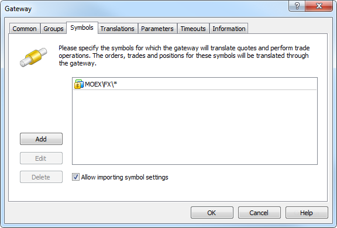
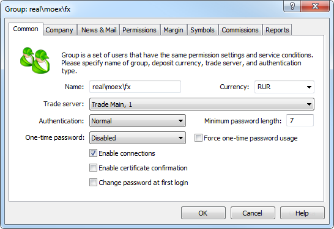
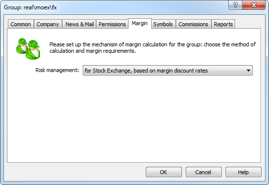
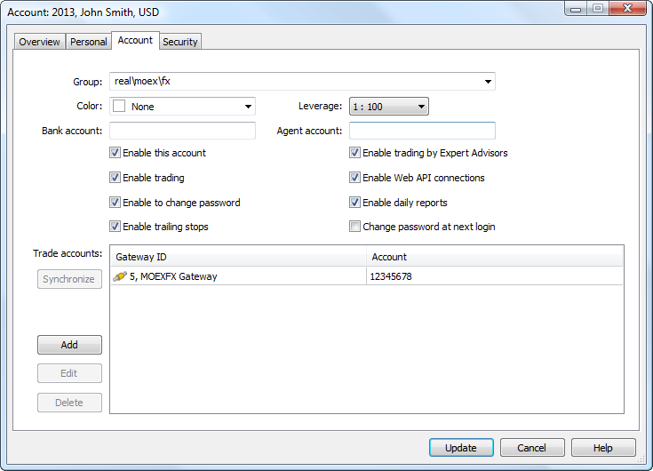

[🏠 Document Start](../../../README.md) / [MetaTrader 5 Trading Platform](../../../MetaTrader-5-Trading-Platform.md) / [Platform Components](../../Platform-Components.md) / [Gateways](../Gateways.md) / MOEXFX

[Previous](../Gateways.md) | [Next](MOEX-Securities.md)

# MetaTrader 5 Gateway to MOEXFX (#metatrader-5-gateway-to-moexfx)

MetaTrader 5 Gateway to MOEXFX enables one-click currency trading with the exchange "Depth Of Market" option and financial market analysis using built-in technical indicators. With the wide functionality of MetaTrader 5, traders can automate the trading process using robots, which they can develop themselves, order from professionals or buy in the trading application store [MetaTrader Market](https://www.mql5.com/en/market). Financial news and important releases appear right in the terminal to enable traders keep the track of market events. The extremely popular market service of [Copy Trading](https://www.mql5.com/en/signals) is also available to traders.

[Moscow Exchange's FX Market](https://moex.com/s1094) is the oldest regulated domestic FX trading venue operating since 1992. The Exchange market is the center of liquidity for ruble related operations. The Bank of Russia sets the official ruble exchange rate on the basis of exchange trading results.

Moscow Exchange's FX Market is one of the most dynamically developing segments of Russia's financial market. The total trading volume on Moscow Exchange's FX Market increased 34% YoY and amounted to 156 trln rubles in 2013. Now Moscow Exchange is experiencing increased activity: in the third quarter of 2014 [trading volumes increased](https://moex.com/n6803/?nt=201) in almost all markets, but the FX section showed the best result. The total trading volume of the FX Market has increased by 26.4% compared to the third quarter of 2013 and amounted to 55.86 trillion rubles.

USD, Euro, Chinese Yuan, Ukrainian hryvnia, Kazakh tenge, the Belarusian ruble, bi-currency basket, and FX swap transactions can be made via the market's electronic trading system.

> [Order MetaTrader 5 Gateway to MOEXFX](https://support.metaquotes.net/en/market/product/272)

## Common Trading Principles and their Implementation in MetaTrader 5 (#general)

Trading in the FX Market is regulated by ["FX and Precious Metals Market Trading Rules of the Moscow Exchange"](https://fs.moex.com/files/1498). Here are some of the key trading features and examples.

In the currency market, the result of a transaction is immediately shown on the client trading status. By opening a long position, a client receives assets, while obligations arise from opening a short position.

At this point MetaTrader 5 provides two types of financial instruments of Moscow Exchange's FX Market:

  * Settlement of obligations is due on the day of the transaction. Suffix TOD is used for such instruments. For example, USDRUB_TOD. Each TOD symbol is traded during a certain session defined by the Exchange trading hours, obligations are settled at the end of the sessions. For example, USDRUB_TOD trading hours are 10:00 to 17:15 (Moscow time).
  * Settlement of obligations is due on the day following the day of the transaction. Suffix TOM is used for such instruments. For example, USDRUB_TOM. TOM instruments are traded 10:00 to 23:50 (Moscow time). At the end of the trading session, all positions of TOM instruments turn into positions of TOD instruments. If there are TOD positions on the account in addition to the TOD positions, they are consolidated (position netting).

Consider opening a short and a long position of 1 lot for USDRUB_TOD at the price of 52 RUR, the contract size is 1,000.

Position Opening

  * Short — when a short position is opened, the client's obligation is to sell 1,000 of his US dollars for rubles at the price of the transaction.
  * Long — when a long position is opened, the client's obligation is to buy 1,000 US dollars for rubles at the price of the transaction.

Margin Trading

Trade is marginal and contractual obligations are delayed in time. Until the time of settlement of obligations, the margin is locked on the client's account. The margin is defined by [discounts](../../Platform-Setup/Symbols/Symbol-Settings/Margin-Rates.md) relative to the current price of the instrument. Discounts are set by the broker, however they cannot be lower than the values set by [National Clearing Centre](https://www.nkcbank.ru/) (NCC). Due to the discounts, clients can make transactions with a leverage, i.e. traders can open positions investing a larger sum than is available on their account.

Fulfillment of Obligations and Swap Operations

At the time of settlement, the broker takes the client's obligation in the fullest possible volume. If money on the client's account is not enough to settle a liability, then a swap transaction is conducted at the amount of the remaining position. Consider the examples of short and long positions.

  * Long position — the client has purchased 1,000 USD at 52 RUR. Thus, during settlement the client needs to take US dollars and pay 52,000 RUR. However, at the time of payment the client has only 30,000 RUR, so part of the position is uncovered. This part is swapped. The part of the position for which obligation was settled becomes a settled position - client's asset, its value at the current rate with [liquidity ratio](../../Platform-Setup/Symbols/Symbol-Settings/Margin-Rates.md) correction can be used as collateral for opening new positions.
  * Short position — the client is obligated to sell his own 1,000 USD at 52 RUR. If the required currency amount is not available on the trader's account, the broker is committed to supply the required amount. This is a swap operation.

A swap consists of two transactions: the current position is closed and is re-opened for the appropriate TOM instrument. The difference between the position close price and the re-open price is called the "swap" price, it is determined by the broker's interest rate.

Thus, a trader can have two types of positions:

  * Unsettled position — the positions, for which the trader expects the settlement of obligations.
  * Settled positions — client's assets.

For customer convenience and ease of calculation, these positions are not differentiated in MetaTrader 5. The settled positions are displayed in the form of unsettled positions of corresponding TOD instruments.

## How the Gateway Works (#principles)

MetaTrader 5 Gateway to MOEXFX is a separate "MOEXFXGateway64.exe" file that uses Gateway API for operation. Gateway module is originally included in the platform delivery set. After purchasing the gateway, the trading platform license will automatically update via LiveUpdate system. This allows you to start using MetaTrader 5 Gateway to MOEXFX without any limitations.

The gateway receives market data of trading on Moscow Exchange via Multicast. This is a UDP protocol that allows packets to be transmitted to multiple recipients. Find the details of the protocol in ["Market Data Multicast Ver3.3 User Guide"](https://ftp.micex.com/pub/FAST/ASTS/docs/Archive/Eng_Market_Data_Multicast_User_Guide_Ver3.3.3.pdf). The system administrator must configure the server where the gateway is running to receive data.

The UDP protocol does not have built-in methods to ensure reliability, ordering, or data integrity, which on the one hand makes it unreliable. But on the other hand, it saves time required to deliver data to clients. This provides data delivery to clients with minimum delay. All transmitted data are doubled to control the integrity of transmitted data. The gateway receives market data from the Exchange in four tables:

  * Trades executed on the Exchange.
  * Trade statistics.
  * Depth of Market.
  * List of instruments.

To deliver each data type, four connections are created: two connections for the incremental channel where only changes relative to the previous state are transmitted, and two for the snapshots (the state at a certain time).

For committing trade operations and receiving the trading status of clients, the gateway uses three FIX services, for each of which a separate connection is created:

  * MFIX Trade — entering and canceling orders and receiving order execution reports.
  * MFIX Drop Copy — receiving the stream of orders and deals from other terminals (other than MetaTrader 5).
  * MFIX Trade Capture — sending all trades of all accounts bound to the current FIX identifier of the broker.

Accordingly, three FIX IDs are required. Read more about the FIX services in ["Moscow Exchange public FIX 4.4 interface specification for Securities and FX markets"](ftp://ftp.micex.com/pub/FIX/ASTS/docs/public_fix44_interface_in_eng_v_4.pdf). If any of the FIX services is not required, it can be omitted. Simply do not specify its address in the gateway settings.

## Integration with Broker's Back Office (#integration)

The relevant trading client state in MetaTrader 5 is maintained using the client limiting interface provided by the gateway. Limiting is implemented through import of limit files in the QUIK format. The detailed format description is available in the [QUIK WorkStation](https://www.quik.ru/depot/quikref_eng.zip) reference. This format is used due to the fact that most of the brokers that provide access to Moscow Exchange have this platform, and therefore such an approach is the most simple and convenient one to move to MetaTrader 5.

In [the gateway settings (#param)](MOEXFX.md#param) specify the address (ftp or local address), from which the gateway shall automatically read the limit and correction files and synchronize client states in MetaTrader 5. The limit file can be used at any moment of gateway operation. Once the administrator adds a file to the specified directory, the gateway will process it and will set the client status in accordance with it. This behavior can also be used to recover client states in case of failure.

Limit correction files are used to reflect the limit changes in the broker's back-office system. The gateway processes them only during trading hours (10:00 to 23:50 Moscow time). Correction files are processed in accordance with the following algorithm:

  * When the correction file is updated, the gateway starts analyzing it.
  * It parses all the correction entries from the file one by one.
  * The gateway finds the entry with LIMIT_ID (the correction identifier is unique within a file for one trading day) equal to LIMIT_ID_LAST (the identifier of the last processed correction).
  * All subsequent entries are processed and applied to client trading status. While each subsequent entry is processed, the value of LIMIT_ID_LAST is updated to avoid repeated correction.
  * As soon as processing is over, the gateway uploads the file with the correction results. The file is of the QUIK system format. The file is uploaded at the address specified in the [gateway settings (#param)](MOEXFX.md#param).
  * At the beginning of each trading day, the ID of the last processed correction is reset.

## Configuring the Gateway (#configuring-the-gateway)

To start working, add [the new gateway configuration](../../Platform-Setup/Gateways.md):

The following parameters on the "Common" tab must be configured:

  * Module — MOEXFXGateway64. After selection, use of the gateway default parameters must be allowed in the dialog request.
  * ID — unique dealer identifier, on whose behalf the trade requests will be processed. Requests are routed to the gateway according to this identifier.
  * Trading server — address for connection to the MFIX Trade service.
  * Trading login — login (FIXTradeSenderCompID) for connection to MFIX Trade.
  * Password — password for connection to MFIX Trade.

  * ID value must be unique in the field of manager logins and gateway identifiers.
  * Connection data (address, login and password) are provided by the exchange.

  
---  
  
Additional configuration parameters must be set on the Parameters tab:

The following additional parameters are available for the gateway:

  * Trading Calendar Holidays — each exchange works in accordance with its own trading calendar. By default, non-working days for the gateway are Saturday and Sunday. Using this option, you can override the working/non-working days for the gateway. To add a non-working day, specify a value of the form +DDMMM. The date is specified as two digits, the month is specified as the first three letters of the month name in English. For example, +01JAN. To add a working day on Saturday or Sunday, specify a value of type -DDMMM, for example, -07FEB. You can specify multiple working/non-working days separated by semicolons, for example, + 01JAN;-07FEB.
  * Market Feed ConfigUrl — parameters of channels for receiving market data from the exchange are described in the XML file. This file is available on the [Exchange's FTP server](https://ftp.micex.com/pub/FAST/ASTS/config/). Specify the path to the file depending on what data you want to receive (real or test). Configuration file can be copied to a local server, the appropriate path should be specified in this field. The gateway reads data for connection to the following channels (set by the connection_id parameter in the file):

  *     * OBR and OBS — an incremental channel and a channel of snapshots for transmitting the depth of market.
    * TLR and TLS — an incremental channel and a channel of snapshots for transmitting trading operations.
    * MSR and MSS — an incremental channel and a channel of snapshots for transmitting trade statistics.
    * IDF — a channel for transmitting the list of financial instruments.
  * Market Feed FAST Templates Url — all market data are transmitted through the FAST protocol. Transmitted data are unpacked using the special FAST template. Specify here the path to the template file, it is available on the [Exchange's FTP server](https://ftp.micex.com/pub/FAST/ASTS/template/). You can specify the FTP path or copy the file to a local server and specify the appropriate local path to it.

> Market channel parameters and template files downloaded via FTP are saved in the directory [gateway folder]\downloads. If the gateway fails to download updated files, it will use earlier downloaded files stored in this folder. The following rules apply here:

  * Market Feed A Bind — the address of the local interface the connection will be bound to in order to receive market data through channel A (all data from the Exchange are duplicated on two channels).
  * Market Feed B Bind — the address of the local interface the connection will be bound to in order to receive market data through channel B (all data from the Exchange are duplicated on two channels).
  * Trade Account — the account used for registering the transaction performed through the gateway on the Exchange.
  * Trade Commission Use — this parameter sets the use of commissions from the Exchange. The commissions are specified in each transaction received from the Exchange. If the parameter is set to "Yes", this value is used in the platform. If set to "No" (default), the broker can configure [commission calculation](../../Platform-Setup/Groups/Commission-Settings.md) directly in MetaTrader 5 based on the commission calculation formula used on the Exchange.
  * FIX Trade TargetCompID — FIX messages heading standard parameter used for a message recipient identification for the MFIX Trade service. The remaining connection parameters are specified on the "Common" tab in the gateway settings.
  * FIX Drop Copy Address — address for connection to the MFIX Drop Copy service. The gateway can work without connection to the service. In that case, leave this parameter empty.
  * FIX Drop Copy TargetCompID — FIX messages heading standard parameter used for a message recipient identification for the MFIX Drop Copy service.
  * FIX Drop Copy SenderCompID — FIX messages heading standard parameter used for a message sender identification for the MFIX Drop Copy service.
  * FIX Drop Copy Password — password for connection to MFIX Drop Copy.
  * FIX Trade Capture Address — address for connection to MFIX Trade Capture.
  * FIX Trade Capture TargetCompID — FIX messages heading standard parameter used for a message recipient identification for the MFIX Trade Capture service.
  * FIX Trade Capture SenderCompID — FIX messages heading standard parameter used for a message sender identification for the MFIX Trade Capture service.
  * FIX Trade Capture Password — password for connection to the MFIX Trade Capture service.
  * Limits Url — local or FTP address of [limit (#integration)](MOEXFX.md#integration) filed to be imported to MetaTrader 5.
  * Limits Corrections Url — local or FTP address of limit correction files to be imported to MetaTrader 5.
  * Limits Corrections Result Url — local or FTP address where the files of limit correction import results will be exported.

> In order to download and import the limits and corrections, the gateway requires all three parameters filled: Limits Url, Limits Corrections Url and Limits Corrections Result Url. If any of them is not filled or absent, the gateway will not download and import the files.

  * Limits FTP Login — if limit files are received from the FTP server, specify the login and password for connection to it.
  * Limits FTP Password — if limit files are received from the FTP server, specify the login and password for connection to it.
  * Symbols Path — path for importing the exchange symbols. By default, if this parameter is absent, the gateway imports the exchange's trading symbols to \MOEX\FX\ subdirectory with trading ability disabled. A system administrator should manually allow trading for them. If this parameter is present, the gateway imports trading symbols following the specified path.
  * Limits Kind — this parameter is used for specifying a type of limits imported from the limits file (Limits Kind = LIMIT_KIND from the file). For the foreign exchange market, the default value is "0" (corresponds to the T+0 limits).
  * Trades Mode — this parameter specifies the markets (for example, auction, repo deals, target deals) the gateway should work for. The mode codes are used to define the markets. The values can be comma-separated or entered via the "*" and "!" masks.
  * Execution Reports Mode — this parameter specifies the markets, for which Execution Reports are processed. This parameter is reserved for future use. You do not need to specify it.
  * Limits Sync Exclude — allows disabling synchronization of positions and balances for the specified client groups. The platform allows transmitting trading operations from one account through different gateways. To do this, multiple accounts in external systems corresponding to different gateways are registered in the account. There are three gateways for the Moscow Exchange. Each of them synchronizes the trading state and limits. The possibility to disable synchronization allows to prevent overwriting of data about positions and limits during simultaneous operation through these gateways. Specify the list of groups for which the gateway should not synchronize positions and balances in this parameter. Groups can be specified using the "*" mask.
  * FIX Heartbeat Interval — Heartbeat messages are used in the FIX protocol for monitoring the status of connection between the Exchange and the gateway. If the gateway does not receive any data from the Exchange or Heartbeat messages during the FIX Heartbeat Interval, the connection is considered to be lost and the gateway tries to restore it. The default value of FIX Heartbeat Interval is 30 seconds. The valid range of values is from 10 to 60 (the number of seconds).
  * External Account Required — if the [external system account (#account)](MOEXFX.md#account) is not specified for the client on the MetaTrader 5 side, the client's requests are sent to the exchange on behalf of the broker, not on behalf of the client. To disable sending of requests from such clients to the exchange, set "Yes" for the External Account Required parameter. The gateway will immediately reject such requests. "No" is used by default, which means requests from clients without the external account are sent to the exchange.
  * Margin Calculation Mode — [calculation type (#calculation)](../../Platform-Setup/Symbols/Symbol-Settings/Trade.md#calculation) used for the financial instruments imported by the gateway into the platform. If "Common", symbols are imported with the "Exchange Stocks" type. If the value is "MOEX", symbols are imported with the "Exchange MOEX Stocks" type (margin calculation is performed according to the rules adopted at the exchange on July 1st, 2019).
  * Time To Start — by default, the gateway starts connecting to the exchange's server 70 minutes before the start of the main trading session (05:50 GMT+3). Some brokers may need to change this parameter. To do this, use Time To Start parameter to specify in how many minutes before the session the gateway should start connection. For example, if connection is to start at 6:00, the parameter's value should be 60. The maximum possible value for the parameter is 70.
  * Money Currency Codes — currencies of money limits for which import from the limits file is allowed. The default is "SUR,USD": money limits for all currencies except the Russian Ruble and the US Dollar are skipped. The value corresponds to the "CURR_CODE" tag from the limits file.
  * Quotes Delay — delay of transmitted quotes in seconds. The maximum duration of quotes delay is 20 minutes (1200 seconds). The flow of delayed quotes is neither thinned out, nor changed. A quote is passed to MetaTrader 5 History Server only after the expiration of delay period since the quote has arrived to Gateway API. If the temporary delay parameter is not defined, the quote delay is not used. Changes in depth of market and price statistics are delayed together with the quotes flow.
  * Quotes Tickstats Sample — the minimum frequency of sending price statistics in milliseconds. This parameter allows thinning out updates of price statistics reducing the traffic.
  * Quotes Ticks Sample — the minimum frequency of sending quotes in milliseconds. This parameter allows thinning out updates of quotes reducing the traffic. It is recommended for use on demo servers only.
  * Quotes Books Sample — the minimum frequency of depth of market updates in milliseconds. This parameter allows thinning out updates of the depth of market reducing the traffic. It is recommended for use on demo servers only.

> How to Change Password for FIX Services

On the Groups tab, specify the group of clients who will trade in the FX Market. The gateway will only receive trade requests from the clients included into the allowed groups list.

To import the limits via the gateway, enable the "Allow importing traders balances" option. This will allow the gateway to synchronize clients' balances in MetaTrader 5 with exchange account limits.

> Make sure to [configure (#group)](MOEXFX.md#group) the group of clients trading in the FX Market correctly.

On the Symbols tab, specify the symbols available for the gateway. The gateway will receive quotes and perform trade operations for these symbols. Also, the settings will be automatically updated for them in case import of symbols is allowed:

Specify here the group of symbols the gateway will operate with. Also, "Allow importing symbol settings" should also be enabled. MetaTrader 5 Gateway to MOEXFX adds necessary symbols and manages their settings on its own. 

The symbols imported by the gateway are put to the "\MOEX\FX" symbols subgroup.

> The gateway supports conversion of symbols and quotes. For details, please view the [Symbol and Price Translation](../../Platform-Setup/Gateways/Symbol-and-Price-Translation.md) section.

## Configuration of Groups (#group)

Create a separate group for the clients working in the FX market. Specify RUR as the deposit currency in the group settings:

In the "Margin" tab choose the risk management mode "for Stock Exchange, based on margin discount rates". In this mode, pre-trade control is based on discounts specified in [symbol settings](../../Platform-Setup/Symbols/Symbol-Settings/Margin-Rates.md). Discounts are set by the broker, however they cannot be lower than the values ​​determined by [National Clearing Centre](https://www.nkcbank.ru/) (NCC).

To separate clients based on risk policies, create different groups for them. In these groups you can [override symbol discount settings](../../Platform-Setup/Groups/Group-Symbol-Settings/Margin.md).

## Configuring Trade Requests Routing (#configuring-trade-requests-routing)

To forward client requests concerning FX Market symbols to the gateway, the [routing rules](../../Platform-Setup/Routing.md) should be set. Examples can be found in the articles concerning the gateways to other trading systems, for example: [GBOT (#routing)](https://support.metaquotes.net/en/articles/332#routing), [DGCX (#routing)](https://support.metaquotes.net/en/articles/330#routing), etc.

## Configuring Trading Accounts (#account)

Each client on MetaTrader side should be provided with a corresponding separate trading account on the exchange. After an account is opened at the exchange, it should be connected with the account within the platform. Open the appropriate client account and move to Account tab:

A new entry should be added in "Trade accounts" section. Select MetaTrader 5 Gateway to MOEXFX in "Gateway ID" field. Specify the client code in "Account" field (client code on the exchange).

> If the external system account is not specified for the client, the client's requests are sent to the exchange on behalf of the broker, not on behalf of the client. You may use the [External Account Required (#externalaccountrequired)](MOEXFX.md#externalaccountrequired) parameter to disable sending of requests from such clients to the exchange.

The configuration of the gateway is complete. To control the gateway operation use the [journal](../../Platform-Setup/Gateways/Journal-of.md).

## Gateway Launch Specifics (#gateway-launch-specifics)

To avoid an excessive load, the amount of attempts to connect the gateway to the exchange is limited. If the gateway is unable to connect the exchange immediately, it repeats connection attempts for approximately 5 minutes (about 15 attempts). If all the attempts fail, the gateway stops and writes the following entry in the journal:

reached the maximum number of connection attempts (16), gateway stopped  
---  
  
In order for the gateway to continue connection attempts, restart the gateway.

## Discrete Auction Mode (#auction)

Discrete auction mode of trading the USDRUB pair can be launched on Moscow Exchange in case of ultra-high volatility. In this mode, USDRUB_TOM trading stops and trading on the special USDRUB_DIS symbol begins. To ensure the continuity of the trading process on the MetaTrader 5 side, a mechanism for automated mapping of quotes and trading operations between these symbols has been implemented in the gateway.

During the auction, all USDRUB_TOM orders placed on the MetaTrader 5 side will be sent to the exchange as USDRUB_DIS orders. All USDRUB_DIS quotes provided by the exchange will be passed to the platform as USDRUB_TOM quotes.

The start and stop of the discrete auction is displayed in the gateway log:

2018.04.18 12:37:00.355 Gateway discrete auction is started, name exchange: USDRUB_TOM, name gateway: USDRUB_DIS  
2018.04.18 12:52:03.157 Gateway discrete auction is stopped, name exchange: USDRUB_DIS, name gateway: USDRUB_TOM  
---  
  
During the discrete auction time, all Stop Loss and Take Profit triggers for the USDRUB_TOM instrument are rejected, in order to avoid closure of clients' positions by bids from the auction Market Depth. The following message is printed to the log in this case:

request rejected, because SL and TP are discarded during a discrete auction  
---  
  
Also, Stop orders on USDRUB_TOM will not trigger during the auction.

## Running in Quote Receiving Mode (#quotes-only)

This mode allows using the gateway only for receiving quotes from the exchange, without processing trading operations. Leave the value of the following [parameters (#param)](MOEXFX.md#param) blank:

  * Trade server
  * FIX Drop Copy Address
  * FIX Trade Capture Address

The gateway will only connect to FAST channels to receive a list of symbols and quotes.

> In this mode, the gateway continues processing limit files, but does not process correction files.

## Gateway Service Operations (#operations)

The gateway can perform various service operations on accounts during operation.

  * Deals with the type "Correction" and with the comment "[synchronization]" are formed when [synchronizing limits (#integration)](MOEXFX.md#integration) of the account with the QUIK limit file
  * Deals with the comment "limit correction, 'XXXXX'" are formed when limits are corrected according to the corresponding QUIK file
  * Deals with the comment "[swap close deal]" and "[swap reopen deal]" are formed when processing a swap deal arriving though the [Trade Capture (#fixtradecaptureaddress)](MOEXFX.md#fixtradecaptureaddress) channel
  * Deals with the comment "[auction]" are formed when processing a deal executed during an [auction (#auction)](MOEXFX.md#auction)
  * Deals with the comment "[technical deal]" are formed when processing a technical deal on the market

