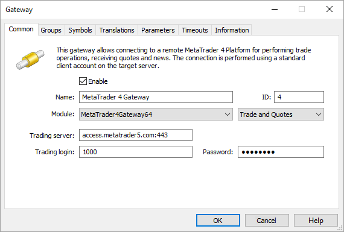
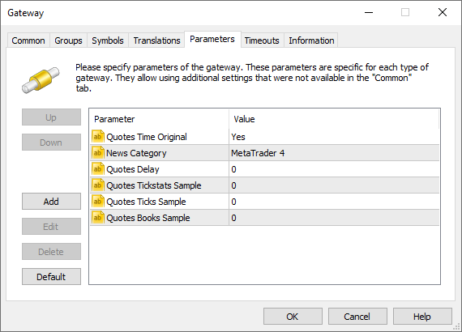
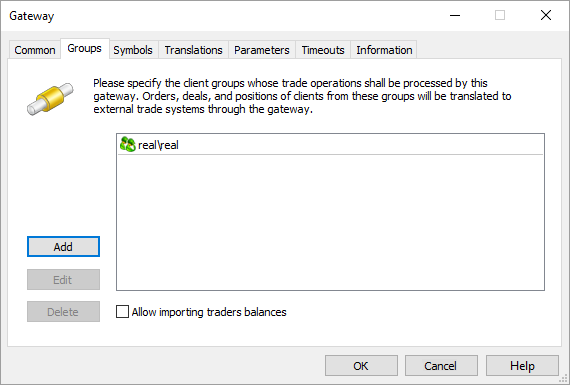
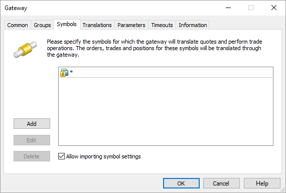
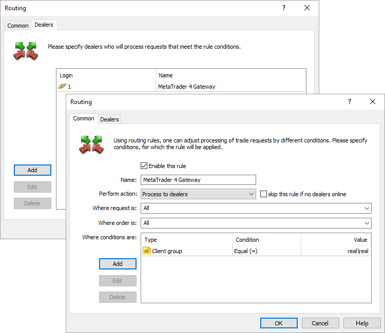
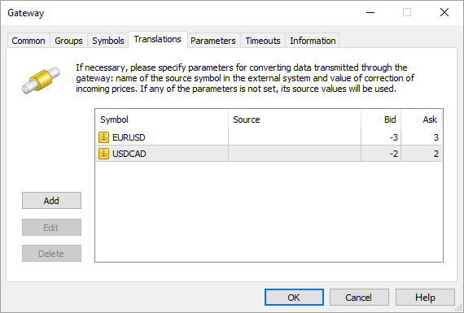
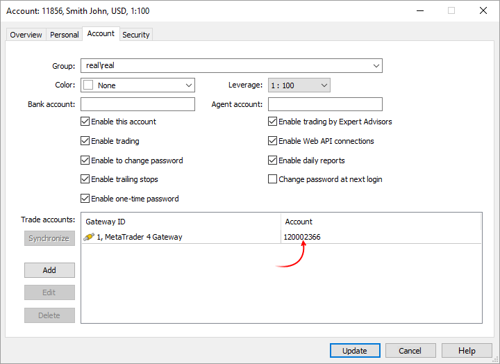

[🏠 Document Start](../../../README.md) / [MetaTrader 5 Trading Platform](../../../MetaTrader-5-Trading-Platform.md) / [Platform Components](../../Platform-Components.md) / [Gateways](../Gateways.md) / MetaTrader 4

[Previous](MetaTrader-5.md) | [Next](Integral.md)

# MetaTrader 5 Gateway to MetaTrader 4 (#metatrader-5-gateway-to-metatrader-4)

The gateway allows any brokerage firm to integrate with larger brokers and liquidity providers using the MetaTrader 4 trading platform. You will be able to minimize your risk and receive potential profit from each trade operation of a client due to markups. All you need to do is select a liquidity provider and perform a simple gateway configuration.

> [Order MetaTrader 5 Gateway to MetaTrader 4](https://support.metaquotes.net/en/market/product/267)

## How the Gateway Works (#how-the-gateway-works)

The gateway acts as an intermediary between the two platforms by converting trade requests of brokerage clients into requests to the external MetaTrader 4 trading platform, receiving answers and sending them back to clients.

The [routing rules (#routing)](MetaTrader-4.md#routing) allow configuring the broker's server in such a way that the clients' trade requests are sent to the gateway. Depending on the order type, each request is handled differently:

  * Market orders are passed to the gateway directly.
  * All pending orders are not passed to the gateway by default. They are handled within the trading platform instead. An appropriate market request is sent to the gateway immediately after activation.
  * Take Profit, Stop Loss and Stop Out orders are handled and stored on the MetaTrader 5 platform side. The appropriate market operation is sent to the external platform right after activation.

  * The gateway is already included in the MetaTrader 5 platform and can be used in demo mode, which allows performing not more than 100 trading operations for a work session (until restart). The full version should be purchased separately.
  * The gateway transmits quotes from the external MetaTrader 4 platform.

  
---  
  

## Requirements (#wl)

For proper operation of the gateway and correct accounting of funds, it is necessary to ensure that the symbol on the broker's server have the same trading settings as the remote MetaTrader 4 platform. The symbol's trading parameters can be set in the symbols setup dialog. The following symbol settings should be the same:

  * The mode of [order execution](../../Platform-Setup/Symbols/Symbol-Settings/Execution.md) by a symbol
  * [Number of digits](../../Platform-Setup/Symbols/Symbol-Settings/Common.md) after the decimal point
  * [Type of calculation (#calculation)](../../Platform-Setup/Symbols/Symbol-Settings/Trade.md#calculation) of margin requirements and profit on a symbol
  * [The price of one point](../../Platform-Setup/Symbols/Symbol-Settings/Trade.md) of the price change, except for instruments with the Forex calculation mode
  * [Size of one point](../../Platform-Setup/Symbols/Symbol-Settings/Trade.md), except for instruments with the Forex calculation mode
  * For the Request execution mode, the [mode of order confirmation](../../Platform-Setup/Symbols/Symbol-Settings/Execution.md) should be enabled

> A trade account should be created on MetaTrader 4 external server, on behalf of which all client trade operations passed through the gateway are performed.

## Gateway Configuration (#gateway-configuration)

MetaTrader 5 Gateway to MetaTrader 4 is a separate MetaTrader4Gateway64.exe file that uses Gateway API for its operation. The gateway is distributed as part of the MetaTrader 5 platform and located in [history server installation directory]\gateway\\.

To start working, add [the new gateway configuration](../../Platform-Setup/Gateways.md):

Set the following parameters on the "Common" tab:

  * ID — set the identifier of the dealer, from whose name the requests routed to the gateway are confirmed.
  * Module — select MetaTrader4Gateway64 in the list of available modules and load its default settings.
  * Trading server — MetaTrader 4 external server IP address and port trade requests are sent to.
  * Trading login — index of a trade account opened at MetaTrader 4 external server. This is the account, at which client trading operations passed through the gateway are performed.
  * Password — password for connecting to an account at MetaTrader 4 external server.

> ID value must be unique in the field of manager logins and gateway identifiers. Usually, this field is filled out automatically by an acceptable default value.

Now, go to the "Parameters" tab.

The following additional parameters are available for the gateway:

  * Quotes Time Original — if the value is Yes, the gateway sets the time of ticks on its own considering a time zone of a recipient trading server. If No, or the parameter is absent, the time of ticks is set by the history server according to its own trading time.
  * News Category — the name of the category of news received from this data feed. Further this category name can be used to specify news to be received by separate [groups](../../Platform-Setup/Groups.md).
  * Quotes Delay — delay of transmitted quotes in seconds. The maximum duration of quotes delay is 20 minutes (1200 seconds). The flow of delayed quotes is neither thinned out, nor changed. A quote is passed to MetaTrader 5 History Server only after the expiration of delay period since the quote has arrived to Gateway API. If the temporary delay parameter is not defined, the quote delay is not used. Changes in depth of market and price statistics are delayed together with the quotes flow.
  * Quotes Tickstats Sample — the minimum frequency of sending price statistics in milliseconds. This parameter allows thinning out updates of price statistics reducing the traffic.
  * Quotes Ticks Sample — the minimum frequency of sending quotes in milliseconds. This parameter allows thinning out updates of quotes reducing the traffic. It is recommended for use on demo servers only.
  * Quotes Books Sample — the minimum frequency of depth of market updates in milliseconds. This parameter allows thinning out updates of the depth of market reducing the traffic. It is recommended for use on demo servers only.

Use the Groups tab to select the group of clients, whose orders and positions will be available to the gateway.

The Symbols tab allows you to configure the list of symbols, according to which the gateway will process trade operations and transmit the quotes.

MetaTrader 5 Gateway to MetaTrader 4 supports the import of symbols and their settings from an external trading server. If the option "Allow importing symbol settings" is enabled, the import of symbols from an external server will be performed. All symbols available for an account used for connection (specified in "Trading server" field of the Common tab) are imported. The symbols are imported to Symbols/Preliminary/ subgroup according to their hierarchy at the external server.

  * The symbols imported by the gateway are put to the \Preliminary symbols subgroup. All symbols have trading ability disabled. System administrator must relocate imported symbols to the proper subgroup and allow trading for them.
  * After symbols are relocated and trading abilities are enabled, the main trading server must be restarted.
  * In case the gateway transmits configuration for the symbol that is already present in the platform, the existing symbol settings are not updated. Configuration of such a symbol is skipped.

> The gateway supports conversion of symbols and quotes. For details, please view the [Symbol and Price Translation](../../Platform-Setup/Gateways/Symbol-and-Price-Translation.md) section.

## Configuring trade requests routing (#routing)

After adding a new gateway, configure [routing](../../Platform-Setup/Routing.md) so that the clients' requests are routed to this gateway. Select "Process to dealers" as an action in the common rule settings. Assign this routing rule for all requests and orders. In additional conditions, indicate groups of clients, whose requests will be passed to the gateway.

Add the previously created gateway at the Dealers tab.

After the correct execution of the steps described above, the gateway is launched and ready to work. The result of the gateway operation is reflected in its [journal](../../Platform-Setup/Gateways/Journal-of.md).

## Formation and Correction of Prices (#markup)

MetaTrader 5 Gateway to MetaTrader 4 translates the price flow from an external MetaTrader 5 platform, just like the data feeds do. The priority of quotes from the gateway is higher than the priority of quotes from a data feed. If quotes for a symbol are available both from the gateway and data feed, a client will receive the quotes from the gateway.

The gateway performs all trading operations considering the price correction. To set correction for each individual symbol, go to the Translations tab in the gateway settings and enter the appropriate values:

In this example, the following corrections are specified for EURUSD: for each tick the Bid price will be reduced by 3 points, and the Ask price will be increased by 3 points.

A price is given to the broker's client only after the correction, so the clients work only with the corrected prices. If no correction is set for a symbol, the client will work with the original prices of the liquidity provider.

## Example (#example)

All trade operations performed by the gateway are included in the gateway journal. For example, using the client terminal we buy EURUSD 1.0. After processing the request, the following entries will appear in the journal of the MetaTrader 5 Gateway:

'1002': request #1179132 received (#2073 instant buy 1.00 EURUSD at 1.31237)  
'1002': request #1179132 answered - Done at 1.312370 (#1002 instant buy 1.00 EURUSD at 1.31237)(based on #2448959, #2448959, 1.31198 / 1.31212)  
---  
  
Let's consider the contents of the logs in more detail.

A request with the ID # 1179132 is received from the broker's client with the account 1002. Corresponding to this request, on the broker's server there is the client's order with the ID # 2073 to Buy one lot of EURUSD at the price of 1.31237.

To the request ID #1179132, the broker's client with the account 1002 receives a reply that the request has been executed (Done), with the request execution price 1.312370. In addition, the original order of the client is specified. The last part of the message contains the parameters of the trading operation on the remote platform. In particular, upon the client's request, generated order # 2448959, deal # 2448959, with the actual execution prices: Sell - 1.31198, Buy - 1.31212. In this case, this means that the client's Buy has been executed at 1.31212 on the external trading platform.

On this basis, we can calculate the profit from the price difference:

The broker's profit = 1.31237 - 1.31212 = 0.00025.

## Simulating the Netting Accounting System on MetaTrader 4 (#simulating-the-netting-accounting-system-on-metatrader-4)

MetaTrader 4 trading platform supports only the [hedging accounting system (#hedging)](../../Platform-Setup/Groups/Position-Accounting-Systems.md#hedging). This system allows you to have unlimited number of trading positions on a single financial instrument. In addition to hedging, MetaTrader 5 supports the [netting (#netting)](../../Platform-Setup/Groups/Position-Accounting-Systems.md#netting) system. This system is used on exchanges allowing a trader to have only one cumulative position at a symbol. Making a trade on the same instrument may change the existing position's volume, close it completely or reverse it.

If netting is used on MetaTrader 5 side, the gateway will try to simulate it on MetaTrader 4 external server.

The gateway automatically assigns an identification number to an account in the external server in the account settings of each client whose trades are passed to the external server (in case the number has not been already specified manually).

The ID is used as a magic number for all client orders (positions) passed to the external system. When a client's market transaction is sent to the MetaTrader 4 external server, the gateway additionally sends the command to close all opposite positions (Multiple close by) with the same magic number on the same symbol. Thus, only one resulting position remains at the external system for a single symbol.
