[🏠 Document Start](../../../README.md) / [MetaTrader 5 Trading Platform](../../../MetaTrader-5-Trading-Platform.md) / [Platform Components](../../Platform-Components.md) / [Gateways](../Gateways.md) / MetaTrader 5

[Previous](DGCX.md) | [Next](MetaTrader-4.md)

# MetaTrader 5 Gateway to MetaTrader 5 (#metatrader-5-gateway-to-metatrader-5)

The MetaTrader 5 Gateway is a gateway that allows bringing up trade operations to external MetaTrader 5 servers. Trade operations performed on the server will be processed and stored in an external system. Interaction between the platforms is performed through a client connection.

> [Order MetaTrader 5 Gateway to MetaTrader 5](https://support.metaquotes.net/en/market/product/266)

## How the Gateway works (#how-the-gateway-works)

The main task of the MetaTrader 5 gateway is to convert trade requests of a broker's clients into requests to the external MetaTrader 5 trading platform.

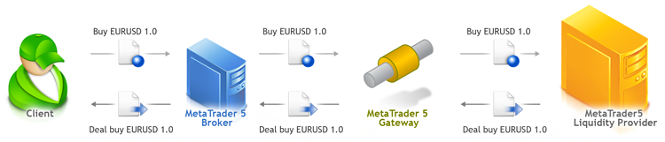

All the requests of the broker's clients are translated to the liquidity provider. The response from the liquidity provider is transmitted to the client. The broker's server is configured in such a way that the clients' trade requests are sent to the MetaTrader 5 gateway. The gateway checks the clients' requests and after the successful check creates new trade requests to a remote platform. After receiving a response from the remote MetaTrader 5 platform, the gateway returns a response to the client's request to the broker's server.

### Trading Operations (#trading-operations)

Orders are sent to MetaTrader 5 Gateway to MetaTrader 5 for processing in accordance with the set [routing rules (#routing)](MetaTrader-5.md#routing). Depending on the order type, each request is handled differently:

  * Market orders are transferred to the gateway directly.
  * Limit orders are not transferred to the gateway by default. They are handled within the trading platform instead. An appropriate market request is sent to the gateway immediately after activation. Limit orders output mode can be changed using [Limit Orders Coverage Mode (#parameters)](MetaTrader-5.md#parameters) parameter in the gateway settings.
  * Stop orders are not transferred to the gateway immediately. Such orders are handled and stored on the MetaTrader 5 platform side. They stay in the MetaTrader 5 platform until a specified price level is reached. An appropriate market order is sent to the external system immediately after reaching this level.
  * Stop-limit orders are handled and stored on the MetaTrader 5 platform side. Such orders stay in the MetaTrader 5 platform until their stop price is reached. Once it has been reached, the corresponding limit order with a specified price will be created in MetaTrader 5 or sent to an external server depending on the [gateway settings (#parameters)](MetaTrader-5.md#parameters).
  * Take Profit, Stop Loss and Stop Out orders are handled and stored on the MetaTrader 5 platform side. An appropriate trading request is sent to an external platform immediately after the order triggering.

> The gateway handles operations on symbols with [Market Execution](../../Platform-Setup/Symbols/Symbol-Settings/Execution.md) mode similar to exchange execution symbols. Handling does not depend on how operations are actually executed on the external server — in the market or exchange execution mode.

### The gateway translates only to the external system only the requests that are lossless for the broker (#the-gateway-translates-only-to-the-external-system-only-the-requests-that-are-lossless-for-the-broker)

In the instant execution mode, some client trade requests with maximum price deviation specified may be unprofitable for the broker. If the operation is unprofitable for the broker, the gateway automatically generates a reply with a requote, without transmitting the trade operation to the liquidity provider. For example, if the client makes a Buy request at a price less than the price of the liquidity provider, such a request will be requoted. If a client makes a Buy request at a price greater than the price of the liquidity provider, the client's request will be executed at the price of the liquidity provider, but the client's position will be opened at the price specified by the client. The broker earns a profit from the price difference. If the client's price and the price of the liquidity provider are equal, the request is transmitted to the liquidity provider and the broker has the zero profit. The broker can increase the earned profit by correcting prices.

  * Gateway delivered together with standard installation of MetaTrader 5 platform works in trial mode, full-functional edition is purchased additionally.
  * In trial mode the gateway performs only 100 trading operations for a work session (until restart).
  * The gateway translates quotes from the external MetaTrader 5 platform. 
  * The gateway ensures that a response with one of the possible return codes will be generated for every selected request.

  
---  
  

## Requirements (#wl)

For proper operation of the gateway and correct accounting of funds, it is necessary to ensure that the symbol on the broker's server have the same trading settings as the remote MetaTrader 5 platform. The symbol's trading parameters can be set in the symbols setup dialog.

In particular, it is necessary to match the following setting of symbols:

  * [Execution mode](../../Platform-Setup/Symbols/Symbol-Settings/Execution.md) for the given symbol. If the Request or Instant Execution mode is used on a remote platform, exactly the same execution mode should be set on your server. If the Market or Exchange Execution mode is used on a remote platform, any of these two modes can be used on your side (both modes are valid).
  * For the Instant Execution mode, you should have the same [maximum order volume, above which the order is switched to the Request Execution mode (#instant)](../../Platform-Setup/Symbols/Symbol-Settings/Execution.md#instant).
  * For the Request execution mode, the [mode of order confirmation](../../Platform-Setup/Symbols/Symbol-Settings/Execution.md) should be enabled
  * [Contract size (#contract-size)](../../Platform-Setup/Symbols/Symbol-Settings/Trade.md#contract-size)
  * [Number of digits](../../Platform-Setup/Symbols/Symbol-Settings/Common.md) after the decimal point. If the symbol price accuracy on the source server is higher than that on the receiving server, the gateway will not provide the Depth of Market for that symbol, while it will only stream tick data.
  * [The price of one point](../../Platform-Setup/Symbols/Symbol-Settings/Trade.md) of the price change, except for instruments with the Forex calculation mode
  * [Size of one point](../../Platform-Setup/Symbols/Symbol-Settings/Trade.md), except for instruments with the Forex calculation mode

If both platform use hedging, then the external platform must provide the ['Fill or Kill' fill policy (#fill-policy)](../../Platform-Setup/Symbols/Symbol-Settings/Trade.md#fill-policy) for the symbols. It is used when forwarding pending order activations to ensure that they are executed as one order on the external server. This way, the total number of positions on the two servers will match. If the Fill or Kill policy is not available, the gateway will reject order activation requests.

Do not use the expiration mode "[Good till today including/excluding SL/TP (#gtc)](../../Platform-Setup/Symbols/Symbol-Settings/Trade.md#gtc)" when forwarding orders to an external system via the gateway. This can lead to issues in the synchronization of operations, in which case "unknown execution report" errors will be printed to logs. Expired intraday orders are canceled in accordance with the [end-of-day time (#end-of-day)](../../Platform-Setup/Network-cluster/Configuring-Servers/Trade-Server.md#end-of-day) of the local platform, without any interaction with gateways. Even if the relevant expiration mode is enabled on a remote server, the end-of-day time may differ on that server, which will also lead to unsynchronized operation.

> The gateway does not check the matching of symbol settings, if it is used as the [liquidity provider for ECN (#price-rules)](../../Platform-Setup/ECN/Forming-Market-Depth.md#price-rules). In this case, the compatibility of trade orders with symbol settings on the remote server is provided by the ECN.

## Installation (#install)

MetaTrader 5 Gateway is a single executable file MetaTrader5Gateway64.exe, and it uses Gateway API. The gateway is included in the MetaTrader 5 platform, and after the installation it is located in the "gateway" subdirectory of the History Server directory.

To start working, add [the new gateway configuration](../../Platform-Setup/Gateways.md):

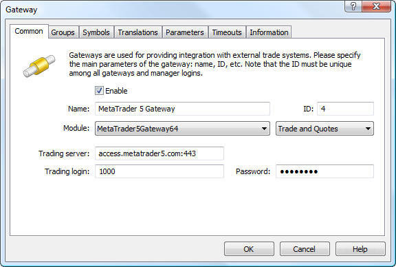

Set the following parameters on the "Common" tab:

  * ID — in the ID field, set the identifier of the dealer, from whose name the requests routed to the gateway will be confirmed.
  * Module — in this field, select MetaTrader5Gateway64 in the list of available modules and load its default settings.
  * Trading server — external MetaTrader 5 server IP-address and port, where trade requests are sent.
  * Trading login — login for connection to the external MetaTrader 5 server.
  * Password — password for connection to the external MetaTrader 5 server.

  * ID value must be unique in the field of manager logins and gateway identifiers. Usually, this field is filled out automatically by an acceptable default value.
  * the gateway will perform all trading operations with the liquidity provider using this trading account.

  
---  
  
Now, go to the "Parameters" tab.

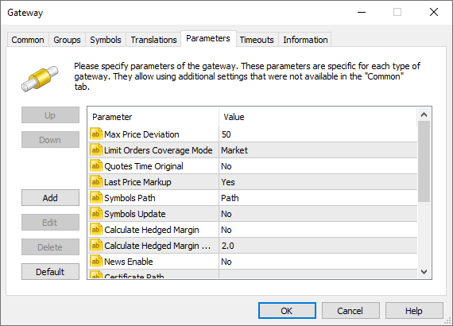

The following parameters values must be specified here:

  * Max Price Deviation — the maximum allowed deviation of the current price from the price requested in an order. The order will not be executed in case that deviation has been exceeded. This parameter is used when a pending order is activated on the MetaTrader 5 side and transferred to an external system as a market order. This parameter is applied only to the symbols having "Instant" execution type.  
If a common market order is transferred to an external system, a client should specify the maximum allowable deviation. A trader cannot specify a deviation when setting pending orders. Thus, Max Price Deviation protects a trader from executing an order at considerably deviated price.
  * Limit Orders Coverage Mode — the mode of handling limit orders by the gateway. This parameter simplifies configuration of trade requests routing to the gateway, since there is no need to create a separate rule for routing the appropriate order types. Three processing modes are available:

  *     * Market — limit orders are processed on the MetaTrader 5 platform side. If an order is activated, an appropriate market order is sent to the external system.
    * Limit — limit orders are processed on the MetaTrader 5 side.  
Once a limit order is triggered, an equivalent limit order is sent to the external system. If the "Specified time" expiration type is allowed for a symbol in the external system, the expiration of 1-2 minutes is set for this limit order. Otherwise the order validity is set to the current day; in the worst case the order will be valid until canceled.  
Since the price specified in the order is already present in the market, the order will be executed with that price – a market deal will be performed. If the necessary volume of the financial instrument is not available in the market at the specified price, the order will be executed partially. In this case, a client will have a market position as well as a limit order with a residual volume, which will be further processed in a similar way on the side of MetaTrader 5.   
Limit mode allows to protect against slippage, as a limit order is sent to the the external system with a specified price rather than a market order for execution by the current price. In addition, this mode allows you not to reserve margin on a client's account before sending an order to the external system.
    * Gateway — limit orders are processed on the the external system side. Once a limit order has been placed by a client, an appropriate order is sent to the external system.
  * Symbols Path — path for importing the symbols. By default, if this parameter is absent, the gateway imports the trading symbols to \Preliminary subdirectory with trading ability disabled. A system administrator should manually allow trading for them. If this parameter is present, the gateway imports trading symbols following the specified path.
  * Symbols Update — if Yes, the gateway updates the symbol settings if they have been changed on the source server. The default is No. Settings are updated in real time. Trading sessions are updated considering the servers' time zones. Regardless of the value of "Symbols Update", the gateway does not update the following settings of symbols that exist in the platform:

  * [group and symbol background color](../../Platform-Setup/Symbols/Symbol-Settings/Common.md)
  * [quote processing and filtration parameters](../../Platform-Setup/Symbols/Symbol-Settings/Quotes.md)
  * [trading, margin calculation, execution and GTC mode](../../Platform-Setup/Symbols/Symbol-Settings/Trade.md)
  * [spread and spread difference](../../Platform-Setup/Symbols/Symbol-Settings/Common.md)
  * [stop and freezing levels, maximum quote delay](../../Platform-Setup/Symbols/Symbol-Settings/Trade.md)
  * [swap settings](../../Platform-Setup/Symbols/Symbol-Settings/Swaps.md)
  * [symbol time limits](../../Platform-Setup/Symbols/Symbol-Settings/Sessions.md)
  * [instant and request execution settings](../../Platform-Setup/Symbols/Symbol-Settings/Execution.md)
  * Quotes Time Original — if "Yes", the gateway itself sets the time for ticks considering the time zone of the recipient trade server. If the parameter is absent or set to "No", the time for ticks is set by the history server according to the trade time used.
  * News Enable — if "Yes", allows transmitting news from the liquidity provider server. The default value is "No".
  * Last Price Markup — if Yes value is set, [price markup settings](../../Platform-Setup/Symbols/Symbol-Settings/Common.md) specified in an external platform (source) will be applied to streamed Last prices. Bid price spread difference values (from the Spread balance parameter) will be applied to Last prices. If you need to disable the Last price markup, set the parameter to No. The default value is Yes.  
The parameter affects Last prices only. For bid/ask prices, the gateway always applies price markup settings from an external platform.
  * Calculate Hedged Margin — when set to No (default) the gateway copies the [hedged margin (#hedged)](../../Platform-Setup/Symbols/Symbol-Settings/Margin.md#hedged) of the source symbol. If Yes, the gateway will calculate the hedged margin. If the initial margin is specified, the hedged margin is calculated as the initial margin multiplied by the Calculate Hedged Margin Rate value. If the initial margin is not specified, the hedged margin is calculated as the contract size multiplied by Calculate Hedged Margin Rate. The calculated value of the hedged margin is rounded to the number of decimal places specified in the symbol settings.
  * Calculate Hedged Margin Rate — hedged margin calculation multiplier used if Calculate Hedged Margin = Yes. Default is 2.0. 
  * Certificate Path — path to the PFX file of the certificate, which the gateway will use for [advanced authentication (#extended)](MetaTrader-5.md#extended) on an external MetaTrader 5 server.
  * Certificate Password — password to open the PFX file of the certificate used for [advanced authentication (#extended)](MetaTrader-5.md#extended).
  * Selftitled Translations — this parameter is used to prevent quotes from looping when connecting to the server on which the gateway is installed. The default value is No. For more details please see [below (#retranslation)](MetaTrader-5.md#retranslation).
  * News Category — the name of the category of news received from this data feed. Further this category name can be used to specify news to be received by separate [groups](../../Platform-Setup/Groups.md).
  * Quotes Delay — delay of transmitted quotes in seconds. The maximum duration of quotes delay is 20 minutes (1200 seconds). The flow of delayed quotes is neither thinned out, nor changed. A quote is passed to MetaTrader 5 History Server only after the expiration of delay period since the quote has arrived to Gateway API. If the temporary delay parameter is not defined, the quote delay is not used. Changes in depth of market and price statistics are delayed together with the quotes flow.
  * Quotes Tickstats Sample — the minimum frequency of sending price statistics in milliseconds. This parameter allows thinning out updates of price statistics reducing the traffic.
  * Quotes Ticks Sample — the minimum frequency of sending quotes in milliseconds. This parameter allows thinning out updates of quotes reducing the traffic. It is recommended for use on demo servers only.
  * Quotes Books Sample — the minimum frequency of depth of market updates in milliseconds. This parameter allows thinning out updates of the depth of market reducing the traffic. It is recommended for use on demo servers only.

> [Margin reservation (#margin)](MetaTrader-5.md#margin) of the clients should be configured for the appropriate order type in case Limit orders are directly transferred to the external system.

On the "Groups" tab select the group of clients, whose orders and positions will be available to the gateway.

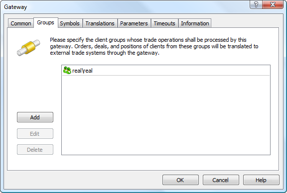

The "Symbols" tab allows to configure the list of symbols, according to which the gateway will process trade operations and transmit the quotes.

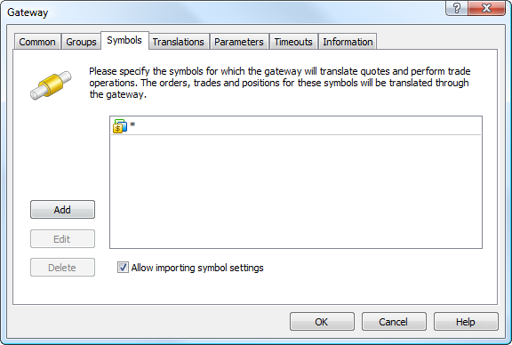

MetaTrader 5 Gateway to MetaTrader 5 supports the import of symbols and their settings from an external trading server. If the option "Allow importing symbols settings" is enabled, the import of symbols from an external server will be performed. All symbols available for an account used for connection (specified in "Trading server" field of the "Common" tab) are imported. The symbols are imported to Symbols/Preliminary/ subgroup according to their hierarchy at the external server.

  * The symbols imported by the gateway are put to the "\Preliminary" symbols subgroup. All symbols have trading ability disabled. System administrator must relocate imported symbols to the proper subgroup and allow trading for them.
  * After the symbols are relocated and trading abilities are enabled, the main trading server must be restarted.
  * In case the gateway transmits configuration for the symbol that is already present in the platform, the existing symbol settings are not updated. Configuration process of such symbol is skipped.

> The gateway supports conversion of symbols and quotes. For details, please view the [Symbol and Price Translation](../../Platform-Setup/Gateways/Symbol-and-Price-Translation.md) section.

## Margin Setup (#margin)

Margin reservation of the clients should be configured for the appropriate order type in case Limit orders are directly transferred to the external system.

The external system checks sufficiency of the funds that are necessary to provide any type of order placed via the gateway. However, the check is performed on the broker's general account, on behalf of which the work is carried out.

By default, the margin is charged on the side of MetaTrader 5 only when market orders are placed. When placing pending orders in an external system, the client's available funds should be controlled on the side of MetaTrader 5 before the orders are transferred to avoid using all broker's funds by the client.

After an order has been transferred to the external system, MetaTrader 5 platform is not able to check the client's margin sufficiency any more. After the order has been executed in the external system, the gateway cannot ignore that fact. Therefore, the appropriate trading operation is performed in the platform.

Set non-zero coefficients for the orders directly transferred to the external trading system in symbol settings for the appropriate symbols to configure margin collection:

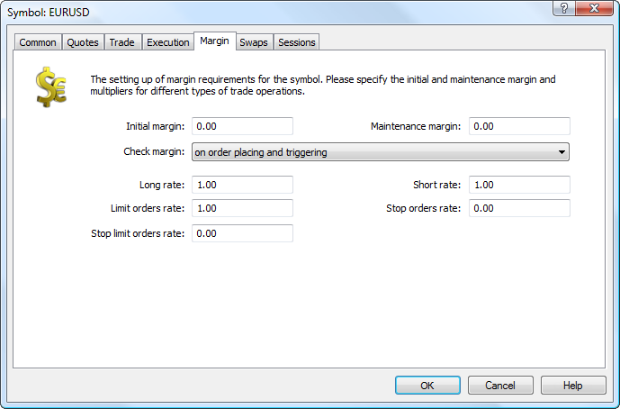

## Configuring Trade Requests Routing (#routing)

After adding a new gateway, you must configure routing of requests so that the clients' requests are routed to this gateway. To do this add a routing rule in the "Routing - Add..." section.

In general settings, select "Process to dealers" as the action. Specify that all requests and orders must be routed according to this rule. In additional conditions, indicate groups of clients, whose requests will be passed to the gateway.

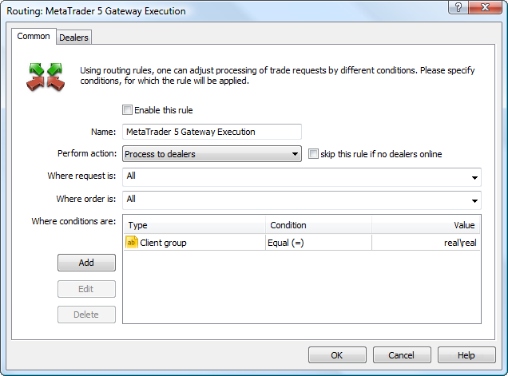

In the settings of the "Dealers" tab, add the previously created gateway.

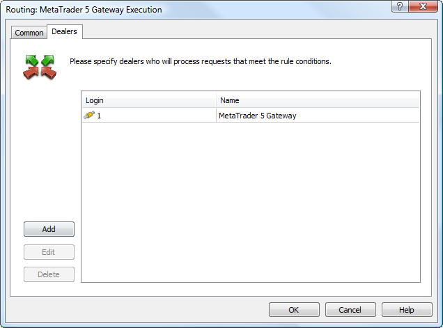

After the correct execution of the steps described above, the MetaTrader 5 Gateway is started and ready to work. The result of the gateway operation is reflected in its journal. Go to the "Network" section and choose the Main Trade Server. In the appeared information dialog, in the tab "Gateways" request the logs for the corresponding period.

## Transferring quotes (#transferring-quotes)

MetaTrader 5 Gateway transfers the price flow from an external MetaTrader 5 platform.

For symbols with the [disabled market depth (#dom)](../../Platform-Setup/Symbols/Symbol-Settings/Common.md#dom) (on the external server side), the gateway passes ticks with Bid and Ask prices.

For symbols with the enabled market depth, the gateway transfers the market depth changes as well as ticks with Last prices and volumes. Ticks containing only Bid and Ask price changes are not transferred. If the best supply and demand prices change in the market depth, the history server generates the necessary tick with Bid and Ask prices and adds it to the flow.

The gateway features the built-in switching mechanism to prevent the quote flow from stopping in case the external server stops transmitting the market depth changes. If not a single market depth change for a symbol arrives from the external system within 35 seconds, the gateway stops sorting out ticks having only Bid and Ask prices. In other words, it starts transferring to the platform both Last/Volume and Bid/Ask ticks.

The following entries are shown in the gateway journal when the market depth is no longer transmitted:

2017.09.12 15:20:25.412 Gateway books stream for EURUSD stopped (no books more than 35 sec)   
2017.09.12 15:20:25.873 Gateway books stream for USDJPY stopped (no books more than 35 sec)  
---  
  
If the flow is resumed:

2017.09.12 15:21:29.759 Gateway books stream for EURUSD resumed   
2017.09.12 15:21:30.060 Gateway books stream for USDJPY resumed  
---  
  
> The gateway transmits the original stream of quotes from the external MetaTrader 5 platform, without spread markup settings specified for instruments/groups in the external platform. Only the relevant [translation settings specified on the gateway](MetaTrader-5.md) are applied to the prices.

## Price Markups (#markup)

The gateway receives prices from the MetaTrader 5 external server and transmits them to clients taking into account transformation settings (markups). The clients perform trade operations using transformed prices. However, while processing trading operations on the gateway and their transmission to the external system, initial, not transformed prices are automatically used.

Thus, a brokerage company receives its profit share from each deal performed at the external system.

Markup values are set separately for Bid and Ask prices by each symbol:

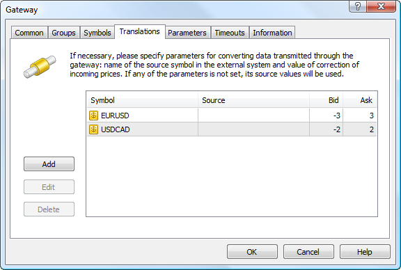

In this example, the following corrections are specified for EURUSD: for each tick the Bid price will be reduced by 3 points, and the Ask price will be increased by 3 points. 

If no correction is set for a symbol, the clients will work with the original prices of the liquidity provider.

### Symbol masks and own price retranslation (#retranslation)

In translation settings, "*" mask can be used as the source symbol and as the destination symbol in the platform. For example, the settings Symbol="*", Source="*" mean that the names of the symbols will be used as they are provided in the external system. If the symbol is entitled EURUSD in the external system, then its data will be feed to the symbol with the same name on the trading platform side. The only situation in which such settings cannot be used is the connection of the gateway to the platform on which it is installed. In this case, receiving and feeding of quotes by the gateway into the same symbols will lead to looping.

To avoid such situations, the gateway provides the parameter "[Selftitled Translations (#selftitled-translations)](MetaTrader-5.md#selftitled-translations)". If it is set to "No" (default) and the gateway has a translation setting "*" <\- "*", the gateway will not start. An appropriate entry will be added into the journal:

translation rule for symbols to themselves '* <\- *' not allowed but exists, remove this rule or allow it by 'Selftitled Translations' parameter  
---  
  
Before enabling this parameter, make sure that the gateway is not connected to the same cluster on which it is running. Otherwise, this can lead to the looping of transactions, configurations and quotes in the platform.

## Example of MetaTrader 5 Gateway (#example-of-metatrader-5-gateway)

All trade operations performed by the gateway are included in the gateway journal. For example, using the client terminal we buy EURUSD 1.0. After processing the request, the following entries will appear in the journal of the MetaTrader 5 Gateway:

'1002': request #1179132 received (#2073 instant buy 1.00 EURUSD at 1.31237)  
'1002': request #1179132 answered - Done at 1.312370 (#1002 instant buy 1.00 EURUSD at 1.31237)(based on #2448959, #2448959, 1.31198 / 1.31212)  
---  
  
Consider the contents of the logs in more detail.

A request with the ID # 1179132 is received from the broker's client with the account 1002. Corresponding to this request, on the broker's server there is the client's order with the ID # 2073 to Buy one lot of EURUSD at the price of 1.31237.

To the request ID #1179132, the broker's client with the account 1002 receives a reply that the request has been executed (Done), with the request execution price - 1.312370. In addition the original order of the client is specified. The last part of the message contains the parameters of the trading operation on the remote platform. In particular, upon the client's request, generated order # 2448959, deal # 2448959, with the actual execution prices: Sell - 1.31198, Buy - 1.31212. In this case, this means that the client's Buy has been executed at 1.31212 on the external trading platform.

On this basis we can calculate the profit from the price difference:

The broker's profit = 1.31237 - 1.31212 = 0.00025.

## Operation in the advanced authentication mode (#extended)

The [advanced authentication (#authorization)](../../Platform-Setup/Groups/Group-Settings.md#authorization) mode can be enabled for the account used by the gateway for connection to an external MetaTrader 5 server. In this case, the PFX certificate file is required for connection, in addition to the login and password. The file path and a password for file opening must be specified in appropriate gateway parameters: [Certificate Path (#certificate)](MetaTrader-5.md#certificate) and [Certificate Password (#certificate)](MetaTrader-5.md#certificate).

To receive the certificate, please contact the broker or generate a certificate using the client terminal. In the latter case, connect to the account and go through the [standard generation procedure (#generation)](https://www.metatrader5.com/en/terminal/help/start_advanced/extended_authorization#generation). The resulting PFX file should be transferred to the computer, on which the gateway is running. Save it to a disk or install it in Windows storage. When installed to the storage, the 'Certificate Path' parameter can be left empty; thus the gateway will request the certificate from the storage.

> When installing the certificate to the Windows storage, make sure to select the Local Computer storage, and not that of the Current User. Otherwise the gateway will not be able to access the certificate.

If the advanced authentication is required, but the gateway cannot find the certificate at the path specified in 'Certificate Path', the following error will be added in its log:

'2098': loading of standard SSL certificate from 'C:\\{path}\2098_ServerName.pfx1' failed  
---  
  
If the certificate cannot be found in the Windows storage, the following error will be added:

'2098': standard SSL certificate for advanced authorization is not found  
---  
  
If an invalid password is specified in 'Certificate Password', the following error will be written in the log:

'2098': invalid standard SSL certificate password  
---  
  

## Coverage using MetaTrader 5 Gateway to MetaTrader 5 (#coverage)

The MetaTrader 5 trade platform allows covering the positions of clients on other trade servers protecting own company from financial risk. Coverage of positions can be performed using the MetaTrader 5 Gateway to MetaTrader 5.

Coverage of client positions is performed using special coverage accounts. Such accounts are those created in [groups](../../Platform-Setup/Groups.md) whose names start with symbols "coverage" (case sensitive). For example, coverage\forex. Performing trade operations on a coverage account, a manager covers the position of clients on another trade server.

In order to make covering possible, an administrator of the trade platform should make the corresponding settings:

### Creating a Group (#creating-a-group)

[Create a group (#name)](../../Platform-Setup/Groups/Group-Settings.md#name), whose name starts with "coverage":

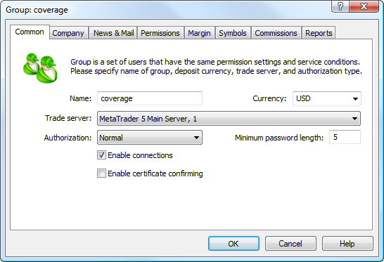

### Creating a Coverage Account (#creating-a-coverage-account)

In the coverage group, [create an account](../../Platform-Setup/Accounts/Creating-Account.md). This account will be used by a manager for performing trade operations that cover client positions.

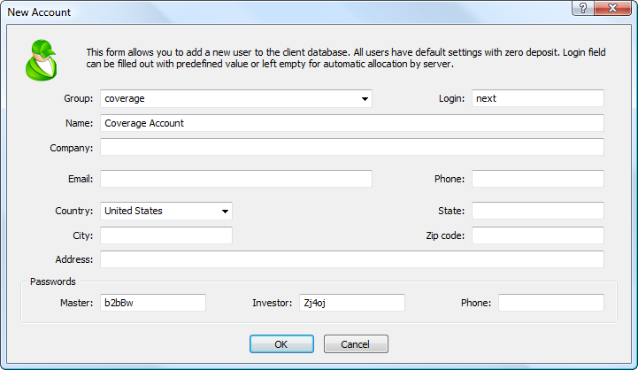

### Opening a Trade Account (#opening-a-trade-account)

You need to open a trade account on an external trade server, where coverage positions will be opened. The account should have enough deposit for covering client positions.

### Setting up the Gateway (#setting-up-the-gateway)

The next step is [setting up](../../Platform-Setup/Gateways/Configuration-of.md) the MetaTrader 5 Gateway using the authorization details of the account opened at the external trade server. Then you need to set up the [routing of trade operations](../../Platform-Setup/Routing.md) from the coverage account to the external trade system through the gateway:

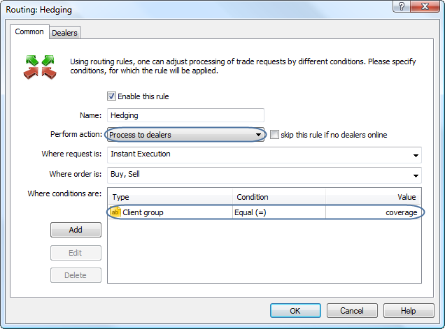

After that, specify the MetaTrader 5 Gateway to MetaTrader 5 in the Dealers tab.

Once the coverage account is set up, a manager can perform trade operations using it in the manager terminal. The summary rates for all coverage accounts on the trade server are displayed in the Summary positions and Exposure tabs of the Toolbox window in the manager terminal.
