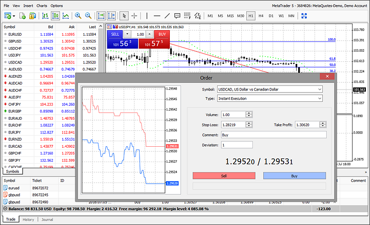
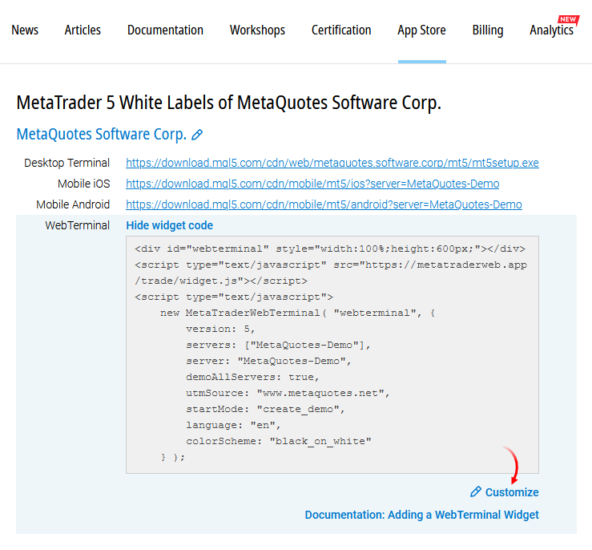
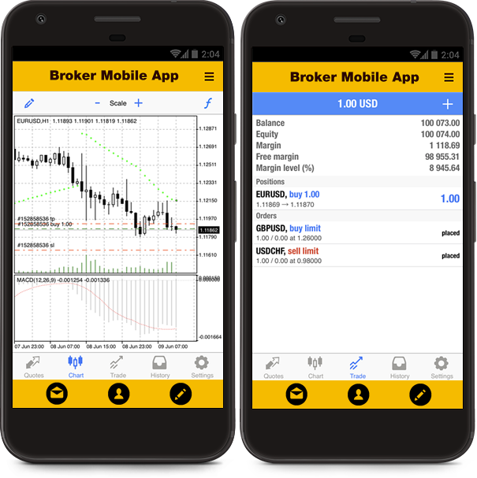
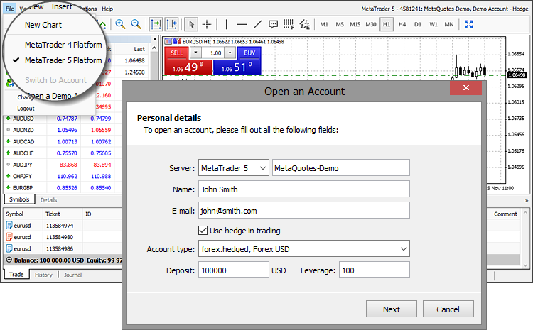

[🏠 Document Start](../../README.md) / [MetaTrader 5 Trading Platform](../../MetaTrader-5-Trading-Platform.md) / [Platform Components](../Platform-Components.md) / Old WebTerminal

[Previous](WebTerminal.md) | [Next](../Platform-Setup.md)

# MetaTrader 5 WebTerminal (#metatrader-5-webterminal)

> This section describes the old version of the web terminal. It will be supported for a limited time. We recommend upgrading to the [new, improved Web Terminal version](WebTerminal.md) the soonest possible. 

The MetaTrader 5 WebTerminal enables financial market trading using any web browser. It works in all operating systems and browsers, while requiring no extra software installations. All transmitted data is securely encrypted.

The web terminal supports all types of market and pending orders, as well as one-click trading. Traders can view real-time quotes and analyze charts using basic graphical objects. Charts can be analyzed using 30 technical indicators.

The terminal is a modern HTML5 application that can be easily integrated into any website via a simple iframe widget.

Similar to the desktop platform, traders should select a server from the list, enter login and password when connecting to the web terminal via your website. For the seamless web terminal integration with clients area on your website, server and login can be pre-selected to let your client enter a password only. If a users saves a password in a browser storage, the platform will login to the trading account automatically on the next run.

To get the terminal, [order it in the App Store section](https://support.metaquotes.net/en/market/product/251 "Order MetaTrader 5 WebTerminal") of the Support website.

[Order WebTerminal](https://support.metaquotes.net/en/market/product/251 "Order WebTerminal") [Configure WebTerminal (# "configure webterminal")](https://support.metaquotes.net/en/market/whitelabel/mt5# "configure webterminal")

  * The trading platform should be updated to at least build 1325 for the web terminal operation.
  * [MQL5.community](https://mql5.com "MQL5.community") account is not required.

  
---  
  

## How to Add the WebTerminal Widget to Your Website (#how-to-add-the-webterminal-widget-to-your-website)

To install the WebTerminal widget on your site, visit the "[App Store \ White Labels \ MetaTrader 5 ](https://support.metaquotes.net/en/market/whitelabel/mt5#)" section of the technical support site. Then click "Show widget code \ Customize":

Set the WebTerminal operation parameters. After that, a special code will be generated for you, which should be inserted into your website.

The following parameters are supported (the corresponding parameters in the widget code are displayed in brackets, you can change them manually if necessary).

  * Version (version) — default web terminal version: MetaTrader 4 or MetaTrader 5. The parameter is important only if you use both versions of the platform at the same time — if the widget settings have no restrictions on used servers or the servers of both versions are present in the server list (servers). The parameter is used only for the first launch of the web terminal. Further on, the platform version will be defined based on the last used account. The detailed description is given in the section [If you have two platforms: MetaTrader 5 and MetaTrader 4 (#version)](Old-WebTerminal.md#version).
  * Restrict trade servers \ Trade server list (servers) — limit servers available for use in your web terminal. All servers of all brokers are available by default. Simply enter a name in the new account opening or in the existing account login dialog.  
If you enable the "Restrict trade servers" option and set the list of available servers, the list of certain servers instead of the server name input box will be available in the appropriate dialogs.

> Server names are case sensitive. Be sure to specify the exact name.

  * Default login (login) — default trading account selected in the login dialog. Use this option to create convenient client areas by immediately substituting the necessary account into the web terminal.
  * Default trade server (server) — default server selected in the connection dialog. Use this option to create convenient client areas by immediately substituting the necessary server into the web terminal.
  * Allow opening demo accounts on any servers (demoAllServers) — disable the option if you want to allow opening demo accounts via the web terminal only on demo servers from the "Trade server list" parameter. If enabled, demo accounts can be opened on any servers (regardless of the "Restrict trade servers" parameter). The server name input box is displayed instead of the list of available servers in the appropriate dialog.
  * Demo account types (demoType) — demo account type, multiple comma-separated values can be added. To open demo accounts in the "demoforex" group, specify "forex" (the "demo" prefix is added automatically). If not specified, all account types configured in the "[Allocations](../Platform-Setup/Accounts/Account-Allocation-Settings.md)" are used. At the moment, you can add this parameter to the terminal widget only by specifying it in the code manually.
  * Leverage (demoLeverage) — the leverage for the demo account, multiple comma separated options can be added. If not specified, all options configured in the "[Allocations](../Platform-Setup/Accounts/Account-Allocation-Settings.md)" are used. At the moment, you can add this parameter to the terminal widget only by specifying it in the code manually.
  * First Name and Second Name (demoFirstName, demoSecondName) — the first name and the second name to be automatically inserted into the demo account registration form in the web terminal. These parameters can be added to the embed code only manually. Use the parameters to display the web terminal with appropriate data to the users who are authorized on the site and whose first and second name are known.
  * Email (demoEmail) — the email address to be automatically inserted into the demo account registration form in the web terminal. Thia parameter can only be added to the embed code manually. Use the parameter to display the web terminal with appropriate data to the users who are authorized on the site and whose emails are known in advance.
  * Allow the Phone field in the demo account opening dialog (demoAllowPhone) — show the Phone input box in the demo account registration form ("true" value).
  * UTM campaign \ UTM Source (utmCampaign \ utmSource) — UTM tags to be added to accounts opened via the web terminal. The tags allow you to analyze the efficiency of this tool. For more details, see ["How to track accounts opened via the web terminal" (#track)](Old-WebTerminal.md#track).
  * Width (width) — terminal widget width in % or pixels. The recommended value is 100% to allow the web terminal to automatically adjust to the maximum available width on the web page.
  * Height (height) — terminal widget height in % or pixels. The recommended value is "600px" to make the entire widget visible even on small screens without the need to scroll.
  * What to do at the start for new visitors (startMode) — web terminal launch mode:

  * Open the demo account creation dialog (open_demo) — display a demo account opening window (instead of the login window) for users who do not have accounts stored in the web terminal. If accounts exist in the local storage, connection to the last used account is established.
  * Create a demo account automatically (create_demo) — open a demo account automatically for a user when launching the web terminal. The account is opened only if the user's web terminal has no previously saved accounts.
  * Show login dialog (login) — show account login window for users when launching the web terminal. Login to the last used account is not conducted automatically even if a user saved the account password in the browser storage previously.
  * Symbols (symbols) — list of symbols to be displayed by default in the "Market Watch" window of the web terminal (optional). The parameter also defines the display order of the symbols. For example, if you add ["EURUSD", "EURGBP", "AUDUSD", "EURRUB"] to the widget, a user will see only the four specified symbols in the "Market Watch" window after the first launch of the web terminal. EURUSD will be displayed first, while EURRUB will be last. Subsequently, the user can re-configure the list of symbols and the settings will be saved in the browser. The maximum number of symbols in the parameter is 300.
  * Chart color scheme (colorScheme) — default color scheme applied to charts. Possible values: black_on_white, yellow_on_black and green_on_black.
  * Language (lang) — default web terminal interface language. Users can select a necessary language in the web terminal menu: View -> Languages. In this case, the value of this parameter is ignored. Currently, the following languages are supported:

  * Arabic (ar)
  * Bulgarian (bg)
  * Chinese (zh)
  * Croatian (hr)
  * Czech (cs)
  * Danish (da)
  * Dutch (nl)
  * English (en)
  * Estonian (et)
  * Finnish (fi)
  * French (fr)
  * German (de)
  * Greek (el)
  * Hebrew (he)
  * Hindi (hi)
  * Hungarian (hu)
  * Indonesian (id)
  * Italian (it)
  * Japanese (ja)
  * Korean (ko)
  * Latvian (lv)
  * Lithuanian (lt)
  * Malay (ms)
  * Mongolian (mn)
  * Persian (fa)
  * Polish (pl)
  * Portuguese (pt)
  * Romanian (ro)
  * Russian (ru)
  * Serbian (sr)
  * Slovak (sk)
  * Slovenian (sl)
  * Spanish (es)
  * Swedish (sv)
  * Tajik (tg)
  * Thai (th)
  * Traditional Chinese (zt)
  * Turkish (tr)
  * Ukrainian (uk)
  * Uzbek (uz)
  * Vietnamese (vi)

Sample web terminal code to be inserted into a website:

   
   
  
---  
  
> Configuring the account opening form (type, leverage, balance)

## How to track accounts opened via the web terminal (#track)

Special UTM parameters are added to all demo accounts opened from the web terminal. Such UTM tags inform the broker that the potential client has come from a web terminal operating on the broker's website. The tags are added to the [trading account parameters (#leadsource)](../Platform-Setup/Accounts/Editing-Account.md#leadsource):

  * The Comment field contains the following details: "WebTerminal [the short name of the domain from which the account was opened]". Example: "WebTerminal mysite.com". The "www" part is removed from the address.
  * The domain name with 'www' is also added in the 'Lead source'‌ field. Example: "www.mysite.com". The value can be overridden by adding utm_source to the widget parameters.
  * The 'Lead campaign' field is not filled by default. You may add utm_campaign to widget parameters in order to write the name of your marketing campaign to this field.

To use your own UTM parameters for tracking clients, add the [utmSource and utmCampaign parameters (#utm)](Old-WebTerminal.md#utm) to the web terminal widget.

   
   
   
</script>  
---  
  
For the widget added to the www.abcbroker.com site, account parameters will be filled as follows:

  * Comment = abcbroker.com
  * Lead source = www.abcbroker.com
  * Lead campaign = web.demo

## Detecting the WebTerminal Language (#detecting-the-webterminal-language)

The web terminal determines the interface language based on the following priorities:

  * The language selected by the user in the web terminal
  * The language specified in lang (if the language is supported in the web terminal)
  * The preferred language in the user's web browser (if the language is supported in the web terminal)

If the web terminal cannot determine the language, English will be used.

## Operation Features (#operation-features)

The maximum number of symbols a client can enable in the Market Watch window is 300 for all browsers, except for Internet Explorer/Edge — 50. A greater number of symbols in Internet Explorer/Edge slows down the web terminal operation.

## Mobile version of the web platform (#mobile)

The MetaTrader 5 web platform includes a special version adapted for smartphones. This allows for convenient trading from mobile browsers in addition to desktop ones. If your website has a mobile version, make sure the appropriate version of the web platform is used there, so that your traders are able to comfortably work from their smartphones. This web platform version can also be embedded directly into mobile Android and iOS applications using the WebView component.

To launch the mobile version of the web platform, add the "mobile: 1" parameter to the widget. Since the mobile version of the web platform is available only for the MetaTrader 5 platform, we also recommend setting the "version=5" parameter to ensure its launch.

<!DOCTYPE html>   
<html>   
<head>   
<meta charset="UTF-8">   
<meta name="viewport" content="width=device-width, initial-scale=1.0, minimum-scale=1.0">   
<title>Web Terminal</title>   
</head>   
<body>   

   
   
   
</body>   
</html>  
---  
  
To call the web platform in your mobile application, create a web form and load the web platform address with the "m=1" and "version="5" parameters to it (similar to the iframe widget). In order to simplify the task, we have prepared examples in the form of simple iOS and Android projects:

  * [Sample Android (Java) project](https://support.metaquotes.net/spfiles/metatrader5/webterminal-mobile-android-example.zip)
  * [Sample iOS (Swift) project](https://support.metaquotes.net/spfiles/metatrader5/webterminal-mobile-ios-example.zip)

> The mobile version is supported only in the MetaTrader 5 web platform.

## If you have two platforms: MetaTrader 5 and MetaTrader 4 (#version)

A single web terminal is used for both platform versions. If you only use one platform (MetaTrader 4 or MetaTrader 5), no additional actions are required. Simply select the necessary one [when receiving the code for insertion (#version-param)](Old-WebTerminal.md#version-param). 

If you simultaneously use two versions of the trading platform, you do not need to configure WebTerminals separately. If the web terminal finds servers of both versions in the "[Trade server list (#servers)](Old-WebTerminal.md#servers)" parameter, a switch between the two versions appears in the web terminal interface. It is available in the account connection dialog, in the account opening dialog and in the File menu.

### Setting the default version (#setting-the-default-version)

In order to set a default version that will be selected during the web terminal launch, use the [Version parameter (#version-param)](Old-WebTerminal.md#version-param):

   
   
  
---  
  
In this example, the versions switch is set to MetaTrader 5 by default.

If a user switches to another platform, the selection will be remembered. During the next launch of the WebTerminal, it will be switched to the latest used version of the platform.

## Supported Browser Versions (#supported-browser-versions)

The web terminal supports the following web browser versions and above:

  * Internet Explorer 11
  * Microsoft Edge 12
  * Mozilla Firefox 34
  * Google Chrome 43
  * Safari 8
  * Opera 32

## Example of Adding a WebTerminal Widget (#example-of-adding-a-webterminal-widget)

<!DOCTYPE html>   
<html lang="en">   
<head>   
<meta http-equiv="Content-Type" content="text/html; charset=utf-8">   
<meta name="viewport" content="width=device-width, initial-scale=1.0, minimum-scale=1.0">   
<title>WebTerminal for the MetaTrader 4 and MetaTrader 5 platforms</title>   
   
</head>   
<body>   

   
<h1>BROKER</h1>   
<ul class="menu">   
<li><a href="#">Analytics</a></li>   
<li><a href="#" class="selected">WebTerminal</a></li>   
<li><a href="#">News</a></li>   
<li><a href="#">Contacts</a></li>   
</ul>   

   

   
<!-- Web Terminal Code Start -->   

   
   
   
<!-- Web Terminal Code End -->   

   

   
Copyright 2000-2015, Broker   

   
</body>   
</html>  
---
