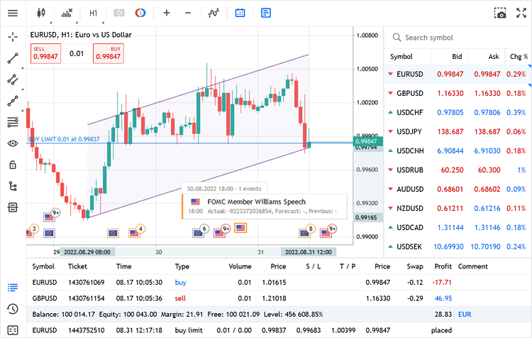
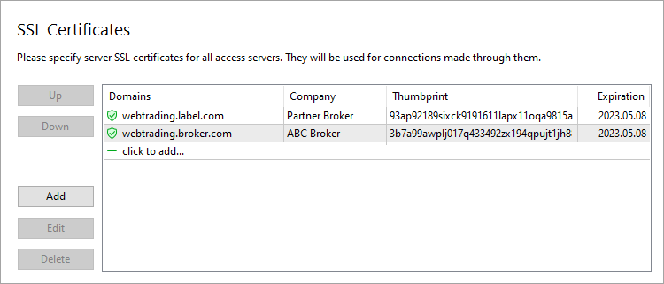
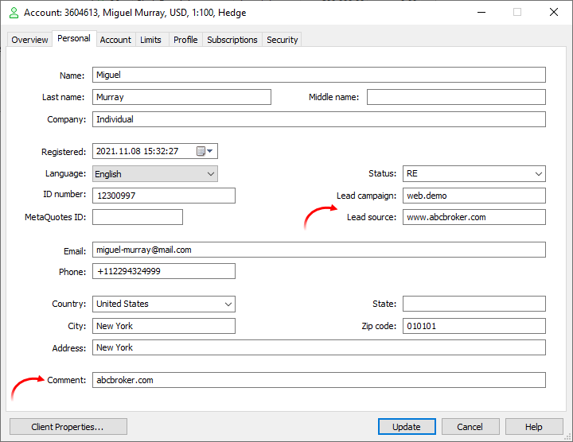
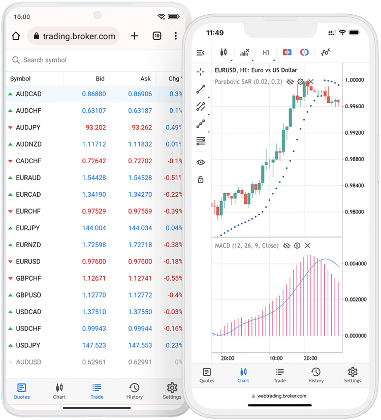

[🏠 Document Start](../../README.md) / [MetaTrader 5 Trading Platform](../../MetaTrader-5-Trading-Platform.md) / [Platform Components](../Platform-Components.md) / WebTerminal

[Previous](Gateways/Interactive-Brokers.md) | [Next](Old-WebTerminal.md)

# MetaTrader 5 WebTerminal (#metatrader-5-webterminal)

The MetaTrader 5 WebTerminal enables financial market trading using any web browser. It works in all operating systems and browsers, while requiring no extra software installations. All transmitted data is securely encrypted.

The web terminal supports all types of market and pending orders, as well as one-click trading. Traders can view real-time quotes and analyze charts using basic graphical objects. Charts can be analyzed using 30 technical indicators.

The terminal is a modern HTML5 application that can be easily integrated into any website via a simple iframe widget.

The web terminal is located entirely on the broker's access servers. It operates as an individual web terminal, which only works with your platform. This provides maximum security and full control for the broker.

When connecting to the web terminal via your website, the trader should only enter the login and password, without having to select a server. The platform will determine which server (demo, real, main or additional trading server) the account belongs to. For the seamless web terminal integration with the clients area on the broker website, the user login can be pre-selected to let your client enter a password only. If a user saves a password in a browser storage, the account will be connected automatically on the next run.

  * The web terminal only operates with the trading platform version 3440 or higher.
  * If your platform license does not include the web terminal, [order it via the App Store section](https://support.metaquotes.net/en/market/product/248 "Order MetaTrader 5 Web Terminal") of the Support Center website.

  
---  
  

## How to set up the platform (#how-to-set-up-the-platform)

The web terminal operates on an [access server](Access-Server.md) which acts as a web server.

Register a domain (or a subdomain for your existing domain) where the web terminal will run. Below we use the domain webtrading.broker.com as an example — you should replace it with your own domain.

Associate your domain with the [public IP address (#public)](../Platform-Setup/Network-cluster/Configuring-Servers.md#public) of your access server. For this purpose, the appropriate record must be specified on the DNS hosting. For example, for webtrading.broker.com host, the following entry should be registered in DNS: "XXX.XXX.XXX.XXX webtrading.broker.com", where XXX.XXX.XXX.XXX is the public address of the access server.

Next, open [Integration \ Web services](../Platform-Setup/Integrations/Web-Services.md) in MetaTrader 5 Administrator and add an SSL certificate for the domain. The certificate will enable connections to the access server using the HTTPS protocol.

You can add extra certificates for your White Label partners to provide a separate web terminal for each required company's domain. After that, in the relevant field, specify which company the domain belongs to.

It is recommended to have port 443 available on the server for HTTPS connections. In this case, your clients will not need to explicitly specify the port in the address bar to open the web terminal page.

No other settings are needed. Your web terminal will be available at https://webtrading.broker.com/terminal/.

## If you have multiple access servers (#if-you-have-multiple-access-servers)

For each platform we [recommend (#recommended)](../Platform-Installation/System-Requirements.md#recommended) using at least two access servers: for the main and backup configuration. As your customer database grows and your business geography expands, the number of servers will increase to ensure high-quality service.

To enable connections to your web terminal via any of your access servers, add A-records with their public addresses to the DNS server. Thus, you will have several records with different addresses but with the same domain:

XXX.XXX.XXX.XXX webtrading.broker.com YYY.YYY.YYY.YYY webtrading.broker.com ZZZ.ZZZ.ZZZ.ZZZ webtrading.broker.com  
---  
  
XXX, YYY and ZZZ are the addresses of your access servers. There can be any number of them.

No additional actions are required on the platform side. The domain certificate uploaded via the Integration \ Web Services section is used for all access servers.

To balance the load by distributing connections to the web terminal between access servers, use GeoDNS or GLSB services. Please check with your hosting provider whether this service is available.

## If you hold multiple licenses (#if-you-hold-multiple-licenses)

If you have multiple MetaTrader 5 platform licenses, for example, the main cluster for live accounts and an [additional cluster for demo accounts](https://support.metaquotes.net/en/market/product/569), you should configure web terminals separately for each of them. The web terminal runs on access servers which belong to a particular platform, and thus they do not know about the existence of other platforms.

With such a configuration, you will have different web terminal links for each platform. You need to provide the option to select the desired platform for your customers. For example, you can implement a drop-down list on your website.

## How to add the web terminal to your site (#how-to-add-the-web-terminal-to-your-site)

To install the web terminal on your site, simply place the <iframe> tag on the desired page. The address of your web terminal should be specified as the source in this tag:

<!DOCTYPE html>   
<html>   
<head>   
<meta charset="UTF-8">   
<title>Web Terminal</title>   
</head>   
<body>   
<iframe src="https://webtrading.broker.com/terminal?mode=connect&marketwatch=EURUSD,GBPUSD,USDJPY&utm_campaign=webterminal&utm_source=site" width="100%" height="1000"></iframe>   
</body>   
</html>  
---  
  
Additional web terminal settings can be specified as URL parameters:

<iframe src="https://webtrading.broker.com/terminal?parameter1=value1&parameter2=value2"></iframe>  
---  
  
The following parameters are supported:

first_name, second_name, email — first name, last name and email to be inserted into the demo and real account registration form. By using these parameters, you can make account opening easier for traders who have already registered on your site and provided the required data. Example:

https://webtrading.broker.com/terminal?mode=demo&first_name=John&second_name=Smith&email=johnsmith%40mail.com  
---  
  
Please note that the example includes the "mode=demo" parameter to automatically open the demo account registration form upon the web terminal launch.

utm_campaign, utm_source — utm parameters that will be added to the [relevant fields of accounts (#leadsource)](../Platform-Setup/Accounts/Editing-Account.md#leadsource) opened via the web terminal. Using them, you can analyze how efficiently you attract traders via web terminals. For further details please see ["How to track accounts opened via the web terminal" (#track)](WebTerminal.md#track). Example:

https://webtrading.broker.com/terminal?utm_campaign=webterminal&utm_source=site  
---  
  
The parameters are used only at the first start. After that the web terminal will use the user-specified data. 

mode — the web terminal page that opens on first launch. Supported values:

  * demo — demo account registration form
  * real — real account registration form
  * connect — existing account connection form

https://webtrading.broker.com/terminal?mode=connect  
---  
  
The parameter is used only if the user has not previously connected to the account. If the web terminal has a saved account, it will be connected immediately upon startup.

login — trading account for connection. If this parameter is specified, the web terminal will be launched with a pre-filled account connection dialog. The user will only have to enter a password. Use this parameter to create convenient client areas.

https://webtrading.broker.com/terminal?login=123456  
---  
  
If an account is specified in the URL, no demo account will be crated at the first launch (the option is managed via [platform settings](../Platform-Setup/Accounts/Account-Allocation-Settings.md)). This also prevents from connecting using a previously saved account.

marketwatch — the list of symbols to be displayed by default in Market Watch is specified by the marketwatch parameter. Example:

https://webtrading.broker.com/terminal?marketwatch=EURUSD,GBPUSD,AUDCAD,USDJPY  
---  
  
The parameter also determines the order in which the symbols are displayed. In the example above, on the first web terminal launch the user will see only four specified symbols in the Market Watch window, EURUSD will be the first and USDJPY will be the last. Later the user can re-configure the list of symbols, and the new settings will be saved in the browser. The maximum number of symbols in the parameter is 300.

theme-mode — theme for the application interface. Possible values:

  * 0 — light (default)
  * 1 — dark

https://webtrading.broker.com/terminal?theme-mode=1  
---  
  
The parameter is only used for the first start. After that the web terminal will use user-specified settings. If necessary, you can force a user-defined theme to be overridden. This may be useful, for example, if your site supports light and dark themes. This will allow the synchronization of interface switching modes of the site and the web terminal.

To switch the color scheme of the web terminal, call postMessage on the <iframe> element, through which the web terminal is loaded. Specify the parameters type: 'mt5_update' and theme-mode: 0 (for the light theme) or 1 (for the dark theme):

const iframe = document.getElementById('iframe');   
  
iframe.contentWindow.postMessage({   
type: 'mt5_update',   
'theme-mode': 1,   
}, '*');  
---  
  
theme — color scheme for the application interface. Possible values:

  * greenRed — red and green (default)
  * blueRed — blue and red
  * blackWhite — black and white
  * neutral — neutral

https://webtrading.broker.com/terminal?theme=blueRed  
---  
  
The parameter is used only at the first start. After that, the web terminal will apply user-specified settings.

The parameter is only used for the first start. Then the web terminal will apply user-specified settings.

lang — web terminal interface language. The following languages are currently supported:

  * English (en), Arabic (ar), Bulgarian (bg), Czech (cs), Chinese Simplified (zh), Chinese Traditional (zt), Hebrew (he), Hungarian (hu), Dutch (nl), French (fr) ), German (de), Greek (el), Hindi (hi),
  * Indonesian (id), Italian (it), Japanese (ja), Korean (ko), Malay (ms), Persian (fa), Polish (pl), Portuguese (pt), Romanian (ro), Russian (ru), Spanish (es), Thai (th), Turkish (tr), Ukrainian (uk), Uzbek (uz), Vietnamese (vi)

https://webtrading.broker.com/terminal?lang=de  
---  
  
The parameter is used only at the first start. After that, the web terminal will apply user-specified settings.

The size of the web terminal window on the page can be set using standard "width" and "height" parameters in the <iframe> tag, for example:

<iframe src="https://webtrading.broker.com/terminal" width="100%" height="1000"></iframe>  
---  
  
Generally we recommended to set the width and height to 100% so that the web terminal block takes up all the available web page space. If you specify an absolute size in pixels, some elements may be out of the visible window on some devices.

## How to set up the account opening form (#how-to-set-up-the-account-opening-form)

To configure the account opening form, use MetaTrader 5 Administrator. Go to the [Allocations](../Platform-Setup/Accounts/Account-Allocation-Settings.md) section and set available account types, leverages and balance. These settings apply to all terminals, including desktop, mobile and web.

## Security settings (#security-settings)

Prevent the web terminal page from loading in IFRAME. An attacker can place an invisible IFRAME containing the page of your website with the web terminal and combine the web terminal control element (such as a button) with another link on their website. Thus, when clicking a link, a user may actually perform an action necessary to the attacker.

Add [X-Frame-Options: DENY](https://developer.mozilla.org/en-US/docs/Web/HTTP/X-Frame-Options "Example of X-Frame-Options: DENY configuration") HTTP header to your page containing the web terminal in order to disable page loading in IFRAME and protect users.

Only use the web terminal widget on https pages. The page on which the widget is installed must work over a secure https protocol (not http). Otherwise, the operation of the web terminal will not be possible in some browsers (for example Chrome version 60 and higher).

## How to track accounts opened via the web terminal (#track)

Special UTM parameters are added to all accounts opened via the web terminal. Such UTM parameters inform the broker that the potential client has come from a web terminal operating on the broker's website. The UTM tags are added to the [trading account parameters (#leadsource)](../Platform-Setup/Accounts/Editing-Account.md#leadsource):

  * The Comment field will contain "WebTerminal [short name of the domain from which the account was opened]". Example: "WebTerminal mysite.com". The "www" part is removed from the address.
  * The domain name with 'www' is also added in the 'Lead source'‌ field. Example: "www.mysite.com". The value can be overridden by adding utm_source to the widget parameters.
  * The 'Lead campaign' field is not filled by default. You may add utm_campaign to widget parameters in order to write the name of your marketing campaign to this field.

To use your own UTM parameters for tracking clients, add the [utm_source and utm_campaign parameters (#utm)](WebTerminal.md#utm) to the web terminal widget.

https://webtrading.broker.com/terminal?utm_campaign=webterminal&utm_source=site  
---  
  
For the widget added to the www.abcbroker.com site, account parameters will be filled as follows:

  * Comment = WebTerminal
  * Lead source = www.abcbroker.com
  * Lead campaign = web.demo

## Mobile version of the web platform (#mobile)

The MetaTrader 5 web platform includes a special version adapted for iOS and Android smartphones and tablets. This enables convenient trading from mobile browsers in addition to desktop ones.

No additional settings for the mobile version are needed. The web terminal will automatically detect the user's device by the browser's "user-agent" and will adapt the interface.

You can also embed a web terminal in your mobile app. To do this, create a web form in it with the web terminal <iframe>.

## Minimum browser versions (#minimum-browser-versions)

The web terminal supports the following web browser versions and above:

  * Microsoft Edge 15
  * Mozilla Firefox 54
  * Google Chrome 51
  * Safari 12
  * Opera 38

## Troubleshooting (#troubleshooting)

If a trader receives a 404 error when trying to open the web terminal page, check the following:

  * The SSL certificate you uploaded in the Integration \ Web Service section is valid and has not expired
  * Your company name is specified correctly in the SSL certificate — it must match the company name specified in the license/White Label
  * Your platform does not run under a test license — in this case the web terminal is not available
  * The web terminal is included in your platform license. Contact the [support team](https://support.metaquotes.net/en/support) to check the license

## Web terminal widget example (#web-terminal-widget-example)

<!DOCTYPE html>   
<html lang="en">   
<head>   
<meta http-equiv="Content-Type" content="text/html; charset=utf-8">   
<title>WebTerminal for the MetaTrader 5 platforms</title>   
   
</head>   
<body>   

   
<h1>BROKER</h1>   
<ul class="menu">   
<li><a href="#">Analytics</a></li>   
<li><a href="#" class="selected">WebTerminal</a></li>   
<li><a href="#">News</a></li>   
<li><a href="#">Contacts</a></li>   
</ul>   

   

   
<!-- Web Terminal Code Start -->   
<iframe src="https://webtrading.broker.com/terminal?mode=connect&marketwatch=EURUSD,GBPUSD,USDJPY&utm_campaign=webterminal&utm_source=site" width="100%" height="1000"></iframe>   
<!-- Web Terminal Code End -->   

   

   
Copyright 2000-2015, Broker   

   
</body>   
</html>  
---
