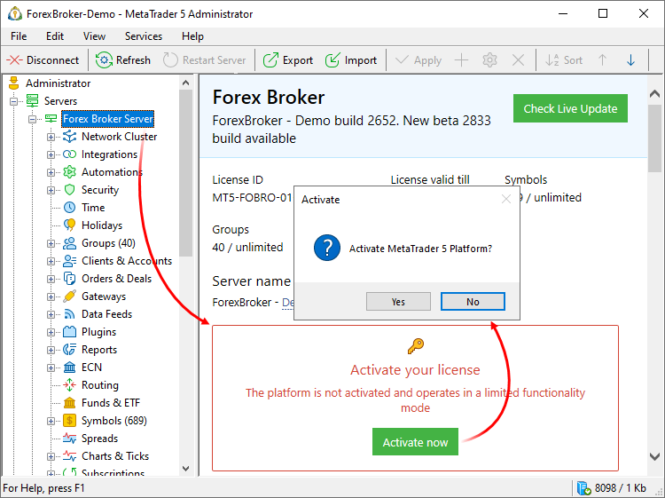
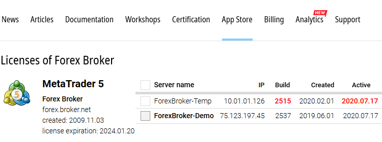

[🏠 Document Start](../../README.md) / [MetaTrader 5 Trading Platform](../../MetaTrader-5-Trading-Platform.md) / [Platform Installation](../Platform-Installation.md) / Activation

[Previous](Installation.md) | [Next](White-Label.md)

# Activation (#activation)

A license given for [installation](../Platform-Installation.md) with the platform distribution is non-activated and has several limitations:

  * Only one trade server (main) can be installed in the system;
  * Not more than 100 users can be created;
  * Not more than 5 groups can be created, including four groups created on default.

After installing the platform and [connecting](../MetaTrader-5-Administrator/Getting-Started/Connect-to-Server.md) to the server via the administrator terminal, go to the [start page](../Platform-Setup/Start-Page.md) and click on "Activate now":

For launching the activation process, you can also use the " Activate" command of the [Services](../MetaTrader-5-Administrator/User-Interface/Main-Menu/Services.md) menu. The following actions are performed during activation:

  * A request is sent to the update server of the developer company;
  * In case of successful license checking, a new activated license is generated; it is bound to the configuration of server where the platform is installed;
  * Activated [license (#license)](../Platform-Components/Trade-Server/Structure-of-Directories-and-Files.md#license) is sent back to the trade server.

> The number of license activations is limited. Normally, up to five activations are allowed for one license.

## Activation Management (#manage)

To view your activations, visit the "[App Store\Licenses](https://support.metaquotes.net/en/market/licenses)" section of the technical support website:

A list of activations of each platform license contains the following data:

  * Server name — the name displayed in client terminals (in the program name, in the Navigator window, etc.). The first part of the name is taken from the appropriate [White Label](White-Label.md), the second one is used from platform settings (specified on the [start page](../Platform-Setup/Start-Page.md)).
  * IP — the IP address from which the platform was activated.
  * Build — current platform build. If the build is shown in red, this means there is a [new version](../Platform-Setup/Live-Update.md) available for the platform. We recommend installing the latest version to ensure the operation stability and to access all the new features of the platform. 
  * Created — platform activation date.
  * Last active — the date of the last platform data update (including the platform build). Platforms send related service information to the server every 24 hours, during [optimization time (#optimization)](../Platform-Setup/Network-cluster/Configuring-Servers.md#optimization). The last activity time is updated each time the data is sent. If no data is received for one month, the date is shown in red, which is a warning about server inactivity. If a platform does not update data for three months, it is automatically removed from the list of available servers in terminals, as well as ["Signals"](https://www.mql5.com/en/signals) and ["Virtual Hosting"](https://www.mql5.com/en/vps) services.

Two types of platform [activations](Activation.md) are available: main (shown in bold) and non-main.

  * Client terminals can only connect to a platform with the main activation.
  * To enable connections of client terminals, the platform sends information about its access points (installed access servers) to the update server every hour. Information is sent to the server regardless of the activation type, but only access points of the main activation are transmitted to terminals.
  * Servers with non-main activation are not shown in the broker selection dialogs when opening accounts through terminals.

To set a platform activation as main, please contact [Service Desk](../Technical-Support.md).

  * If you move the platform to another server and activate it, the new activation will appear in the list as non-main. As soon as you complete the platform preparation, be sure to contact [Service Desk](../Technical-Support.md) to change the activation to main. Otherwise, traders may have problems connecting to the new server, since access points will not be known to client terminals.
  * Desktop terminals receive up-to-date information about access points during each account connection. It is recommended to keep at least one old access point operating during 1-2 weeks after migrating the platform to other equipment/hosting provider, so that terminals can receive such information.
  * Activation is bound to server hardware. In case you change computer configuration, a new activation from the same IP address can appear in the list. If the list of access points has not changed, this will not affect operation with client terminals. However, we recommend that you contact the support team to switch the new activation to the main one.

  
---  
  
Outdated activation can be removed by clicking. If you do not have enough permissions to delete activations or do not see the server management section, please contact [Service Desk](https://support.metaquotes.net/en/servicedesk).
