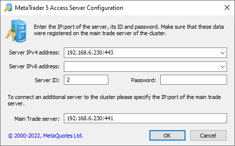
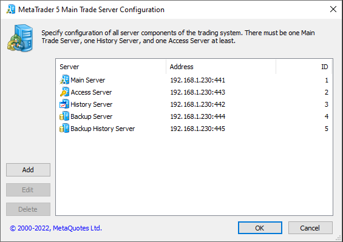
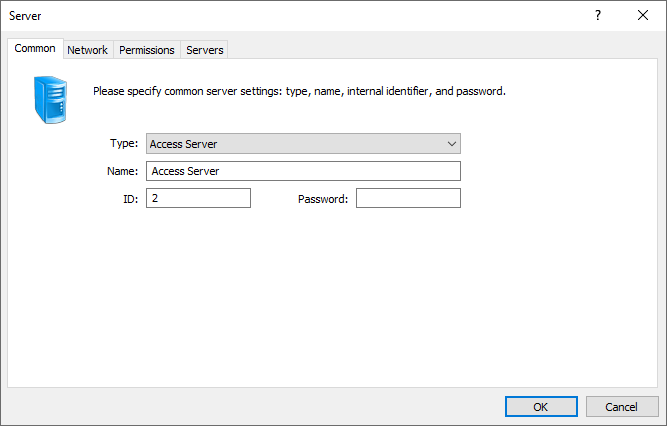
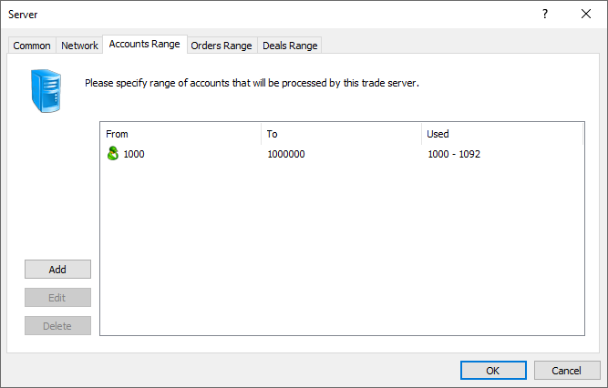

[🏠 Document Start](../../README.md) / [MetaTrader 5 Trading Platform](../../MetaTrader-5-Trading-Platform.md) / [Platform Installation](../Platform-Installation.md) / Console Setup

[Previous](Fast-Deployment.md) | [Next](Platform-Moving.md)

# Console Setup (#console-setup)

Every executable file (*.exe) of the trading platform servers possesses a certain set of console commands. Using them you can perform common actions with appropriate services in the system, as well set up connection of components when connection via the administrator terminal is impossible.

To start executing console commands, open the "Run" window of the operating system and execute the "cmd" command. In the command line go to the directory where the executable file of one of the servers is located, enter its name and specify one of the console commands. For example:

C:\MetaTrader 5 Platform\Access>mt5access.exe /stop

## Common Commands (#common-commands)

The following set of console commands perform common actions and is available for executable files of [all servers](../Platform-Components.md):

  * /start — start the service that is connected with this executable file of the server;
  * /stop — stop the service that is connected with this executable file of the server;
  * /restart — restart the service that is connected with this executable file of the server;
  * /console — start the service in the console mode;
  * /install [/name:service_name /display:displayed_name /description:service_description] — install a service associating it with this executable file. For additional parameters you can specify the service name for the operating system, extended (displayed) service name for users, as well its description. If you do not specify any of parameters, the service name will be set by default;
  * /uninstall [/name:service_name] — uninstall a service associated with this executable file, For an additional parameter, you can specify the service name to be uninstalled.
  * /info — show information about the server: internal identifier (ID), own address, address of the main server and binding addresses (for access servers).

> Additional parameters are specified without square brackets. For example: /install /name:mt5access /display:Access server

## Setup of Servers (#setup-of-servers)

If incorrect settings were specified during the installation of any of components, and connection to the platform via the administrator terminal is impossible, you can re-configure the components using the console command /config. It can be executed on any server except for the main trade server. This command has the following parameters:

  * /main:address:port (for trade servers) or /main_trade:address:port (for other servers) — IP address and port of the main trade server, separated by a colon.
  * /own:address:port — IP address and port of the server you are configuring, separated by a colon.
  * /history:address:port — the IP address and port number of the history server. The parameter is only used when configuring access servers. It enables immediate specification of the history server address, without waiting for it from the main server. This improves the speed and reliability server deployment.
  * /id:identifier — the internal identifier of the server you are configuring.
  * /password:password — the internal password of the server you are configuring.

You can specify multiple addresses separated by commas in the 'main', 'own' and 'history' parameters. For example: /main:192.168.0.1:440,[2a00:1987:1:30::2a]:440.

These parameters are analogous to those specified in the ["Network"](../Platform-Setup/Network-cluster.md) section in the administrator terminal. After the command execution, the earlier specified parameters for the server will be overwritten.

> Example: /config /main:192.168.0.1:440 /own:192.168.0.1:443 /id:3 /password:3jdaLjsQ

### Setup of Servers in the Graphical Mode (#setup-of-servers-in-the-graphical-mode)

In order to start setting up a server in the graphical mode, you should run its executable file with the /gui key from the command line. For example, mt5access64.exe /gui.

Parameters that are set here are the same as in the console mode:

  * Server IPv4\IPv6 address — colon separated IP address and port of the configured server;
  * Server ID — the internal identifier of the server you are configuring;
  * Password — the internal password of the server you are configuring;
  * Main Trade server — IP address and port of the main trade server, separated by a colon.

  * When launching the backup server setup, the Restore command becomes available in the configuration window. It can be used to restore a server that was backed up by the selected server. Find more details about the server recovery [here](../Platform-Components/Backup-Server/Restoring-Server.md).
  * Use only the /gui_main key to configure the main trade server. When using the /gui key, the main server becomes a secondary one.

  
---  
  

### Linking to NUMA Nodes (#numa)

You can link specific servers to the required [NUMA nodes](https://en.wikipedia.org/wiki/Non-uniform_memory_access). How to link:

  * Stop the server.
  * Call the command 'mt5trade64.exe /modify /numa_node:X' indicating the node number instead of X. Repeat for other servers.
  * Start the server.

## Setup of the Main Trade Server (#setup-of-the-main-trade-server)

To configure the main trade server, a separate console command /config_main with the below parameters is used:

  * /main:address:port — IP address and port of the [main trade server](../Platform-Setup/Network-cluster/Configuring-Servers/Trade-Server.md), separated by a colon;
  * /access:address:port — IP address and port of an [access server](../Platform-Setup/Network-cluster/Configuring-Servers/Access-Server.md), separated by a colon;
  * /history:address:port — IP address and port of a [history server](../Platform-Setup/Network-cluster/Configuring-Servers/History-Server.md), separated by a colon;
  * /backup:address:port — IP address and port of a [backup server](../Platform-Setup/Network-cluster/Configuring-Servers/Backup-Server.md), separated by a colon;
  * /password:password — the internal password that will be set to all the above mentioned servers.

In addition, [internal IDs (#identifier)](../Platform-Setup/Network-cluster/Configuring-Servers.md#identifier) will be automatically assigned to all servers: "1" to the trade server, "2" to the access server, "3" to the history server, and "4" to the backup server.

### Setup of the Main Trade Server in the Graphical Mode (#setup-of-the-main-trade-server-in-the-graphical-mode)

To start setting up a main trade server in the graphical mode, you should start its executable file with the /gui_main key from the command line. For example, mt5trade64.exe /gui_main.

The appeared window contains the list of servers which settings are already present at the main trade server. Three commands are provided for managing the servers:

  * Add — add a server configuration;
  * Edit — change configuration of a selected server;
  * Delete — delete configuration of a selected server. When deleting a configuration, the physical deletion of the server form the computer is not performed.

The windows of settings contain the main parameters of servers, that are set through the administrator terminal in the ["Network" (#common)](../Platform-Setup/Network-cluster/Configuring-Servers.md#common) section:

Additional column Used is displayed for the ranges of accounts, orders and deals. It displays the current use of the range.

You can stop using the current range by specifying the last value from Used field in To field. After that, create a new range.

Parameters set when configuring the main trade server are checked for correctness:

  * Adding a duplicate main or history server — there can be only one server of each type in a cluster.
  * Specifying incorrect ranges of logins, orders and deals.
  * Creating more trade servers than allowed by the license. Such servers will not work.
  * Deleting main server (deleting directly or changing its type).
  * Deleting a working trade server.
  * Changing networks settings so that the main server will become inaccessible to the administrator. For example, deleting the last access server.

In all the cases mentioned above the administrator will get the corresponding warning when trying to save the changes.

## Rebinding a Cluster to Another IP Address (#rebinding-a-cluster-to-another-ip-address)

When changing an IP address on the server the MetaTrader 5 cluster is installed at, rebinding to a new address is done as follows:

  * Execute /gui_main command for the main trading server and replace the addresses of all cluster components with new ones.
  * Execute /gui command for the history server and replace the addresses of the history and main servers with new ones.
  * Execute /gui for the access server and replace the addresses of the access and the main servers with new ones.

