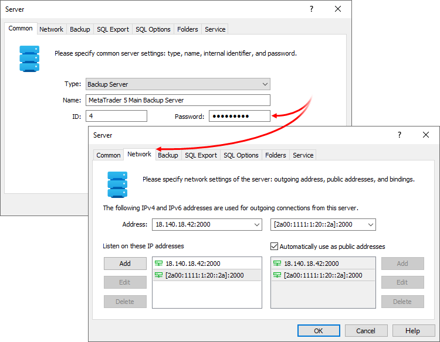
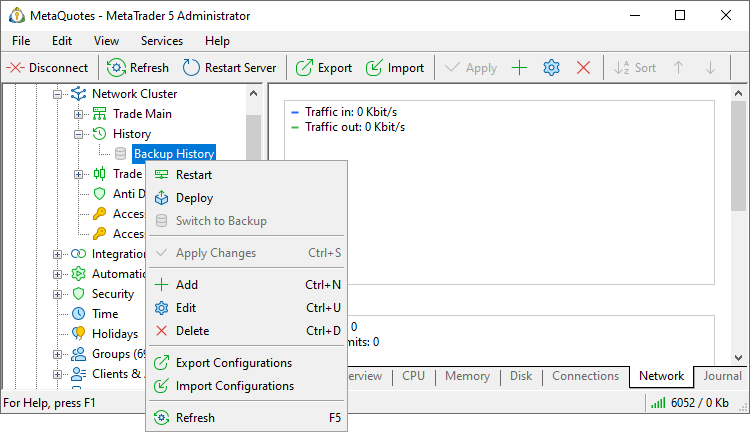
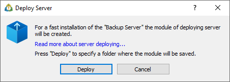
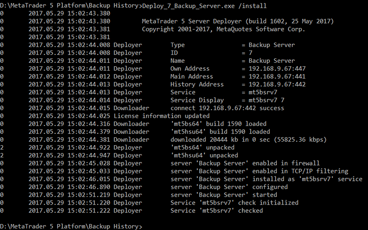

[🏠 Document Start](../../README.md) / [MetaTrader 5 Trading Platform](../../MetaTrader-5-Trading-Platform.md) / [Platform Installation](../Platform-Installation.md) / Fast Deployment

[Previous](White-Label.md) | [Next](Console-Setup.md)

# Fast Deployment

The fast deployment function simplifies installation of the platform's additional components. During a conventional server installation, you should specify its settings twice: during the installation itself and when creating its configuration via the Administrator terminal. Instead, you can first create a correct server configuration and then receive a setup file with all the previously specified settings.

Before the deployment, configure the server network parameters: ID and password to be used by other cluster components for connection to the new server, as well as IP addresses to be used by the new server for sending and receiving data. All these parameters, as well as data for connecting to the platform's main server, are specified in the installation package. Thus, all remaining cluster components are able to connect to the new server immediately after the installation allowing you to manage the server via the Administrator terminal.

> The function of deployment is available only for access, backup and additional trade servers.

## Creating and Configuring the Server

Create a server configuration in the [Network](../Platform-Setup/Network-cluster.md) section by clicking  Add. Specify an ID and a password to be used by other cluster components for connection to the new server on the [Common (#common)](../Platform-Setup/Network-cluster/Configuring-Servers.md#common) tab. Specify IP addresses to be used by the new server to send and receive data on the [Network (#network)](../Platform-Setup/Network-cluster/Configuring-Servers.md#network) tab.

> Make sure that your [network parameters (#network-connection)](System-Preparation.md#network-connection) are properly configured and all [required ports (#firewall)](System-Preparation.md#firewall) are open, because instant connection to all required servers within the cluster will be needed during deployment.

The created server will be marked by a gray icon (for example,), which means that the server service is not running in the operating system. In our case, such a service is simply not installed.

## Deployment

Click " Deploy..." in the new server context menu:

This will open the deployment dialog. Click Deploy and select a folder where the setup file is to be saved.

A file of the following form will be saved to the specified folder: Deploy_ID_ServerName.exe. Here ID is the [internal ID (#identifier)](../Platform-Setup/Network-cluster/Configuring-Servers.md#identifier) of the server, ServerName — name of the server. Copy the file to the required computer, to the directory from which the installed server will operate. After that run it from the command line with the /install key. For example:

D:\MetaTrader 5 Platform\Backup History\Deploy_5_Backup_Server.exe /install  
---  
  
The file will install the server with the parameters pre-configured in the MetaTrader 5 Administrator. The results of deployment are written in a text file Deploy_ID_ServerName.txt, located in the same directory.

During installation, the availability of a network connection to the main and historical servers of the platform is checked. When installing a backup server, the system additionally checks the connection to the primary server. If the connection cannot be established, the installation is aborted and the relevant message is added to the log. To ignore errors and to install the component anyway, restart the installer with the additional /nochecks switch.

After installation you can [configure other parameters of the server](../Platform-Setup/Network-cluster/Configuring-Servers.md).

## Additional Parameters of Installation

The deployer file can be run with additional parameters specified in the command line:

  * /nogui — in an operating system with UAC (User Account Control) enabled, running the deployer file may require higher privilege (administrator rights) and evoke a window with the corresponding request. When running the deployer file with this parameter, an attempt to acquire higher privilege is not made.
  * /main:address:port — using this parameter, you can redefine the address of the main trade server in the configuration of the server installed.
  * /history:address:port — using this parameter, you can redefine the address of the history server in the configuration of the server installed.
  * /name:name — using this parameter, you can define a short name of the service of the server installed.
  * /display:display — using this parameter, you can define a full name of the service of the server installed.
  * /desc:description — using this parameter, you can define a description of the service of the server installed.

An example of running the file with additional parameters: Deploy_5_AccessSever.exe /install /main:192.168.1.135:433 /name:mt5accesssrv.

  * The server will be automatically configured according to the settings specified for it in the administrator terminal.
  * The server is installed in the folder, from which the deployer was started.
  * After deploying a server you should [restart](../Platform-Setup/Network-cluster/Restarting-and-Stopping-Servers.md) the main trade server.

  * If a component is installed in another subnetwork (different from the one, where the main trade and the history servers are installed), the main trade server and the history server must be accessible via the Internet. Otherwise, the newly installed component will not be able to connect to them.
  * In case of deploying a trade server, a manager account is created on it. It is required for the first connection to the server. The account login and password are saved in the log file of the server (/Logs folder). The log record looks as following: default manager with login '1000' and password 'lfd5fircvs' added

  
---  
  
## Removing the Server

To remove the service of the installed server from the operating system, you can use the corresponding [console command](Console-Setup.md) of the server (/uninstall). After that, the folder where the server was installed, can be removed physically from the disk.
