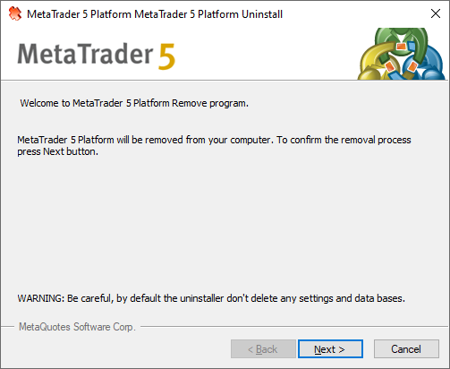
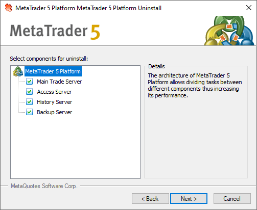
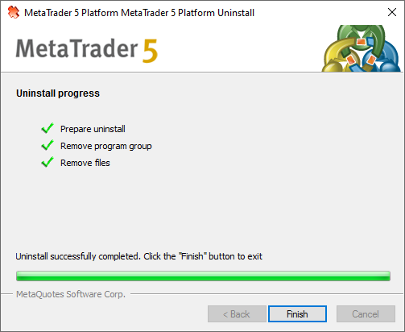

[🏠 Document Start](../../README.md) / [MetaTrader 5 Trading Platform](../../MetaTrader-5-Trading-Platform.md) / [Platform Installation](../Platform-Installation.md) / Platform Uninstall

[Previous](Platform-Moving.md) | [Next](../Platform-Components.md)

# Platform Uninstall

To remove the entire platform or one of its components, start file uninstall.exe located in the program directory or execute the "Uninstall" command in the corresponding group of programs in the "Start" menu. The following window will appear after that:

In the greeting window, read the deinstallation warning. If you are sure that want to continue the deinstallation process, press "Next".

> When a platform is removed, configurations and databases are not removed on default. In order to perform the full removal, enable the corresponding option on the next deinstallation stage.

All currently installed platform components are shown in the left part of the window. Tick off  servers that you want to remove. Information about the component selected in the tree-like list is shown in the right part of the window. The following details are shown:

  * Server address — IP address of a selected server;
  * Server port — port of a selected server;
  * Server ID — ID of a selected server used for its internal identification;
  * Service name — name of the service, under which the server works in the operating system.

  * To delete the server configurations and data bases, select "Delete server data bases". Be maximally attentive with this option, because in this case data recovery will be impossible. However, if data bases were not deleted, the platform can be recovered then with all the data and configurations.
  * The option of data base deletion is enabled separately for each separate server.

  
---  
  
After you press "Next" all the selected platform components will be deleted.

To complete the deinstallation process press "Done".
