[🏠 Document Start](../../README.md) / [MetaTrader 5 Trading Platform](../../MetaTrader-5-Trading-Platform.md) / [Platform Installation](../Platform-Installation.md) / System Preparation

[Previous](System-Requirements.md) | [Next](Installation.md)

# System Preparation (#system-preparation)

An important issue that directly affects the security and stability of the trading platform is the configuration and optimization of your computer with the operating system. This section highlights the main stages of the process:

  * [Configuring the user interface (#graphics)](System-Preparation.md#graphics)
  * [Disabling server roles (#roles)](System-Preparation.md#roles)
  * [Removing unneeded programs (#programs)](System-Preparation.md#programs)
  * [Configuring system updates (#update)](System-Preparation.md#update)
  * [Disabling time synchronization (#time)](System-Preparation.md#time)
  * [Configuring network connections (#network-connection)](System-Preparation.md#network-connection)
  * [Configuring Windows firewall (#firewall)](System-Preparation.md#firewall)
  * [Disabling sounds (#sound)](System-Preparation.md#sound)
  * [Configuring general performance parameters (#performance)](System-Preparation.md#performance)
  * [Configuring files deletion without moving them to the Recycle Bin. (#recycle)](System-Preparation.md#recycle)
  * [Configuring remote access (#remote)](System-Preparation.md#remote)
  * [Configuring antivirus software (#antivirus)](System-Preparation.md#antivirus)

  * After completing configurations, restart the server.
  * Please note that these are only recommendations. Use them at your discretion depending on your specific circumstances and needs.

  
---  
  

## Graphical interface (#graphics)

First, it is recommended to configure a graphical user interface of the operating system. You should disable anti-aliasing, shadows, menus, transition effects, etc. These settings allow for fast working with the server in remote access.

> Additionally, set blank page as a home page in the Internet Explorer options.

## Disabling server roles (#roles)

Disable unnecessary server roles using the server configuration wizard. Launch it via the Administration section and pass through all the steps clicking Next till you see the list of server roles. If there is any active role, select it and click "Next." Skip the next step for configuring the system components by clicking Next. Check the list of removed roles on the confirmation step and click Remove.

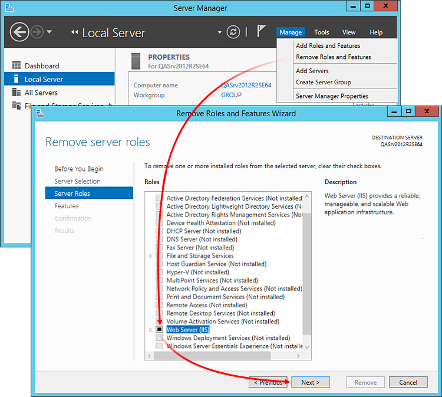

## Removing unneeded programs (#programs)

Uninstall any unnecessary programs that can slow down the trading platform or disrupt its security:

  * Web server (Internet Information Server, Apache, etc.);
  * Mail server, DNS server, SNMP, etc.;
  * Databases (Oracle, MSSQL, etc.);
  * Various development environments (IDE), compilers, etc.;
  * .NET and Java environments;
  * Various control agents from the server manufacturer (usually, this is an entire set of default programs) designed to remotely monitor the server.

Launch the wizard for installing and deleting programs. Move to "Uninstall or change a program" and remove unnecessary programs. Remove programs as you see fit depending on your needs and resource efficiency.

## Configuring system updates (#update)

Enable auto update with manual installation confirmation in the Control Panel. Fully automated mode is not recommended since Windows does not allow selecting the update installation day. It is recommended to install updates on weekends when the server load is minimal.

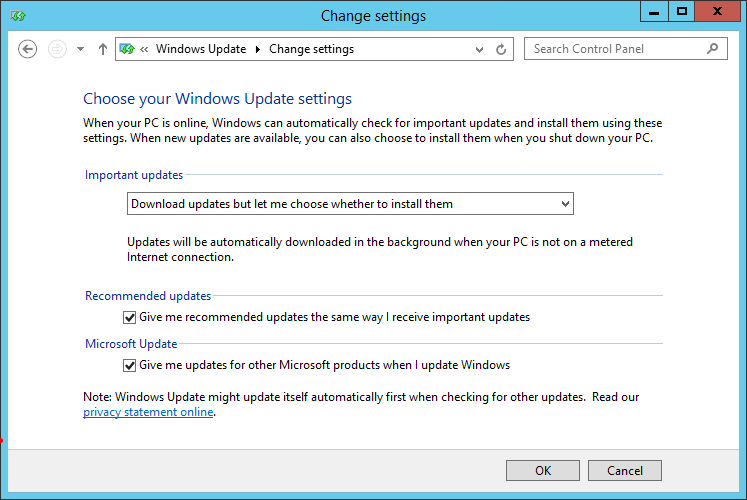

> Before installing the platform, you should install all necessary updates for your operating system.

## Disabling time synchronization (#time)

System time synchronization should be performed only by the MetaTrader 5 main trade server on the server where the trading platform is installed. Windows Time should be disabled.

The MetaTrader 5 built-in time synchronization service verifies and corrects time (if necessary) once per hour.

In order to disable time synchronization in the operating system, open the "Date and Time" section of the Control Panel. Go to the "Internet Time" tab, enter 127.0.0.1 to the Server field and unflag the automated synchronization:

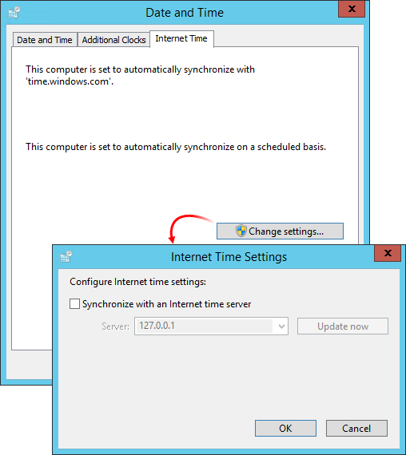

> If the address of the time synchronization server is not specified in the [time settings](../Platform-Setup/Time.md) of the platform, the Windows Time service is automatically disabled in the operating system when MetaTrader 5 servers are launched.

## Configuring network connections (#network-connection)

Right-click on the active network connection and select Properties:

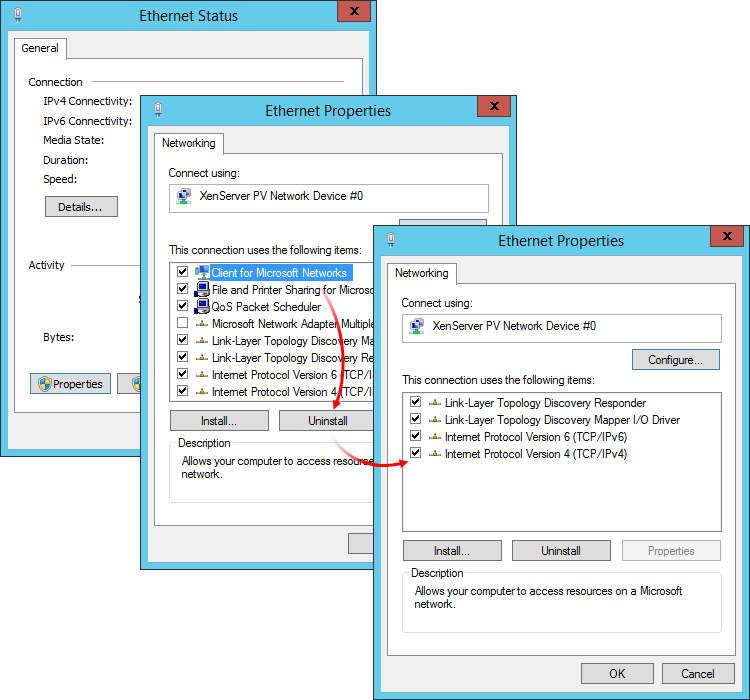

On the Networking tab, remove all components except for TCP/IP v4, TCP/IP v6 and Link-Layer Topology Discovery* protocols. They are helpful when configuring the routing.

## Configuring Windows firewall (#firewall)

The [platform installer](../Platform-Installation.md) (including the one used during the [quick deployment](Fast-Deployment.md)) automatically adds permissions for the necessary ports to the Windows firewall.

If an additional port should be opened for your platform configuration, go to the Control Panel — Windows Firewall — Additional settings. Create a new inbound rule and select:

  * Program — in case you want to allow connections for a specific application, for example a gateway.
  * Port — if you want to open certain ports regardless of an application.

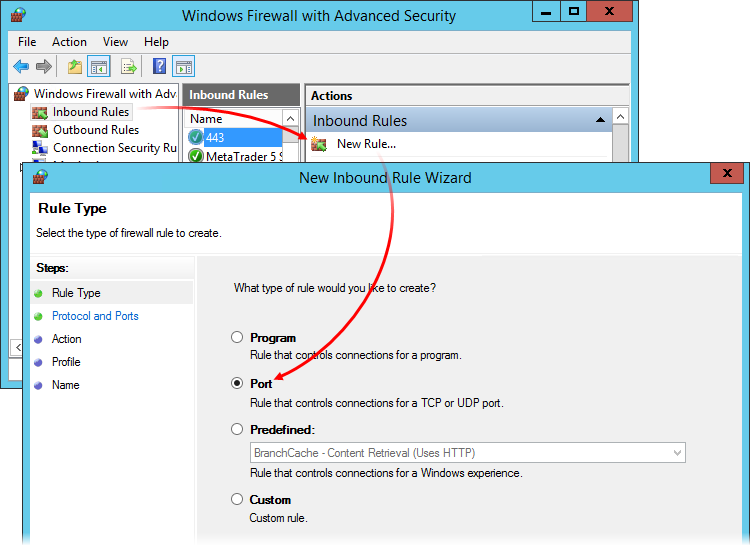

Next, set the port number and select "Allow the connection":

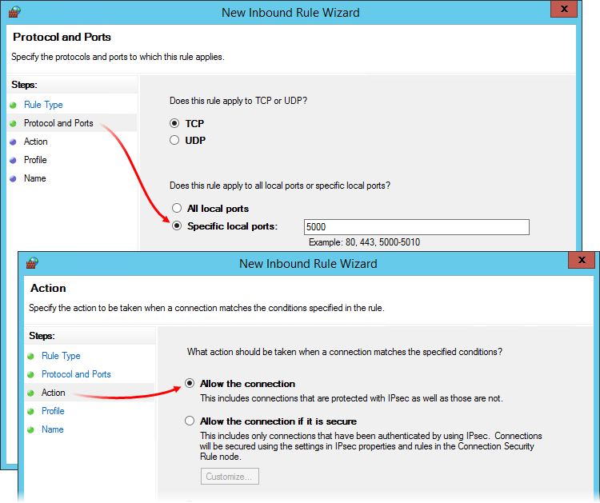

Depending on the location of your PC, specify the profile the rule is applied for: domain, private network or public network. At the last stage, enter a name for the rule.

For each component of the platform, the list of ports that should be allowed is different:

### Access Server (#access-server)

Ports for outgoing connections | Reason  
---|---  
Ports, on which [trade servers](../Platform-Setup/Network-cluster/Configuring-Servers/Trade-Server.md) work. | Access servers rout clients' connections to trade servers. In case with the main trade server, additionally configuration files are updated and [time is synchronized (#synchronization)](../Platform-Setup/Time.md#synchronization).  
Port, a [history server](../Platform-Setup/Network-cluster/Configuring-Servers/History-Server.md) works on. | Receiving news, quotes and [updates](../Platform-Setup/Live-Update.md).  
Port 443. | Connection to MetaQuotes' Updates server (https://updates.metaquotes.net).  
Ports for incoming connections | Reason  
Port the access server works on ([Bindings (#network)](../Platform-Setup/Network-cluster/Configuring-Servers.md#network)). | These ports will be listened to for receiving clients' connections.  
  

### Backup Server (#backup-server)

Ports for outgoing connections | Reason  
---|---  
Port of the [main trade server](../Platform-Setup/Network-cluster/Configuring-Servers/Trade-Server.md). | Through the main server, configuration files are updated, as well time is synchronized.  
Port of the server, whose [backups are made (#backup)](../Platform-Setup/Network-cluster/Configuring-Servers/Backup-Server.md#backup). | Backup copying of the server data.  
Port, on which a [history server](../Platform-Setup/Network-cluster/Configuring-Servers/History-Server.md) works. | Receiving updates.  
Ports, on which [gateways](../Platform-Setup/Gateways.md) are running. | Backing up gateway data.  
Port 443. | Connection to MetaQuotes' Updates server (https://updates.metaquotes.net).  
[Access server (#network)](../Platform-Setup/Network-cluster/Configuring-Servers.md#network) ports | Monitoring the availability of the backup server if [automatic switch (#auto)](../Platform-Components/Backup-Server/Switching-to.md#auto) to the backups server is enabled.  
  

### Trading Server (#trading-server)

Ports for outgoing connections | Reason  
---|---  
Port 25. | Sending [reports (#reports)](../Platform-Setup/Groups/Group-Settings.md#reports) to the mail server.  
Port 37. | [Time synchronization (#synchronization)](../Platform-Setup/Time.md#synchronization) by the TIME protocol (for the main server).  
Port 123. | Time synchronization by the NTP protocol (for the main server).  
Port of the main trade server. | Receipt of configuration files and time synchronization (for servers other than the main).  
Port, on which a history server works. | Receiving quotes and updates.  
Ports, on which [gateways](../Platform-Setup/Gateways.md) are running. | Work with gateways: receiving quotes, trading.  
Port 443. | Connection to MetaQuotes' Updates server (https://updates.metaquotes.net).  
Ports for incoming connections | Reason  
Port where the trade server works. | This port is required for the main trade server to connect all other components. For non-main servers it is required for connecting access servers.  
  

### History Server (#history-server)

Ports for outgoing connections | Reason  
---|---  
Port 443. | Connection to MetaQuotes' Updates server (https://updates.metaquotes.net).  
Port of the main trade server. | Receipt of configuration files and time synchronization.  
Ports, on which data feeds work. | Ports for [data feeds](../Platform-Setup/Data-Feeds.md) that establish connection to remote servers. For example, [MetaTrader4Feeder](../Platform-Components/Data-Feeds/MetaTrader-4-Feeder.md) (port 443 is used on default) and [TCNewsFeeder](../Platform-Components/Data-Feeds/Trading-Central-News-Feeder.md) (FTP ports 20 or 21 are used on default).  
Ports, on which remote data feeds work. | Port numbers depend on the [data feeds](../Platform-Components/Data-Feeds/Remote-Datafeed.md) that are connected.  
Ports for incoming connections | Reason  
Port, on which the [history server](../Platform-Setup/Network-cluster/Configuring-Servers/History-Server.md) works. | This port is required for connecting other components of the platform.  
Ports, on which data feeds work. | Ports, on which [data feeds](../Platform-Setup/Data-Feeds.md) work, that receive external connections from remote servers. For example, [DJPrimeTassNewsFeeder](../Platform-Components/Data-Feeds/Dow-Jones-Prime-Tass-News-Feeder.md) (port 20000 is used on default).  
  

## Disabling sounds (#sound)

Disable sounds for the server the trading server is installed at. Open the Sound section in the Control Panel:

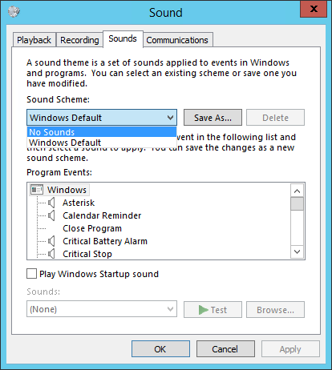

Select "No Sounds" in the list of sound schemes and click OK.

## Configuration general performance parameters (#performance)

Open the Control Panel — System — System Properties — Advanced — Performance settings. Select "Adjust for best performance" on the "Visual Effects" tab:

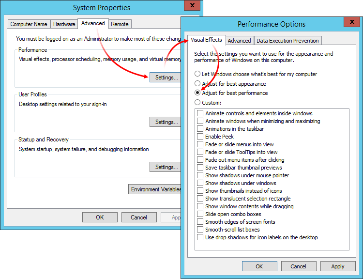

On the Advanced tab, click Change and enter the value of the initial swap file size equal to its maximum value.

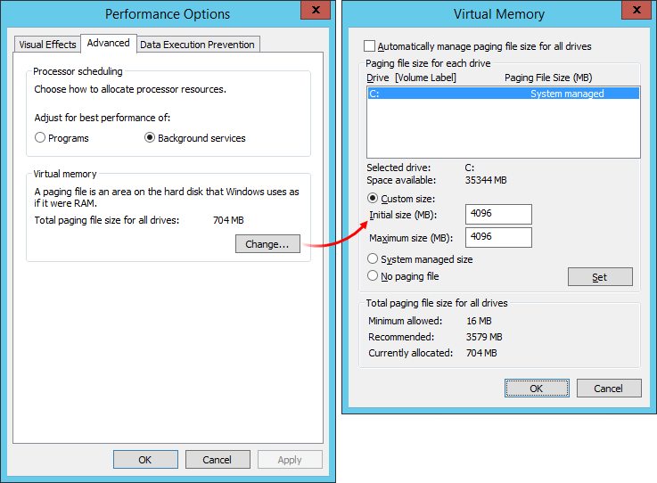

Return to the System Properties — Advanced and open the startup and recovery settings:

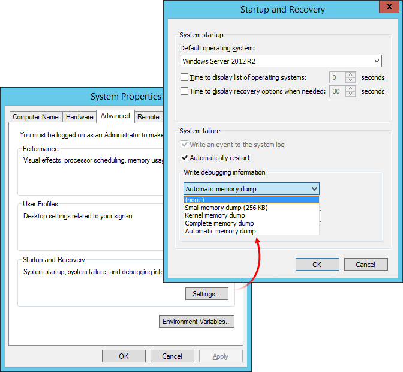

Disable the "Time to display list of operating systems" option. Set "Write debugging information" to None.

From the control panel, navigate to Hardware — Power Options. Select maximum performance mode:

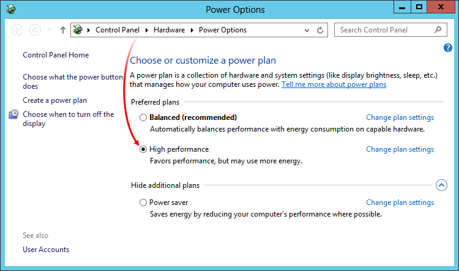

## Configuring files deletion without moving them to the Recycle Bin (#recycle)

In order to ensure the files are deleted immediately, click Properties in the bin's context menu. Select "Don't move files to the Recycle Bin. Remove files immediately when deleted":

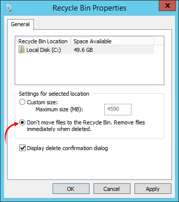

## Server Configurator (#configurator)

The "Server Configurator" program is specially designed to facilitate the server preliminary configuration process by automating the manual work of terminating various services, system configuration via the registry and deleting temporary and unnecessary information from the disks. You can download this utility from the following link <https://support.metaquotes.net/spfiles/srvcfg.exe>. The program does not require installation, it can be simply launched through the EXE file. Go through all the steps enabling all the flags. A more detailed description of the Server Configurator can be found in the article "[Using the Server Configurator](https://support.metaquotes.net/en/articles/15)".

## Configuring remote access (#remote)

> Keep the data for the remote access to the server in a safe place and do not disclose them to anyone without particular reason.

Blocking RDP connections for accounts having no password. Accounts with no entry password should not have permission for remote access to the server. Open the Control Panel — Administrative Tools — Local Security Policy — Security Options. Enable the parameter "Accounts: Limit local account use of blank passwords to console logon only".

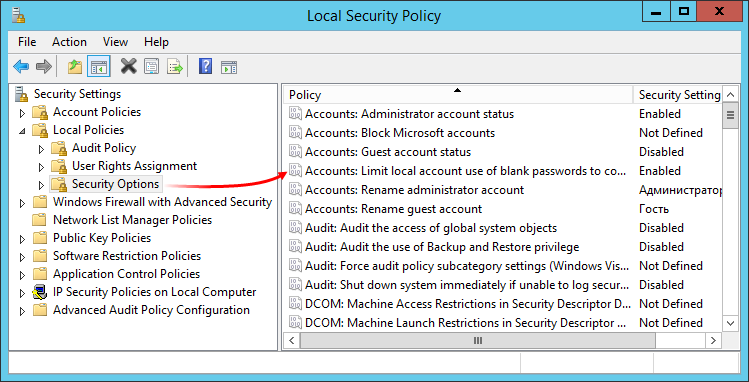

Changing a standard port for remote connection. In order to protect against the attacks monitoring "well-known" ports, change the port for the Remote Desktop Protocol. Open the registry editor (regedit), go to HKEY_LOCAL_MACHINE\SYSTEM\CurrentControlSet\Control\Terminal Server\WinStations\RDP-Tcp and find the Port Number parameter. Double-click on it, select the decimal system in the new window and set the necessary port as the value.

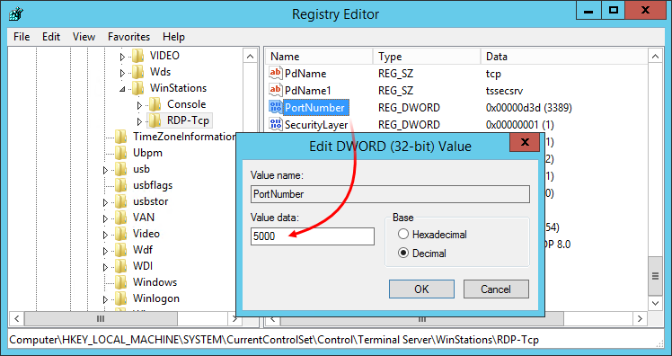

  * The specified port should be permitted in the [Windows Firewall (#firewall)](System-Preparation.md#firewall).
  * In order to remotely connect to the server, specify the new port after an IP address separated by a colon. For example, 10.59.162.3:5000.

  
---  
  
Limitation of IP address list for remote connection. As an additional security measure, you can restrict the list of IP addresses that can be used to remotely connect to the server. For example, you can allow connection only from your office's IP addresses.

Open Windows Firewall and find "Remote Desktop - User Mode (TCP-In)" in the list of inbound rules. There may be several such rules depending on the number of network profiles. Open the one you need and go to Scope tab. In the "Remote IP address" section, select "These IP addresses" and add the necessary ones to the list:

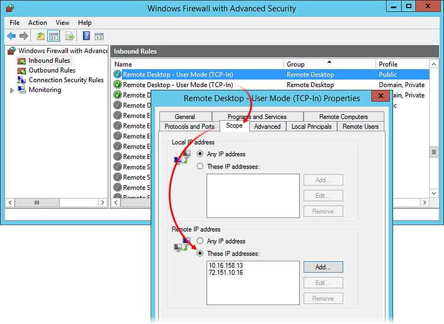

## Configuring antivirus software (#antivirus)

If antivirus software is used on your server, add to its exclusions the system processes of the MetaTrader 5 platform, as well as its installation directory. Constant monitoring by antivirus software reduces platform performance.

Here is an example of adding exclusions in Windows Defender, which is a built-in antivirus software used on Windows Server 2016. Open Windows Settings — Updates and Security — Windows Defender. Go to "Exclusions" and click "Add an exclusion".

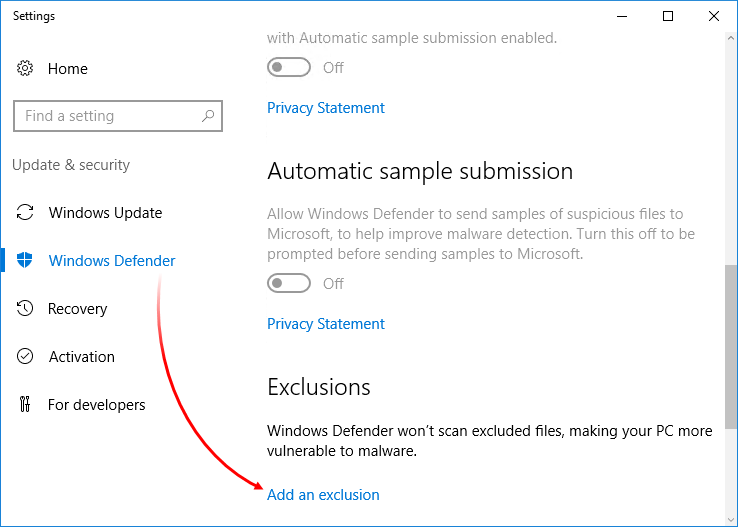

Select "Exclude folder" and choose the platform installation directory.

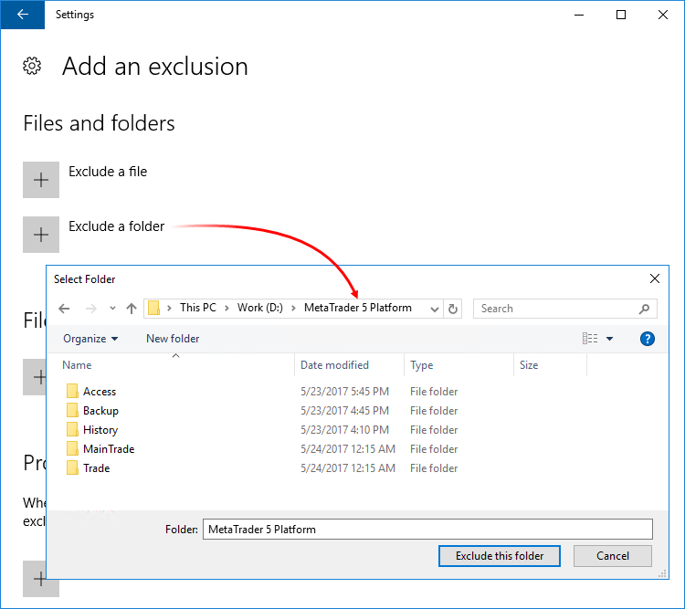

Click "Exclude process .exe, .com or .src". Specify the name of the platform component process in the window that opens. You can specify the name of the server executable file (for example mt5trade64.exe) or the name of the process (for example mt5msrv).

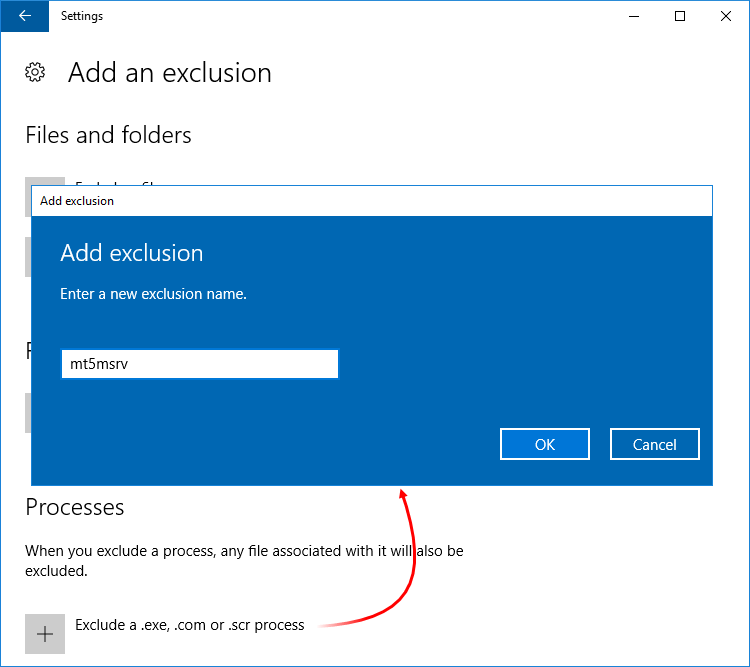

Similar exclusions should be added for all installed components of the cluster. The default names of the services are:

  * mt5msrv — the main trade server
  * mt5tsrv — an additional trade server
  * mt5asrv — an access server
  * mt5bsrv — a backup server
  * mt5hsrv — a history server

If several components of the same type are installed, a digit is added to the service name. For example, mt5tsrv5. The list of installed processes can be viewed in the task manager.
