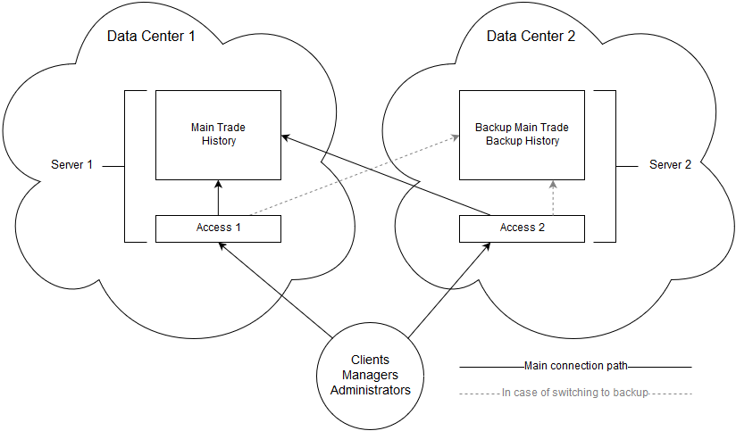
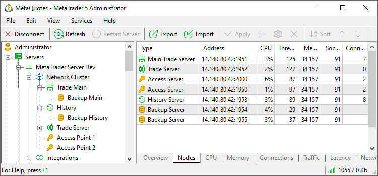

[🏠 Document Start](../../README.md) / [MetaTrader 5 Trading Platform](../../MetaTrader-5-Trading-Platform.md) / [Platform Installation](../Platform-Installation.md) / System Requirements

[Previous](../Platform-Installation.md) | [Next](System-Preparation.md)

# System Requirements (#system-requirements)

The MetaTrader 5 platform components are recommended to be installed on dedicated servers rented from hosting companies.

## Hardware (#hardware)

| Minimum requirements | Recommended requirements  
CPU | Intel i7 12xx or AMD Ryzen 9 5900 series, quad-core or higher | Intel Xeon Silver 43XX or AMD EPYC 40XX  
RAM | No less than 16GB | No less than 32GB  
Disk | RAID-1 array with 2 x 1 TB disks | RAID-1 array with two 1 TB SSD/NVMe disks for the trade server and the history server, RAID-1 array with 2 x 1 TB for backup servers  
Network | Both download and upload speed no less than 100 Mbps | Both download and upload speed no less than 1 Gbps  
Operating System | Windows Server 2022 Standard x64 or newer | Windows Server 2025 Standard / Server Core edition  
  
  * The processor must support [AVX2](https://en.wikipedia.org/wiki/Advanced_Vector_Extensions) instructions to enable platform installation.

  * Choose a server configuration depending on the number of clients, financial instruments and the density of quotes stream. When databases grow, causing an increased load on the trading platform, event the initially recommended configuration may be fail to cope with such load.
  * Due to the fact that the backup server is basically a duplicate of the main trading server, it is desirable that the configuration of the backup server is similar or even identical to the configuration of the main server. It's not recommended to place the backup server at the same hosting company as the main server, as it may happen that the entire network of the provider will be unavailable. Locating the servers at different hosting companies increases data security and the resiliency of the system.
  * History server processes and stores a huge volume of information. Due to this fact, important criteria for it are disk volume and disk read/write speed.

  
---  
  

## Additional Requirements (#additional-requirements)

  * No third-party software for system time synchronization is allowed.
  * Use virtualization if you have control over the hypervisor and can ensure enough resources for the virtual machine running MetaTrader 5. At least 8 logical cores must be available to the virtual machine (virtual processors are specified here, unlike physical ones used for dedicated servers). The machine should support the Over-Provisioning technology and have the disk speed of no less than 30 MB/s.
  * Configure BIOS on the server to run low-latency applications: turn all the energy saving features off (including CPU C-state), configure memory settings to the 'High Performance' state.

## Recommended basic cluster configuration (#recommended)

We recommend renting at least two servers. It is advisable to have servers that are physically located in different data centers. One server is to be used as the main one. The second server is used as the backup one. The main server data is to be replicated to it in real time. Thus, even if one of the hosting providers has troubles, you will be able to restore the platform on the backup server. This will allow you to minimize risks, while the probability of failure in both data centers is very small.

The following platform components should be installed on the main and backup servers:

Main server | Standby server  
---|---  
Main trade server History server Access server | Backup server for the main trade server Backup server for the history server Access server  
  
Components can be installed in different physical servers within one data center, in order to provide a greater platform performance.

In MetaTrader 5 Administrator, suggested configuration looks as follows:

It is strongly recommended to install the history server close to trade servers in order to avoid delays when delivering quotes and sending trading operations to external systems through gateways.
