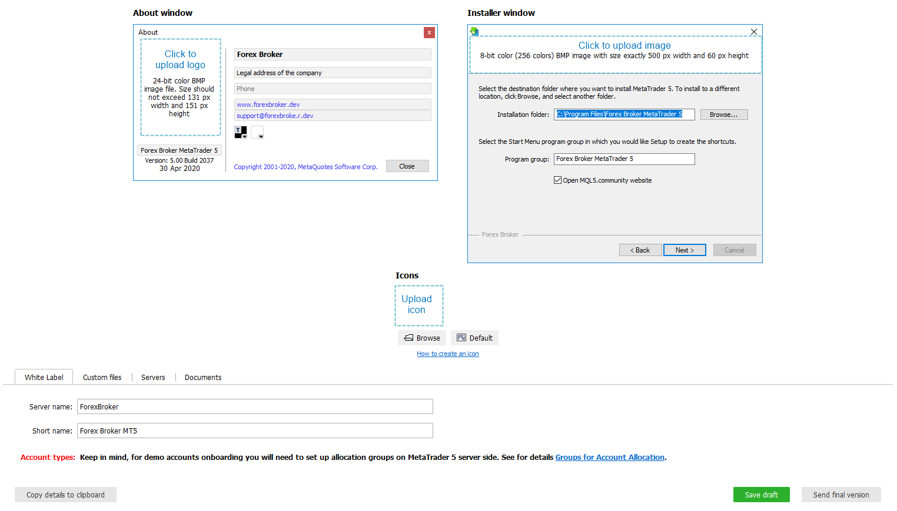
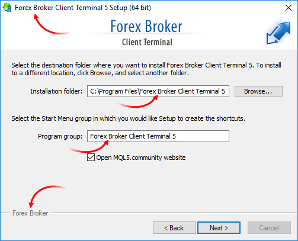
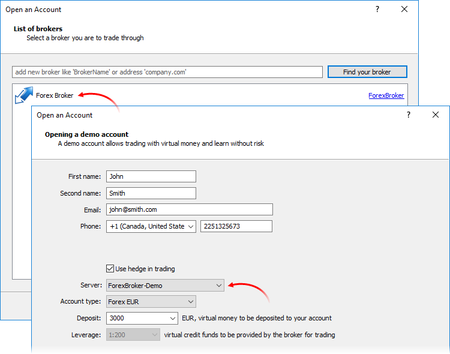
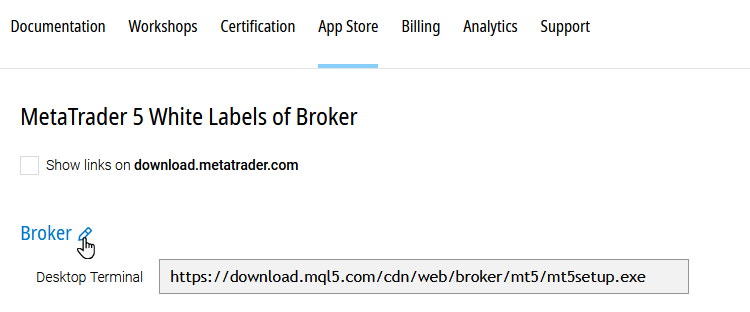
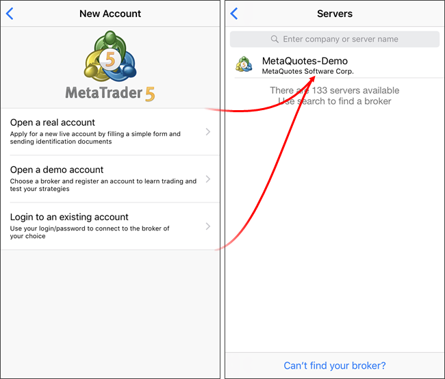
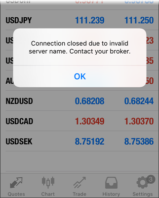

[🏠 Document Start](../../README.md) / [MetaTrader 5 Trading Platform](../../MetaTrader-5-Trading-Platform.md) / [Platform Installation](../Platform-Installation.md) / White Label

[Previous](Activation.md) | [Next](Fast-Deployment.md)

# White Label (#white-label)

White Label refers to the branding of the desktop terminal of the trading platform for a specific brokerage company. The White Label includes the company's name, contact details, logos, and other MetaTrader 5 terminal settings.

The client-side part of the platform also includes MetaTrader 5 mobile terminals for iPhone and for Android, as well as the a web terminal that provides account access via a web browser. If these components were not purchased together with the platform, you can [ordered then separately](https://support.metaquotes.net/en/market/product/248) at any time. Please note that no appearance modifications (branding/white labeling) are applied to these components.

> White Label applies exclusively to the MetaTrader 5 desktop client terminal. The Manager and Administrator terminals remain standard and are not subject to customization.

## White Label for the Client Terminal (#terminal-wl)

After the platform purchase, a support ticker will be automatically created in the [Service Desk](https://support.metaquotes.net/en/servicedesk) section of the technical support site. This ticket will include an online form used for creating the White Label. The ticket will allow you to track the delivery status and provide additional information if necessary.

The online form is located in the body of the ticket, directly beneath the subject line.

  * The fields marked in red are mandatory and must be completed. These include: company address, website, name, short name, server name, and logos.
  * All terminal information (branding, images, server name) must match the company's name. Promotional slogans are not allowed in images unless the company holds a valid legal registration or license for their use.
  * If you do not yet have ready-made logos, you may use the default MetaQuotes logos. Logos and other details can be updated later. To do this, simply open the White Label editing form from the [Download](https://support.metaquotes.net/en/download/mt5) page. The corresponding link appears when you hover your cursor over the terminal name.

  * The "Custom Files," "Servers," and "Documents" sections are available only when editing the White Label via the [technical support website](https://support.metaquotes.net/en/market/whitelabel/mt5). These sections cannot be completed during the initial platform order.

  
---  
  

### The About window (#the-about-window)

In this tab, specify your company name, contact details, logo, and program name. This information will be visible to traders in the "About" window of your terminal. You can edit the relevant fields directly within the "About" window. When you hover the cursor over each field, a tooltip will appear explaining what information should be entered.

Element | Description  
---|---  
Company name | The name of the company for which the White Label is being created. By default, this field is populated with the company name provided during contract signing. Scanned copies of company documents can be uploaded in the Documents tab.  
Address | The registered office address of the company, as specified in the KYC form. The address can be specified in two lines. Use the special character \n to insert a line break.  
Phone | Phone number. You may provide additional contact information beyond just the company phone number. The data can be split into two lines using the special character \n. For example: Tel : +1 xxx xxxxxx\nFax: +1 xxx xxxxxx Phone numbers should be specified in the standard international format.  
Site | The URL of your company's website, for example: www.metaquotes.net Do not include the "https" protocol prefix; it will be added automatically. Only one website address can be entered; additional links will not be functional.  
E-mail  | The e-mail address of your company's technical support service.  
Logo | A BMP image with 24-bit color depth. The image dimensions must not exceed 131 pixels in width and 151 pixels in height. To upload a logo, click the Select button and choose an image file in the dialog window. After uploading, you can center the image by clicking the corresponding button. To use a standard MetaQuotes logo, click the Default button ([archive with MetaQuotes logos](https://support.metaquotes.net/spfiles/metatrader4/forms/allimages.zip)).  
Program name | The name is generated based on the company name or registered trademark (brand). It is used as:

  *     * the title of the client terminal window
    * the name of the terminal installation directory and Start menu group
    * the label under the desktop shortcut

If you want to use the word "MetaTrader" in the program name, it must be written exactly as: MetaTrader (as one word, with capital "M" and "T").  
  
The About window always displays the MetaQuotes Ltd copyright notice, a link to the company's website, and a link to the End-User License Agreement (EULA).

### The Installer window (#the-installer-window)

In this section, you can specify your company logo to be displayed in the terminal installation window, as well as the icon under which your terminal will operate.

Element | Description  
---|---  
Banner | A BMP image with 8-bit color depth (256 colors), with exact dimensions of 500 pixels wide by 60 pixels high. You can create a banner by combining the default MetaQuotes logo with your company or program name.  
Icon | An ICO file containing a set of frames sized 16x16, 32x32, 48x48, and 64x64 pixels, each with 8-bit and 32-bit color depth. This icon will appear in the main window of the client terminal, on the desktop, and in the Start menu. The icon file (terminal.ico) is also included in the directory of the installed terminal. Icons can be created using various free programs, such as [IcoFX](https://www.icofx.ro/) and others. A detailed guide on creating an icon using "Icon Studio" is available in the answer to the question: "[How to create an icon for the client terminal?"](https://support.metaquotes.net/en/articles/1460)  
  
In addition to these elements, the company name is also used in the installer. It is displayed in the window title, installation paths, and footers:

### Custom files (#custom-files)

In this tab, you can upload files that will be automatically included in the client terminal build and placed into their respective folders.

Custom files should be taken from the corresponding folders of the client terminal. To prepare them, open the terminal, configure it as desired, close it, and then copy the necessary files. These can then be uploaded using the custom file upload interface. Do not include any files whose purpose you do not clearly understand. If you wish to keep all default settings and the appearance of the client terminal unchanged, you may skip this tab entirely.

Folder | File types  
---|---  
config | Here you can upload files that store terminal settings. Upon first launch after installation, the client terminal will apply these configurations. For example, terminal.ini stores data related to the position and size of the client terminal windows (note: this does not include chart windows, which are saved in the profile - see below). Keep in mind that the coordinates are stored in absolute values, which may result in different window positions on different screens. We do not recommend including this file in the terminal build. The file named trade.ini contains trading settings of the terminal (found under Tools - Options in the terminal menu). The common.ini file contains general settings (also under Tools - Options). It is strictly prohibited to upload a common.ini file that contains the value AllowDllImport=1. For security reasons, we do not allow DLL imports to be enabled by default for end users.  
bases\default\symbols | You can upload price history files here, along with a symbol set file that defines which instruments will appear in the Market Watch window on the terminal's first launch. For details please see "[How to change the default list of symbols in the client terminal label?](https://support.metaquotes.net/en/articles/1498)"  
MQL5 | This folder and its subfolders may contain custom indicators, scripts, or Expert Advisors (EAs) that will be available in the client terminal. It is strictly forbidden to include any .DLL files, or .EX5 files that reference external DLLs.  
MQL5\profiles\charts\default | Here, you can add a default terminal profile that will be applied on the first startup. For details please see "[How to change the default set of charts in the client terminal label?](https://support.metaquotes.net/en/articles/1499)"  
MQL5\profiles\symbolsets | This directory stores symbol set files (*.set) that can be selected from the context menu in the Market Watch window. You may create your own sets based on the types of instruments offered.  
MQL5\profiles\templates | You can upload your own chart templates (*.tpl) and terminal report templates (*.htm). You may also modify built-in report templates such as ReportTrade.htm, ReportHistory.htm, and ReportTester.htm, and upload the customized versions here.  
  

### Servers (#servers)

In this tab, select the servers that should appear in the list when opening a new account in the terminal. Example:

### Documents (#documents)

Upload documents confirming the registration details of the company for which the White Label is being issued. A list of required documents can be found in the article "[Guide to easily meet KYC requirements](https://support.metaquotes.net/en/articles/1588)". Only color scans are accepted.

If you are editing an existing White Label and your company details have not changed, re-uploading the documents is not required.

### Submitting the final version (#submitting-the-final-version)

Carefully review all entered information before submitting the final version. After submission, changes can only be made once the client terminal build has been completed. To temporarily save your progress and return later, click "Save as a draft".

Once all data is confirmed, click "Send final version" in the bottom-right corner of the form.

### What happens next (#what-happens-next)

After your order is confirmed (the automatically created ticket will change status to "Completed"), the client terminal White Label will be built using the information provided in the form. The download link for the [web installer](https://support.metaquotes.net/en/articles/427) will appear under [App Store / White Labels / MetaTrader 5](https://support.metaquotes.net/en/market/whitelabel/mt5).

To modify the White Label later, click the edit button in the block containing the desktop terminal link:

> We strongly recommend that brokers use distribution links provided in the [App Store / White Labels / MetaTrader 5](https://support.metaquotes.net/en/market/whitelabel/mt5) section of this website when sharing installers with traders. If your corporate policy prohibits linking to external websites, you may host the files on your own server, just be sure to periodically check for and apply updates. Always keep your applications up to date!

## Platform configuration for White Label (#platform-configuration-for-white-label)

Ensure that after the White Label is registered, your trading server receives the updated license file. By default, the trading server checks for license updates at the end of the trading day. To apply the update immediately, run a [manual platform update](../Platform-Setup/Live-Update.md). Note that this will restart your trading server.

If the server does not restart, it indicates an update error. Verify that the server machine can access: https://updates.metaquotes.net. For further details, check the [History server log](../Platform-Setup/Network-cluster/Journal.md) filtered by keyword "Update" or in the "logs\mt5srvupdater.log" file located in the [History server directory](../Platform-Components/History-Server/Structure-of-Directories-and-Files.md).

> If the license file is not updated, clients will see outdated company information in their terminals when connected to your server. Also, outdated data will be displayed in client statements.

## White Label for the Mobile Terminal (#mobile-terminal-wl)

Mobile terminals allow your clients to manage their trading accounts without a desktop PC. Using smartphones, they can analyze market conditions and execute trades at any time.

Ordering a mobile terminal gives you access to several versions for different device types:

  * MetaTrader 5 for iPhone — for iPhone, iPod Touch and iPad powered by iOS 15.0 and higher;
  * MetaTrader 5 for Android — for smartphones and tablet PCs powered by Android OS 4.0 or higher.

Clients can connect to any trading server owned by a company that has purchased a mobile White Label.

To order the mobile terminal, select MetaTrader 5 Mobile in the [Buy section](https://support.metaquotes.net/en/market) of the technical support website. In the popup window, specify your company name. It must exactly match the name used in your desktop terminal's White Label.

Once the order is confirmed, a support ticket will be automatically created in the [Service Desk](https://support.metaquotes.net/en/servicedesk) with your order number in the title. This ticket will help you track the status of your order and provide any additional information if required. Once the order status changes to "Completed", the mobile White Label will be assembled for you.

The demo and live account opening settings configured in the [Account Allocation](../Platform-Setup/Accounts/Account-Allocation-Settings.md) section will be applied to the mobile terminal just like the desktop terminal. The server icon shown in the list will match the one used in the desktop terminal.

MetaTrader 5 for iPhone can be downloaded via [iTunes](https://download.mql5.com/cdn/mobile/mt5/ios?utm_campaign=support.metaquotes.net) or from the App Store on iPod Touch/iPhone/iPad. MetaTrader 5 for Android can be downloaded from the [Google Play](https://download.mql5.com/cdn/mobile/mt5/android?utm_campaign=support.metaquotes.net&hl=ru) website or Google Play mobile application.

Your server will be accessible for connecting both existing and new accounts.

By default, only the MetaQuotes-Demo server appears in the list. To find another server, users can simply type the first few letters of its name or the associated company. Server search results are filtered based on the account type - demo servers for demo accounts, real servers for real accounts.

If MetaTrader 5 mobile users encounter the error "invalid server name", it likely means that the [Company field in the group settings (#company)](../Platform-Setup/Groups/Group-Settings.md#company) is incorrect or does not match the company name associated with the mobile White Label.

You can always find the exact company name in the original White Label request ticket, on the [White Labels](https://support.metaquotes.net/en/market/whitelabel/mt5) page, or in the [edit form](https://support.metaquotes.net/en/forum/5854).
