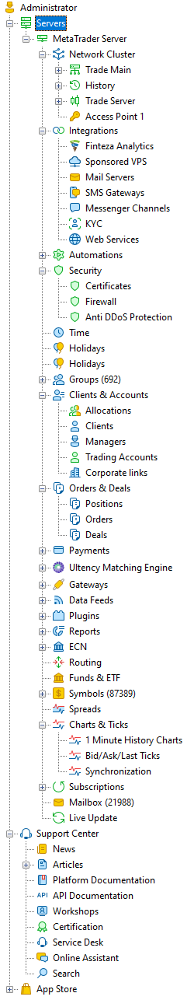

[🏠 Document Start](../README.md) / [MetaTrader 5 Trading Platform](../MetaTrader-5-Trading-Platform.md) / Platform Setup

[Previous](Platform-Components/Old-WebTerminal.md) | [Next](Platform-Setup/General-Information.md)

# Administration

The administration of the online trading platform includes managing of not only the trade server but also of the intermediate components (access points, backup servers, history server, etc.). The administration is divided into categories represented as a tree-like list in the left part of the [MetaTrader 5 Administrator](MetaTrader-5-Administrator.md):

 | 

  * [Start Page](Platform-Setup/Start-Page.md) — general information about the platform, live update settings
  * [Network Cluster](Platform-Setup/Network-cluster.md) — settings of platform components
  * [Integrations](Platform-Setup/Integrations.md) — configuring mail servers, messengers and access to Finteza analytics
  * [Automations](Platform-Setup/Automations.md) — configuring scenario-based automated actions
  * [Certificates](Platform-Setup/Security/Certificates.md) — configuring certificates for extended authentication
  * [Firewall](Platform-Setup/Security/Firewall.md) — configuring access by IP addresses
  * [Anti DDoS Protection](Platform-Setup/Security/Anti-DDoS-Protection.md) — integration with external protection providers
  * [Time](Platform-Setup/Time.md) — general time settings of the server and setting of trade time
  * [Holidays](Platform-Setup/Holidays.md) — holiday settings
  * [Leverage](Platform-Setup/Leverages.md) — floating margin settings
  * [Groups](Platform-Setup/Groups.md) — account group settings
  * [Allocations](Platform-Setup/Accounts/Account-Allocation-Settings.md) — configuring the opening of demo and preliminary accounts through client terminals
  * [Clients](Platform-Setup/Clients.md) — working with customer data, documents and accounts
  * [Managers](Platform-Setup/Managers.md) — administration of manager accounts
  * [Trade Accounts](Platform-Setup/Accounts.md) — working with accounts
  * [Corporate links](Platform-Setup/Accounts/Corporate-Links.md) — adding custom links to the client terminals
  * [Positions](Platform-Setup/Positions.md) — working with positions
  * [Orders](Platform-Setup/Orders.md) — working with orders
  * [Deals](Platform-Setup/Deals.md) — working with deals
  * [Payments](Platform-Setup/Payments.md) — integration with payment systems
  * [Gateways](Platform-Setup/Gateways.md) — administration of gateways that provide interaction with exchanges
  * [Data Feeds](Platform-Setup/Data-Feeds.md) — configuring quotes and news sources
  * [Plugins](Platform-Setup/Plugins.md) — modules of expanding the platform functionality
  * [Reports](Platform-Setup/Reports.md) — report settings
  * [ECN](Platform-Setup/ECN.md) — configuring the built-in electronic communication network
  * [Routing](Platform-Setup/Routing.md) — rules of processing of coming trade requests
  * [Funds & ETF](Platform-Setup/Funds-&-ETF.md) — controlling fund settings: commissions, managers, investors
  * [Symbols](Platform-Setup/Symbols.md) — configuring financial instruments
  * [Spreads](Platform-Setup/Spreads.md) — configuring margin requirements for positions in spread
  * [1 Minute History Charts](Platform-Setup/1-Minute-History-Charts.md) — working with price data stored at the server
  * [Bid/Ask/Last Ticks](Platform-Setup/BidAskLast-Ticks.md) — viewing tick data
  * [Synchronization](Platform-Setup/Synchronization.md) — configuring synchronization with other MetaTrader servers
  * [Subscriptions](Platform-Setup/Subscriptions.md) — configuring subscriptions for additional trader services
  * [Mailbox](Platform-Setup/Mailbox.md) — built-in email system for communicating with traders and colleagues
  * [Live Update](Platform-Setup/Live-Update.md) — configuring automatic updating of the system components
  * [Support Center](Technical-Support.md) — this section offers help for the MetaTrader 5 platform users: articles, news, answers to frequently asked questions and a possibility to contact the technical support team directly
  * [App Store](App-Store.md) — store of additional components for the trading platform: gateways, liquidity, CRM and others

  
---|---
