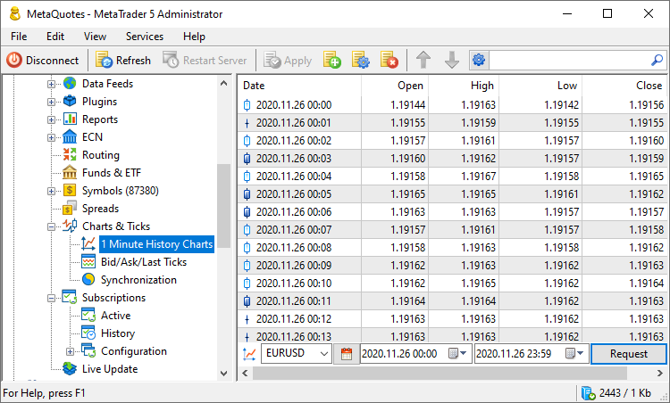
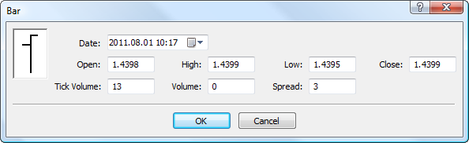

[🏠 Document Start](../../README.md) / [MetaTrader 5 Trading Platform](../../MetaTrader-5-Trading-Platform.md) / [Platform Setup](../Platform-Setup.md) / 1 Minute History Charts

[Previous](Spreads.md) | [Next](1-Minute-History-Charts/Import-of-History-Data.md)

# Charts (#charts)

This section allows managing price data of financial instruments. The history of prices is stored in the platform in the form of one-minute bars and [ticks](BidAskLast-Ticks.md). One-minute bars are used for displaying history charts in client terminals. Such charts allow traders to analyze price dynamics, perform technical analysis and test trading robots.

Only one-minute bars are stored in the platform; all other timeframes are built in client terminals (including mobile and web platforms) using these bars. The use of 1-minute bars allows saving the disk space and network traffic, as well as preserve data consistency on all timeframes.

The trading platform ([the history server](../Platform-Components/History-Server.md)) builds bars using ticks received from datafeeds and gateways. Depending on the ["Charts" parameter of a trading symbol (#charts)](Symbols/Symbol-Settings/Common.md#charts), bars are based on Bid or Last prices (the price of the last executed trade). As a rule, charts of exchange instruments with the enabled [Market Depth (#dom)](Symbols/Symbol-Settings/Common.md#dom) feature are based on the Last price.

Bars are only formed and accumulated using newly received ticks. To meet traders' needs, it is highly recommended to find a high-quality deep history of all your financial instruments and [import](1-Minute-History-Charts/Import-of-History-Data.md) it to the platform. The history can also be [synchronized](Synchronization.md) with another MetaTrader 4/5 server.

Each bar can store the following data:

  * Date — the bar formation date (minute).
  * Open — the price at the beginning of bar formation (the beginning of the minute).
  * High — the highest price inside the bar.
  * Low — the lowest price inside the bar.
  * Close — the price at the end of bar formation (the end of the minute).
  * Tick Volume — the number of ticks received during bar formation. The variable only counts the ticks that change the price based on which the bar is constructed (Bid or Last, depending on [symbol settings (#charts)](Symbols/Symbol-Settings/Common.md#charts)). Several ticks in a row with the same price will be counted as one.
  * Volume — the real volume of trades executed during bar formation.
  * Spread — the lowest symbol spread recorded during the bar formation time.

  * When the [chart constructing mode (#charts)](Symbols/Symbol-Settings/Common.md#charts) is changed, the accumulated price history will not be re-built. Settings only apply to new received data.
  * For the symbols, the charts of which are based on Bid prices, the history server does no accept Last prices and volumes from [gateways](Gateways.md) and [datafeeds](Data-Feeds.md). These [ticks](BidAskLast-Ticks.md) are not saved and are not delivered to other components of the platform.

  * The price data received from gateways and data feeds is stored under [history server installation directory\history]. If the free disk space on the history server drops below 2 gigabytes, no saving of new arriving price data is performed. This prevents data from occupying of all available disk space. Thus, the overall server performance is preserved. If data cannot be written to disk, the following message is added into the history server’s log: "'EURUSD' save skipped due not enough free space on disk", "bars and ticks are not saved due not enough free space on disk", "synchronization was stopped due not enough free space on disk ". In this case, you should immediately increase free disk space on the server.

  
---  
  

## Requesting Data (#request)

In order to view or edit bars of a symbol, you should request them.

  * Choosing a symbol  
In the first field, specify one of financial symbols from the platform. The symbol can be specified manually or chosen from the list which opens by clicking on the down arrow.
  * Choosing a period  
Then specify the period, for which you want to request bars. You can choose one of the predefined periods by clicking on (today, last 3 days, last week, last month, last 3 months, last 6 months or the entire history). You can also specify a custom time interval.
  * Request execution  
To receive the history data, click "Request" or choose the same command from the context menu .

## Adding and Editing Data (#add-edit)

To add a bar, click " Add Bar" in the [Edit (#add)](../MetaTrader-5-Administrator/User-Interface/Main-Menu/Edit.md#add) menu, on the [Standard](../MetaTrader-5-Administrator/User-Interface/Toolbar/Standard.md) toolbar or in the context menu. To edit a bar, click "Edit Bar" or double-click on it.

Each bar can store the following data:

  * Date — the bar formation date (minute).
  * Open — the price at the beginning of bar formation (the beginning of the minute).
  * High — the highest price inside the bar.
  * Low — the lowest price inside the bar.
  * Close — the price at the end of bar formation (the end of the minute).
  * Tick Volume — the number of ticks received during bar formation.
  * Volume — the real volume of trades executed during bar formation.
  * Spread — the lowest symbol spread recorded during the bar formation time.

To delete a bar, select it and click "Delete Bars". To delete multiple bars, select them with the mouse while holding down "Shift" or "Ctrl", and then click "Delete Bars".

## Context Menu (#context)

The following commands are available from the context menu of this section:

  *  Add — add a new bar.
  *  Edit — edit a selected bar.
  *  Delete — delete selected bars.
  *  Request — request history data.
  *  Export — [export](General-Information/Data-Export.md) current requested history data to a file in CSV or HTML format.
  *  Import from File — [import](1-Minute-History-Charts/Import-of-History-Data.md) history data to the current requested symbol from a file.
  *  Import from Folder — [import](1-Minute-History-Charts/Import-of-History-Data.md) history data to the current requested symbol from multiple files.
  *  Split Stock — [transform](1-Minute-History-Charts/Split-Stocks.md) minute bars after splitting stocks.
  *  Find — open the [Search](../MetaTrader-5-Administrator/User-Interface/Search.md) window.
  * Auto Arrange — if this option is enabled the size of columns is selected automatically.
  * Grid — this option shows/hides field separators in the table.
  * Columns — select columns to display. You can additionally enable "Volume", "Spread" and "Tick volume".

