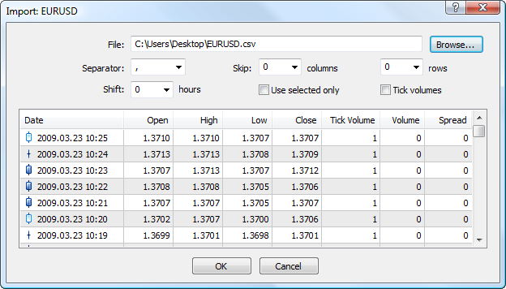
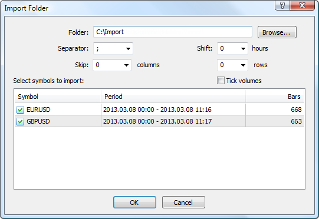

[🏠 Document Start](../../../README.md) / [MetaTrader 5 Trading Platform](../../../MetaTrader-5-Trading-Platform.md) / [Platform Setup](../../Platform-Setup.md) / [1 Minute History Charts](../1-Minute-History-Charts.md) / Import of History Data

[Previous](../1-Minute-History-Charts.md) | [Next](Split-Stocks.md)

# Import of History Data

The import of history data implements the following tasks:

  * creating history when a new symbol is added;
  * filling up missing parts of history of an existing symbol;
  * correcting separate parts of history.

History data can be imported from a single file or from multiple files at once (from a folder).

> Only one-minute bars are stored in the platform; all other timeframes are built in client terminals based on these bars. The use of 1-minute bars allows saving the disk space and network traffic, as well as preserve data consistency on all timeframes.   
> You can import data from higher timeframes (for example when [switching from MetaTrader 4](../../Migration-from-MetaTrader-4/Financial-Instruments.md)). However please note that lower timeframe charts will be incomplete. For example, if you import D1 data, these data will be written as 1-minute bars as of the beginning of corresponding days. The D1 and higher timeframe charts will be complete, but charts on lower timeframes will have gaps.

## Import from File

In order to start importing data, click " Import from File" in the [context menu (#context)](../1-Minute-History-Charts.md#context) of the "Charts" section. After that the following window will be opened:

Specify the following information here:

  * File — specify a file to import using the "Browse" button. You can import files of different formats: *.hst and *.hsc — history data of the MetaTrader 4 servers and terminals; *.csv, *.prn and *.txt — text files with separators;
  * Separator — separator of elements in a text file;
  * Skip columns and rows — number of columns (left to right) and rows (top to bottom) that should be skipped when importing;
  * Shift — time shift in hours. This option is used when importing data from other time zones;
  * Use selected only — this option allows importing only lines selected in the preview window. Strings can be selected using the mouse, holding "Ctrl" or "Shift".
  * Tick volume — if this option is not checked, the information on tick volumes will not be imported from the file.

> Data are imported for the symbol that is currently selected by request in the ["Charts"](../1-Minute-History-Charts.md) section.

## Import from Folder

You can import history data in bulk from multiple files. To do it, click " Import from Folder" in the [context menu (#context)](../1-Minute-History-Charts.md#context) of the "Charts" section. After that the following window will be opened:

Specify the following information here:

  * Folder — using the "Browse" button choose a folder containing history data files that should be imported. Only CSV format of data files is supported. File names must correspond to the names of the symbols created in the trading platform. For example, EURUSD.csv, GBPUSD.csv, etc.;
  * Separator — separator of elements in a text file;
  * Skip columns and rows — number of columns (left to right) and rows (top to bottom) that should be skipped when importing;
  * Shift — time shift in hours. This option is used when importing data from other time zones;
  * Tick volume — if this option is not checked, the information on tick volumes will not be imported from the files.

Once a folder is selected, the recognized price data will be displayed in the bottom part of the window. Selected symbols that should be imported by putting a check mark against them and click OK.

## Record Format

The following types of entries in text formats are supported by import:

  * YYYY.MM.DD HH:MM O H L C V
  * YYYY-MM-DD HH:MM O H L C V
  * YYYY/MM/DD HH:MM O H L C V
  * DD.MM.YYYY HH:MM O H L C V
  * DD-MM-YYYY HH:MM O H L C V
  * DD/MM/YYYY HH:MM O H L C V
  * MM.DD.YYYY HH:MM O H L C V
  * MM-DD-YYYY HH:MM O H L C V
  * MM/DD/YYYY HH:MM O H L C V
  * YYYY.MM.DD,HH:MM O H L C V
  * YYYY-MM-DD,HH:MM O H L C V
  * YYYY/MM/DD,HH:MM O H L C V
  * DD.MM.YYYY,HH:MM O H L C V
  * DD-MM-YYYY,HH:MM O H L C V
  * DD/MM/YYYY,HH:MM O H L C V
  * MM.DD.YYYY,HH:MM O H L C V
  * MM-DD-YYYY,HH:MM O H L C V
  * MM/DD/YYYY,HH:MM O H L C V
  * YYYYMMDD,HHMMSS,O,H,L,C,V

Time can be also specified in the format HH:MM:SS.

## Copying History Data from Another Symbol

For newly created symbols without any price data, one can copy the data from another symbol in the platform. To do it, specify the name of the symbol from which you need to copy the data in the [Source (#source)](../Symbols/Symbol-Settings/Common.md#source) field of the new symbol. The server will automatically copy the entire price history.

  * Once copying is finished, delete the value of the Source field from the new symbol settings.
  * Copying works only if the new symbol doesn't have any price data. To make sure there are no historical prices available, check the history\\[symbol_name] directory on the history server. This directory must be empty.

  
---
