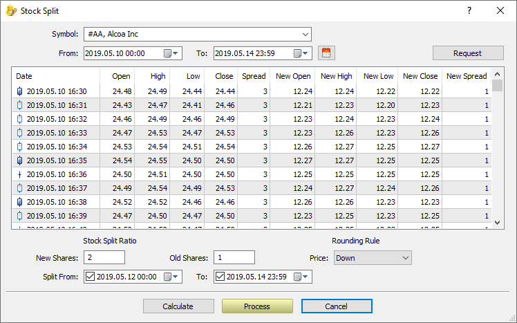
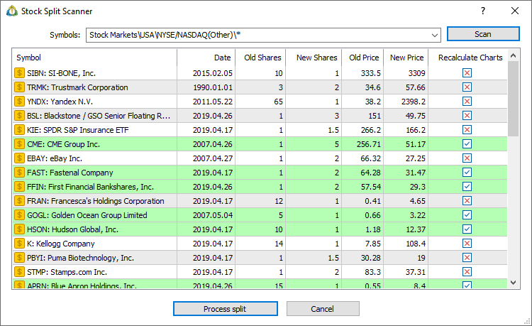

[🏠 Document Start](../../../README.md) / [MetaTrader 5 Trading Platform](../../../MetaTrader-5-Trading-Platform.md) / [Platform Setup](../../Platform-Setup.md) / [1 Minute History Charts](../1-Minute-History-Charts.md) / Split Stocks

[Previous](Import-of-History-Data.md) | [Next](../BidAskLast-Ticks.md)

# Split Stocks (#split-stocks)

Split is an increase of the number of outstanding stocks by splitting them with a proportional decrease in their value. The opposite operation — consolidating (or reverse split) by decreasing a number of stocks with a proportional increase in their value — is possible as well.

The appropriate operations (stock splitting/consolidation) can be executed on the trading platform's side as well:

  * Transforming the minute and [tick symbol history](../Bid-Ask-Last-Ticks/Split-Stocks.md) means proportional increase or decrease in prices, spreads and volumes.
  * Transforming the current client's positions — assigning a new volume and price with the ability to remove stop loss and take profit levels. Transforming is performed using MetaTrader 5 Manager.

Click "Split Stock" in the context menu of the "1 Minute History Charts" section.

Select a trading instrument and a time interval, and click Request. Minute bars appear in the list.

Set the split settings:

  * Use "New Shares" and "Old Shares" to set stock split/consolidation ratio so that prices can be transformed similarly.
  * Set the rounding rule in case the number of digital places of a new price exceeds the value set in the symbol's [Digits parameter (#digits)](../Symbols/Symbol-Settings/Common.md#digits). For example, when transforming the price of 35.15 with the ratio of 2:1, we obtain 17.575. When rounded down, the final price is 17.57, when rounded up, it is 17.58. Also, the "Standard" rounding option (standard rounding to the nearest integer) is available as well. For example, if the Digits is 2, the rounding is performed as follows: 17.234 -> 17.23, 17.235 -> 17.24.
  * If necessary, you can specify the time interval in which the split will be performed, using the "Split from" and "To" fields. In this case the operation will only be performed for one-minute data in the specified range, while the remaining data will not be affected. Such an operation may be needed for performing a backdated split. If you want to split the entire available symbol history, leave these parameters unchanged.

After implementing all the settings, click Calculate to see the preliminary split results. New parameters for each bar are displayed in the table: new OHLC prices and spread. Click Process to execute a split. 

  * Splitting can take quite a long time. Do not launch the process during trading hours.
  * Split is performed both for 1-minute and tick data, regardless of the section from which the process is launched. Only preliminary split results can be viewed separately.

  
---  
  
The process can be tracked using the [history server journal](../Network-cluster/Journal.md).

2017.04.18 17:30:27.339 HistoryBase #AA split 2 for 1 started, up rounding   
2017.04.18 17:30:27.366 HistoryBase #AA split for 2014.04.26 completed [1239 bars updated, 126977 ticks updated]   
2017.04.18 17:30:27.406 HistoryBase #AA split for 2014.04.27 completed [1052 bars updated, 105122 ticks updated]   
....   
2017.04.18 17:34:28.429 HistoryBase #AA split for 2017.04.17 completed [1438 bars updated, 134115 ticks updated]   
2017.04.18 17:34:28.888 HistoryBase #AA split for 2017.04.18 completed [874 bars updated, 89779 ticks updated]   
2017.04.18 17:34:28.888 HistoryBase #AA split 2 for 1 finished [3497656 bars updated, 26295115 ticks updated]  
---  
  

## Split Scanner (#split-scanner)

Split scanner automatically analyzes the price history of trading instruments to identify possible stock splits. The scanner then adjusts the price history to generate a smooth chart corresponding to the instrument's current prices. During analysis, the system additionally checks an internal database of publicly known stock splits.

Go to the "1-Minute History Charts" section and select "Split Scanner" in the context menu. Next, select a group of symbols and click "Scan". Check the received split points. The list will display:

  * Found split date
  * Price before and after split, their ratio
  * Number of stocks before and after split, their ratio (split ratio)
  * Overall conversion rate for prices and stocks, taking into account all splits found for the instrument

To customize the information displayed, use the context menu.

Records found in the internal list of known splits are highlighted in green.

Check the "Recalculate Charts" box for the desired splits. Please note that there can be multiple splits for each instrument. Click "Process split", and the platform will automatically convert minute and tick data.

  * Splitting can take quite a long time. Do not launch the process during trading hours.
  * Split is performed both for 1-minute and tick data, regardless of the section from which the process is launched. Only preliminary split results can be viewed separately.

  
---
