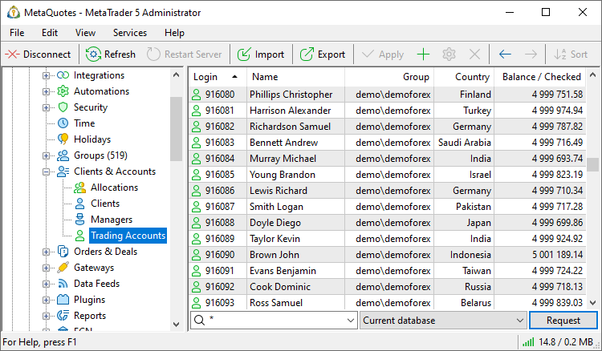

[🏠 Document Start](../../README.md) / [MetaTrader 5 Trading Platform](../../MetaTrader-5-Trading-Platform.md) / [Platform Setup](../Platform-Setup.md) / Accounts

[Previous](Clients/Import-of-from-MetaTrader-5.md) | [Next](Accounts/Creating-Account.md)

# Accounts (#accounts)

This section enables management of accounts on the server: [creation](Accounts/Creating-Account.md), [setup](Accounts/Editing-Account.md) and control of account trading states. Complete information is available for each client: personal data, all open positions and orders, financial status and security parameters.

Depending on items selected in the context menu, different [account details (#personal)](Accounts/Editing-Account.md#personal), time and address of last access to the server, etc. are shown here. Accounts can be sorted out by any of the fields. Click on a column name to sort.

  * All accounts are stored separately for each [trade server](Network-cluster/Configuring-Servers/Trade-Server.md), depending on the server the [group (#trade-server)](Groups/Group-Settings.md#trade-server), to which the account belongs, is bound to. A [manager](Managers.md) can see and manage only accounts that belong to the same server, to which the manager's account belongs.

  * [Account type (#type)](Accounts.md#type) is determined by the group to which the account belongs.

  
---  
  

## Requesting Accounts (#request)

To request accounts use a line located in the bottom part of the window. In the field to the right of  specify accounts using one of the following methods:

  * Specify the precise number of an account or of several accounts comma separated;
  * Specify mask "*" to request all accounts;
  * Select a [group](Groups.md) from the dropdown list to request accounts included into a certain group.

In the next field select a data base, from which accounts will be requested: current or archive. You can also specify one of backup databases created on the server by selecting "More backups". The following window will appear at that:

Specify the period for requesting backup copies:

  * Period — in this field you can choose one of the predefined request periods;
  * From — starting date of the selection. A date can be specified manually of using the calendar that is opened by pressing the  button;
  * To — end date of the selection.

Once a period is specified, additional items appear in the field of choosing a database — all the backup copies that were made within the specified period of time.

To display the accounts press the "Request" button.

## Working with Accounts (#manage)

To [add](Accounts/Creating-Account.md) or [modify](Accounts/Editing-Account.md) an account, press the " New" and " Edit" buttons respectively. They can be found in the ["Edit"](../MetaTrader-5-Administrator/User-Interface/Main-Menu/Edit.md) menu, in the standard part of [toolbar](../MetaTrader-5-Administrator/User-Interface/Toolbar/Standard.md) or in the [context menu (#context)](Accounts.md#context). You can also open an account for editing by a double click on it with the left mouse button. To delete an account, one should press the " Delete" button.

The accounts can be modified and deleted in groups. To do it, select them in the list with the mouse while holding the "Ctrl" or "Shift" keys.

> When an account is deleted its trade history (orders and deals) is not deleted. Do not use logins of deleted account when creating new ones.

## Account types (#type)

The account type is determined by the [type of the group](Groups/Group-Types.md), in which the account is located. For convenience, different icons are used for different types of accounts:

  *  — demo
  *  — preliminary
  *  — live
  *  — manager
  *  — technical (the "[Show to regular managers (#limits)](Accounts/Editing-Account.md#limits)" permission disabled)
  *  — disabled (the "[Enable this account (#enable)](Accounts/Editing-Account.md#enable)" permission disabled)

## Context Menu (#context)

The context menu of the list of accounts allows executing the following commands:

  *  New — [create](Accounts/Creating-Account.md) a new account.
  *  Edit — [edit](Accounts/Editing-Account.md) a selected account.
  *  Edit group — [edit](Groups/Group-Settings.md) the group a selected account is located in. 
  *  Edit manager — edit the [manager account](Managers.md), created on the basis of the selected account.
  *  Delete — delete a selected account. The deletion of an account does not affect orders, trades, or positions associated with this account. Such operations are not deleted immediately, later during optimization, or after any period of time. If necessary, you should delete them manually.
  *  Request — execute the [request (#request)](Accounts.md#request) of accounts.
  *  Move to Archive — move the selected account to the [archive](Accounts/Archive-and-Backup-Bases.md) database. When an archive or reserve database is selected, this command is changed to " Restore". Using it, you can return the account to the current database.
  * Balance — open the submenu of commands for working with [balance and credit assets](Accounts/Checking-and-Fixing-Balance.md) of an account:
    * Check Balance — when this command is executed, the calculation of total profit/loss by all the [deals](Deals.md) of a selected account is performed. Obtained value is compared with the current balance of the account. In case the values are not equal, the following entry appears in the [journal](../MetaTrader-5-Administrator/User-Interface/Toolbox/Journal.md): ''account xxx has invalid balance: xxx.xx, valid: xxx.xx".
    * Fix Balance — when this command is executed, the calculation of total profit/loss by all the deals of a selected account is performed. Obtained value is written as the current balance of the account. The operations of balance correction are necessary for [restoring accounts](Accounts/Archive-and-Backup-Bases.md) and for manual correction of trade history.
  * Copy As — copy accounts selected in the list:
    *  Lines — copy entire selected information.
    * List of Logins — copy the list of logins only.
  *  Export — [export](General-Information/Data-Export.md) the selected accounts as a *.HTM, *.HTML or *.CSV file.
  *  Import from File — [import](Accounts/Import-of-from-File.md) accounts from a CSV file.
  *  Import from Server — [import](Accounts/Import-of-from-MetaTrader-5.md) accounts from a MetaTrader 4 or MetaTrader 5 server.
  *  E-Mail — [send a message (#create)](Mailbox.md#create) to the account owner via the internal mail system or by email.
  *  Journal — request all [journal](Network-cluster/Journal.md) entries on the selected account.
  *  Find — open the [search](../MetaTrader-5-Administrator/User-Interface/Search.md) window.
  * Enabled only — show only [enabled accounts (#enable)](Accounts/Editing-Account.md#enable) in the list. Enable this option to leave only active accounts in the list.
  * Auto Arrange — if this option is enabled the size of columns is selected automatically.
  * Grid — this option shows/hides field separators in the table of accounts.
  * Columns — using this sub-menu, one can choose which [details of accounts (#personal)](Accounts/Editing-Account.md#personal) will be displayed in the list.

