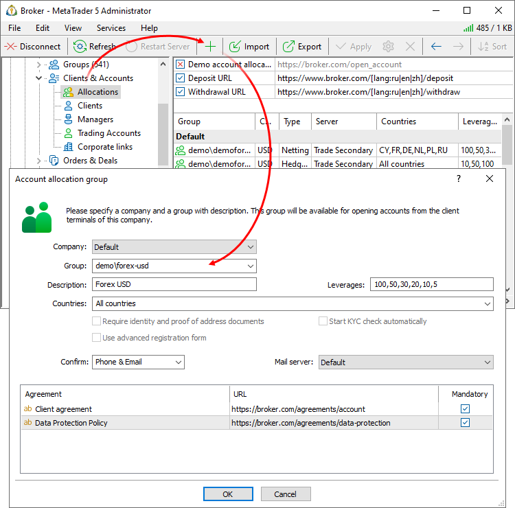
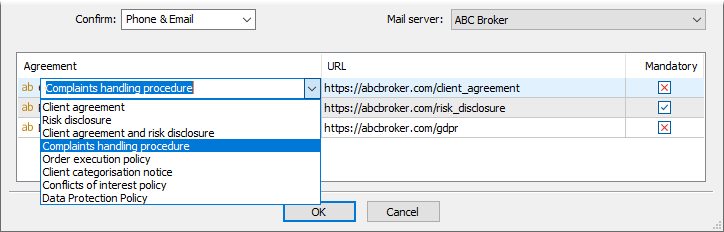
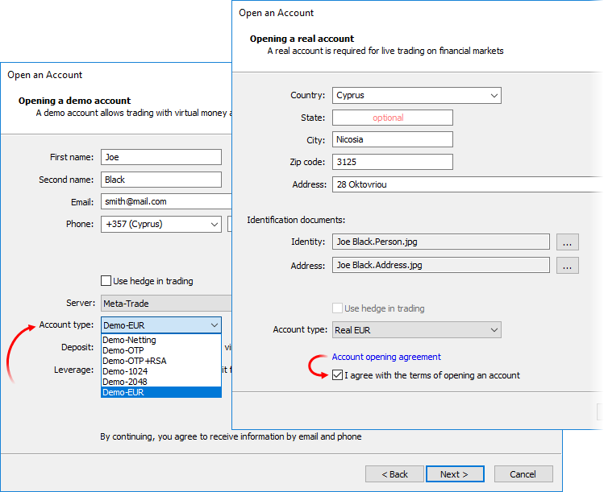
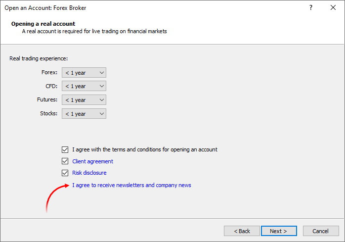
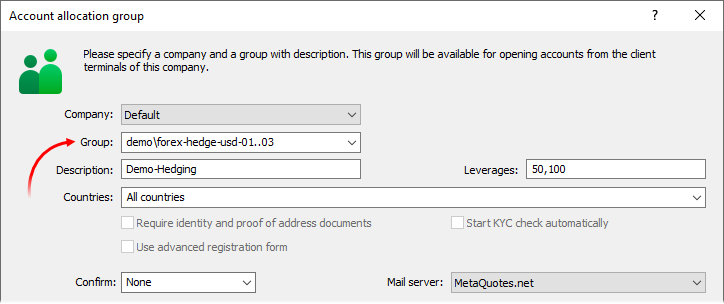
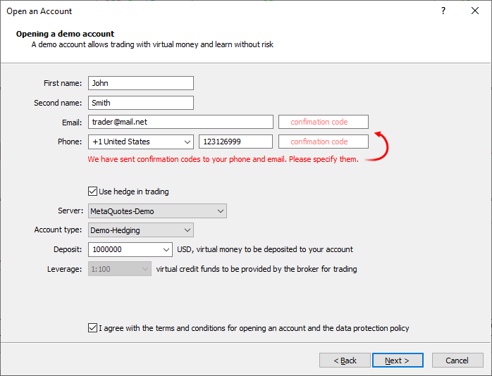
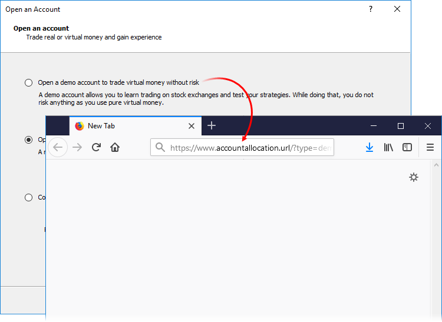

[🏠 Document Start](../../../README.md) / [MetaTrader 5 Trading Platform](../../../MetaTrader-5-Trading-Platform.md) / [Platform Setup](../../Platform-Setup.md) / [Accounts](../Accounts.md) / Account Allocation Settings

[Previous](Checking-and-Fixing-Balance.md) | [Next](Corporate-Links.md)

# Account Allocation Settings (#account-allocation-settings)

Clients can only open new demo and [preliminary real accounts](Preliminary.md) from their terminals. Parameters for the allocation of such accounts can be specified in section "Clients and Orders — Allocation of accounts":

  * Groups, in which clients can open accounts depending on their country of residence (such groups may have different deposit currencies)
  * Different leverage size for groups
  * Groups with an extended registration form, which clients need to fill when requesting a real account
  * Agreements, which clients need to accept when opening new accounts

General settings are available in the upper part:

  * Demo account allocation URL — if you want to enable opening of demo accounts only from your web site, specify the address of the appropriate page in this field. When a client selects the demo account creating option in the terminal, they will be redirected to the specified page. If you fill in the URL address, all other account allocation settings become inactive. See ["Account Redirection" (#url)](Account-Allocation-Settings.md#url) for details.
  * Deposit URL, Withdrawal URL — URLs of your website pages in which traders can deposit or withdraw money from their trading accounts. If these fields are filled, all the "Deposit" and "Withdraw" commands in the terminals will be available to all accounts on your server (regardless of the group). A click on these commands opens the relevant pages of your website. Links to withdrawal and deposit pages are only displayed for real accounts. These links are hidden for demo accounts. For details, please see the [appropriate section](Links-to-Depositing-and-Withdrawing.md).

  * Opening of accounts from the terminal is preferable since a demo account is opened as quickly and convenient for a trader as possible.

  * Any changes to account allocation settings are saved only after you click the "Apply" button in the context menu or on the toolbar.

  * The 'Demo account allocation URL' option only affects the registration of demo accounts. The preliminary account opening option will be available in client terminals if there is at least one 'preliminary' group in the list of account allocation groups.

  * The 'Demo account allocation URL' option is only used in the desktop client terminal versions. Redirection to an external site is not supported in mobile terminals.

  
---  
  
Further you should configure groups, in which clients can open demo and preliminary accounts. Each entry of this table is displayed as a separate item in the "Account type" field of the account opening dialog in the client terminal. Only demo groups are shown during the opening of a demo account, and only preliminary groups are shown when opening preliminary accounts.

Prior to configuring groups, please make sure that [demo account allocation (#demo)](../Network-cluster/Configuring-Servers/Trade-Server.md#demo) is enabled for the trade server. Then, add a group by selecting in the context menu or on the toolbar, and specify the settings:

  * Company — the name of the company (White Label), in which terminals the group will be available.
  * Group — the group of accounts. You can only select the demo group or a group of preliminary accounts. You can specify several groups to ensure [balanced distribution of accounts (#sharding)](Account-Allocation-Settings.md#sharding).
  * Description — the description of the group, which will be shown in the "Account type" field in client terminals. 
  * Leverages — the list of available leverage options, which a client can choose from when opening an account. This list is ignored if the default leverage is specified in [group settings (#leverage)](../Groups/Group-Settings.md#leverage).
  * Countries — the list of countries: the group will be available to clients from these countries. If the client's country does not match any group (taking into account the group availability by the "Company" field), the client will be shown the first group from the list.  
When opening a demo account, the country is determined automatically on the client terminal side. When opening a preliminary account, the country is also detected automatically, but the client can specify another country in the registration form. To select/deselect all countries in the list, right-click on it.
  * Require identity and proof of address documents — by default, the client is requested to provide ID and proof of address documents, when opening a [preliminary account](Preliminary.md) from the terminal. If you disable this option, documents will not be required when opening an account. The block for loading documents will be hidden from the corresponding dialog in this case.
  * Start KYC check automatically — if this option is enabled, client data and documents will be automatically sent to the [KYC service](../Integrations/KYC.md) once a preliminary account is opened and linked to a client. After the check, the system provides a report which can be viewed under the [client comments section (#kyc)](../Clients.md#kyc).
  * Use advanced registration form — if the option is enabled, clients need to fill in an extended form when opening a preliminary account. In addition to standard personal data, the extended form requires specifying information on citizenship, employment, income and trading experience.
  * Confirm — the option enables verification of phone numbers and emails which traders specify when opening demo and preliminary accounts from client terminals. Please see [below (#confirmation)](Account-Allocation-Settings.md#confirmation) for details.
  * Mail sever — [the mail server configuration](../Integrations/Mail-Servers.md), which will be used for email confirmation when opening this type of accounts. Please see [below (#confirmation)](Account-Allocation-Settings.md#confirmation) for details.

> If no account allocation group is specified, clients will not be able to open demo or preliminary accounts from client terminals.

## Agreements in the account opening form (#agreement)

In the field below, you can add links to agreements, which clients need to accept when opening a preliminary or demo account. Specify the name of the agreement or select one of the predefined values, and then add a link.

Agreements are displayed as links in the account opening dialog:

Up to two types of agreements can be displayed in a normal account opening form:

  * Client Agreement (or Client Agreement and Risk Notification) and Data Protection Policy, in case both types of agreement are specified. If the Client Agreement is not specified, the first user agreement from the list (if any) will be shown instead. A user agreement is the one, which name has been specified manually (rather than selected from the predefined list).
  * Client Agreement (or Client Agreement and Risk Notification) or Data Protection Policy, in case only one of them is specified.
  * If no agreements are specified, only the following check box will be displayed in the account opening dialog: "I agree with the terms of opening an account and the data protection policy".

Up to ten types of agreements are shown in the expanded form.

Use the [lang] macro in the links to show to users the agreements in the desired language. The macro substitutes the language identifier into the link depending on the language of the client terminal interface. For example, you can specify the link as follows: https://abcbroker.com/[lang]/client_agreement. If the client uses the English interface of the terminal, the following link will be generated for this user: https://abcbroker.com/en/client_agreement. For the Spanish interface, the link will be <https://abcbroker.com/es/client_agreement>. The following languages are supported: en, ru, es, pt, zh, ar, cs, fr, it, de, el, id, ja, pl, tr.

  * You cannot add a disabled group to the list of groups for opening demo accounts. Allocation of demo accounts is impossible in such groups. If there is a disabled group among the previously selected ones, a warning is displayed when closing the dialog window.
  * You can set the [expiration time of demo accounts (#demo)](../Network-cluster/Configuring-Servers/Trade-Server.md#demo) in each trade server's parameters.

  
---  
  
Agreements can be marked as mandatory. For example, the acceptance of account opening rules and Privacy Policy is required by law and is therefore considered as mandatory. Such agreements require a separate, explicitly set checkbox in the account registration window, while the acceptance of the agreement will be additionally displayed in the trade server log.

Similar behavior is implemented in mobile terminals for iOS and Android.

When the user accepts each mandatory agreement, a relevant event is added to the trade server log:

'27904969': accepts mandatory agreement 'Risk disclosure' - https://abcbroker.com/legal/risk  
---  
  
A relevant comment is also added to the [client record (#comments)](../Clients.md#comments):

Accepts agreements on account '1092' allocation : Client agreement Risk disclosure  
---  
  

## Segmentation of accounts by groups (#sharding)

The distributed architecture of the trading platform enables the management of a huge number of accounts, without compromising performance. Performance optimization is supported both at the cluster level and at the database level.

To ensure efficient server operation, it is recommended not to use huge groups that include several thousand accounts. Instead, it is better to create several smaller groups and to evenly distribute accounts among them. This will improve the quality of your services.

The platform provides the automated distribution of accounts into different groups, at the moment the account is opened via a client terminal.

To enable this feature, create account groups with indexes in the name, such as:

  * demo\forex-hedge-usd-01
  * demo\forex-hedge-usd-02
  * demo\forex-hedge-usd-03

These groups must have the same settings.

Next, in the account allocation settings, specify the group as follows: demo\forex-hedge-usd-01..03.

All accounts will be evenly distributed into three groups.

Distribution of accounts is performed by access servers. Accounts are distributed evenly, but not necessarily sequentially, i.e. not necessarily from the first to the last group in the list.

## Automatic selection of account type based on the client's country (#currency)

You can configure allocation of demo and preliminary accounts in groups with different deposit currencies on the server. These groups are displayed as different account types in client terminals. You can configure allocation of accounts with expected deposit currency for clients. This possibility is provided by a special mechanism, which is implemented in the side of desktop and mobile terminals. If possible, a group with the deposit currency corresponding to the region/country is selected by default in the account allocation form:

  * EUR — for clients from Europe
  * CHF — for clients from Switzerland
  * JPY — for clients from Japan
  * GBP — for clients from the UK

If groups with such currencies are not available, the first group with USD currency will be selected by default.

When opening a demo account, the country is determined automatically on the client terminal side. When opening a preliminary account, the country is also detected automatically, but the client can specify another country in the registration form.

## Phone and Email Verification (#confirmation)

The trading platform provides built-in features for the verification of phone numbers and emails which traders specify when opening demo and preliminary accounts via client terminals. Configure verification and access wider opportunities in working with potential clients by collecting valid contact information.

### Verification Setup (#verification-setup)

To verify data, small confirmation codes are sent to traders by SMS and email.

  * To send SMS, you should configure [messenger integration](../Integrations/SMS-Gateways.md). [Mail server](../Integrations/Mail-Servers.md) integration is required for email confirmation.
  * For each account type, in the [Confirm (#confirm)](Account-Allocation-Settings.md#confirm) parameter select which data should be verified: phone number, email of both of them.
  * Specify the [mail server (#mail)](Account-Allocation-Settings.md#mail), which will be used to confirm emails during the registration of this account type.
  * The SMS provider is selected based on [group and country settings, as well as the working statistics (#best-provider)](../Integrations/SMS-Gateways.md#best-provider).

You can additionally specify your own email and SMS text to be sent to traders for confirmation. Use [standard templates on the trade server](../../Platform-Components/Trade-Server/Mail-Templates.md):

  * [main server installation directory]\templates\verify_email — HTM files with email templates.
  * [main server installation directory]\templates\verify_phone — text files for SMS templates. Do not use too large messages. If the allowed length is exceeded (depending on the provider), a message may be cropped or split into several SMS.

### Confirmation on the client side (#confirmation-on-the-client-side)

During demo or preliminary account registration, traders provide their contact data, including phone number and email. If verification is enabled for the selected account type (group), confirmation codes are automatically sent to the trader and special code fields appear in the dialog box:

Confirmation codes are valid for three hours. If the code is not entered in the field within this time frame, the trader will need to repeat the procedure.

Before sending codes, the system checks whether the specified phone/email was previously confirmed. If the trader has already passed verification from his or her computer in the last 72 hours, an account will be opened without additional confirmation. Thus, there will be no additional burden for traders and no additional costs for brokers.

The system automatically controls the correctness of specified phone numbers on the client terminal side. This prevents the sending of codes to incorrect numbers and thus saves you costs for the SMS provider services.

  * The phone number must be specified in the international format: +[country code][number], for example: +79171113594. The number should be specified without spaces.
  * This must be a mobile phone number, not landline.

In addition, the system checks the correctness of email addresses. Temporary addresses and unreliable mail services are not allowed.

The number of confirmations of different phone numbers and email addresses that a trader can request from one computer is limited for security purposes. When the limit is reached, confirmation codes are no longer sent, and the following messages is printed in the server log:

too many phone confirmation requests from IP too many email confirmation requests from IP  
---  
  

## Account Redirection (#url)

To disable opening demo accounts from the client terminals, but redirect a client to your own web page, specify "Demo account allocation URL". The list of groups will be deactivated and the client will be redirected to the specified page when trying to open a demo account from the terminal:

Request parameters separated by "&" symbol are additionally passed in the address line:

https://www.accountallocation.url/?type=demo&acp=1251&label=CompanyName&server=ServerName&interface=English&cid=3c8e1d9cd303dbd0d5686b729689d556  
---  
  
  * first_name — the first name specified in the registration form on the client terminal side.
  * second_name — the last name specified in the registration form on the client terminal side.
  * email — the email specified in the registration form on the client terminal side.
  * phone — the phone number specified in the registration form on the client terminal side.
  * age — the number of days elapsed since client terminal installation.
  * type — the type of the account requested: demo or real.
  * acp — code page used by a trader.
  * label — the name of the company which owns the terminal White Label.
  * server — the name of the server selected by the trader when opening an account.
  * interface — the UI language of the client terminal.
  * cid — trader unique computer ID.

When forming a request, the presence of "?" symbol in Account allocation URL parameter is checked. In other words, it is checked whether the specified address contains its own request parameters:

  * If there is no "?" symbol in the address, it is formed with the standard set of parameters described above. For example, https://www.mycompany.com.
  * If "?" symbol is present in the address, standard parameters are added to the specified custom ones. For example, if https://www.mycompany.com?utm_campaign=terminal address is specified, the final line has the following look: https://www.mycompany.com?utm_campaign=terminal&type=demo&acp=.... .

  * The link address must start with "https://" or "http://".
  * When opening demo accounts via the website, it is impossible to set different addresses for the main and additional labels. Only a single link can be specified instead. On the website itself, you have to re-direct customers to different web pages depending on what terminal has been used to open an account. The terminal label can be defined by the additional "label" parameter automatically added to the link on the client terminal side.

  * The redirect function only works for demo accounts. Preliminary accounts can only be opened from client terminals.

  * The 'Demo account allocation URL' option is only used in the desktop client terminal versions. Redirection to an external site is not supported in mobile terminals.

  
---
