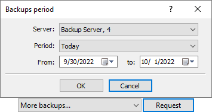

[🏠 Document Start](../../../README.md) / [MetaTrader 5 Trading Platform](../../../MetaTrader-5-Trading-Platform.md) / [Platform Setup](../../Platform-Setup.md) / [Accounts](../Accounts.md) / Archive and Backup Bases

[Previous](Preliminary.md) | [Next](Import-of-from-File.md)

# Archive and Backup Bases

During the operation of a trade server a a lot of unused accounts are accumulated in the system. Most of them cannot be deleted, because they are necessary, for example, for solving disputes with clients. The archive database allows:

  * To store the accounts that are not necessary to be maintained at the moment (for example, inactive accounts with insignificant deposits where trading is impossible);
  * To quickly restore accounts from the archive for resuming the work with them;
  * To decrease the server load for servicing the accounts, because the request to the archive database are not performed while working.

The archive databases are stored on the [trade server](../../Platform-Components/Trade-Server.md), in separate files by years.

> The archive of accounts does not affect trading operations. Orders, trades and positions are not deleted from current databases.

## Working with Accounts Archive

  * Moving account to the archive  
To move an account to archive, select it in the [Accounts](../Accounts.md) section and click " Move to archive" in the [context menu (#to-archive)](../Accounts.md#to-archive).
  * Restoring account from the archive  
To restore an account from the archive, navigate to the [Account (#request)](../Accounts.md#request) section, select the archive database, and request an account from the database by its number. Once you have found an account, select it in the list and click " Restore" in the [context menu (#context)](../Accounts.md#context). After that, perform [balance check and correction](Checking-and-Fixing-Balance.md) for the account.

  * Restored accounts are not deleted from the archive.
  * If an account is moved to archive again after it has been restored, new information about it will replace the one that is stored in the archive.

  
---  
  
## Backup Bases of Accounts

[Backup copies (#file)](../../Platform-Components/Backup-Server/Backup-Features.md#file) are copies of the account database at certain points in time. They are created daily on the [backup server (#enable-backups)](../Network-cluster/Configuring-Servers/Backup-Server.md#enable-backups). To get the list of available backup copies, select "More backups..." and specify a time period:

As soon as the period is specified, additional items with the dates of creation of backup copies will appear in the list of database selection. After selecting the necessary database, [request (#request)](../Accounts.md#request) accounts from it. Using the " Restore" command of the context menu, any account can be easily returned back to the current database in the same state as when the backup copy was created.
