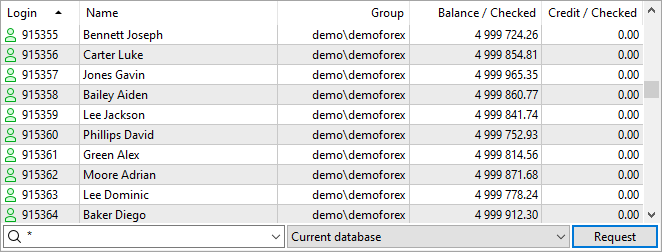
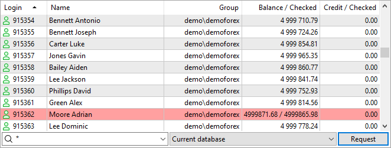

[🏠 Document Start](../../../README.md) / [MetaTrader 5 Trading Platform](../../../MetaTrader-5-Trading-Platform.md) / [Platform Setup](../../Platform-Setup.md) / [Accounts](../Accounts.md) / Checking and Fixing Balance

[Previous](Import-of-from-MetaTrader-5.md) | [Next](Account-Allocation-Settings.md)

# Checking and Fixing Balance and Credit Funds

["Accounts"](../Accounts.md) section provides the ability to check clients' balance and credit funds based on [deals](../Deals.md) history. Corrections can be necessary for [restoring the accounts](Archive-and-Backup-Bases.md) and manual correction of trade history.

To perform a check, enable "Balance" and "Credit" columns via the [context menu (#context)](../Accounts.md#context).

Select one or several accounts, for which you want to check the balance and credit funds, and execute "Balance - Check Balance" command in the context menu. If an incorrect balance or credit funds value is revealed, the appropriate account will be highlighted in red.

Two values will be displayed in "Balance" and "Credit" columns: the current balance/credit funds value will be displayed on the left, while the value calculated using the deals history - on the right.

> Credit funds are checked by deals of ["Credit" type](../Deals.md) (specified in "Action" field).

Check result is also displayed in the [journal](../../MetaTrader-5-Administrator/User-Interface/Toolbox/Journal.md). If the calculated value differs from the current one, the following message will appear in the journal:

account xxx has invalid balance: xxx.xx, valid: xxx.xx  
---  
  
To correct the balance/credit funds value, execute "Balance - Fix Balance" command in the context menu. The calculated value will be inserted as the current one. Correction results are also shown in the [journal](../../MetaTrader-5-Administrator/User-Interface/Toolbox/Journal.md):

balance of account '1030390' has been fixed from 9 968.70 to 9 999.80  
---
