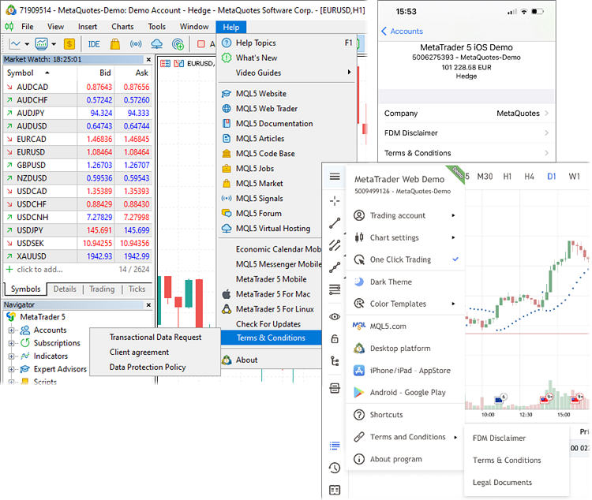
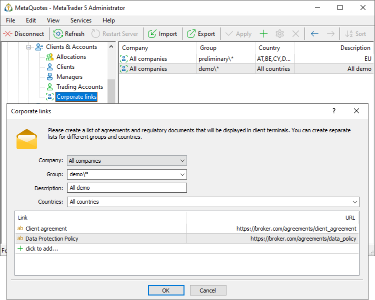

[🏠 Document Start](../../../README.md) / [MetaTrader 5 Trading Platform](../../../MetaTrader-5-Trading-Platform.md) / [Platform Setup](../../Platform-Setup.md) / [Accounts](../Accounts.md) / Corporate Links

[Previous](Account-Allocation-Settings.md) | [Next](Links-to-Depositing-and-Withdrawing.md)

# Corporate links

Some regulators require brokers to show traders a certain set of agreements and regulatory documents. In particular, one of the NFA requirements is to display a document on providing information about transactions (Transactional Data Request). In order to enable brokers to bring client terminals into compliance with the requirements, the trading platform provides a mechanism for adding custom links.

Set a list of corporate links and they will automatically appear in the desktop, mobile and web client terminal menus.

Go to "Clients & Accounts \ Corporate links", add a new entry and specify the settings:

  * Company — name of a company (White Label) displaying the links.
  * Group — group of accounts the links are to be displayed for.
  * Description — description to be displayed in the list of settings.
  * Countries — list of countries the links are to be displayed for. A country is taken from the [account settings (#personal)](Editing-Account.md#personal).

Using these settings, you can create different sets of links. They will be displayed depending on what account the client is connected to in the terminal.

Specify the agreements and links to them at the bottom. They will be displayed in client terminals.

Use the [lang] macro in the links to show to users the agreements in the desired language. The macro substitutes the language identifier into the link depending on the language of the client terminal interface. For example, you can specify the link as follows: https://broker.com/[lang:en|es|de|zh]/client_agreement. If the client uses the English interface of the terminal, the following link will be generated for this user: https://broker.com/en/client_agreement. For the Spanish interface, the link will be https://broker.com/es/client_agreement, etc.

Languages are specified in the ISO 639-1 format. The following values are supported: en|ru|es|pt|zh|ar|cs|fr|it|de|el|id|jp|pl|tr. If the interface language does not match any of the values specified in the macro, the first language from the list will be used.

## Settings check order

Link settings are checked from top to bottom. The first suitable setting is applied to the account, while further settings will be ignored. For example, you have created the following sets of links:

  1. Groups: real\*; Countries: Spain, France, Portugal
  2. Groups: real\*; Countries: USA, Canada
  3. Groups: All; Countries: All

The second set of links will be shown to a real account from Canada. Any account created outside of the real\* groups will see the third set of links.

If you change the settings order as follows:

  1. Groups: All; Countries: All
  2. Groups: real\*; Countries: Spain, France, Portugal
  3. Groups: real\*; Countries: USA, Canada

The first set of links will be shown to all accounts. Sets 2 and 3 will not be used.
