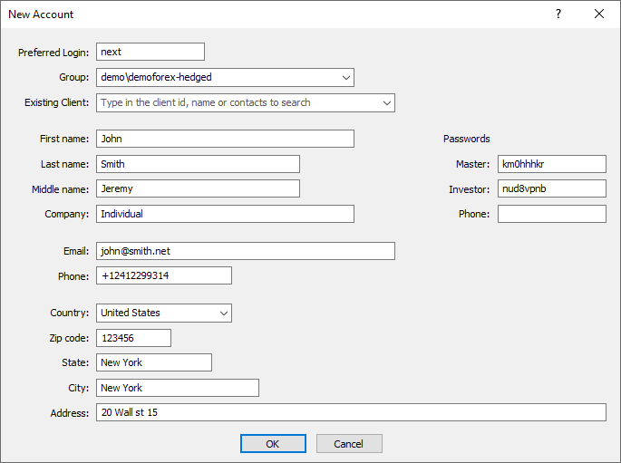

[🏠 Document Start](../../../README.md) / [MetaTrader 5 Trading Platform](../../../MetaTrader-5-Trading-Platform.md) / [Platform Setup](../../Platform-Setup.md) / [Accounts](../Accounts.md) / Creating Account

[Previous](../Accounts.md) | [Next](Editing-Account.md)

# Creating Accounts

To create an account, execute the " New" command in the ["Edit"](../../MetaTrader-5-Administrator/User-Interface/Main-Menu/Edit.md) menu, standard part of the [toolbar](../../MetaTrader-5-Administrator/User-Interface/Toolbar/Standard.md) or in the [context menu (#context)](../Accounts.md#context) of the corresponding section.

For convenience, the account settings in the window of account creation are divided into two boxes.

## Details

In this box the client's details are specified:

  * Preferred Login — account number. If you specify "Next" in this field the the closest free number will be assigned to the account. Do not use logins of deleted account when creating new ones.
  * Group — selection of a [group](../Groups.md) the account will be created in.
  * Preferred Client — the [client](../Clients.md) to whom the account should be linked. Specify the ID, name or contact information in the Existing Client field and then click "Request". Then select the required client from the list.
  * Name — first name of the account owner.
  * Last Name — second name of the account owner.
  * Middle Name — middle name of the account owner.
  * Company — name of the client's company.
  * E-Mail — e-mail address.
  * Phone — phone number.
  * Country — country of residence.
  * State — state (region) of residence.
  * City — city of residence.
  * Zip code — postal code.
  * Address — exact address.

> Additional account settings can be specified when [editing](Editing-Account.md) it.

## Passwords

In this box the account passwords are specified. At the creation of account the passwords are generated automatically, however they can be manually specified in the corresponding fields:

  * Master — master password of the account.
  * Investor — investor password (without ability to trade).
  * Phone — phone password that is intended for the identification of the account owner when performing trade operations by phone.

> All passwords, including master and investor, must contain four character types: lowercase letters, uppercase letters, numbers and [symbols](https://learn.microsoft.com/en-us/style-guide/a-z-word-list-term-collections/term-collections/special-characters) (#, @, !, etc.). For example, 1Ar#pqkj. The minimum password length is determined by [group settings (#minimum-password)](../Groups/Group-Settings.md#minimum-password), while the lowest possible value is 8 characters. The maximum length is 16 characters.

In order to create the account, press the OK button. To cancel the creation press the Cancel button.
