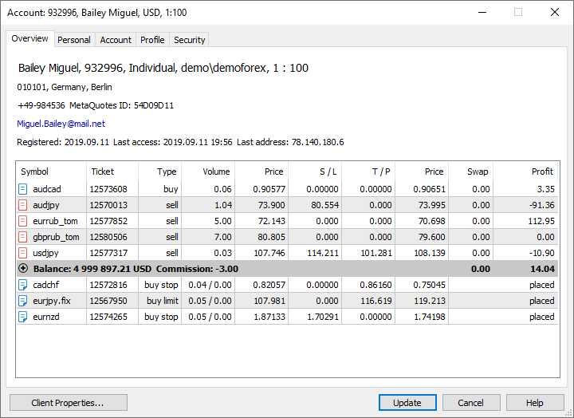
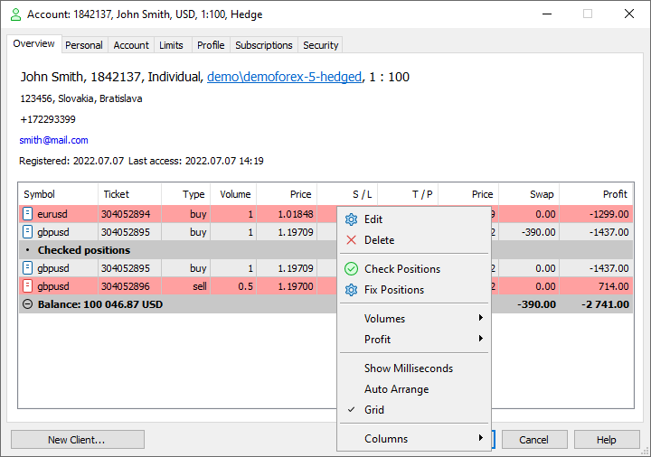
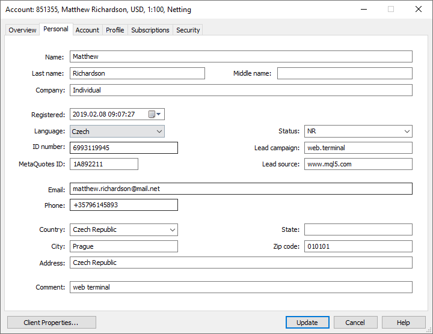
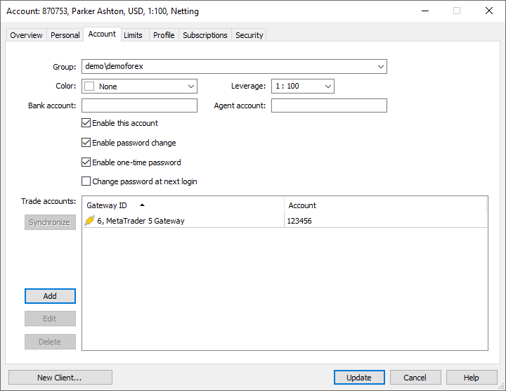
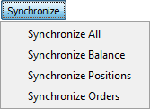
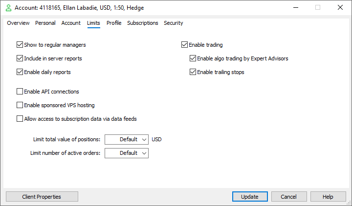
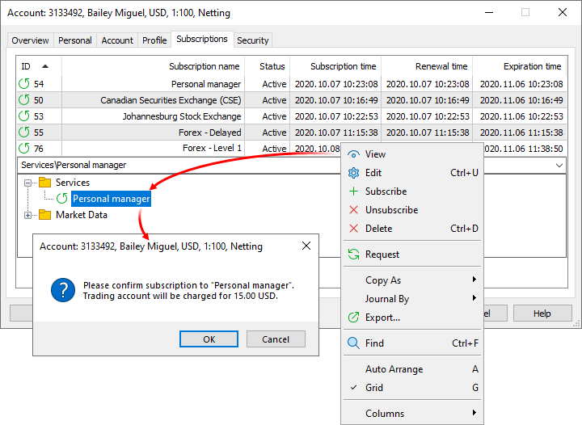
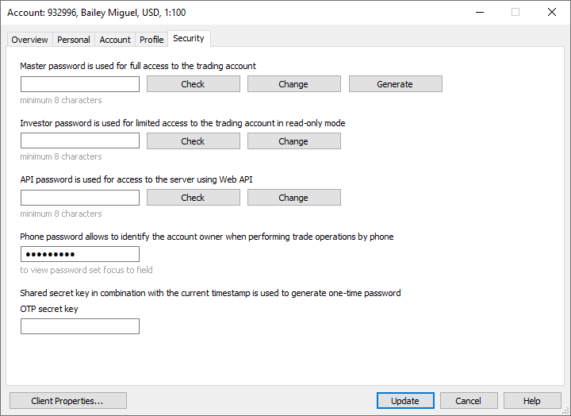
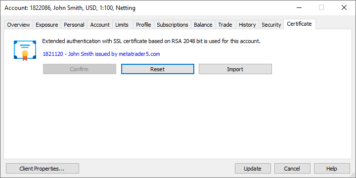

[🏠 Document Start](../../../README.md) / [MetaTrader 5 Trading Platform](../../../MetaTrader-5-Trading-Platform.md) / [Platform Setup](../../Platform-Setup.md) / [Accounts](../Accounts.md) / Editing Account

[Previous](Creating-Account.md) | [Next](Preliminary.md)

# Editing Accounts (#editing-accounts)

To edit an account, press " Edit" in the ["Edit"](../../MetaTrader-5-Administrator/User-Interface/Main-Menu/Edit.md), standard part of the [toolbar](../../MetaTrader-5-Administrator/User-Interface/Toolbar/Standard.md) or in the [context menu (#context)](../Accounts.md#context) of the corresponding section. An account can be opened for editing by a double-click with the left mouse button on it. The window of editing an account contains four tabs:

## Overview (#overview)

This tab contains general information about an account. Upper part contains personal details and the dates of registration and last login with the account. Lower part displays all the open [positions](../Positions.md) of the account and the current state of the account.

If you have an active [Finteza subscription](https://support.metaquotes.net/en/news/3420), this section can display data for user tracking: Visitor ID and Affiliate. For further details, please visit the [Finteza Analytics (#visitor)](../Integrations/Finteza-Analytics.md#visitor) section.

> Last access time and address data is updated once per hour. When an account is created, the creation date and time are also recorded in the "Last access" field.

### Open Positions (#open-positions)

The following information is displayed for positions:

  * Symbol — the [trading instrument](../Symbols.md) for which the position was opened.
  * Ticket — the position ticket (unique number). Usually, a position ticket matches the ticket of the order, as a result of which the position was opened.
  * ID — unique identifier of the position in an external system (if the operation is forwarded via a gateway).
  * Time — position open time.
  * Type — type of the position, buy or sell.
  * Volume — the current position volume in lots or units.
  * Price — weighted-average position open price: (price of deal 1 * volume of deal 1 + ... + price of deal N * volume of deal N) / (volume of deal 1 + ... + volume of deal N). The accuracy of rounding of the average weighted price is equal to the number of decimal places in the symbol price plus three additional digits.
  * S/L — Stop Loss level of a position.
  * T/P — Take Profit level of a position.
  * Price — the current price of the financial instrument for which the position was opened. The Bid price is displayed for short positions, while the Ask price is used for long ones. The price of the last performed deal (Last) is displayed for the positions involving exchange symbols (both directions).
  * Swap — charged swap.
  * Profit — current profit on this position. The profit does not include swap and commission.
  * Comment — comment to the position. On netting accounts, a comment to a position is inherited from the last deal for the symbol of the position. On hedging accounts a comment is inherited from the order with which the position was opened.

### Assets (#collateral)

The trading platform supports a special type of non-tradable assets, which can be used as client's assets to provide the required margin for open positions of other instruments. For example, a certain amount of gold in physical form can be available on a trader's account, which can be used as a margin (collateral) for open positions.

Such instruments have [calculation type "Collateral" (#calculation)](../Symbols/Symbol-Settings/Trade.md#calculation). Features of such symbols:

  * Clients can't perform any operations with these symbols, except for closing. A position can be opened only by a manager.
  * No profit can be accrued for the positions of these symbols, they have no stop loss or take profit.
  * The value of such a position, and thus the amount of money that a client can use as collateral, is calculated by the below formula:

Such assets are displayed as open positions. Their value is calculated by the formula: Contract size * Lots * Market Price * Liquidity Rate.

Liquidity Rate is the share of the asset that a broker allows to use for the margin, it is set in the [symbol properties](../Symbols/Symbol-Settings/Margin.md).

The Assets are added to the client's Equity and increase Free Margin, thus increasing the volumes of allowable trade operations on the account.

In the example above, a trader has 1 ounce of gold having the current market value of 1 210.56 USD. This value is added to the equity and the free margin.

[Symbol settings (#trade-disabled)](../Symbols/Symbol-Settings/Trade.md#trade-disabled) may allow clients and managers close such positions (Trade = Close only). In this case a trader will be able to convert the asset in the deposit currency at the current market rate and use that money for trading. A position can be closed only if the conversion rate of the assets currency into the deposit currency is available.

### Account State (#account-state)

The current state of an account is displayed in a gray row under the list of open positions:

  * Balance — amount of money on a client account (deposit);
  * Credit — amount of credit money given to a client by broker (the sum of ["Credit" and "Bonus"](../Deals.md) type operations). The trading platform does not have a function of charging an interest for credit assets. Credit assets can be given and taken away using the manager terminal.
  * Commission — the amount of commission by orders and positions accumulated during a day or a month. Depending on [settings](../Groups/Commission-Settings/Commission-Calculation.md), a preliminary calculation of commission is performed during a day or a month. The corresponding amount of assets is blocked on the account and its value is shown in this field. At the end of the day/month, the final calculation of commission is performed and the corresponding amount of money is charged from the account as a balance operation (a separate [deal](../Deals.md) of the Daily/Monthly commission type). Previously blocked assets are unblocked.  
If a commission is charged immediately during execution of a deal, its value is written in the "Commission" field of the deal.
  * Swap — the amount of swaps by all open positions.
  * Profit — the amount of profit/loss by all open positions.

The context menu commands of the lower part of the window allow performing the following actions:

  * Time — show/hide the "Time" column;
  *  Check Positions — [check the positions (#check-fix)](Editing-Account.md#check-fix) of a client based on executed deals;
  *  Fix Positions — [recalculate the positions (#check-fix)](Editing-Account.md#check-fix) of a client based on executed deals;
  * Auto Arrange — if this option is enabled the size of columns is selected automatically;
  * Grid — this option shows/hides field separators in the table.

### Pending orders (#pending)

The list of the trader's pending orders is shown below the account status bar:

  * Symbol — the [trading instrument](../Symbols.md) for which the pending order has been placed.
  * Ticket — the unique order ticket.
  * ID — the unique order identifier in an external trading system (if the order is forwarded via a gateway). 
  * Time — time when the order was placed by the client. If the order is passed to an external trading system, this field displays the time of order placing in the external system (not in the MetaTrader 5 platform).
  * Type — order type: "Buy Limit", "Sell Limit", "Buy Stop", "Sell Stop", "Buy Stop Limit" or "Sell Stop Limit".
  * Volume — volume requested in the pending order and the currently filled volume (in lots or units).
  * Price — the order execution price specified by the trader.
  * S/L — Stop Loss level in an order.
  * T/P — the Take Profit level in the order.
  * Price — the current price of a financial instrument for which the order was placed. The Bid price is displayed for sell orders, while the Ask price is used for buy ones. The price of the last performed deal (Last) is displayed for the orders involving exchange symbols (both directions).
  * Comment — text comment to the order. Can be specified by a trader when placing an order.

## Checking and Fixing Positions (#check-fix)

The Administration terminal allows you to automatically check and fix the positions of a client on the basis of his or her deals. For example, if a dealer makes a mistake, the administrator can delete the wrong deal using the ["Deals"](../Deals.md) section. The position of the client must be properly recalculated and corrected.

To verify the client's positions, use the command " Check Positions" in the context menu. After that, below the account current positions, positions made on the basis of the client's deals are shown (if there should be positions for the client's deals now).

If the current open position of the client does not match the one recalculated based on his or her deals, it is highlighted in red. You can compare the type, volume and open price of the current calculated position. If the position highlighted in red appears only in the upper or only in the bottom part of the window, it means that the client should not have this position or it lacks, respectively.

The result of position checking also appears in the terminal [journal](../../MetaTrader-5-Administrator/User-Interface/Toolbox/Journal.md). Entries are as follows:

positions of account 'xxx' have been checked   
account 'xxx' has valid positions   
or   
account 'xxx' has 'yyy' invalid positions  
---  
  
In order to fix the position of a client, select " Fix Positions" in the context menu.

When using the function, keep in mind the swap nuances:

  * When restoring an absent position, the swap value is not filled for it. Swap is stored only market exit deals. When you delete a deal closing a position and restore a position by an entry deal, there is nowhere the system can get the swap value from. If required, set the swap in the restored position [manually](../Positions.md).
  * When editing an existing position, the swap is not reset to zero in it.

  * When checking and correcting the positions, only the deals of the client are taken into account, [orders](../Orders.md) are not checked. The orders are used to assign tickets to positions created as a result of fixing. If there is no source order ticket and the netting system is used on the account, a new ticket is assigned to the created position. In case of the hedging system, position is not created (fixing is unsuccessful), and the appropriate message is displayed in the journal.
  * If the client's [position accounting type](../Groups/Position-Accounting-Systems.md) ever changed (e.g. the account was transferred between groups with different accounting systems), balance check and fixing will not be available, because trades cannot be matched correctly. The platform does not store data about when position accounting type was changed for an account.
  * For hedging accounts, check reveals no error if the volume of the deal closing the position is greater than the original volume of the position. This situation is abnormal and can only be the result of manual actions with the trade database.

  
---  
  

## Personal (#personal)

The following information about an account is specified here:

  * Name — name of account owner.
  * Last Name — second name of the account owner.
  * Middle Name — middle name of the account owner.
  * Company — name of company of account owner.
  * Registered — account registration date. The date is added automatically during account creation. Please be careful when changing the registration date manually: the data should fit the account trading history, and thus there should not be any trading operations before the registration date. Otherwise, such operations can be ignored when generating [reports](../Reports.md).
  * Language — user's language. If the account is created through the client terminal, the language is set automatically based on the terminal's interface language.
  * Status — status of account owner , RE (resident) or NR (non-resident).
  * ID number — passport number, TIN or other unique identifiers of account owner.
  * Lead Source, Lead Campaign — website, from which a client has come (lead source), and a name of a marketing campaign that attracted the client (lead campaign).  
These fields are used to analyze marketing campaigns and track where clients come from. To receive the data, add the following labels to the client or mobile platform download link:

https://download.mql5.com/cdn/web/metaquotes.ltd/mt5/mt5setup.exe?utm_source=YourWebsite&utm_campaign=YourCampaign  
https://download.mql5.com/cdn/mobile/mt5/ios?server=ABC-Demo,ABC-Real&utm_source=YourWebsite&utm_campaign=YourCampaign  
https://download.mql5.com/cdn/mobile/mt5/android?server=ABC-Demo,ABC-Real&utm_source=YourWebsite&utm_campaign=YourCampaign  
---  
  
where YourCampaign is a campaign name, while YourWebsite is a website the link has been placed at. In the 'server' parameter of the mobile platform links, enter the list of your servers to be shown to traders when they open an account.  
When opening a demo account and connecting to any trading account via the terminal downloaded using such a link, utm_source and utm_campaign values are set in a client record at the server side. If the fields are already filled, the label values are not overwritten when re-connecting to the account (even if the terminal used for connection was downloaded by a link containing other labels).

Lead Source and Lead Campaign data from terminal download links can be written to created accounts only if the broker has a [Finteza](../Integrations/Finteza-Analytics.md) license.

  * MetaQuotes ID — during installation of the MetaTrader 5 for [iPhone](https://download.mql5.com/cdn/mobile/mt5/ios?hl=en&utm_campaign=download&utm_source=metatrader5.help "iPhone") or [Android](https://download.mql5.com/cdn/mobile/mt5/android?hl=en&utm_campaign=download&utm_source=metatrader5.help "Android"), each user is assigned a unique identifier — MetaQuotes ID. This identifier is used like a phone number. By specifying MetaQuotes ID in the desktop terminal settings, a user can send notifications about various trade events on their mobile devices. MetaQuotes is also supported by [MQL5.community](https://www.mql5.com/ "MQL5.community"): by specifying the identifier in profile, a user can receive important notifications from the website and communicate with other members of the community via private messages. For more information please refer to the article [MetaQuotes ID in MetaTrader Mobile Terminal](https://www.mql5.com/en/articles/476 "Article MetaQuotes ID in MetaTrader Mobile Terminal").  
MetaQuotes ID is added to the client record on the server side, once the client specifies it in the terminal settings.
  * E-Mail — email address. You can specify multiple addresses separated by commas. All of them will be used to [send reports (#reports)](../Groups/Group-Settings.md#reports). The maximum total length of a string is 63 characters.
  * Phone — phone number.
  * Country — country of residence.
  * State — state (region) of residence.
  * City — city of residence.
  * Zip code — postal code.
  * Address — exact address.
  * Comment — text comment to the account.

> Country and City fields for demo accounts opened via client terminals are automatically filled on the basis of GeoIP data or, if' it is not available, on the basis of the OS locale.

## Account (#account)

Trading parameters of an account are set up at this tab:

  * Group — name of the [group](../Groups.md), the account belongs to.
  * Color — color that will be used in the manager terminal for displaying clients' requests for performing trade operations. When [exporting](../General-Information/Data-Export.md) to a file, the color is saved in the AABBGGRR format. AA defines the value of the alpha channel: FF for completely transparent (None), 00 for completely opaque (color).
  * Leverage — leverage of the account.
  * Bank account — an account in an external bank.
  * Agent account — an account for charging the [agent commissions (#type)](../Groups/Commission-Settings.md#type) for trading operations on this account.
  * Enable this account — enable/disable the account. If the check mark is removed from this field, the account becomes inactive and its icon becomes gray . Connection to the server using this account is impossible then. Disabling of an account does not disable the sending of daily or monthly reports to this account. This option should be [disabled separately (#reports)](Editing-Account.md#reports). Disabling of an account does not affect the already placed pending orders, as well Stop Loss and Take Profit levels of the current positions since these operations can be passed to external systems. However, the [Stop Out (#stopout)](../Groups/Group-Settings.md#stopout) procedure is not performed for disabled accounts since this tool is intended for internal broker risk control.
  * Allow to change password — if this field is checked, then the account owner can change the account passwords on their own in the client terminal.
  * Enable one-time password — using this option, you can disable the OTP use for individual clients in the group. If use of OTP is [disabled for a group (#otp)](../Groups/Group-Settings.md#otp), enabling this option does not have any effect.
  * Change password at next login — if this option is enabled, then the owner of the account will be forced to [change the master password (#change-password)](../../MetaTrader-5-Administrator/Getting-Started/Connect-to-Server.md#change-password) at next connection. Any action is prohibited for the account until its master password is changed. Once the password is changed, this options disables automatically.

  * Moving accounts to groups with different [deposit currencies (#currency)](../Groups/Group-Settings.md#currency) can only be performed for accounts with zero balances and no open positions.

  * It is impossible to move account between groups that belong to [different trade server (#trade-server)](../Groups/Group-Settings.md#trade-server).

  
---  
  

### Trade Accounts (#trade-accounts)

This section is intended for managing trade account of a client in external systems (for example, a bank or an exchange). Each number is bound to a certain [gateway](../Gateways.md) that is used for working with the corresponding external trade system.

The accounts are managed using the following commands:

  * Add — add a new account. Once this button is pressed, a new row appears. In the "Gateway ID" field, select a [gateway](../Gateways.md); and in the "Account" field, specify an account in the external system, interaction with which is performed using the specified gateway.
  * Edit — change a selected account. The same action can be done by double-clicking with the left mouse button on a necessary field.
  * Delete — delete a selected account.

Using the "Synchronize" button, you can synchronize the trade state of a client with an external trading system if such a possibility is implemented in the gateway used by the client. To perform synchronization select the gateway and account row and click "Synchronize".

In the menu choose a suitable mode of synchronization:

  * Synchronize All — synchronize current pending orders, positions and balance;
  * Synchronize Balance — synchronize balance only;
  * Synchronize Positions — synchronize current open positions only;
  * Synchronize Orders — synchronize current pending orders only.

> Synchronization of trading data results in the creation of correcting operations, which are displayed accordingly in the client's trading history.

## Limits (#limits)

In this section, you can configure trading account permissions and restrictions:

  * Show to regular managers — this rule allows the convenient working with technical accounts. Disable this option for testing accounts to hide them from all managers who do not have special [access to technical accounts (#technical-accounts)](../Managers.md#technical-accounts). Such technical accounts can be confusing for the managers working with clients, in which case hiding them can be useful.   
The permission affects the visibility in the general list of accounts in the Administrator and Manager terminals, as well as in the list of online accounts in the Manager terminal.
  * Include in server reports — using this option, you can exclude the account from [server reports](../Reports.md). Like the previous permission, it is intended for more convenient work with technical accounts. The ability to edit the previous two options is determined by the "[Manage technical accounts (#manage-technical-accounts)](../Managers.md#manage-technical-accounts)" permission.
  * Enable daily reports — enable receiving of the daily and monthly reports. If this option is disabled, HTML reports will not be generated or sent daily/monthly for the account (however, this does not affect the generation of [daily data (#reports)](../Groups/Group-Settings.md#reports)). Account settings take precedence over [group settings (#reports)](../Groups/Group-Settings.md#reports).
  * Enable API connections — enable connection through Web API using this account. The parameter is obsolete and is not used.
  * Enable sponsored VPS hosting — brokers can pay for the [virtual hosting](https://www.mql5.com/en/vps) for their client. The service is extremely important for traders, and the opportunity to receive a VPS for free can give them a good reason to choose your company over competitors. The availability of a broker-sponsored VPS is controlled at the individual account level. Only if this option is enabled, the appropriate payment plan will be shown to the trader in the client terminal. For more details, please read the [appropriate section](../Integrations/Sponsored-VPS.md).
  * Enable trading — if this options is disabled, trading on the account is impossible: one cannot place new orders or modify existing orders and positions. However, the account can be used to connect to the server and to analyze price dynamics. Disabling trading does not affect the already placed pending orders, as well Stop Loss and Take Profit levels of the current positions since these operations can be passed to external systems. However, [Stop out (#stopout)](../Groups/Group-Settings.md#stopout) is not performed for accounts with trading disabled since this tool is meant for broker's internal risk management.
  * Enable algo trading by Expert Advisors — permit this account to trade using Expert Advisors. This option can also be specified in the setting of the [group (#ea-trading)](../Groups/Group-Settings.md#ea-trading);
  * Enable trailing stops — enable using the trailing stops in the client terminal for this account. This option can be specified in the setting of the [group (#trailing-stop)](../Groups/Group-Settings.md#trailing-stop);
  * Allow access to subscription data via data feeds — this option provides additional protection for your market data accessed through [subscriptions](../Subscriptions.md). By default, such data is only available via client terminals. If you are integrating with another service or server and need to access data through a [gateway](../Gateways.md) or [data feed](../Data-Feeds.md), enable this permission to allow access for the relevant account. By default, this permission is disabled for all accounts.
  * Limit total value of positions — the maximum value of open positions allowed on the account. Positions are evaluated as follows:  
  
For each symbol, the total value of positions and active pending orders is determined separately for each direction, i.e., separately for buy and sell operations. The platform calculates the difference in value between the buy and sell sides. Such calculations are performed for every instrument for which the account has open positions and orders.  
  
The obtained values are summed up and the result is compared to the specified limit. Once the limit is reached, the platform will disable the ability to place new orders if their execution could increase the total value of positions.  
  
The value calculation for each position/order depends on the [symbol's margin/profit calculation (#calculation)](../Symbols/Symbol-Settings/Trade.md#calculation).  
  
For the symbols with the Forex calculation type, the value is calculated in the base symbol currency and is equal to the product of the contract size and the volume. For example, for EURUSD with the contract size of 100,000, the value of 1 lot is equal to EUR 100,000.  
  
For the symbols with the CFD, CFD Leverage, CFD Index and Futures calculation type, the value is also calculated in the base currency. Since the contract size of such instruments is not expressed in money (it can be expressed, for example, in the amount of assets), the contract size is additionally multiplied by the instrument price to obtain the value in monetary terms. For Futures symbols, the final value is additionally multiplied by the ratio of tick value to tick size. For example, if some Futures symbol has USD as the base currency, the contract size is equal to 100, the cost is 33, and the tick value to tick size ratio is 1/0.1, the value of one lot of the position is equal to 100*33*10 = USD 33,000. For a CFD symbol with the same parameters, one lot size would be 100*33 = USD 3,300.   
  
If the symbol base currency differs from the account deposit currency (specified after the field), the calculated value will be additionally converted using the relevant exchange rate.
  * Limit number of active orders — the maximum number of active (placed) pending orders allowed on the account. Once the limit is reached, the client will no longer be able to place new pending orders. If no value is specified (default), a limit defined at the [group (#maximum-orders)](../Groups/Group-Settings.md#maximum-orders) level will be used. If limits are set both at the account and at the group level, the stricter one of them will be applied.

## Subscriptions (#subscriptions)

This section displays information about active [additional trading service subscriptions (#user-subscriptions)](../Subscriptions/Controlling.md#user-subscriptions).

## Security (#security)

The account passwords are managed on this tab.

### Master Password (#password)

In this box you can check or change the master password to an account. To do this, type the password in the Password field and press the Check or Change button, depending on the required action. A click on Check opens the window containing the check result of whether the password matches the checked one or not.

To create a random master password, click Generate. Next, select Change to assign the created password to your account. You can set other passwords in the same way. After generating the password, copy it into the required field.

### Investor Password (#invest)

In this box, one can check or change the investor password (without possibility to trade) to an account. To do it, it is necessary to type it in the "Password" field and press the "Check" or "Check" button, depending on the action you need to perform. A click on Check opens the window containing the check result of whether the password matches the checked one or not.

### Web API Password (#web-api-password)

This password is required when the account is used for authorization in a Web client created using MetaTrader 5 Web API. To check or change the password, type it in the Password field and press the Check or Change button, depending on the action you need to perform. A click on Check opens the window containing the check result of whether the password matches the checked one or not.

  * Master, investor, and Web API passwords must contain four character types: lowercase letters, uppercase letters, numbers and [symbols](https://learn.microsoft.com/en-us/style-guide/a-z-word-list-term-collections/term-collections/special-characters) (#, @, !, etc.). For example, 1Ar#pqkj. The minimum password length is determined by [group settings (#minimum-password)](../Groups/Group-Settings.md#minimum-password), while the lowest possible value is 8 characters. The maximum length is 16 characters.

  * Once the password is changed, the connection of the account to the trader server is reset. A reconnection with the new password is required.

  
---  
  

### Phone Password (#phone-password)

The phone password is intended for the identification of an account owner when performing trade operations by phone. To view the password put the mouse cursor to the "Password" field. In order to set a new password or change the current one, type it and press the "Update" button.

### OTP Secret Key (#otp-secret-key)

The key is a link between the account and the [one-time password generator](../../MetaTrader-5-Administrator/Getting-Started/Connect-to-Server/2FATOTP.md) it is bound to. The key is a sequence of 16 characters generated based on the data about the device the MetaTrader 5 mobile platform is installed on.

Each account can be bound to only one password generator. When trying to rebind the account to a new generator, a one-time code from the previous generator should be entered.

If the user no longer has access to the bound password generator (for example, the mobile device is lost), the current OTP secret key can be deleted. In this case, account authorization via one-time passwords is disabled and the user is able to bind the account to the new generator.

If the user has forgotten the password for the password generator (PIN) while using the same mobile device, they may simply reinstall the mobile platform and rebind the account to the generator. No one-time password is required when rebinding the account to the generator on the same device.

## Certificate (#authorization)

This tab displays the [authentication type (#authorization)](../Groups/Group-Settings.md#authorization) of the group the account belongs to. It is not shown if the standard authentication mode is used. The following information is displayed here:

  * Certificate — information about the certificate if it has been generated or imported for the account. The certificate details include the account number, the owner name and the name of a Certificate Authority that issued the certificate. A window containing detailed information about the certificate will be opened if you click on the certificate name.
  * Confirm — this button is intended for [confirming certificates (#confirm)](../../MetaTrader-5-Administrator/Getting-Started/Connect-to-Server/Extended-Authorization.md#confirm) of account that belong to the groups with the corresponding [mode (#confirm)](../Groups/Group-Settings.md#confirm) enabled. Until the certificate is confirmed, connection using the account in a manager or administrator terminal is impossible, while connection in a client terminal can be established only in the investor mode without the possibility to trade.
  * Reset — if the [extended authorization (#authorization)](../Groups/Group-Settings.md#authorization) mode is used for the account group then using this button one can reset the [certificate](../../MetaTrader-5-Administrator/Getting-Started/Connect-to-Server/Extended-Authorization.md) that was issued earlier. At that it will be impossible to authorize using it, and at the next attempt of connection to the server using this account a new certificate will be issued.
  * Import — import a certificate for the account. Once this button is pressed, the window where you need to specify a certificate file (*.cer or *.crt) appears. Only the public component of the certificate is imported to the platform. During authorization, the client's certificate is compared to the one uploaded to the data base. In addition, the presence of a private key in the client certificate is checked. The import function is implemented to give the possibility of using custom mechanisms of [generation of certificates](../Security/Certificates.md).

  * When a certificated is reset it becomes invalid. At the next attempt of connection the process of [generation (#generation)](../../MetaTrader-5-Administrator/Getting-Started/Connect-to-Server/Extended-Authorization.md#generation) of a new certificate and further authorization using it will be performed.
  * A detailed description of the entire process of the extended authentication is given in a [separate section](../Groups/Extended-Authentication-Setup.md).

  
---
