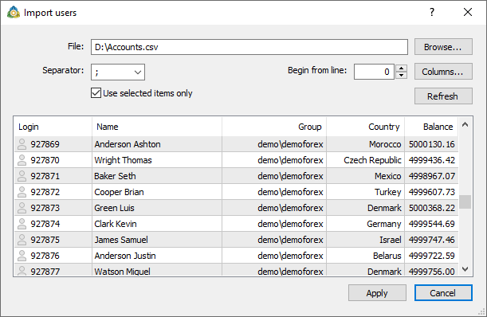
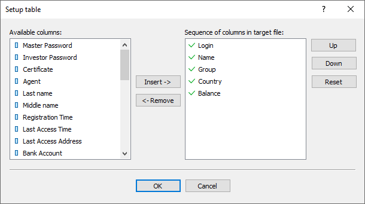

[🏠 Document Start](../../../README.md) / [MetaTrader 5 Trading Platform](../../../MetaTrader-5-Trading-Platform.md) / [Platform Setup](../../Platform-Setup.md) / [Accounts](../Accounts.md) / Import of from File

[Previous](Archive-and-Backup-Bases.md) | [Next](Import-of-from-MetaTrader-5.md)

# Import of Accounts from File (#import-of-accounts-from-file)

The administrator terminal allows to import accounts to a trade server from CSV files. In order to do it, one should execute the " Import from File" command in the [context menu (#context)](../Accounts.md#context) of the "Accounts" section.

The following settings and commands are present in the window of account importing:

  * File — path to a *.CSV file, from which accounts &ill be imported. You can specify the path manually or select the necessary file by pressing the "Browse" button located to the right.
  * Separator — separator of data in the file (comma, semicolon, tab or space);
  * Begin from line — in this field you can specify a line in the file starting from which the data will be imported;
  * Columns — open the window of [associating columns (#columns)](Import-of-from-File.md#columns) in the imported file with the corresponding fields in the system;
  * Use only selected items — if this option is chosen then only the lines that are currently selected in the preview window below will be imported;
  * Refresh — refresh the data in the preview window.

In order to start importing the accounts, one should press the "Apply" button. The process of importing will be displayed at the ["Journal"](../../MetaTrader-5-Administrator/User-Interface/Toolbox/Journal.md) tab of the "Toolbox" window.

By a double-click on a line in the preview window, you can see how the information would look like if the account was imported. The same action can be performed using the "View" command in the context menu. Using this menu you can also enable or disable the automatic arrangement of columns and the displaying of a grid.

  * All the accounts are imported as disabled. Further they can be enabled manually at the ["Account" (#enable)](Editing-Account.md#enable) tab.

  * If passwords for accounts are not imported, [set them (#password)](Editing-Account.md#password) afterwards.

  
---  
  

## Associating Columns (#columns)

The window of associating columns is opened using the "Columns" command.

The left part contains the available columns and the right one contains the sequence of columns in the imported file. The following commands are present in the window:

  * Insert — add a selected column to the chosen ones;
  * Remove — remove a selected column from the selected ones. The "Login" field is obligatory, it cannot be removed;
  * Up — move an added column up relatively to the others;
  * Down — move an added column down relatively to the others;
  * Reset — return to default column settings.

Columns can also be moved by a double-click with the left mouse button on their names.

The sequence of selected columns is very important, since it is the way of associating them with the fields in the system. To skip one or several columns in the source file, it is necessary to use the special "Skip column" item. For example, if it is put in the third position from the top, then the third column in the imported file will be skipped.

> When importing accounts exported from the MetaTrader 4 platform columns are associated automatically.
