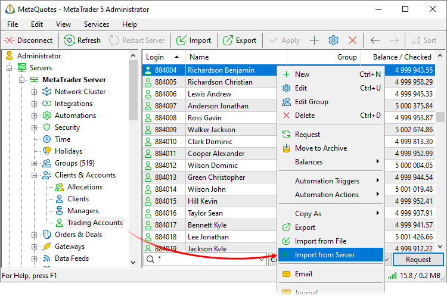
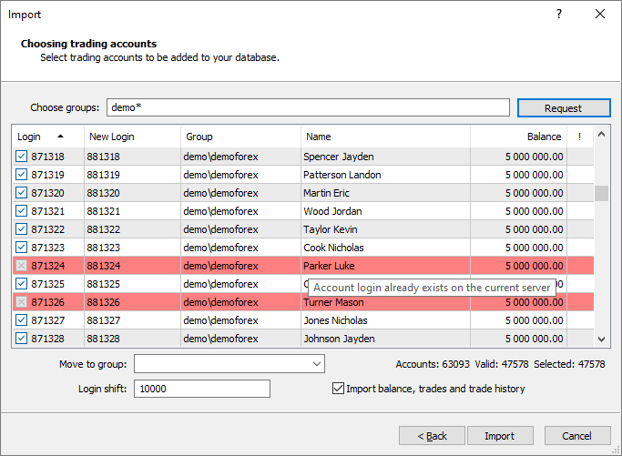
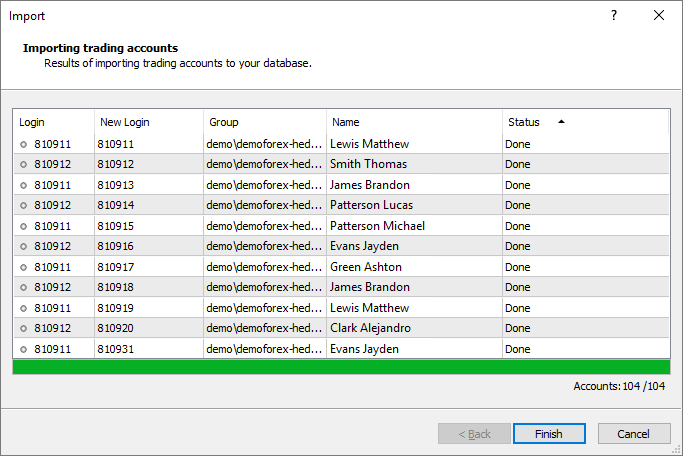

[🏠 Document Start](../../../README.md) / [MetaTrader 5 Trading Platform](../../../MetaTrader-5-Trading-Platform.md) / [Platform Setup](../../Platform-Setup.md) / [Accounts](../Accounts.md) / Import of from MetaTrader 5

[Previous](Import-of-from-File.md) | [Next](Checking-and-Fixing-Balance.md)

# Import of Accounts from MetaTrader 5 Server

You can easily import your account database from one MetaTrader 5 sever to another, including accounts' trading operations and history. You will need administrator accounts having access to accounts, groups and trading operations on these two servers.

> You can also [import accounts and trading operations from the MetaTrader 4 server](../../Migration-from-MetaTrader-4/Import-of-Accounts-and-Trades.md).

Open the [Accounts](../Accounts.md) section in MetaTrader 5 and click "Import from Server":

Specify connection parameters:

  * Server Type — MetaTrader 5.
  * Server — the IP address and port of the MetaTrader 5 server separated by a colon.
  * Login — the number of the manager account for authentication on the server.
  * Password — the account password for authentication on the server.
  * Use certificate from file — [advanced authentication](../../MetaTrader-5-Administrator/Getting-Started/Connect-to-Server/Extended-Authorization.md) can be enabled for the manager account on the source server, from which accounts are imported. A certificate is required in this case. If the certificate has previously been installed in the storage of the operating system, it will be automatically recognized by the import system. If the certificate has not been installed, enable this option and specify the path to the file manually.

  * Certificate File — click "Browse" and specify the pfx-file of the certificate. The certificate file received in the terminal is saved in /terminal data folder/profiles/server name/certificates/.
  * Certificate Password — [the password (#password)](../../MetaTrader-5-Administrator/Getting-Started/Connect-to-Server/Extended-Authorization.md#password) of the certificate.

To import accounts, you should have an administrator or manager account on the source server, with the following [access permissions (#accounts)](../Managers.md#accounts):

  * Connection type: MetaTrader 5 Administrator or MetaTrader 5 Manager
  * Accounts section: "Accountant", "Access accounts", "Access account personal details"
  * Dealing section: Access to trading orders (if import includes trading history)

For security purposes, you should grant to the manager account the access only to specific trading account groups for import. Also you should disable the entire group of "Configuration settings" permission and allow connections only from a certain address. After the accounts import is complete, you can disable the manager account if it is not used for other purposes.

On the receiving server, you should have an administrator account (Connection type: MetaTrader 5 Administrator) with the same permissions along with the permission to access group settings.

## Requesting accounts

The next step is to request the accounts that you want to import from the source server. Enter your request in the "Choose groups" field. Here you can specify a comma separated list of logins or a more complex query using the "*" masks and the "!" negation symbol.

The "Choose groups" field contains the default request of "!demo*,!manager*,!coverage*,!contest*,*", which allows to select all accounts except from groups of demo and manager accounts, as well as coverage and contest groups.

To execute the request click "Request".

An account having a red background cannot be imported to the server. The following reasons are possible:

  * The group of the account on the source server and the current server have different [position accounting types](../Groups/Position-Accounting-Systems.md) (hedging and netting). Try to select another group in the "Move to group" field.
  * The currency of the account deposit does not match the deposit currency of the group to which you want to import the account.
  * An account with the same number already exists on the current server or on one of other trade servers of the platform.
  * The account number is out of the [range of accounts (#accounts)](../Network-cluster/Configuring-Servers/Trade-Server.md#accounts) allowed for the current server.
  * The symbol, for which the account to import has orders or positions, does not exist on the server.
  * The symbol, for which the account to import has orders or positions, had different numbers of decimal places on the source and target servers.
  * The group of the account does not match any group on the server. In this case, you should specify in the appropriate field the group to move accounts to.

Information about the reason for not inability to import an account is available in the tooltip that appears when you hover the mouse over the account line.

Double click on an account to view how it would look like after import. This will open a standard [account viewing](Editing-Account.md) window.

You can disable import of individual accounts from the list. To do this, click on the icon at the beginning of the account row, and then it will change to.

> Depending on import settings, the login of a migrated account can be preserved or converted with an offset. For example, login 101980 is converted to 1101980, if the parameter "Login shift" is set to 1 000 000. If login shift is applied, the numbers of [agent accounts (#agent-account)](Editing-Account.md#agent-account) in client records are shifted by the same value.

## Import Settings

## To import trading operations of selected clients, enable the "Import balance, trades and trade history" option. All available orders, deals and positions of the client will be imported.

You can also specify additional parameters:

  * Move to group — choose the [group](../Groups.md) to import accounts to. The administrator executing the import procedure only has access to the groups on the server, to which the administrator account belongs. The list of groups available to the administrator can also be limited in [manager account (#groups)](../Managers.md#groups) settings.
  * Login shift — you can specify a number, by which all numbers of imported account will be shifted. The shift can be wither positive or negative. For example, 1000 or -100.

## Result of Import

The total number and the number of imported accounts will be shown on the last step:

Import details are also available in the trade server journal.

  * After import, the appropriate accounts on the source server must be disabled or set to the "read-only" mode to avoid trading state mismatch with the new MetaTrader 5 server.
  * After completing the import for accounts having open positions, you can see the differences in equity and free margin in the Manager terminal. This may happen if quotes in the new MetaTrader 5 platform are significantly different from the ones in the source platform or a data feed is not configured. The Manager terminal calculates these values in real time according to the current prices in the platform. In the Administrator terminal, there are no differences (the values coincide with the source server) since data are taken directly from the accounts and are not recalculated.

  
---  
  
## Client connection and passwords

Random passwords are generated for imported accounts. Hashes of account passwords that were used on the source server are saved in the client record. They are used for verification during the first account connect in MetaTrader 5.

During the first connection to the imported account, the client will attempt to connect using the old password. Upon entering the incorrect password (since a new random password has been generate), a welcome dialog will be displayed:

The old account password that was used on the source server should be specified here. The client will not be able to continue without this password. A new password should be set here, which will later be used to connect to the account.

If authenticated successfully, the dialog will not be displayed again, and the client will work as usual. 

> You can set a new password for the imported account via the administrator or manager terminal and provide it to the client. The welcome dialog will not be displayed in this case. After password change, the hash of the password used on the source server is deleted from the client record.

## Import Features

Accounts are imported in packages each containing 100 account. If an account from the package could not be imported, you will need to repeat the import. If errors occur, the previous state will not be restored. The accounts and trading operations from the package successfully imported before the error will not be removed. Before re-import, remove them manually in the following order:

  * ORDERS
  * Deals
  * Positions
  * Accounts

Importing may take a long time: it depends on the database size and your Internet connection speed.
