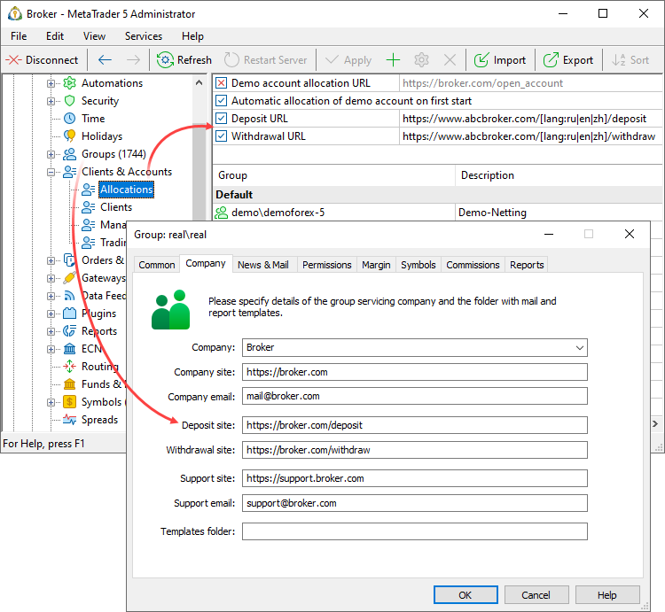
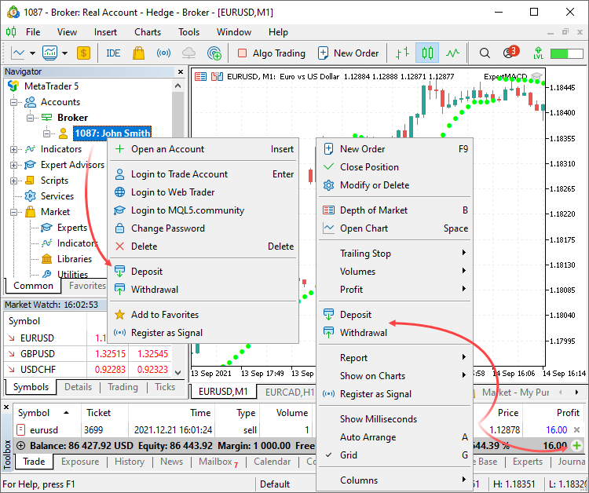

[🏠 Document Start](../../../README.md) / [MetaTrader 5 Trading Platform](../../../MetaTrader-5-Trading-Platform.md) / [Platform Setup](../../Platform-Setup.md) / [Accounts](../Accounts.md) / Links to Depositing and Withdrawing

[Previous](Corporate-Links.md) | [Next](../Payments.md)

# Links to Depositing and Withdrawing

You can redirect traders to your deposit and withdrawal pages directly from client terminals. By enabling this option you eliminate the need for you traders to search for the necessary pages in their trader's rooms, while they will be able to simply click an appropriate command in the account or trading section menu.

> You can set up full platform integration with [payment systems](../Payments.md) and accept payments directly through client terminals.

## How to set up

You can add deposit and withdrawal links using [account allocation settings (#deposit-withdrawal)](Account-Allocation-Settings.md#deposit-withdrawal) and [group settings (#deposit-withdrawal)](../Groups/Group-Settings.md#deposit-withdrawal):

Links in account allocation section apply globally, to all groups. Thus, added deposit and withdrawal links will be available for all accounts within the platform. Links in groups allow overriding global settings or enabling this option only for separate accounts. If you do not want to enable deposit and withdrawal commands for all accounts, leave appropriate account allocation settings unchanged and add links only to the specific group settings. Links to withdrawal and deposit pages are only displayed for real accounts. These links are hidden for demo accounts.

Trader parameters separated by "&" symbol are additionally passed in the address line. Analyze the parameters to direct the traders to the required page and to automatically fill deposit/withdrawal form fields.

https://www.deposit.url/?login=1815985&email=john@smith.net&type=real&currency=USD&acp=1252&label=MetaQuotes&server=MetaQuotes-Demo&interface=English&cid=35069eb0358e7b01023bdef53313c0cc&age=437&utm_campaign=download&utm_source=www.metatrader5.com  
---  
  
The following parameters are supported:

  * login — account login
  * type — account type: demo, contest or real
  * currency — account deposit currency
  * acp — code page used by a trader
  * label — name of the company which owns the terminal White Label
  * server — the name of the server on which the account is open
  * interface — the current language of the client terminal interface
  * cid — trader PC's unique ID
  * age — the number of days elapsed since client terminal installation.
  * email — the email address specified in the trading account
  * utm_campaign — the name of the marketing campaign from the Lead Campaign field of the trading account. The parameter is filled automatically in accordance with the UTM used in the [installation link of the relevant terminal (#lead)](../../Additional-Features.md#lead), from which the commands are clicked.
  * utm_source — the source name from the Lead Source field of the trading account. The parameter is filled automatically in accordance with the UTM used in the [installation link of the relevant terminal (#lead)](../../Additional-Features.md#lead), from which the commands are clicked.

You can use the [lang: ... ] macro in the address line to forward a trader to the desired language page. The list of languages in ISO 639-1 format should be specified here. If one of the listed languages ​​matches the interface language of the client terminal, it will be used for the news language. Otherwise, the first language in the list is used. Example:

https://www.deposit.url/[lang:ru|en|es]  
---  
  
> Additional link parameters are not supported. If necessary, you can use the redirect option on your site.

## How the option appears on the client terminal side

If deposit and withdrawals URLs are co9nfigured for an account, appropriate commands appear in client terminals:

  * in the account context menu in Navigator
  * in the context menu of the trading section in Toolbox
  * in the account status bar in the trading section Toolbox

> If [payment systems integration](../Payments.md) is configured in the platform, these commands will redirect the user to the [payments section](../Payments/in-Client-Terminals.md). Links to deposit and withdrawal pages will not be used.
