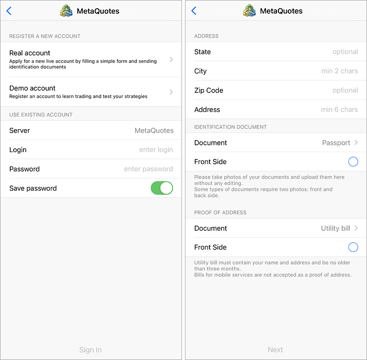
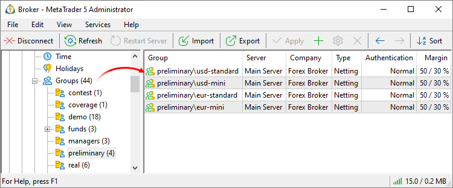

[🏠 Document Start](../../../README.md) / [MetaTrader 5 Trading Platform](../../../MetaTrader-5-Trading-Platform.md) / [Platform Setup](../../Platform-Setup.md) / [Accounts](../Accounts.md) / Preliminary

[Previous](Editing-Account.md) | [Next](Archive-and-Backup-Bases.md)

# Preliminary Accounts

Traders can send a request to a broker to open a real account straight from desktop and mobile terminals. The user needs to fill in a simple request form and, if necessary, to attach two documents to confirm their identity and address.

After that, a new account with a zero balance is created for the client in the ["Preliminary" group](../Groups/Group-Types.md). Trading is disabled for this group. After formalizing relations with the client, a manager can easily move the preliminary account to one of real groups, after which the client will be able to trade.

> View the video "[Increase conversion rate and optimize client management](https://support.metaquotes.net/en/articles/461)" for more details related to preliminary accounts.

## Configuring groups for working with preliminary accounts

During platform installation, only one "preliminary" group is created on the main trade server. Preliminary real accounts requested by traders from the terminals will be created in this group.

Create preliminary groups for different countries, currencies and account types. This will enable automatic distribution of registrations to regional sales departments and will allow clients to select desired trading conditions, for example to request a standard, mini or micro account.

The names of preliminary groups should begin with "preliminary".

Then create account types under the [Account allocation](Account-Allocation-Settings.md) section, based on preliminary groups.

Select here types of data to be requested from the trader when opening an account, as well as the need to provide documents and other details.

> The platform automatically collects relevant information about traders. Every account the trader opens is linked to the appropriate [client record](../Clients.md). The documents provided by traders during preliminary account request are uploaded to the [Documents (#documents)](../Clients.md#documents) section.
