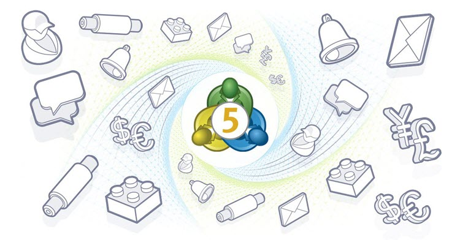

[🏠 Document Start](../../README.md) / [MetaTrader 5 Trading Platform](../../MetaTrader-5-Trading-Platform.md) / [Platform Setup](../Platform-Setup.md) / Automations

[Previous](Security/Authentication-Protocols.md) | [Next](Automations/Common-Settings.md)

# Automations

The Automations service enables the execution of various actions in the platform based on predefined scenarios. The service allows specifying a list of conditions and a list of actions that should trigger under these conditions. Automations allows companies to streamline numerous day-to-day operations and eventually reduce manual work. The service does not require from the administrator any extra programming skills, while all rules can be configured in a user-friendly visual mode.

The following actions can be automated:

  * Communication with clients. Automatically notify clients when their balances drop below a certain value, send promotional emails to new clients and reminders to inactive customers.
  * Platform maintenance. Reboot servers and gateways if performance metrics degrade, launch history synchronization according to a pre-configured schedule.
  * Managing of configurations. Set dynamic time-based symbol and group parameters, rearrange routing rules after reaching threshold volumes.
  * Managing of deals. Close positions and cancel orders upon expiration of futures contracts.
  * Managing of accounts. Disable trading for malicious traders, conduct balance operations and add automated comments upon certain actions.
  * Sending events to external systems. Back-office integration options will be added soon. For example, you can send information on opened accounts to online trader rooms or to your CRM system via the REST API.

Reduce manual work and free up resources for important business tasks, as well as improve the quality of services by eliminating human errors. Save money on programmer services and paid plugins by replacing them with simple and easily controlled automation tasks.

## Test the service and purchase a subscription

You can create up to three Automation tasks for free. Any types of conditions and actions can be automated. Test the system and evaluate its efficiency for your business.

To remove trial restrictions and to add more automations, [purchase the service subscription from the App Store](https://support.metaquotes.net/en/market/product/547). The service costs USD 500 per month, but the savings and the additional earnings can certainly be much higher than the aforementioned cost.

[Order MetaTrader 5 Automations](https://support.metaquotes.net/en/market/product/547 "Order MetaTrader 5 Automations")

## Task configuration

To configure an automation task, specify:

  * [Time and repetition periodicity](Automations/Common-Settings.md) for the task
  * [Triggers](Automations/Triggers.md) — the events upon which the task should be performed
  * [Additional conditions](Automations/Conditions.md), under which the task should be performed
  * [Action](Automations/Actions.md) to be executed upon the specified conditions

The platform features a few ready-made service examples, which can help you in understanding the service operation and setup principles. Customize the settings and enable tasks to see how the service works.

[Detailed statistics](Automations/Statistics.md) will show how effectively the Automations service assists you in solving everyday tasks.
