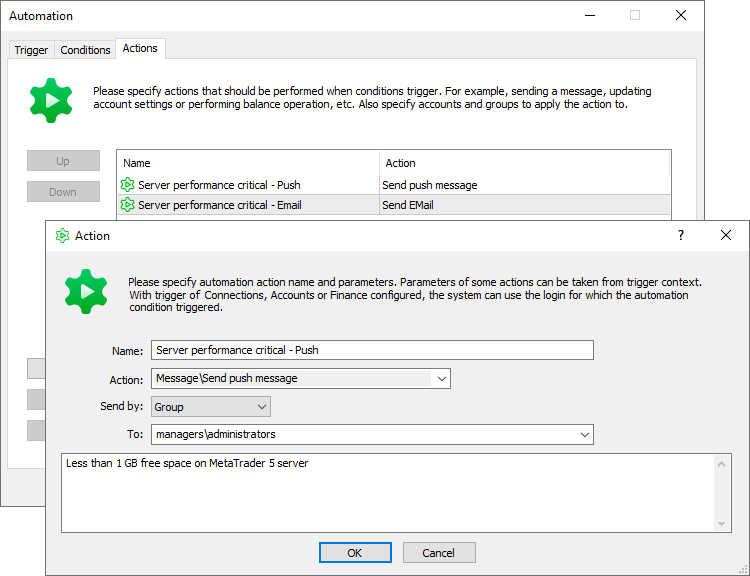
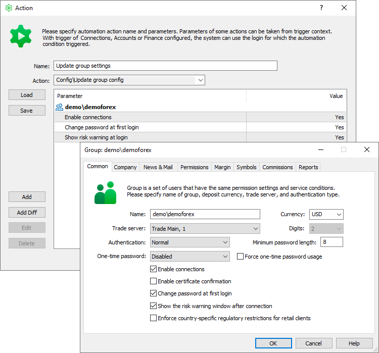
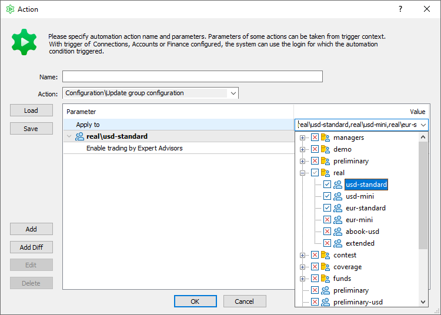
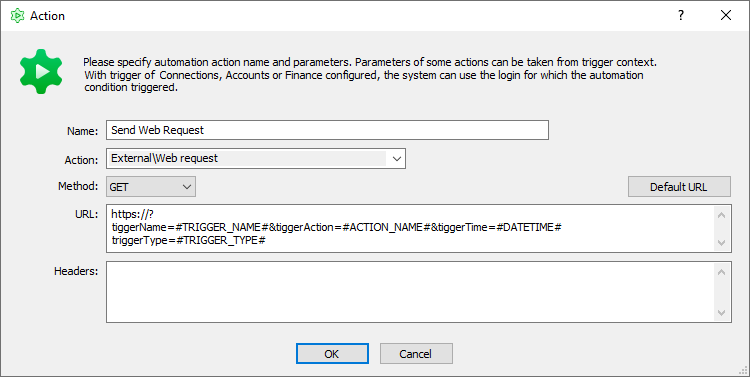
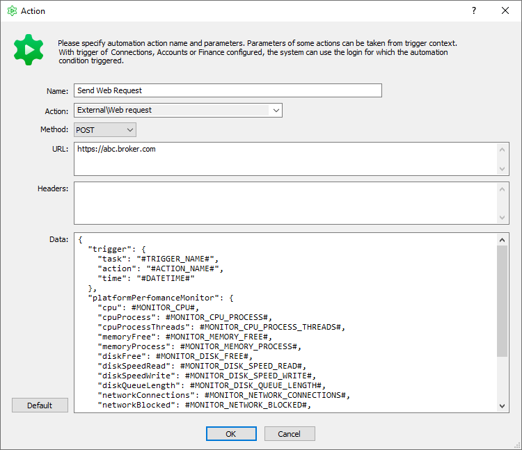
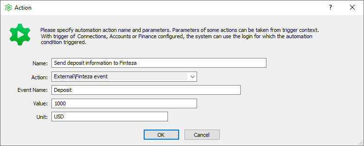
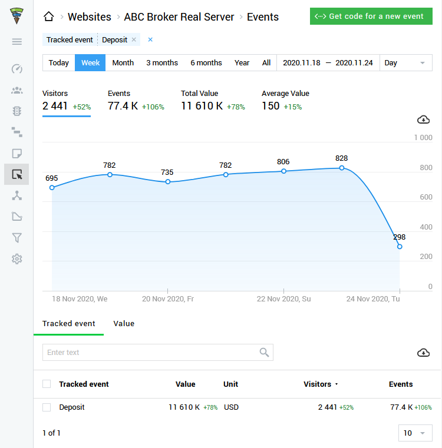
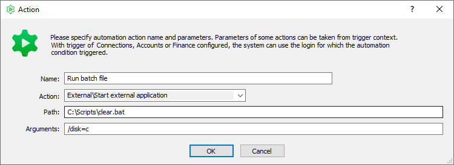

[🏠 Document Start](../../../README.md) / [MetaTrader 5 Trading Platform](../../../MetaTrader-5-Trading-Platform.md) / [Platform Setup](../../Platform-Setup.md) / [Automations](../Automations.md) / Actions

[Previous](Conditions.md) | [Next](Macros.md)

# Actions Performed by Automations (#actions-performed-by-automations)

After configuring the conditions under which the automation task should trigger, describe the actions that should be performed by this automation task.

Multiple actions can be specified for each task. They will be executed in the specified order, from top to bottom. If any action fails, execution of further actions is not terminated.

The available actions are divided into categories, in accordance with the objects to which they apply.

  * [Message (#message)](Actions.md#message) — send a notification to users.
  * [Account (#account)](Actions.md#account) — manage account balances.
  * [Finance (#finance)](Actions.md#finance) — execute balance operations on accounts.
  * [Trade (#trading)](Actions.md#trading) — execute trading operations on accounts.
  * [Config (#configuration)](Actions.md#configuration) — change platform settings.
  * [Platform (#platform)](Actions.md#platform) — platform service actions.
  * [External (#external)](Actions.md#external) — platform integration with external systems.

[The accounts to which actions apply (#action-select-by)](Actions.md#action-select-by), are indicated in the "Select by"/"Send by" field.

> The availability of actions in the list is determined by the selected [trigger](Triggers.md). If actions are not associated with the event for which the task is being configured, such actions are automatically hidden. This makes setup easier while reducing potential errors. For example, for [database processing (#account-processing)](Triggers.md#account-processing) triggers, the system does not allow the selection of actions related to [platform configuration changes (#platform)](Actions.md#platform).

## Accounts to which actions apply (#action-select-by)

The accounts to which the actions will be applied are indicated in the "Select by"/"Send by" field. Three login specification options are available for actions from categories "Message", "Account" and "Finance":

  * Login — one or more accounts separated by commas. Value ranges can also be specified here, for example: 1006-1019. It is possible to specify both an enumeration and a range, for example: 100,102,107,120-130.
  * Group — one or more groups or group masks (all accounts from specified groups).
  * Trigger — the action is only applied on the account on which the trigger fired. For example, if the "Login" event is specified as the trigger, the connected account will be used as the action object. This option is unavailable if a trigger event is not related to actions on the trading account. For example, "Scheduled event", "Price gap started", etc.

For actions from other categories, only the "Login" and "Group" options are available.

## Message (#message)

These actions are intended to inform users:

  * Send push message — sends a notification to a [mobile device via MetaQuotes ID](https://support.metaquotes.net/en/articles/436). 
  * Send internal mail — sends an email via the [internal mail system](../Mailbox.md). The email sender can be specified for this action, in the "From" field. The message recipient will information about the sender and will be able to send him a reply. Only the managers with a [specified mailbox (#common)](../Managers.md#common) and appropriate permissions are shown in the list that opens in the sender selection field.
  * Send SMS — sends an SMS. The feature requires an appropriate [SMS service integration configuration](../Integrations/SMS-Gateways.md).
  * Send Email — sends an email message. The feature requires an appropriate [mail service integration configuration](../Integrations/Mail-Servers.md).
  * Post in messenger channel — sends a message to the selected channel via a messenger. Using this action, you can promptly receive monitoring data, notifications about large financial transactions, manager connections in the platform, and other information directly on your phone. The feature requires an appropriate [messenger integration configuration](../Integrations/Messengers.md).

  * Send to journal — prints a message to the journal of the trading server on which the automation task is running. Use this action for additional control over the platform and automation tasks.

The following data from appropriate accounts will be used to send a message:

  * For push messages: MetaQuotes IDs [specified in accounts (#personal)](../Accounts/Editing-Account.md#personal).
  * For internal emails: logins.
  * For SMS: phone numbers specified in accounts.
  * For emails — email addresses specified in accounts.

You can use [macros](Macros.md) in messages. They allow substituting different data depending on a recipient (account) and a triggered event.

## Trading account (#account)

These actions enable management of trading account settings:

  * Disable, Enable — manage [account enabling/disabling (#enable)](../Accounts/Editing-Account.md#enable) options.
  * Disable trade, Enable trade — manage [account trading permissions (#trading)](../Accounts/Editing-Account.md#trading).
  * Disable experts, Enable experts — manage the [permission to trade using Expert Advisors on the relevant account (#ea-trading)](../Accounts/Editing-Account.md#ea-trading).
  * Disable trailings, Enable trailings — manage the [permission to use a trailing stop in client terminals (#trailing-stop)](../Accounts/Editing-Account.md#trailing-stop).
  * Disable reports, Enable reports — manage the [permission to receive daily reports (#reports)](../Accounts/Editing-Account.md#reports).
  * Disable sponsored VPS, enable sponsored VPS — manage the [availability of the sponsored VPS (#sponsored-vps)](../Accounts/Editing-Account.md#sponsored-vps) option. These actions expand [standard scenarios](../Integrations/Sponsored-VPS.md) in which you can provide VPS to traders. For example, by using these actions with the "[Deposit (#finance)](Triggers.md#finance)" trigger, you can provide the sponsored VPS option to the client when they deposit a certain amount to their account.
  * Force to change password — enables [forced password change (#change-password)](../Accounts/Editing-Account.md#change-password) during the next account connection.
  * Change group — moves an account to the specified group. Please note that accounts can be moved between groups with different deposit currency only if their balance is zero and they have no open positions. Accounts cannot be moved between groups which belong to different trade servers.
  * Change color — changes the [account color (#account)](../Accounts/Editing-Account.md#account) to the specified one.
  * Move to archive — moves an account to [archive](../Accounts/Archive-and-Backup-Bases.md).
  * Comment, Client comment — adds a [comment to an account (#personal)](../Accounts/Editing-Account.md#personal) or to a [client record (#comments)](../Clients.md#comments) to which the account is linked.
  * Change leverage — changes the account leverage to the specified one. By using this action with the account balance condition, you can encourage traders to make larger deposits. For example, you can set the "Login" trigger, conditions "Balance > 100 000" and "Group = real\*", "Action = Change leverage to 1:500". Clients with large deposits will have lower margin requirements and more trading opportunities. Accompany it with another rule, which will automatically reduce the leverage in the case of a balance drop.

## Finance (#finance)

These actions allow performing balance operations on accounts:

  * Deposit — a regular deposit or withdrawal from the account balance. An additional Type field is available for this action. You can specify here [the deal type (#action)](../Deals.md#action) by which the operation will be executed: balance, correction, commission, etc.
  * Bonus — adding or deducting a bonus using a [Bonus type deal (#action)](../Deals.md#action).
  * Bonus, % — adding or deducting a bonus using a Bonus type deal. The action is only used with the ["Deposit" and "First Deposit" triggers (#finance)](Triggers.md#finance). It allows adding bonuses to a trader account depending on the deposit amount. For this action, specify in the "Amount" field the bonus as a percentage of the deposit amount.
  * Credit — adding or deducting credit funds using a ["Credit" type deal (#action)](../Deals.md#action).
  * Deposit pay off — writes off the account balance. The action will be useful when closing trading accounts. An additional Type field is available for this action. You can specify here [the deal type (#action)](../Deals.md#action) by which the operation will be executed: balance, correction, commission, etc.
  * Credit pay off — writes off the account credit funds. Use these rules to automate promotions for new clients. For example, you can withdraw credit funds from the traders account when a month passes since the client's registration.

  * Bonus pay off — eliminates all bonus funds from the account. This action can be utilized to automate promotions for new clients. For example, you can remove bonuses from the account if the trader does not use them within a certain time.

Indicate a positive amount to add funds and a negative value to deduct the appropriate amount.

## Trading (#trading)

These actions allow conducting trading operations on accounts:

  * Close positions — closes positions on specified accounts.
  * Close orders — cancels active pending orders on specified accounts.
  * Clear Stop Loss / Take Profit / Stop Loss and Take Profit — delete the relevant activation levels of pending orders and open positions. Use these actions to implement your own Take Profit and Stop Loss expiration rules. For example, when combined with scheduled database processing triggers, they can clear all levels at the end of a trading day or week. Use conditions to additionally filter positions and orders to which the action will be applied. For example, you can set a specific list of symbols or groups.

As an object to which the action will be applied, you can select:

  * Trigger Position. This option is available for the "[Scheduled position database processing (#trade-processing)](Triggers.md#trade-processing)" trigger. In this case, the action is applied to all positions which match the [conditions](Conditions.md) specified for the automation task. For example, the trigger is combined with the condition "Position\Days since creation > 365". By selecting the "Close positions" action and the "Position from trigger" object, you will close all positions that were opened more than a year ago.
  * Trigger Order. This option is available for the "[Scheduled order database processing (#trade-processing)](Triggers.md#trade-processing)" trigger. In this case, the action is applied to all orders which match the [conditions](Conditions.md) specified for the automation task. For example, the trigger is combined with the condition "Order\Days since Setup > 365". By selecting the "Close orders" action and the "Order from trigger" object, you will close all orders that were placed more than a year ago.

  * Trigger Position or Order — available if the trigger is set to [Web callback (#webcallback)](Triggers.md#webcallback). In this case, the action is applied to the position or order passed in the request. Further details are provided in the [Triggers (#webcallback-clearsltp)](Triggers.md#webcallback-clearsltp) section.

  * Trigger Login, specified list of logins or groups — similar to any other action. The relevant description is provided in the section "[Accounts to which actions apply (#action-select-by)](Actions.md#action-select-by)".

Additional parameters should be specified for these actions:

  * Type — type of trading operations the actions will be applied to: position direction or [pending order type (#details)](../Orders.md#details).
  * Symbol — a list of trading instruments to which the action will be applied. A comma separated list of symbols or symbol masks can be specified here.
  * Price — only used for the "Close positions" action. Specify the price at which the positions will be closed.
  * Comment — a comment to be added to position closing operations (exit deals) or to canceled orders.
  * Reason — operation execution [reason (#reason)](../Deals.md#reason) to be specified in position closing deals. This parameter enables more accurate details in the database of deals. For example, if your automation task closes positions on Stop Out, then you can specify the relevant reason in the deals. The default reason is "Dealer".

## Configuration (#configuration)

These actions enable management of platform settings:

  * Update groups configuration
  * Update symbol configuration
  * Move symbol configuration
  * Update routing configuration
  * Update server configuration
  * Update gateway configuration
  * Update data feed configuration

Two methods for describing required configurations are supported:

  * The Add command creates the full description of the configuration. The list includes all parameters, including those that remain unchanged. When the rule triggers, the new configuration will completely overwrite the existing one (or it will add a new configuration).
  * The Add Diff command only creates a description of the parameters to be changed. When the rule triggers, the changes will be applied to an existing configuration.

Selection of any of the commands will open a corresponding configuration editing dialog:

Change the parameters as needed and click OK. All changed parameters and their new values will be displayed in a list.

Next, add other configurations as needed.

Optionally, you can use [settings files in JSON format](../General-Information/ImportExport-Settings.md). For example, you can save several symbol settings in advance and then add them to automation tasks using the Load command.

> All settings must be specified in JSON files, not only the ones that you want to change. [Export settings](../General-Information/ImportExport-Settings.md), make desired amendments and use them in automation tasks.

Action "Move symbol configuration" enables automatic regrouping of trading instruments. For this action, specify the path for the symbol in the field below. The symbol to be moved is identified by the name from the new path. For example, if you specify "Forex\Majors\EURUSD", the EURUSD symbol will be moved to the "Forex\Majors\" subgroup. If you specify "Delayed\EURUSD", the EURUSD symbol will be moved to the "Delayed\" subgroup.

### Bulk Configuration Changes (#configuartion-bulk)

Automation tasks allow you to change symbol and group settings in bulk. Select the appropriate action and specify the changes with the "Difference" command. Next, in the "Apply to" parameter, specify the list of groups or symbols to which the specified changes should be applied.

## Platform (#platform)

These actions enable platform management.

  * Restart server — restarts the server with the specified [ID (#identifier)](../Network-cluster/Configuring-Servers.md#identifier).
  * Restart datafeed — [restarts](../Data-Feeds/Restarting.md) the specified datafeed.
  * Restart gateway — restarts the specified gateway.
  * History synchronization — launches [price data synchronization](../Synchronization.md) in accordance with the specified configurations.
  * Live Update — initiates checking for [platform updates](../Live-Update.md) and starts installation if an update is found. This action can be combined with the "Scheduled Event" trigger to enable automatic checks and installation of platform updates on weekends.

By using these actions combined with the "[Scheduled event (#time-interval)](Triggers.md#time-interval)" trigger, you can automatically execute preventive actions at a specified frequency. For example, you can automatically restart gateways and datafeeds once a week, on Sunday nights.

## External (#external)

These actions will integrate your MetaTrader 5 platform into external systems. By using them, you can:

  * Send standard [HTTP requests (#webrequest)](Actions.md#webrequest) to any URL
  * Send events to [the Finteza analytics system (#finteza)](Actions.md#finteza)
  * Run [external files and scripts (#application)](Actions.md#application) on the server where the platform is installed

### Sending Web Requests (#webrequest)

When specific events occur in the platform, standard HTTP GET and POST requests can be sent to desired addresses. The new possibility enables platform integration with any web services supporting REST API. For example, you can automatically send information about opened accounts to traders' web accounts and to your CRM systems.

In the action setup dialog, select "External \ Web request" and specify request parameters: GET or POST.

GET Requests

When using a GET method, information about an event is passed as request arguments. Therefore, such requests should only be used to transfer a small amount of event data.

After selecting this request type, specify the following parameters:

  * URL — the address to which the request will be sent, and additional arguments.
  * Headers — additional headers for the request in the "key: value" format. For example, "Content-Type: application/x-www-form-urlencoded".

By default, the system inserts [macros](Macros.md) to URL parameters, allowing to pass information about the triggered event:

  * Automation rule name
  * Action name
  * Trigger time
  * Trigger type

https://?triggerName=#TRIGGER_NAME#&tiggerAction=#ACTION_NAME#&tiggerTime=#DATETIME#&triggerType=#TRIGGER_TYPE  
---  
  
The following macros are added additionally added to URL parameters for appropriate [triggers](Triggers.md):

  * The user login for which the event triggered is passed for triggers "Connections", "Accounts", "Finance", "Trade": login=#LOGIN#
  * The transaction amount is added for "Finance" triggers: amount=#ACTION_FINANCE_AMOUNT#
  * The symbol name is added for "Prices" triggers: symbol=#SYMBOL#

Add to the URL a default address, to which the request will be sent. The address should be specified between characters // and ?. You can also add your own parameters to the string, separated by &.

POST Requests

Such requests accept an additional body in JSON format. They provide a convenient way to pass an extended event description.

After selecting this request type, specify the following parameters:

  * URL — the address to which the request is sent.
  * Headers — additional headers for the request in the "key: value" format. For example, "Content-Type: application/x-www-form-urlencoded".
  * Data — an additional body of a POST request in JSON format.

For convenience, the system automatically substitutes additional parameters in the JSON body of the request, according to the selected [trigger](Triggers.md). For example, if you configure a task related to a system monitoring event, then macros displaying measurement results will be substituted into the request. Account login macros are automatically inserted for connection triggers, login and operation amount macros are inserted for deposit operations, and so on. You can also add [any other macros](Macros.md) to requests.

Regardless of the trigger type, the following data is added to the request body by default:

  * Automation rule name
  * Action name
  * Trigger time

"trigger": {   
"task": "#TRIGGER_NAME#",   
"action": "#ACTION_NAME#",   
"time": "#DATETIME#"   
}  
---  
  
Sequence of Requests

The system uses one connection for all requests to the same domain. Due to this, if you set multiple tasks which send web requests, the system:

  * Guarantees that requests to the same domain are executed in the same sequence, in which the events trigger
  * Does not guarantee that requests to different domains are executed in the same sequence, in which the events trigger

For example, you have created tasks which execute web requests to the following addresses:

  * https://example1.com/xxx
  * https://example1.com/zzz
  * https://example2.com/xxx
  * https://example2.com/zzz

Requests to http://example1.com/xxx and https://example1.com/zzz will be executed sequentially, in the order of occurrence of associated events, regardless of request execution speed. The same will happen for https://example2.com/xxx and https://example2.com/zzz.

If requests for domain example1.com are executed slower (for example, due to slow server response), and requests for example2.com are executed faster, then the execution order may not match the order in which the events triggered.

### Sending Events to Finteza (#finteza)

MetaTrader 5 integration with the [Finteza business analytics system](../Integrations/Finteza-Analytics.md) enables analysis of audiences and advertising campaign efficiency, as well as tracking of client life cycles, from the first account visit to the first real account deposit.

This allows expanding the standard [set of events](../Integrations/Finteza-Analytics.md). By using Finteza with the Automations service, you can easily track a plethora of other important platform metrics, such as account connections, deposit operations and other events. 

Select "External \ Finteza event" in the action settings dialog, and specify the following parameters:

  * Event name — the name of the occurred event which will be sent to Finteza. We recommend specifying meaningful names, as they will be used in reports.
  * Value — the value of the parameter, for example, the deposit amount.
  * Units — parameter measurement units, for example, USD, items, etc.

The events will be collected to a website tracker specified under "[Integrations \ Finteza](../Integrations/Finteza-Analytics.md)". To view the events, open [Finteza Panel](https://panel.finteza.com), select the required tracker and navigate to "Events".

For further details about events, please read the article [How to configure events in Finteza](https://support.metaquotes.net/en/articles/462).

### Running External Applications (#application)

This action allows running external applications and script files on the machine where the platform's main trade server is installed. For example, when the free disk space drops below [a specified threshold (#platform)](Conditions.md#platform), you can run a BAT file which will empty temporary folders and the system's Recycle Bin.

Select "External \ Start external application" in the action settings dialog, and specify the following parameters:

  * Path — the path to the file to run, including the extension. A file can only be run on the machine where the platform's main trade server is installed. You can specify an absolute path or a path relative to the directory where the server executable file mt5trade64.exe is located. For example: "C:\Scripts\clear.bat" or "..\\..\Scripts\clear.bat" (go up to levels and navigate to the "Scripts" directory).
  * Arguments — command parameters with which the executable file will be launched.

[Macros](Macros.md) can be used in the path line and in the arguments line. For example, you can pass the account number for which the trigger was activated (#LOGIN#), or the deal ticket (#DEAL_TICKET#).

## Verification of permissions for actions (#verification-of-permissions-for-actions)

Automation tasks cover a wide range of actions, from editing of platform settings to financial operations. All these actions are performed without verifying the permissions of the [manager/administrator (#permissions)](../Managers.md#permissions) who creates the task. Permissions are only checked when the user accesses the automation configuration section. It means that a user having access to the automation section can execute any [automation action](Actions.md) with any available parameters.

> Therefore, please be extremely careful when allocating automation configuration permissions as it provides access to critical platform functions.

## Task loop control (#task-loop-control)

The platform does not control task looping if the task execution hits the [trigger](Triggers.md) of another task. For example, if you set a chain of tasks "make a withdrawal when depositing, make a deposit when withdrawing", such a task will be executed infinitely.

Be sure to take into account possible looping and avalanche triggering when creating tasks. Pay attention to combinations of triggers from the Finance and Trade groups with [actions](Actions.md) from the corresponding groups.
