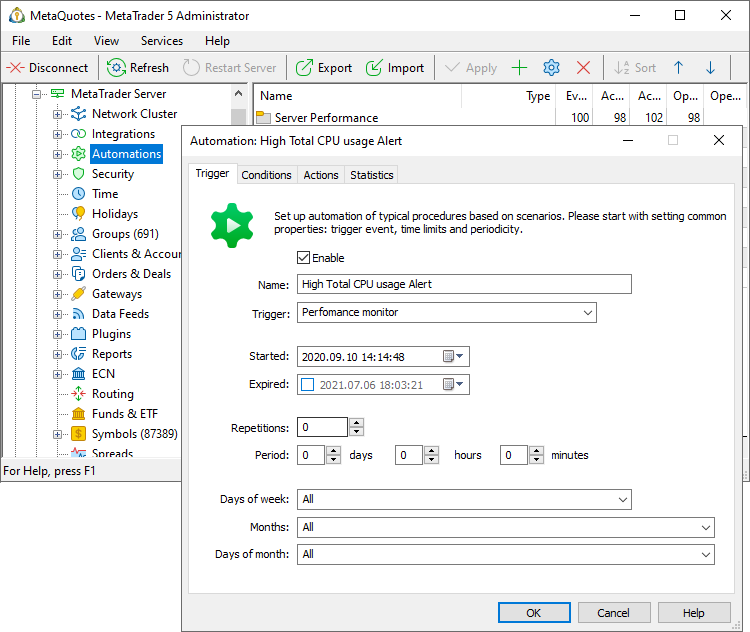

[🏠 Document Start](../../../README.md) / [MetaTrader 5 Trading Platform](../../../MetaTrader-5-Trading-Platform.md) / [Platform Setup](../../Platform-Setup.md) / [Automations](../Automations.md) / Common Settings

[Previous](../Automations.md) | [Next](Triggers.md)

# Common Automation Settings (#common-automation-settings)

To create a task, open the "Automation" section and create a new configuration:

Set general parameters for the task:

  * Name — task name. Set descriptive names which reflect the idea of target actions. Appropriate naming will ensure efficient task managements when many tasks are accumulated in the system. While the maximum name length is 127 characters, we recommend keeping names short and concise. This will make it easier to search for automation events in [server logs](../Network-cluster/Journal.md), among other things. It is not recommended to use special characters in the name: %, !. " etc.
  * Trigger — [an event in the platform](Triggers.md) upon the occurrence of which the automation task should be executed. When a trigger fires, the correspondence of the occurred event to the relevant [conditions](Conditions.md) is checked. If all the conditions are met, a [predefined action](Actions.md) is performed.
  * Started — the date and time on which the trigger check will be activated.
  * Expired — the date and time after which the trigger check will be disabled. If no value is specified in this field, the trigger check interval is considered unlimited. 
  * Repetitions — the maximum number of event repetitions over the period specified in the next field. Every time a trigger fires, the system checks how many similar events have occurred during the specified period. If the threshold has been reached, no action is performed. For all triggers except for those of the "[Schedule (#schedule)](Triggers.md#schedule)" type, a zero value means that the number of repetitions is not limited. If zero is set for a scheduled event, the trigger will fire once at the time specified in the "Started" field. For more setup details please view section "[Period and repetitions setup specifics (#period-features)](Common-Settings.md#period-features)" below.
  * Period — the period of time for which the number of repetitions should be checked. If you are limiting the occurrence of an event, do not leave the period field set to zero. You should explicitly specify some value. Otherwise, the repetition limit will not work.
  * Days of week, Months, Days of month — days and months for which triggers are enabled. If an event does not meet the specified criteria, the event handling will be skipped.

If a task configuration is not ready or if you wish to suspend it, uncheck the "Enable" box.

  * For convenience, tasks can be grouped in directories. Click "Add" in the context menu of the "Automation" section in the left-hand tree and specify the new directory name. Then drag and drop the desired tasks into this directory.

  * To quickly create similar tasks, use the "Add copy" command of the context menu. Instead of creating each task from scratch, create a copy of the existing one and adjust the required parameters.

  * When you cancel your subscription to the Automations service, only the three tasks that were activated first will continue to operate. All other tasks will stop running, even if their configurations are enabled. The number of active tasks and their names are displayed in the server log at startup:  
Automation loading 130 tasks (91 disabled, 3 active)  
Automation active tasks: High Process CPU usage Alert, Manager Order Modify, Geo Condition

  
---  
  

## Period and repetitions setup specifics (#period-features)

[Repetitions (#repetitions)](Common-Settings.md#repetitions) and [period (#period)](Common-Settings.md#period) settings have different logic for the "[Schedule (#schedule)](Triggers.md#schedule)" triggers and for all other triggers:

  * For schedule triggers, this setting indicates how many times and at which intervals the event generation shall be repeated. Therefore, the Repetitions and Period parameters cannot be zero for such events, otherwise they will never be triggered.
  * For all other triggers the setting indicates how many event repetitions in the specified period shall cause the trigger to fire.

Example: Started = 10:30, Repetitions = 3, Period = 3 minutes.

For the "Scheduled event" trigger, the event will be generated three times: at 10:30, at 10:33 and at 10:36. After that the generation will stop.

For all other triggers, the first 3 events over the last 3 minutes at the event occurrence time will be used. For example, if the "Login" trigger is used and connection events occur in the specified period, then:

  * Logging in at 10:30:01 will activate a trigger, as there have been no triggers in the last 3 minutes.
  * Logging in at 10:30:03 will activate a trigger, as there have been only 1 trigger, at 10:30:01.
  * Logging in at 10:31:00 will activate a trigger, as there have been only 2 triggers, at 10:30:01 and at 10:30:03.
  * Logging in at 10:31:01 will not activate a trigger, as there have already been 3 triggers in the last 3 minutes: at 10:30:01, at 10:30:03 and at 10:31:00.
  * Logging in at 10:33:01 will activate a trigger, as there have only been 2 triggers in the last 3 minutes: at 10:30:03 and at 10:31:00.
  * Logging in at 10:33:02 will not activate a trigger, as there have already been 3 triggers in the last 3 minutes: at 10:30:03, at 10:31:00 and at 10:33:01.
  * This logic will continue until the time specified in the "Expired" field.

Trigger activations are calculated in the context of the event source. For example, connections of users 1000 and 1001 are different and thus they will be counted separately. The following unique keys are used:

  * Login — for triggers form sections "Connections", "Finance" (except for first operation events, such as first deposit, first withdrawal, etc.) and "Trade".
  * Symbol — for triggers from the "Prices" section.
  * Absent (no key) — triggers for first operation events, such as first deposit, first credit, etc., "Scheduled event" triggers from the "Platform" section.

If only the period is specified and the number of repetitions is set to 0, the "Scheduled event" trigger will generate an event every specified interval, without any limitations, until the time specified in the "[Expired (#expiration)](Common-Settings.md#expiration)" field. All other trigger types will activate a trigger for each event, without any limitation on the number of repetitions.

If only the number of repetitions is set and the period is equal to zero, the "Scheduled event" trigger will fire once, at the time specified in the "Started" field (the number of repetitions is ignored). All other trigger types shall fire only the first n times, where n is the number of specified repetitions.
