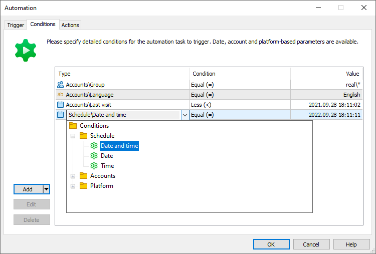
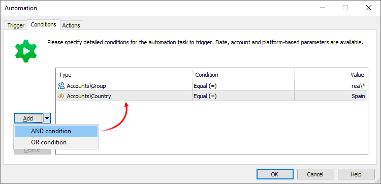
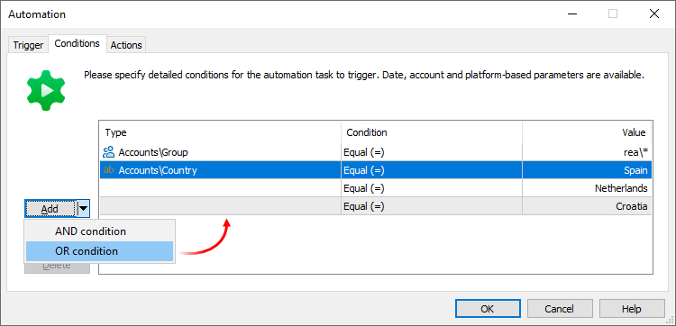

[🏠 Document Start](../../../README.md) / [MetaTrader 5 Trading Platform](../../../MetaTrader-5-Trading-Platform.md) / [Platform Setup](../../Platform-Setup.md) / [Automations](../Automations.md) / Conditions

[Previous](Triggers.md) | [Next](Actions.md)

# Trigger Conditions for Automation Tasks (#trigger-conditions-for-automation-tasks)

Having configured general task triggering parameters, describe more detailed event conditions. For example, if you have set a Login trigger, you can specify which group this account should belong to, as well as the registration city, language and many other additional parameters.

## Comparison Types (#comparison-types)

Standard comparison types are available for all conditions:

  * Equal (=)
  * Not equal (! =)
  * Greater than (>)
  * Greater than or equal (>=)
  * Less than (<)
  * Less than or equal (<=)

The "Match mask" condition is additionally available for string conditions, such as country name, symbol name or email address. Here you can specify strings with the "*" mask. For example:

  * Condition "Symbol", value "Forex\USD*" means all symbols from the Forex group where the base currency is USD.
  * Condition "Email", value "*@mailbox.com" means all email address with the mailbox.com domain.

For login specifying conditions, you can specify multiple values and value ranges. For example: Account\Login = 100,102,107,120-130.

  * Conditions are checked after [triggers](Triggers.md) fire.
  * If an event does not have a characteristic which is defined in a condition, such a condition will never hit. For example, a "Platform monitoring" event has occurred, and the conditions specify the balance requirements.

  
---  
  

## Condition types (#condition-type)

Conditions can be of two types: "AND" and "OR". The AND condition is mandatory, while the OR condition is optional.

For example, a rule specifies two "AND" conditions: country = Spain, group = real\*. In this case, the task will only trigger for real accounts from Spain.

Now let us add two additional "OR" conditions to the rule: country = Netherlands, country = Croatia. The task will trigger for real accounts from any of the three countries: Spain, the Netherlands or Croatia.

"OR" conditions can only be added in addition to the "AND" condition. In this case, the "Country" condition is mandatory, while it can have three possible values.

To add an "OR" condition, you must first add the mandatory "AND" condition. Then select it in the list and select the appropriate option in the drop-down menu of the Add button.

## Time (#time)

These parameters set date and time conditions. The automation task will be launched if the [event](Triggers.md) (trigger) fires on the specified date and time.

When using "more than" or "less than" [comparisons (#condition-type)](Conditions.md#condition-type), time is counted in seconds. For example, "< 00:01" means "less than 61 seconds", "> 08:15" means "more than 29700 seconds". Therefore, using a comparison with 00:00 (zero seconds) will be incorrect. If you want to set the condition to "before midnight", enter "< 23:59".

To specify time intervals within one day, use [AND (#condition-type)](Conditions.md#condition-type) conditions. For example, Time > 07:00 AND Time < 23:00. For time intervals that cross over midnight, use [OR (#condition-type)](Conditions.md#condition-type) conditions. For example, Time > 23:00 OR Time < 07:00. If you specify the "AND" condition here, it will never be met because the value will cannot simultaneously be greater than 23:00 and less than 07:00.

## Accounts (#accounts)

These settings specify conditions based on account parameters:

  * Login — the event (trigger) occurred for the specified account. For example, if the "Login" event is specified as the trigger, and the account 1000 is specified as the login, then the automation task will be executed every time this account connects to the platform. Connection of other accounts will not trigger the task.
  * Group, Country, City, Language, Phone, Email, Color, Status, Company, Comment — the event occurred for the account from the specified [group (#account)](../Accounts/Editing-Account.md#account), [country (#personal)](../Accounts/Editing-Account.md#personal), [city (#personal)](../Accounts/Editing-Account.md#personal) and so on. For example, if the "Login" event is specified as the trigger, and "real\*" is indicated as the group, then the automation task will be executed every time an account from any real group connects to the platform. If the "Login" event is specified as the trigger, and "Argentina" is indicated as the country, then the automation task will be executed every time an account from Argentina connects to the platform. The condition works similarly for other account parameters.
  * Previous group — the condition is only used with the "[Trade account group change (#account)](Triggers.md#account)" trigger. It enables filtering of events by the group from which the account was transferred.
  * Registration — the condition is set relative to the account creation date in the platform. Specify the date and the comparison type: equal to, less than or greater than. Accordingly, the condition will trigger for account registered on the specified date, earlier or later than this date. For example, if the "Deposit" event is specified as the trigger, and the condition is set to "Registration > 2020.09.01", then the automation task will be executed for all deposit operations on accounts registered after the specified day. By using Bonus as the [action](Actions.md), you can automate promotions to attract new customers.
  * Last visit — the condition is set relative to the last connection of the account to the platform. Specify the date and the comparison type: equal to, less than or greater than. Accordingly, the condition will trigger for account connected on the specified date, earlier or later than this date. For example, if the "Login" event is specified as the trigger, and the condition is set to "Last visit < 2019.01.01", then the automation task will be executed for connections form accounts for which the previous login date was before the specified day. By using "sending of an internal email" as an action, you can automatically inform returning clients about new services and conditions.
  * Days since registration — the condition is set relative to the number of days that have passed since the account was created. The number of days is calculated based on the number of times the clock crosses midnight (00:00) since the event. The principle of operation and purpose of this condition are similar to the "Registration" condition.
  * Days since last access — the condition is set relative to the number of days that have passed since the last connection to the account. The number of days is calculated based on the number of times the clock crosses midnight (00:00) since the event. The principle of operation and purpose of this condition are similar to the "Last visit" condition.
  * Days since last trade activity — the condition is set relative to the number of days that have passed since the last operation on the account. This considers any trading operations, commission charges, etc. Balance operations are not taken into account. In addition, the system checks if the account has any open positions or active pending orders. Using this condition, you can automatically archive inactive accounts in order to reduce the server load, or you can send promotional emails. Set the trigger to "Scheduled account database processing", conditions to "Days since last trade activity >= 90", "Balance > 0" and the action to "Send SMS". The system will check the entire database and will send SMS to inactive traders who have money on their accounts. When using this condition, please note that newly registered accounts may also fall under this condition. For example, a trader may have created an account 1-2 days ago and has not yet performed any trading operations. If you set a condition based on the absence of trading activity in last 180 days, this trader will also be included in the automation action. To avoid such situations, use the trading activity condition in conjunction with other conditions, such as "Registration" or "Days since registration".  
When calculating the number of days, the result is rounded down. For example, if 5 days and 23 hours have passed since the event, this will be counted as 5 days.

  * Days since last balance operation — the condition is set relative to the number of days that have passed since the last [balance deal (#action)](../Deals.md#action) on the account. Such deals include deposits/withdrawals, credit transactions, bonuses, adjustments, dividends, taxes, commissions, annual interest accrual and compensation. You can use this condition in addition to checking trading activity on the account, for example when automatically archiving accounts. If you archive accounts with zero balances, you can additionally check if the funds were withdrawn recently.  
When calculating the number of days, the result is rounded down. For example, if 5 days and 23 hours have passed since the event, this will be counted as 5 days.
  * Days since last credit operation — the condition is set relative to the number of days that have passed since the last [credit transaction (#action)](../Deals.md#action) on the account. Such transactions include credit transactions themselves, credit reset operations, as well as the accrual and withdrawal of bonuses.  
When calculating the number of days, the result is rounded down. For example, if 5 days and 23 hours have passed since the event, this will be counted as 5 days.

  * Online — the condition is set relative to the status of account connection to the trade server. Possible values are "true" and "false", i.e. the account is either connected (any connection type: client terminal, mobile terminal and so on) or not. When combined with the web request sending action, this condition enables the generation of your own reports and the analysis account activity in third-party systems. By using the "Login" and "Online" conditions, as well as the actions from the "Messages" section, you can set up manager notifications about the connection of certain clients.
  * Leverage — the condition is set relative to the [account leverage (#account)](../Accounts/Editing-Account.md#account). For example, the regulator's requirements have changed and you need to disable trading with the leverage greater than 1:20 on accounts from the US. Set the "Login" trigger and specify two conditions: "Country = USA", Leverage > 1:20. As an action, specify "Disable trade". Once an account with the specified leverage connects to the platform, trading for such an account will be [disabled (#trading)](../Accounts/Editing-Account.md#trading).
  * Balance — the condition is set relative to the current [account balance (#account-state)](../Accounts/Editing-Account.md#account-state); the amount is specified in the [deposit currency (#currency)](../Groups/Group-Settings.md#currency). By using this conditions, you can send automated emails to clients when the account balance drops below a certain threshold. For example, you can set the "Login" trigger, the "Balance < 100" and "Group = real\*" conditions, "Action = Send internal mail". The automation action will be performed every time a real account with a balance less than 100 (in deposit currency) connects to the platform.
  * Credit is similar to the "Balance" condition. In this case, the amount of [credit funds on the account (#account-state)](../Accounts/Editing-Account.md#account-state) is checked.
  * Positions total — the condition is set by the number of open [positions](../Positions.md) which currently exist on the account. This action allows you to control extremely active accounts. For example, you can set a trigger for "Scheduled event = once a day" and two conditions: "Total positions > 100", "Group = demo\*". Specify "Close positions" as the action. Using the above task, you can reduce server load associated with a high trading activity on demo accounts.
  * Orders total — similar to the "Total positions" condition, it checks the number of active pending orders on the account.
  * Floating profit, Equity, Margin, Free margin, Margin level — these conditions are similar to the "Balance" condition. Appropriate [trading account states (#account-state)](../Accounts/Editing-Account.md#account-state) are checked here. By using these conditions, you can implement your own system for notifying clients about issues with their account states. For example, you can set a trigger for "Scheduled event = once a day" and two conditions: "Margin level < 100", "Group = real\*". Specify "Send push message" as the action. Your real clients will receive automated notifications about low margin states directly on their [mobile devices](https://support.metaquotes.net/en/articles/436).
  * Deposit currency — the event occurred for an account with the specified [deposit currency (#currency)](../Groups/Group-Settings.md#currency). For example, if the "Login" event is specified as the trigger, and "EUR*" is indicated as the deposit currency, then the automation task will be executed every time an account from any group with the deposit currency Euro connects to the platform.
  * Lead Source, Lead Campaign — [lead source and lead campaign (#leadsource)](../Accounts/Editing-Account.md#leadsource) parameters specified in the account. These conditions can be used for the analysis of marketing campaigns. For example, when a new account with the specified parameters is opened, you can send the corresponding [event to Finteza (#finteza)](Actions.md#finteza) or to any other analytics system using the [Web request (#webrequest)](Actions.md#webrequest) action.
  * Enabled — the condition is specified relative to the "[Enable this account (#enable)](../Accounts/Editing-Account.md#enable)" setting. Use it along with the "[Scheduled account database processing (#account-processing)](Triggers.md#account-processing)" trigger to exclude disabled accounts from the selection so that the system does not waste time on such accounts.
  * Trading enabled, Algo trading by Expert Advisors enabled — the conditions are set relative to the corresponding [trading account settings (#limits)](../Accounts/Editing-Account.md#limits). Use them to fine-tune the delivery of marketing materials. For example, you can exclude the accounts with algo trading disabled from your algo trading mailing list.
  * Agent account — the condition is set relative to the [agent account (#agent-account)](../Accounts/Editing-Account.md#agent-account) specified in the trading account settings. Use it along with the "[Scheduled account database processing (#account-processing)](Triggers.md#account-processing)" trigger to send referral reports to agents.
  * Client ID — the unique identifier of the [client](../Clients.md) with whom the trading account is associated. A client can have several trading accounts. With this condition, you can work directly with the client rather than separate accounts. For example, you can send a notification to a client if they connect with any of their accounts.
  * Own funds percentage — when trading, clients are able to use their own funds they deposited on their accounts, as well as the credit and bonuses provided by a broker. Both types of funds increase their Equity parameter. The "Own funds percentage" condition allows configuring the automation task depending on the own funds share on a client's account. 100% means the account has client's funds only with no credit and bonuses. 0% means only credit and bonuses are used for trading. Using this data, you can conduct a recurring database check and withdraw bonuses from the accounts of clients who withdrew their own funds. Alternatively, you can encourage traders using solely their own funds by granting them bonuses.  
The parameter calculation equation: (1 - (Credit / Equity)) * 100.  
During the calculation, the fractional part of the value is rounded down: 1.5% becomes 1% and 0.9% becomes 0%. The parameter value cannot exceed 100% or be less than 0%. If an action is required after the client has spent all their funds, it is more efficient to use the "Own funds volume" condition.
  * Own funds volume — the parameter works similarly to the previous condition, although it applies an absolute own funds value rather than a relative one. Specified in the deposit currency. The calculation equation: Equity - Credit.

## Manager (#manager)

Set the conditions for the parameters of the manager account for which the event occurred:

  * Login — the event (trigger) occurred for the specified manager account. For example, if the "[Trade order modified (#managers)](Triggers.md#managers)" event is selected as the trigger an the account 1000 is specified as the login, then the automation task will trigger every time the specified manager modifies the parameters of any order. The actions of other managers will not activate the task.

## Platform (#platform)

These settings specify conditions based on the cluster performance:

  * Total CPU usage
  * Process CPU usage
  * Process threads
  * Total free memory, MB
  * Process memory, MB
  * Disk free space, MB
  * Disk read speed, MBps
  * Disk write speed, MBps
  * Disk queue
  * Connections
  * Blocked connections
  * Total sockets
  * Traffic in, Mbps
  * Traffic out, Mbps
  * Retransmits, %
  * Process handles

The above parameters and their impact on the platform operation are described in detail under the "[Monitoring](../Network-cluster/Monitor.md)" section.

Use these conditions to timely inform the administrator about a decrease in platform performance. For example, set the "Performance monitoring" trigger, specify the condition "Disk free space < 1000" and the action: "Send push message", "Send Email". Your administrator will be promptly notified about the need to buy an additional disk to ensure relevant data storage. "Scheduled event" can also be used as a trigger here. This allows sending periodic platform state reports to the administrator, for example such reports can be sent once a day.

Additionally, the "Platform" section provides general cluster parameters:

  * Server ID — the condition triggers when the server with the specified [ID (#identifier)](../Network-cluster/Configuring-Servers.md#identifier) connects to the cluster. For example, the Server ID is set to 3, and the trigger is set to "Server connect to Main server". The automation task will be executed every time when a server with the ID 3 connects to the Main server.
  * Server type — similar to the "Server ID" condition. Instead of a specific server, you indicate the server type: access, history server, etc.
  * Server connected — this condition enables periodic checks of connection states of all cluster components. Combine it with the "Server type" or "Server ID" conditions. This condition is always considered fulfilled for the main server.

If a cluster has several trading servers, automation tasks are performed on each of the servers independently of each other. For example, if you create a task based on the "[Server disconnection (#platform)](Triggers.md#platform)" trigger, then it will be executed in parallel on each trading server, monitoring connection to each of the servers.

The conditions described below allow you to identify the specific server on which the task is running. In some cases, they can help avoid unnecessary steps.

For example, you want to configure notifications when an access server is disconnected. In this case, you create the following task:

  * Trigger: "Server disconnection"
  * Conditions: "Server type = Access Server", "Server connected = false"
  * Action — "Send push message"

This task will cover most of your needs, but it can be further improved: disable sending of notifications during a regular reboot by the administrator. This can be especially useful if your access server[ operates with multiple trading servers (#servers)](../Network-cluster/Configuring-Servers/Access-Server.md#servers). For example, if you have 3 trading servers, then if the main server (and, accordingly, the entire cluster) is rebooted, you will receive three notifications at once. The task will trigger on each trading server and will report that the connection with the access server has been lost.

To solve this problem, add another condition to the automation task: "Current server state = None". It will ignore all servers where a reboot was started.

  * Current server ID — the identifier of the trade server on which the automation task was triggered.
  * Current server type — the type of trading server on which the automation task was triggered: main or additional.
  * Current server state — the state of the trade server on which the automation task was triggered. Available values: No — the server does not reboot; Restart — a regular reboot has been started, Shutdown — the server service is stopped, Live Update — the server service is stopped due to a platform update.
  * Current server connected — the state showing the connection between the trade server on which the automation task was triggered and the main server of the platform.

A separate group of conditions is intended for use with [triggers of gateway connection and disconnection (#platform)](Triggers.md#platform) from the trading platform. They enable the creation of tasks for specific components.

  * Gateway name — gateway configuration name.
  * Gateway ID — ID specified in the gateway configuration.
  * Gateway connected — the state of gateway connection to the platform at the trigger activation time. true — the gateway is connected, false — the gateway is not connected. Use this condition to determine which event happened: connect or disconnect. You can send the relevant notifications to the administrator depending on the event.

A separate group of conditions is intended for use with [triggers of data feed connection and disconnection (#platform)](Triggers.md#platform) from the trading platform. They enable the creation of tasks for specific components.

  * Data feed name — data feed configuration name.
  * Datafeed connected — the state of data feed connection to the platform at the trigger activation time. true — the data feed is connected, false — the data feed is not connected. Use this condition to determine which event happened: connect or disconnect. You can send the relevant notifications to the administrator depending on the event.

> Conditions from the "Platform" section can only be used with the "Scheduled event" trigger and with triggers from the "Platform" section.

## Connection (#connection)

Platform integration with geo-services enables access to IP address-based information about clients connecting to the platform, such as their geographical location, provider and various signs of suspicious activity. You can use this data to create automation tasks. For example, you can send notifications about suspicious connections to an external system for analysis.

The following conditions are available:

  * IP address — client's IP address.
  * Country — the country in which the IP address is located.
  * City — the city in which the IP address is located.
  * ASN — the Autonomous System Number (ASN) to which the IP address belongs.
  * ISP — the name of the internet service provider that owns the IP address.
  * Additional true/false flags:
    * Datacenter — the address belongs to a data center.
    * TOR — the address belongs to the [TOR](https://ru.wikipedia.org/wiki/Tor) network.
    * Proxy — the address is a proxy server.
    * VPN — the address is a VPN server.
    * Attacker — the address was involved in various attacks, such as spam, password brute-forcing, DDoS, etc.
    * Botnet — the address belongs to a botnet.

The conditions are only used with [connection triggers (#connection)](Triggers.md#connection).

## Payments (#payments)

These settings specify conditions based on the parameters of the [internal payment transaction](../Payments/Controlling.md), conducted on the account. Used only with the triggers from the [Payments (#payments)](Triggers.md#payments) section.

  * Action — the type of transaction: deposit or withdrawal.
  * Amount — the transaction amount requested by the client. Specified in the deposit currency.
  * Currency — the transaction currency.
  * Commission — the commission charged by the broker in accordance with the [settings (#commissions)](../Payments/Payment-Gateways.md#commissions).
  * Wallet Amount — the amount of the transaction on the side of the payment provider. It is specified in the currency selected by the user on the client terminal side when making the operation.
  * Wallet Currency — the currency of the transaction on the payment provider's side.
  * Wallet Commission — the payment provider's fee for the transaction.
  * Description — additional information about the transaction. Can be filled in by payment systems or manually by managers.
  * Manager — the login and name of the manager who [processed the transaction](../Payments/Processing.md). It is filled only for manually processed transactions.
  * Type — the payment method type: card, bank transfer, etc.
  * Provider type — the type of the payment provider (gateway).
  * Provider name — the name of the payment provider configuration under which the payment was made.
  * Client IP — the IP address from which the payment was requested.
  * Client type — the type of client terminal from which the payment was requested: desktop, mobile, or web.
  * Deal ticket — the ticket of the balance operation through which funds are credited to or debited from the trading account.
  * External ID — the transaction identifier on the payment provider's side.
  * External error code — the error code that occurred on the provider's side.
  * External error description — a description of the error that occurred on the provider's side.
  * Error code — the error code that occurred on the platform side.
  * Error description — a description of the error that occurred on the platform side.

## Finance (#finance)

These settings specify conditions based on the parameters of financial transactions on the account:

  * Amount — the amount of transactions. By using this conditions, you can send an automated email to a manager if a too large deposit transaction is detected, requesting from the manager additional payment verification. For example, you can set trigger to "Deposit" and the following conditions "Amount > 100,000" and "Currency = USD".
  * Currency — the currency in which the transaction was performed. Combine this parameter with the previous one.
  * Comment — a comment to a transaction. With this parameter, you can take into account additional conditions when processing financial transactions on the account. For example, when depositing funds to a VIP client's account, you can add an appropriate comment to the transaction, and then use it in the Automations service to send appropriate notifications to the client's personal manager.

  * Action — [deal type (#action)](../Deals.md#action): Buy, Sell, balance or credit operation, etc. Using this parameter, you can control in detail the operations occurring on user accounts. For example, you can monitor [negative balance compensations (#compensate)](../Groups/Group-Settings.md#compensate) to quickly identify unscrupulous users. For this, select the trigger [Finance \ Operation (#finance)](Triggers.md#finance) and add the following condition: "Action = SO Compensation". Additionally, you can use the "Amount" condition to specify the amount of compensation to be reported, for example, higher than USD 100. For the action, select [sending notifications (#messages)](Triggers.md#messages) to the manager.

  * Manager — the login of the manager who performed the financial transaction. With this condition, you can control account deposits and withdrawals performed by your employees. For example, you can create a task with the trigger "[Finance \ Operation (#finance)](Triggers.md#finance)" and the conditions "Finance \ Manager = 1000" and "Amount > 1000". For the action, you can enable the sending of a push notification to a senior manager. To add the manager's login, indicate the [#FINANCE_MANAGER# macro (#finance)](Macros.md#finance) in the message.

## Prices (#prices)

Prices set conditions by the parameters of arriving quotes:

  * Symbol — the name of the trading instrument for which the event triggered. For example, the trigger is set to "[Price gap started (#gap)](Triggers.md#gap)". If the condition is set to "Symbol = EURUSD", the action will only be performed if the gap starts for the specified currency pair. The same behavior is applied to triggers related to quoting stream delays and its restoration.
  * Last tick time — time of the last received quote of the symbol for which a trigger from the "[Prices (#price)](Triggers.md#price)" section was activated. The condition can be used to disable the quotes delay trigger for archived symbols which are no longer used for trading.

## Position (#position)

This groups sets conditions by [position parameters](../Positions.md). The conditions are used by triggers from the [Positions (#position)](Triggers.md#position) section and the "[Scheduled order database processing (#trade-processing)](Triggers.md#trade-processing)" trigger.

  * Login — [account](../Accounts.md) number the position was opened on.
  * Ticket — unique position ticket.
  * Symbol — [symbol](../Symbols.md), for which the position was opened.
  * Volume — position volume in lots.
  * Type — position type: buy or sell.
  * Open price — weight-average price of the position opening: (price of deal 1 * volume of deal 1 + ... + price of deal N * volume of deal N) / (volume of deal 1 + ... + volume of deal N).
  * Current price — the price of the financial symbol for which the position has been opened, at the trigger activation time.
  * Profit — profit of a position at the trigger activation time.
  * Reason — [reason (#reason)](../Positions.md#reason) for position opening.
  * Creation time — position opening time.
  * Time since creation — the amount of time that have passed since the position was opened. 1 day corresponds to 24 hours, not the passing of a calendar day. For example, a position is opened at 21:00 on 01.04.2025 and the condition is set as "Time since creation > 1 day", while the automation task runs daily at 19:00. In this case, the condition will be triggered at 19:00 on 03.04.2025.
  * Update time — time when the position was last modified (when its volume was changed).
  * Time since modification — the amount of time that have passed since the last position modification (a change in its volume).

  * Dealer — the login of the dealer who confirmed or placed the order (deal) which caused the position to open. Use this condition to track dealers' trading activities. For example, you can create a task with the trigger "[Position opened (#position)](Triggers.md#position)" and the conditions "Position \ Reason = Dealer" and "Position \ Dealer = 100". For the action, you can use sending of a push notification to a senior manager. To add the dealer login, indicate the [macro #DEAL_DEALER# (#deal)](Macros.md#deal) in the notification text.

  * Expert ID — identifier (magic number) of an Expert Advisor by which a position was opened in the client terminal.
  * Comment — a text comment to the position.

## Deal (#deal)

These settings specify conditions by [deal parameters](../Deals.md). The conditions are used by triggers from the [Positions (#position)](Triggers.md#position) section.

  * Login — the number of the [account](../Accounts.md), on which the deal was executed.
  * Ticket — unique deal identifier.
  * Symbol — [financial instrument](../Symbols.md) for which the deal was executed.
  * Volume — deal volume in lots.
  * Type — [deal type (#action)](../Deals.md#action): Sell, Buy, Balance etc.
  * Direction — direction of a deal relative to the current [position](../Positions.md): entry ("in"), exit ("out"), reversal ("in/out") or close by ("out by").
  * Price — deal price.
  * Profit — profit gained from the deal.
  * Reason — [reason (#reason)](../Deals.md#reason) for deal execution.
  * Time — deal execution time.

  * Dealer — the login of the dealer who confirmed or placed the order, which caused the deal to execute. Use this condition to track dealers' trading activities. For example, you can create a task with the trigger "[Position closed (#position)](Triggers.md#position)" and the conditions "Deal \ Reason = Dealer" and "Position \ Dealer = 100". For the action, you can use sending of a push notification to a senior manager. To add the dealer login, indicate the [macro #DEAL_DEALER# (#deal)](Macros.md#deal) in the notification text.

  * Expert — identifier (magic number) of an Expert Advisor by which the deal was executed in the client terminal.
  * Comment — a text comment to the deal.

## Orders (#order)

This group sets conditions by [order parameters](../Orders.md). The conditions are used by triggers from the [Positions (#position)](Triggers.md#position) section and by the "[Scheduled account database processing (#trade-processing)](Triggers.md#trade-processing)" trigger.

  * Login — the number of the [account](../Accounts.md) on which the order was placed.
  * Ticket — the unique order ticket.
  * Order ID — order identifier in the external system.
  * Symbol — the [financial instrument](../Symbols.md) for which the order was placed.
  * Setup time — time of order placing by a client.
  * Days since setup — the number of days that have elapsed since the client placed the order. The calculated number of days is rounded down. For example, if the order was placed 3 days and 22 hours ago, this will be counted as 3 days.
  * Expiration time — order expiration date, if it was set by the client.
  * Type — order type: "Buy", "Sell", "Buy Limit", "Sell Limit", "Buy Stop", "Sell Stop", "Buy Stop Limit", "Sell Stop Limit" or "Close By".
  * Order price — price specified by trader for execution of the order.
  * Trigger price — this field is used for the "Buy Stop Limit" and "Sell Stop Limit" orders. It sets the price level at which the orders trigger and the relevant limit orders are placed.
  * Stop Loss — the Stop Loss level.
  * Take Profit — the Take Profit level.
  * Initial volume — volume requested in the order.
  * Remained volume — if the order is not filled in the volume requested by trader this field will display the remainder volume.
  * State — current state of the order. The end states of orders (rejected, filled, etc.) are not supported since automation only works with a database of open/active orders.

  * Dealer — login of the dealer who confirmed or placed the order.

  * Expert ID — identifier (magic number) of an Expert Advisor which placed the order in the client terminal.
  * Position — ticket of the position opened, modified or closed due to this order.
  * Comment — a text comment to the order.
  * Contract size — the contract size of the symbol, for which an order was placed.
  * Currency — the deposit currency of the client who has placed the order.

## Messages (#messages)

These settings specify conditions by email parameters. These conditions are used with triggers from the [Messages (#messages)](Triggers.md#messages) section.

  * Sender login — the account number of the user who sent the email.
  * Sender name — the name of the user who sent the email.
  * Recipient login — the account number of the email recipient.
  * Recipient name — the name of the email recipient.
  * Subject — email subject.

  * Body — email body including the HTML markup or the contents of the message sent via the SMS provider or instant messenger.
  * Address — recipient's email address or phone number.
  * Provider name — the configuration name of the [SMS provider](../Integrations/SMS-Gateways.md), [messenger](../Integrations/Messengers.md) or [mail server](../Integrations/Mail-Servers.md) via which the message was sent.
  * Provider balance — remaining balance with your [SMS provider (#statistics)](../Integrations/SMS-Gateways.md#statistics). By using this property, you can prevent message sending issues by promptly sending notifications to administrators prompting them to top up the balance.

## KYC (#kyc)

These settings specify conditions by KYC check parameters. Used with triggers from the [KYC (#kyc)](Triggers.md#kyc) section.

  * 'Status description' is the client verification result, such as approved, rejected, etc.
  * 'Rejection reason' is the description of the reason why KYC providers rejected the client data, such as inappropriate document files, duplicates, or other reasons.

Possible statuses and rejection reasons are provided in the [table (#kyc)](Macros.md#kyc).
