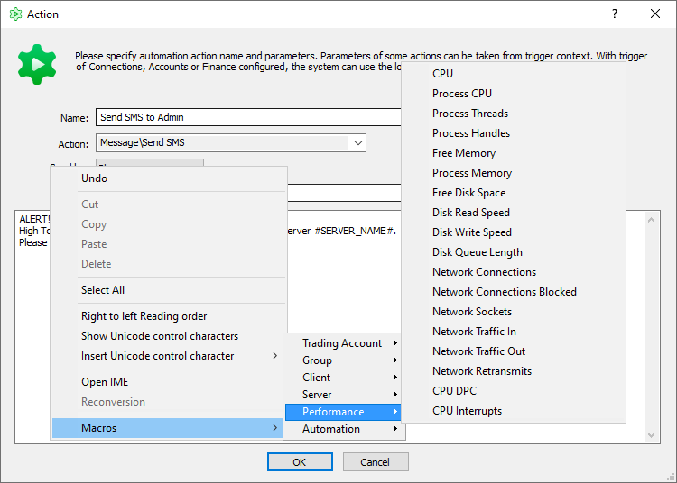

[🏠 Document Start](../../../README.md) / [MetaTrader 5 Trading Platform](../../../MetaTrader-5-Trading-Platform.md) / [Platform Setup](../../Platform-Setup.md) / [Automations](../Automations.md) / Macros

[Previous](Actions.md) | [Next](Statistics.md)

# Macros (#macros)

Automation actions for [sending various messages (#message)](Actions.md#message) (SMS, Push, emails) and [web requests (#external)](Actions.md#external) support macros. They allow substituting different data depending on a recipient (account) and a triggered event. For inserting, set the macro name between #..# or use the context menu.

All available macros are divided into several categories depending on what information they provide in the text.

## Trading Account (#account)

These macros substitute message recipient's [account data](../Accounts/Editing-Account.md).

  * Login (#LOGIN#) — email/message receipient's account number.
  * Full Name (#USERNAME#) — recipient's first and last name.
  * First Name (#USER_FIRST_NAME#) — recipient's first name.
  * Last Name (#USER_LAST_NAME#) — recipient's last name.
  * Middle Name (#USER_MIDDLE_NAME#) — recipient's middle name.
  * Currency (#USER_CURRENCY#) — recipient's deposit currency. It is defined by the user's [group (#currency)](../Groups/Group-Settings.md#currency).
  * Company (#USER_COMPANY#) — name of a company a user belongs to. It is defined by the user's [group (#company)](../Groups/Group-Settings.md#company).
  * Creation Date (#USER_CREATION_DATE#) — account creation date.
  * Registration date (#USER_REGISTRATION_ELAPSED#) — the number of days that have elapsed since account creation.
  * Last Access Time (#USER_LASTTIME#) — last account access time.
  * Days since last login (#USER_LASTTIME_ELAPSED#) — the number of days that have elapsed since the last connection to the account.
  * Online status (#USER_ONLINE_STATUS#) — the status of account connection to the trade server: Online or Offline.
  * Language (#USER_LANGUAGE#) — user's language.
  * Status (#USER_STATUS#) — user status (resident/non-resident).
  * ID Number (#USER_ID#) — user's document ID.
  * Email (#USER_EMAIL#) — user's email.
  * Group (#USER_GROUP#) — user's group.
  * Previous (#USER_GROUP_PREVIOUS#) — the macro is only used with the "[Trade account group change (#account)](Triggers.md#account)". Use it to get the group from which the account was transfered.
  * Phone (#USER_PHONE#) — user's phone number.
  * Country (#USER_COUNTRY#) — user's country.
  * City (#USER_CITY#) — user's city.
  * State (#USER_STATE#) — user's region.
  * Zip Code (#USER_ZIP_CODE#) — user's zip code.
  * Address (#USER_ADDRESS#) — user address.
  * Comment (#USER_COMMENT#) — comment to a user account.
  * Bank Account (#USER_BANK_ACCOUNT#) — bank account number specified in the account.
  * Agent (#USER_AGENT_ACCOUNT#) — agent account number specified in the account.
  * Balance (#USER_BALANCE#) — recipient's balance.
  * Credit (#USER_CREDIT#) — credit funds on the recipient's account.
  * Equity (#USER_EQUITY#) — account equity.
  * Leverage (#USER_LEVERAGE#) — account leverage.
  * Margin (#USER_MARGIN#) — amount of funds reserved on the account as margin.
  * Free Margin (#USER_MARGIN_FREE#) — amount of free margin.
  * Margin Level (#USER_MARGIN_LEVEL#) — margin level.
  * Position Total (#USER_POSITIONS_TOTAL#) — number of open positions on the account when sending a message.
  * Orders Total (#USER_ORDERS_TOTAL#) — current number of active pending orders on the account when sending a message.
  * Profit (#USER_PROFIT#) — floating profit on the account when sending a message.
  * Lead Source (#USER_LEAD_SOURCE#) — lead source specified in the account.
  * Lead Campaign (#USER_LEAD_CAMPAIGN#) — marketing campaign which led to opening the account.
  * Color (#USER_COLOR#) — the color by which the client's requests to execute trading operations will be displayed in the Manager terminal.
  * Full JSON (#USER_JSON#) — complete data on user account in JSON format.
  * Own funds percentage (#USER_OWN_FUNDS_PERCENT#) — client's funds share consisting of money the client deposited to their account. The calculation equation: (1 - (Credit / Equity)) * 100. Find out more in the [Conditions (#own-funds)](Conditions.md#own-funds) section.
  * Own funds volume (#USER_OWN_FUNDS_VOLUME#) — client's funds volume consisting of money the client deposited to their account. The calculation equation: Equity - Credit.
  * IP address (#USER_IP_ADDRESS#) — address connection to the trade server was established from. Use the macro with triggers from the [Connections (#connection)](Triggers.md#connection) section.
  * Client ID (#CLIENT_ID#) — the unique identifier of the [client](../Clients.md) with whom the trading account is associated.

## Manager (#manager)

These macros are used in a text to substitute the [data of a manager account](../Managers.md) with which the event is associated. Used only with triggers from the [Managers (#managers)](Triggers.md#managers) section.

  * Login (#MANAGER_LOGIN#) — the account of the manager who performed the action.

## Group (#group)

These macros substitute target account [group data](../Groups/Group-Settings.md).

  * Name (#GROUP_NAME#) — group name.
  * Currency (#GROUP_CURRENCY#) — group deposit currency.
  * Company (#GROUP_COMPANY#) — [name of a company (#company)](../Groups/Group-Settings.md#company) a group belongs to.
  * Email (#GROUP_EMAIL#) — company email.
  * Support Email (#GROUP_EMAIL_SUPPORT#) — company technical support team email.
  * Site (#GROUP_SITE#) — company website.
  * Support Site (#GROUP_SITE_SUPPORT#) — company support website.
  * Margin Call (#GROUP_MARGIN_CALL#) — [margin call level (#margin)](../Groups/Group-Settings.md#margin) set for the group.
  * Stop Out (#GROUP_STOP_OUT#) — stop out level set for the group.
  * Full JSON (#GROUP_JSON#) — full group description in JSON format.

## Client (#client)

These macros substitute recipient's [client data](../Clients.md).

  * Title (#CLIENT_TITLE#) — title: Mr. or Mrs.
  * First Name (#CLIENT_FIRST_NAME#) — client's first name.
  * Last Name (#CLIENT_LAST_NAME#) — client's last name.
  * Middle Name (#CLIENT_MIDDLE_NAME#) — client's middle name.
  * Gender (#CLIENT_GENDER#) — client's gender.
  * Birthday (#CLIENT_BIRTDAY#) — client's birthday.
  * Language (#CLIENT_LANGUAGE#) — client's language.
  * Email (#CLIENT_EMAIL#) — client's email.
  * Phone (#CLIENT_PHONE#) — client's phone number.
  * Messengers (#CLIENT_MESSENGERS#) — client's messenger list.
  * External ID (#CLIENT_EXTERNAL_ID#) — client ID in an external system.
  * Country (#CLIENT_COUNTRY#) — client's country.
  * State (#CLIENT_STATE#) — client's region.
  * City (#CLIENT_CITY#) — client's city.
  * Zip Code (#CLIENT_ZIP_CODE#) — client's zip code.
  * Address (#CLIENT_ADDRESS#) — client's address.
  * Nationality (#CLIENT_NATIONALITY#) — client's citizenship.
  * Tax ID (#CLIENT_TAX_ID#) — client's tax ID.
  * Type (#CLIENT_TYPE#) — client type.
  * Status (#CLIENT_STATUS#) — client status.
  * Manager (#CLIENT_MANAGER#) — responsible [manager](../Managers.md) login.
  * Lead Source (#CLIENT_LEAD_SOURCE#) — lead source specified in client record.
  * Lead Campaign (#CLIENT_LEAD_CAMPAIGN#) — marketing campaign which led to creating the client.
  * Introducer (#CLIENT_INTRODUCER#) — login (trading account) of the user, who introduced the client.
  * Full JSON (#CLIENT_JSON#) — full client description in JSON format.

## Position (#position)

These macros substitute in a text [data of positions](../Positions.md), a change in which caused the automation task trigger (triggers from the "[Positions (#position)](Triggers.md#position)" section). 

  * Login (#POSITION_LOGIN#) — the number of the [account](../Accounts.md) the position as opened on.
  * Ticket (#POSITION_TICKET#) — unique position identifier.
  * Symbol (#POSITION_SYMBOL#) — [symbol](../Symbols.md) the position was opened for.
  * Volume (#POSITION_VOLUME#) — position volume in lots.
  * Type (#POSITION_TYPE#) — position type: buy or sell.
  * Open price (#POSITION_PRICE_OPEN#) — weight-average price of the position opening: (price of deal 1 * volume of deal 1 + ... + price of deal N * volume of deal N) / (volume of deal 1 + ... + volume of deal N).
  * Current price (#POSITION_PRICE_CURRENT#) — current price of the financial symbol for which the position has been opened, at the trigger activation time.
  * Profit (#POSITION_PROFIT#) — profit of a position at the trigger activation time.
  * Reason (#POSITION_REASON#) — [reason (#reason)](../Positions.md#reason) for opening the position.
  * Creation time (#POSITION_TIME_CREATE#) — position opening time.
  * Update time (#POSITION_TIME_UPDATE#) — time when the position was last modified (when its volume was changed).

  * Dealer (#POSITION_DEALER#) — the login of the dealer who confirmed or placed the order (deal), which caused the position to open.

  * Expert (#POSITION_EXPERT#) — identifier (magic number) of an Expert Advisor by which a position was opened in the client terminal.
  * Comment (#POSITION_COMMENT#) — a text comment to a position.

  * Storage (#POSITION_STORAGE#) — swap charges.
  * Stop Loss (#POSITION_PRICE_SL#) — position Stop Loss level
  * Take Profit (#POSITION_PRICE_TP#) — position Take Profit level.
  * Profit rate (#POSITION_RATE_PROFIT#) — profit currency to deposit currency conversion rate.
  * Margin rate (#POSITION_RATE_MARGIN#) — margin currency to deposit currency conversion rate.

  * Full JSON (#POSITION_JSON#) — full description of the position in JSON format.

## Deal (#deal)

These macros substitute in a text [data of a deal](../Deals.md), an execution of which caused the automation task trigger (triggers from the "[Positions (#position)](Triggers.md#position)" section). 

  * Login (#DEAL_LOGIN#) — the number of the [account](../Accounts.md), on which the deal was executed.
  * Ticket (#DEAL_TICKET#) — unique deal identifier.
  * Symbol (#DEAL_SYMBOL#) — [financial instrument](../Symbols.md) for which the deal was executed.
  * Volume (#DEAL_VOLUME#) — deal volume in lots.
  * Type (#DEAL_TYPE#) — [deal type (#action)](../Deals.md#action): Sell, Buy, Balance etc.
  * Direction (#DEAL_ENTRY#) — direction of a deal relative to the current [position](../Positions.md): entry ("in"), exit ("out"), reversal ("in/out") or close by ("out by").
  * Price (#DEAL_PRICE#) — deal execution price.
  * Profit (#DEAL_PROFIT#) — the profit received from the deal.
  * Reason (#DEAL_REASON#) — [reason (#reason)](../Deals.md#reason) for deal execution.
  * Time (#DEAL_TIME#) — deal execution time.

  * Dealer (#DEAL_DEALER#) — the login of the dealer who confirmed or placed the order, which caused the deal to execute.

  * Expert (#DEAL_EXPERT#) — identifier (magic number) of an Expert Advisor by which the deal was executed in the client terminal.
  * Comment (#DEAL_COMMENT#) — a text comment to a deal.

  * Commission (#DEAL_COMMISSION#) — commission charged for deal execution.
  * Fee (#DEAL_FEE#) — [Fee (#type)](../Groups/Commission-Settings.md#type) commission type.
  * Storage (#DEAL_STORAGE#) — swap charges.
  * Closed volume (#DEAL_VOLUME_CLOSED#) — position volume closed by this deal.
  * Stop Loss (#DEAL_PRICE_SL#) — deal Stop Loss level.
  * Take Profit (#DEAL_PRICE_TP#) — deal Take Profit level.
  * Raw profit #DEAL_PROFIT_RAW# — profit/loss obtained from the execution of the deal, in the instrument's profit currency.
  * Profit rate (#DEAL_RATE_PROFIT#) — profit currency to deposit currency conversion rate.
  * Margin rate (#DEAL_RATE_MARGIN#) — margin currency to deposit currency conversion rate.
  * Market Bid (#DEAL_PRICE_MARKET_BID#) — market Bid price as at the time the deal is executed by the server.
  * Market Ask (#DEAL_PRICE_MARKET_ASK#) — market Ask price as at the time the deal is executed by the server.
  * Market Last (#DEAL_PRICE_MARKET_LAST#) — market Last price as at the time the deal is executed by the server.

  * Full JSON (#DEAL_JSON#) — full description of the deal in JSON format.

## Orders (#order)

These macros are substitute [parameters of the order](../Orders.md), with which the automation task triggering is associated ("[Scheduled account database processing (#trade-processing)](Triggers.md#trade-processing)").

  * Ticket (#ORDER_TICKET#) — the unique order number.
  * External order ID (#ORDER_ORDER_ID#) — order identifier in an external trading system.
  * Login (#ORDER_LOGIN#) — the number of the [account](../Accounts.md) on which the order was placed.
  * Symbol (#ORDER_SYMBOL#) — the [financial instrument](../Symbols.md) for which the order was placed.
  * Setup time (#ORDER_TIME_SETUP#) — time of order placing by a client.
  * Days since setup (#ORDER_TIME_SETUP_ELAPSED#) — the number of days that have elapsed since the client placed the order.

  * Done time (#ORDER_TIME_DONE#) — order execution time.

  * Expiration time (#ORDER_TIME_EXPIRATION#) — order expiration date, if it was set by the client.
  * Type (#ORDER_TYPE#) — order type: "Buy", "Sell", "Buy Limit", "Sell Limit", "Buy Stop", "Sell Stop", "Buy Stop Limit", "Sell Stop Limit" or "Close By".
  * Order price (#ORDER_PRICE_ORDER#) — price specified by trader for execution of the order.
  * Trigger price (#ORDER_PRICE_TRIGGER#) — this field is used for the "Buy Stop Limit" and "Sell Stop Limit" orders. It sets the price level at which the orders trigger and the relevant limit orders are placed.
  * Stop Loss (#ORDER_PRICE_SL#) — the Stop Loss level.
  * Take Profit (#ORDER_PRICE_TP#) — the Take Profit level.
  * Initial volume (#ORDER_VOLUME_INITIAL#) — volume requested in the order.
  * Remained volume (#ORDER_VOLUME_CURRENT#)— if the order is not filled in the volume requested by trader this field will display the remainder volume.
  * State (#ORDER_STATE#) — current state of the order (filled, rejected, partially filled, expired, etc.).

  * Dealer (#ORDER_DEALER#) — login of the dealer who confirmed or placed the order.

  * Expert ID (#ORDER_EXPERT#) — identifier (magic number) of an Expert Advisor which placed the order in the client terminal.
  * Position (#ORDER_POSITION_ID#) — ticket of the position opened, modified or closed due to this order.
  * Comment (#ORDER_COMMENT#) — a text comment to the order.
  * Contract size (#ORDER_CONTRACT_SIZE#) — the contract size of the symbol, for which an order was placed.
  * Currency (#ORDER_CURRENCY#) — the deposit currency of the client who has placed the order.

  * Margin rate (#ORDER_RATE_MARGIN#) — margin currency to deposit currency conversion rate.

  * Full JSON (#ORDER_JSON#) — full description of the order in JSON format.

## Payments (#payments)

These macros substitute data about an [internal payment transaction](../Payments/Controlling.md) performed on the account: Used only with the triggers from the [Payments (#payments)](Triggers.md#payments) section.

  * Action (#PAYMENT_ACTION#) — the type of transaction: deposit or withdrawal.
  * Amount (#PAYMENT_AMOUNT#) — the transaction amount requested by the client. Specified in the deposit currency.
  * Currency (#PAYMENT_CURRENCY#) — the transaction currency.
  * Commission (#PAYMENT_COMMISSION#) — the commission charged by the broker in accordance with the [settings (#commissions)](../Payments/Payment-Gateways.md#commissions).
  * Wallet Amount (#PAYMENT_WALLET_AMOUNT#) — the amount of the transaction on the side of the payment provider. It is specified in the currency selected by the user on the client terminal side when making the operation.
  * Wallet Currency (#PAYMENT_WALLET_CURRENCY#) — the currency of the transaction on the payment provider's side.
  * Wallet Commission (#PAYMENT_WALLET_COMMISSION#) — the payment provider's fee for the transaction.
  * Description (#PAYMENT_DESCRIPTION#) — additional information about the transaction. Can be filled in by payment systems or manually by managers.
  * Manager (#PAYMENT_MANAGER#) — the login and name of the manager who [processed the transaction](../Payments/Processing.md). It is filled only for manually processed transactions.
  * Type (#PAYMENT_TYPE#) — the payment method type: card, bank transfer, etc.
  * Provider type (#PAYMENT_PROVIDER_TYPE#) — the type of the payment provider (gateway).
  * Provider name (#PAYMENT_PROVIDER_NAME#) — the name of the payment provider configuration under which the payment was made.
  * Client IP (#PAYMENT_CLIENT_IP#) — the IP address from which the payment was requested.
  * Client IP (#PAYMENT_CLIENT_TYPE#) — the IP address from which the payment was requested.
  * Deal ticket (#PAYMENT_CLIENT_DEAL#) — the ticket of the balance operation through which funds are credited to or debited from the trading account.
  * External ID (#PAYMENT_EXTERNAL_ID#) — the transaction identifier on the payment provider's side.
  * External error code (#PAYMENT_EXTERNAL_ERROR_CODE#) — the error code that occurred on the provider's side.
  * External error description (#PAYMENT_EXTERNAL_ERROR_DESC#) — a description of the error that occurred on the provider's side.
  * Error code (#PAYMENT_ERROR_CODE#) — the error code that occurred on the platform side.
  * Error description (#PAYMENT_ERROR_DESC#) — a description of the error that occurred on the platform side.

## Finance (#finance)

These macros substitute data about a [balance operation (#action)](../Deals.md#action) executed on the account:

  * Amount (#FINANCE_AMOUNT#) — operation amount.
  * Currency (#FINANCE_CURRENCY#) — the currency in which the operation was performed.
  * Comment (#FINANCE_COMMENT#) — a text comment to a balance transaction.

  * Manager (#FINANCE_MANAGER#) — the login of the manager who performed the financial transaction.

  * Action (#FINANCE_ACTION#) — deal type: Buy, Sell, balance or credit operation, etc.

## Server (#server)

These macros substitute target account [server data](../Network-cluster/Configuring-Servers.md).

  * ID (#SERVER_ID#) — server ID
  * Type (#SERVER_TYPE#) — server type as a string. For example, "Main Trade Server".
  * Name (#SERVER_NAME#) — server name specified in the configuration.
  * Public name (#SERVER_PUBLIC_NAME#) — public name of the broker's server (platform) which is displayed in client terminals.
  * Connection state (#SERVER_CONNECTED#) — the state of server connection to the main trade server at the time the trigger is activated. If the server is connected, the value is 'true'; otherwise it is 'false'.

  * Current server ID (#SERVER_CURRENT_ID#) — the identifier of the trade server on which the automation task was triggered. For further details please read the "[Conditions (#current-server)](Conditions.md#current-server)" section.
  * Current server type (#SERVER_CURRENT_TYPE#) — the type of trading server on which the automation task was triggered: main or additional.
  * Current server state (#SERVER_CURRENT_CONNECTED#) — the state of the trade server on which the automation task was triggered. Available values: Not set — the server does not reboot; Restart — a regular reboot has been started, Stop — the server service is stopped, LiveUpdate — the server service is stopped due to a platform update.
  * Current server connected (#SERVER_CURRENT_STATE#) — the state showing the connection between the trade server on which the automation task was triggered and the main server of the platform.

## Gateway (#gateway)

These macros substitute [data of a gateway](../Gateways.md), which the automation task is related with ([Gateway connection/disconnection (#platform)](Triggers.md#platform) triggers).

  * Gateway name (#GATEWAY_NAME#) — the name of the gateway configuration.
  * Gateway ID (#GATEWAY_ID#) — the identifier specified in the gateway configuration.
  * Connection status (#GATEWAY_CONNECTED#) — the state of gateway connection to the platform at the trigger activation time. If the gateway is connected, 'true' is added; otherwise, false.

## Data feed (#datafeed)

These macros substitute [data of a data feed](../Data-Feeds.md), which the automation task is related with ([Data feed connection/disconnection (#platform)](Triggers.md#platform) triggers).

  * Data feed name (#DATAFEED_NAME#) — the name of the data feed configuration.
  * Connection status (#DATAFEED_CONNECTED#) — the state of data feed connection to the platform at the trigger activation time. If the data feed is connected, 'true' is added; otherwise, false.

## Prices (#prices)

These macros substitute data of the symbol to which the automation task trigger is related ("[Prices (#price)](Triggers.md#price)" triggers).

  * Symbol (#PRICES_SYMBOL#) — the name of the financial instrument for which the event triggered.
  * Last tick time (#PRICES_LASTTIME#) — time of the last received quote of the symbol for which a trigger was activated.

## Performance (#performance)

These macros substitute [server monitoring data](../Network-cluster/Monitor.md) at the moment of trigger activation.

  * Total CPU (#MONITOR_CPU#) — total CPU load.
  * Process CPU (#MONITOR_CPU_PROCESS#) — CPU usage by the server process.
  * Process Threads (#MONITOR_CPU_PROCESS_THREADS#) — number of threads used by the server process.
  * Process Handles (#MONITOR_HANDLES_PROCESS#) — number of descriptors (handles) used by the server process.
  * Free Memory (#MONITOR_MEMORY_FREE#) — free RAM.
  * Process Memory (#MONITOR_MEMORY_PROCESS#) — amount of RAM allocated by the server process.
  * Free Disk Space (#MONITOR_DISK_FREE#) — amount of free disk space.
  * Disk Read Speed (#MONITOR_DISK_SPEED_READ#) — speed ​​of data reading in MB/s.
  * Disk Write Speed (#MONITOR_DISK_SPEED_WRITE#) — speed ​​of data writing in MB/s.
  * Disk Queue Length (#MONITOR_DISK_QUEUE_LENGTH#) — disk queue length.
  * Network Connections (#MONITOR_NETWORK_CONNECTIONS#) — total amount of all standard operating terminal connections and temporary connections made for executing trades, downloading history or news.
  * Network Connections Blocked (#MONITOR_NETWORK_BLOCKED#) — number of connections blocked by the antiflood control or by the built-in firewall.
  * Network Sockets (#MONITOR_NETWORK_SOCKETS#) — number of active sockets.
  * Network Traffic In (#MONITOR_NETWORK_TRAFFIC_IN#) — incoming traffic in Mbit/s.
  * Network Traffic Out (#MONITOR_NETWORK_TRAFFIC_OUT#) — outgoing traffic in Mbit/s.
  * Network Retransmits (#MONITOR_NETWORK_RETRANSMIT#) — number of retransmitted packets.
  * Total CPU DPC (#MONITOR_CPU_DPC#) — CPU load when handling deferred procedure calls.
  * Total CPU Interrupts (#MONITOR_CPU_INTERRUPTS#) — CPU load when handling interruptions from devices.

## External (#external)

These macros are used for triggers that run automation tasks upon requests received from [external systems (#external)](Triggers.md#external).

  * Web callback URL (#WEBCALLBACK_URL#) — URL of the [callback request (#webcallback)](Triggers.md#webcallback) which has run the automation task.

## Message (#messages)

These macros substitute data of the internal email which the user interacts with. Use them with triggers from the [Messages (#messages)](Triggers.md#messages) section.

  * Sender login (#MESSAGE_FROM#) — the account number of the user who sent the email.
  * Sender name (#MESSAGE_FROM_NAME#) — the name of the user who sent the email.
  * Recipient login (#MESSAGE_TO#) — the account number of the email recipient.
  * Recipient name (#MESSAGE_TO_NAME#) — the name of the email recipient.
  * Subject (#MESSAGE_SUBJECT#) — email subject.

  * Body (#MESSAGE_BODY#) — email body including the HTML markup or the contents of the message sent via the SMS provider or instant messenger.

  * Address (#MESSAGE_ADDRESS#) — recipient's email address or phone number.
  * Provider name (#MESSAGE_PROVIDER_NAME#) — the configuration name of the [SMS provider](../Integrations/SMS-Gateways.md), [instant messenger](../Integrations/Messengers.md) or [mail server](../Integrations/Mail-Servers.md) via which the message was sent.
  * Provider balance (#MESSAGE_PROVIDER_BALANCE#) — remaining balance with your [SMS provider (#statistics)](../Integrations/SMS-Gateways.md#statistics).

## Connection (#connection)

These macros are used to display information about the connected client based on their IP address. Use them with triggers from the [Connection (#connection)](Triggers.md#connection) category.

  * IP address (#CONNECTION_IP#) — client's IP address.
  * Country (#CONNECTION_COUNTRY#) — the country in which the IP address is located.
  * City (#CONNECTION_CITY#) — the city in which the IP address is located.
  * ASN (#CONNECTION_ASN#) — the Autonomous System Number (ASN) to which the IP address belongs.
  * ISP (#CONNECTION_ISP#) — the name of the internet service provider that owns the IP address.
  * Additional flags (#CONNECTION_FLAGS#):
    * Datacenter — the address belongs to a data center.
    * TOR — the address belongs to the [TOR](https://ru.wikipedia.org/wiki/Tor) network.
    * Proxy — the address is a proxy server.
    * VPN — the address is a VPN server.
    * Attacker — the address was involved in various attacks, such as spam, password brute-forcing, DDoS, etc.
    * Botnet — the address belongs to a botnet.

## Time (#time)

These macros substitute trigger activation time in the message text:

  * Trading time — time used in the platform, taking into account its [settings](../Time.md).
  * Local time — time used in the computer on which the platform is installed.
  * UTC time — [UTC](https://en.wikipedia.org/wiki/Coordinated_Universal_Time) time.

## KYC (#kyc)

These macros substitute KYC check results in the message text: Only used with the [relevant triggers (#kyc)](Triggers.md#kyc).

  * #KYC_STATE_CODE# — check status code.
  * #KYC_STATE_DESC# — check status description.

The possible codes and their descriptions are as follow

# KYC_STATE_CODE# | #KYC_STATE_DESC# (#kyc_state_code-kyc_state_desc)
---|---  
STATUS_INIT | Initiated  
STATUS_QUEUED | Queued  
STATUS_APPROVED | Approved  
STATUS_DECLINED | Declined  
STATUS_EXPIRED | Expired  
ERROR_GENERAL | General error  
ERROR_CONNECTION | Connection error  
ERROR_AUTH | Auth error  
ERROR_INTERNAL | Internal error  
ERROR_DOC_DUPLICATE | Duplicate document (image, video) was uploaded. Exact equality is taken into account  
ERROR_DOC_TOO_MANY | Applicant contains too many documents. Adding new ones is not allowed  
ERROR_DOC_TOO_BIG | Uploaded file is too big (more than 64MB)  
ERROR_DOC_EMPTY | Uploaded file is empty (0 bytes)  
ERROR_DOC_CORRUPTED | File is corrupted or incorrect format (e.g. PDF file is uploaded as JPEG)  
ERROR_DOC_FORMAT | Unsupported file format (e.g. a TIFF image)  
  

## Automations (#automation)

These macros substitute a description of an event which led to [trigger](Triggers.md) activation.

### Trigger Name (#CONDITION#) (#trigger-name-condition)

This macro substitutes a description of all [trigger conditions](Conditions.md) in one line. Conditions are separated by semicolons. 

All comparison operations other than "equal" feature:

  * Condition name
  * Fixed level (actual value at the moment of trigger activation)
  * Comparison type
  * Condition activation threshold (condition value)

Examples:

Platform\CPU Total 7.5% > 1%  
Platform\CPU Total 7.5% > 1%; Platform\Disk queue 100 > 10; Platform\Server ID 3  
---  
  
"Equal" comparison operations feature:

  * Condition name
  * Fixed level

Examples:

Platform\CPU Total 7.5%  
Platform\CPU Total 7.5%; Platform\Disk queue 10; Platform\Server ID 3  
---  
  

### Condition Threshold (#CONDITION_LEVEL#) (#condition-threshold-condition_level)

The list of semi-colon separated trigger condition values. For example, the objective has two conditions:

  * Platform\Disk Queue Length > 10
  * Platform\CPU > 70%

The macro displays the string "10 ; 70%".

### Condition Value (#CONDITION_VALUE#) (#condition-value-condition_value)

The list of actual values of tracked conditions recorded at the trigger time. For example, the objective has two conditions:

  * Platform\Disk Queue Length > 10\. At the time of triggering, the actual disk queue length was 50.
  * Platform\CPU > 70%. At the moment of triggering, the actual CPU load was 85%.

The macro displays the string "50 ; 85%".

### Action Date and Time (#DATETIME#), Action Time (#TIME#), Action Date (#DATE#) (#action-date-and-time-datetime-action-time-time-action-date-date)

These macros display the trigger activation date and time. Examples:

2020.10.16 15:05:14   
15:05:14   
2020.10.16  
---  
  

### Trigger Name (#TRIGGER_NAME#), Trigger Type (#TRIGGER_TYPE#) (#trigger-name-trigger_name-trigger-type-trigger_type)

These macros display [automation task name](Common-Settings.md) and [activated trigger type](Triggers.md).

  * Schedule/Scheduled event
  * Connection/Login
  * Connection/First login
  * Connection/Logout
  * Accounts/New trade account
  * Finance/Deposit
  * Finance/First deposit
  * Finance/Withdrawal
  * Finance/First withdrawal
  * Finance/Credit
  * Finance/First credit
  * Finance/Credit out
  * Finance/First credit out
  * Trade/Margin call
  * Trade/Stop out
  * Price/Gap started
  * Price/Gap finished
  * Platform/Performance monitor
  * Platform/Server connect to Main server
  * Platform/Server disconnect from Main server

### Action Name (#ACTION_NAME#), Action Type (#ACTION_TYPE#) (#action-name-action_name-action-type-action_type)

These macros display the name and type of a [performed action](Actions.md).
