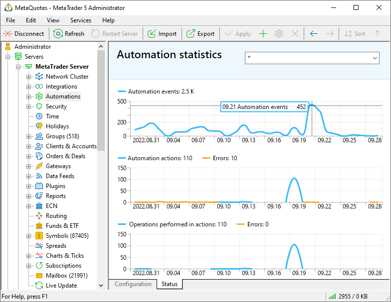
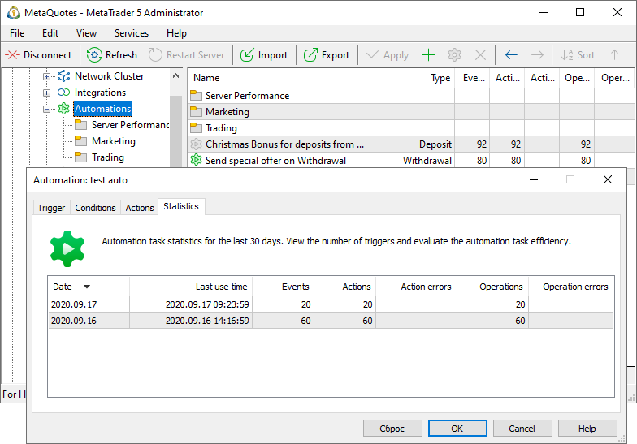

[🏠 Document Start](../../../README.md) / [MetaTrader 5 Trading Platform](../../../MetaTrader-5-Trading-Platform.md) / [Platform Setup](../../Platform-Setup.md) / [Automations](../Automations.md) / Statistics

[Previous](Macros.md) | [Next](../Time.md)

# Automation Task Monitoring Statistics

You can control Automations efficiency by using statistics on automation tasks: how many times each of the tasks triggered, how many actions it executed and how many actions failed for any reason.

To view the general statistics, navigate to the State section:

The following data is available here:

  * Automation events — the number of automation task [triggers](Triggers.md).
  * Automation actions / Errors — the number of successful [actions](Actions.md) and the number of execution errors. An action is one row (one setting) in the appropriate task section. Some actions require the execution of multiple operations. For example, this can be sending of emails to a range of logins. If an email is successfully sent to at least one login in the range, the whole action is considered successful.
  * Operations performed in actions / Errors — the number of successful and failed operations executed in accordance with the configured action. Some actions require the execution of multiple operations. For example, this can be sending of emails to a range of logins. If an email is successfully sent to only one login in the range, only one operation will be considered as successful. Other operations will be included in the Errors statistics.

Use a filter in the upper part of the section to select a specific task or a directory of tasks, for which you wish to view statistics.

Automation statistics are also available in the list of tasks and in each tasks' separate tab:

To reset the statistics of a certain task, for example, after completing testing, click "Reset" in the "Statistics" tab.

> Automation statistics are available for the last 30 days. Longer history is not stored.
