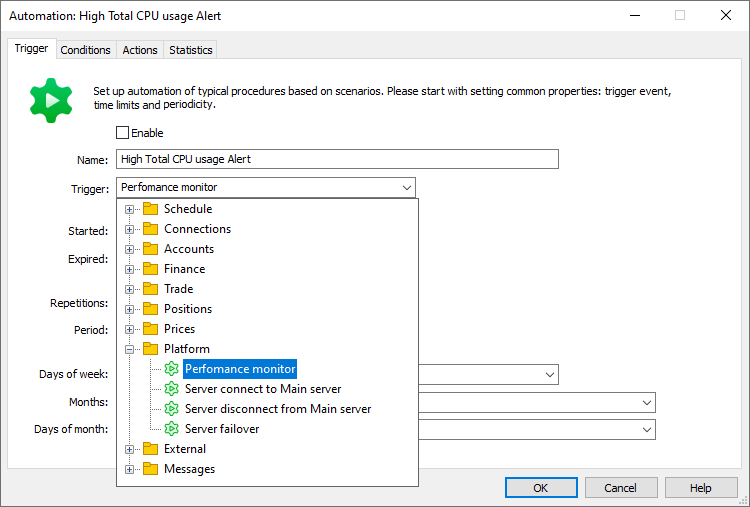
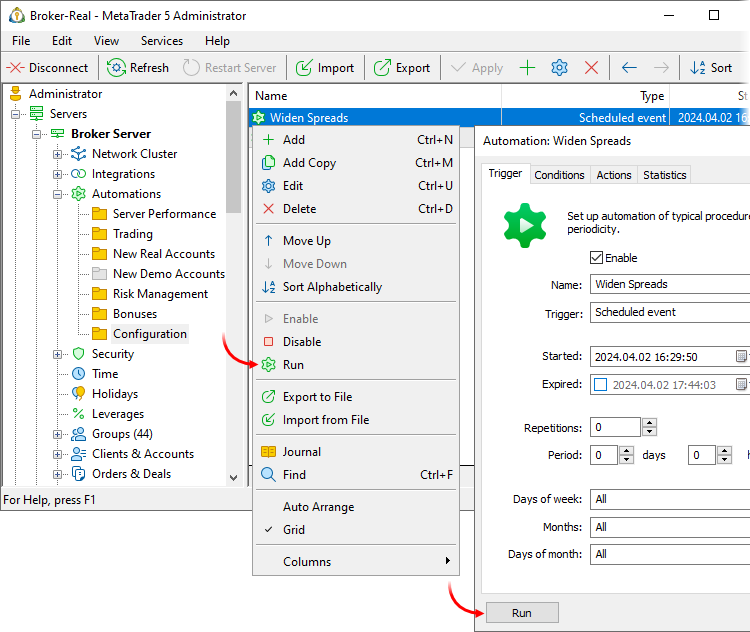
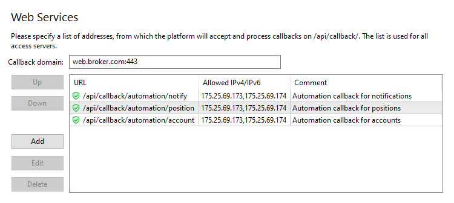
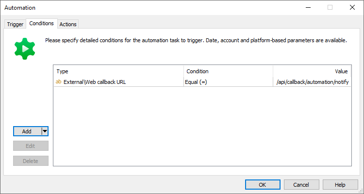

[🏠 Document Start](../../../README.md) / [MetaTrader 5 Trading Platform](../../../MetaTrader-5-Trading-Platform.md) / [Platform Setup](../../Platform-Setup.md) / [Automations](../Automations.md) / Triggers

[Previous](Common-Settings.md) | [Next](Conditions.md)

# Triggers for Automation Tasks (#triggers-for-automation-tasks)

Triggers are events in the platform for which automation tasks can be performed.

A trigger fires (the event check begins) if:

  * The task is enabled.
  * The type of the occurred event corresponds to the specified trigger.
  * The monitored event occurs within the time interval specified in the ["Started" and "Expired" (#start)](Common-Settings.md#start) fields.
  * The number of event repetitions in the specified [period (#period)](Common-Settings.md#period) (these two parameters are specified in general settings) has not been exceeded.
  * The event occurs on the [day and month (#days)](Common-Settings.md#days) specified in settings.

If all the conditions are met, the system proceeds with checking the correspondence of the occurred event to the relevant [automation task conditions](Conditions.md). The [specified action](Actions.md) is performed if all conditions are met.

All triggers are divided into several categories:

## Schedule (#schedule)

These events enable the execution of schedule-based tasks.

### Scheduled event (#time-interval)

The action is performed at a specified frequency. The first event is performed at the time specified under "[Started (#start)](Common-Settings.md#start)". Further repetitions are executed in accordance with the "Period" and "Repetitions".

### Scheduled account database processing (#account-processing)

This trigger is intended for periodic maintenance of the entire trading server account database. The service allows the selection of accounts from the database according to specified criteria and the execution of bulk actions. For example, you can:

  * Archive or disable the accounts which have no active positions and have not connected for more than a specified number of days.
  * Set users' balances to zero if they fall below zero.
  * Create your own Stop-Out mechanisms: when the account balance is less than a specified value, close positions for specified symbols.

When a task triggers, the system checks each account to determine if it corresponds to the [specified conditions](Conditions.md). For example, you can filter accounts by the last connection time, by the balance value, by country, etc. We strongly recommend that you always specify in conditions the account groups to which the actions should be applied. Checking of a large number of accounts is resource-intensive, and eliminating of unnecessary accounts can significantly reduce the task execution time.

The [specified actions](Actions.md) are executed for each account that matches the criteria.

Below is a setup example:

  * Trigger = Scheduled account database processing
  * Started = 2021.03.07 22:00:00 (Sunday)
  * Period = 7 days
  * Repetitions = 0
  * Days of week = Sunday

The following conditions are specified:

  * Account group = real\*
  * Balance < 0

The following action is specified:

  * Action = Deposit pay off
  * Select by = Trigger
  * Type = Balance
  * Comment = Compensate negative balance

The task will be executed as follows: starting from March 1, 2021, 22:00, every Sunday at 22:00 the system will select from the database the real accounts with negative balance values, and will change the value to 0 by performing an appropriate balance correction operation, while adding the specified comment.

  * Processing of an entire database and application of actions to multiple accounts can be time-consuming and resource-intensive. Therefore, we strongly recommend setting the task only [for weekends (#days)](Common-Settings.md#days) and [disabling repetitions (#repetitions)](Common-Settings.md#repetitions).
  * Only conditions form the "[Accounts (#accounts)](Conditions.md#accounts)" list are available for the trigger.
  * Actions related to [configuration changes (#configuration)](Actions.md#configuration) and [platform management (#platform)](Actions.md#platform) are not available for the trigger related to the processing of an account database.

  
---  
  

### Scheduled order database processing / Scheduled position database processing (#trade-processing)

These triggers work similarly to the previous one, but instead of the account database they process the the databases of orders and positions. Set the criteria for the selection of trading operations, and the system will apply the selected bulk actions to these operations. For example:

  * Set a threshold volume and the system will periodically notify dealers about all larger positions.
  * Set a threshold profit, and the system will periodically notify managers about clients' possible large revenue.
  * Define criteria for selecting positions for a symbol approaching an expiration date and send periodic notifications to clients.
  * Define criteria for selecting positions on accounts which have not been connected for a long time, and periodically remind traders about the current state of their accounts.

When a task triggers, the system checks each order or position to determine if it corresponds to the [specified conditions](Conditions.md).

  * Position triggers operate with conditions form the "Accounts", "Positions" and "Platform" lists.
  * Order triggers operate with conditions form the "Accounts", "Orders" and "Platform" lists.

For example, you can filter orders by symbol or expiration date. Positions can be filtered by volume or profit, etc. We strongly recommend that you always specify in conditions the account groups in which the operations should be analyzed. Checking of a large number of records is resource-intensive, and eliminating of unnecessary accounts can significantly reduce the task execution time.

The [specified actions](Actions.md) are executed for each order or position that matches the criteria. Both triggers operate with the actions from the lists "Message", "Trading account", "Finance", "Trade", "External".

Below is a setup example:

  * Trigger = Scheduled position database processing
  * Started = 2021.03.07 22:00:00 (Sunday)
  * Period = 7 days
  * Repetitions = 0
  * Days of week = Sunday

The following conditions are specified:

  * Accounts\Group = real\*
  * Position\Volume > 100

The following action is specified:

  * Action = Message\Send push message
  * Send to = Group
  * To = managers\dealers
  * Text = High trading volume on account #LOGIN#, position #POSITION_TICKET#, #POSITION_VOLUME# lots

The task will run as follows:

  * Starting from March 1, 2021, every Sunday at 22:00 the system will check positions on real accounts.
  * If the system finds positions with a volume of more than 100 lots, it will send a notification to the mobile phones of accounts from the "dealers" group.
  * The message will contain the account number, position ticket and volume.

> Processing of an entire database and application of actions to multiple trading operation can be time-consuming and resource-intensive. Therefore, we strongly recommend setting the task only [for weekends (#days)](Common-Settings.md#days) and [disabling repetitions (#repetitions)](Common-Settings.md#repetitions).

## Manually running a task (#manual)

Tasks with scheduled triggers can be launched manually. Use this option to apply a one-time action to a database or platform settings. For example, you can change the spread before the release of important news and then set it back to the original value.

To manually launch a task, click "Run" in its context menu or the relevant button in the settings dialog:

The task is performed exactly as if the trigger has fired. To perform the action, all of the following conditions must be met:

  * The task configuration must be enabled.
  * The task run time must not conflict with the "Started" and "Expired" parameters specified in [common settings (#start)](Common-Settings.md#start).
  * All [conditions](Conditions.md) in the task must be fulfilled as if it were a casual trigger-based execution.

> Manual execution of automation tasks does not work without a valid service [license](https://support.metaquotes.net/en/market/product/547).

## Connections (#connection)

This category includes the events related to the login and logout accounts in the trading platform.

  * Login — the event occurs every time an account is connected to the trading platform.
  * First login — the event occurs once, for each trading account, when the account connects to the platform for the first time.
  * Logout — the event occurs every time an account is logged out of the platform.
  * Authorization fail — the event occurs in case of a failed attempt to connect to an account, for instance, because of an invalid password. It allows reducing the number of technical support tickets: in case of a login issue, [send (#message)](Actions.md#message) your clients a message prompting to check their login data. Besides, you are able to improve account handling security. With the #USER_IP_ADDRESS# [macro (#account)](Macros.md#account), you are able to specify the IP address, a connection attempt was made from, in notifications sent to your clients. In case of an unknown address, users are able to perform the necessary actions in a timely manner.  
The event is not triggered if an attempt was performed using a non-existing or disabled account, as well as using an account from a disabled or non-existing group.

## Accounts (#account)

This category includes the events related to the trading database.

  * New trade account — registration of a new trading account. Using this trigger, you can organize the distribution of promotional materials to new customers. The event is also generated when an account is restored from an archive or backup database.
  * Trade account deleted — this trigger can be used to notify the administrator about important changes in the account database. Also, for deleted accounts, you can automatically close positions and cancel pending orders. The deletion event is also generated when an account is archived.
  * Trade account archived — this trigger will send final notifications to inactive clients when their accounts are moved to the archive database.
  * Trade account restored — you can notify the administrator of an account restored from an archive or backup database.
  * Trade account group changed — the event is generated when an account is moved from one group to another. To filter events by the group to which the account was moved, use the "Group" condition; to filter by the source group use "Previous group".
  * Trade account password changed — the event is generated when any of the account passwords (primary, investor or API) is changed. The trigger can be used to send security alerts. If the trading account password has changed, notify the trader via SMS or email.

## Managers (#managers)

These are the events associated with [manager account](../Managers.md) actions. By using these triggers with the [notification actions (#message)](Actions.md#message), you can implement control over the employees' work.

Triggers are fired when the specified action is performed via any client software: Manager terminal, Administrator terminal or Manager API.

  * Trade order [modified (#view)](../Orders.md#view)
  * Trade order deleted
  * Trade order moved to [history (#history)](../Orders.md#history)
  * Trade order [reopened (#reopen)](../Orders.md#reopen) from history
  * Trade order [restored (#backup)](../Orders.md#backup) from backup
  * Trade deal [modified (#view)](../Deals.md#view)
  * Trade deal deleted
  * Trade deal [restored (#backup)](../Deals.md#backup) from backup
  * Trade position [modified (#view)](../Positions.md#view)
  * Trade position deleted
  * Trade position [restored (#backup)](../Positions.md#backup) from backup
  * Account position fixed — [correction of positions (#check-fix)](../Accounts/Editing-Account.md#check-fix) based on the account's history of deals
  * Account balance fixed — [balance correction (#fix)](https://support.metaquotes.net/en/docs/mt5/manager/account_balance#fix) based on the account's history of deals

  * Export accounts / clients / positions / deals / orders / reports — the action of saving of the corresponding data to a file executed from the Manager terminal (when the "Export" or "Save Report" command is executed). These triggers help you better monitor your employees' actions and prevent leaks of important data. For example, whenever a data export command is pressed, you can send the corresponding [notification (#message)](Actions.md#message) to a supervisor or higher-level employee. The login of the manager who exported the data can be included into the message using the [#MANAGER_LOGIN# (#manager)](Macros.md#manager) macro.

To get information about the modified (state after the modification) and deleted operations, use macros [#ORDER_*# (#order)](Macros.md#order), [#DEAL_*# (#order)](Macros.md#order) and [#POSITION_*# (#order)](Macros.md#order).

## Payments (#payments)

These are the events related to payment transactions performed through the [integrated payment system](../Payments.md).

  * Payment requested — the event occurs whenever a user initiates a payment in the client terminal by entering the required details and submitting a request to the broker or payment provider. The event is called before the request is sent to an external provider or manager for verification (if provided by the [processing rules](../Payments/Payment-Processing-Rules.md)). This trigger allows you to track detailed statistics on internal payments, such as sending data to an external system via the "[Send Web Request (#webrequest)](Actions.md#webrequest)" action. To display transaction data, use macros from the "[Payments (#payments)](Macros.md#payments)" section.
  * Payment rejected — this event occurs when a request is declined due to incorrect parameters or when it is rejected based on [processing rules](../Payments/Payment-Processing-Rules.md) (either automatically or manually by a manager).
  * Payment confirmed — this event occurs when a [payment request is manually approved](../Payments/Processing.md) by the manager.
  * Payment done — this event occurs when a payment is successfully completed, following a confirmation notification from the payment provider and the crediting or debiting of funds from the account.
  * Payment failed — this event occurs when a payment is declined due to internal errors on the MetaTrader 5 server (e.g., missing conversion rates, provider unavailability, etc.).

To filter events, use the [conditions from the "Payments" section (#payments)](Conditions.md#payments).

## Finance (#finance)

These are the events related to balance operations on accounts.

  * Deposit — the event occurs for each deposit operation (the "Balance \ In" [balance operation (#action)](../Deals.md#action)).
  * First deposit — the event occurs once, for each trading account, when the user makes the first balance operation of "Balance \ In" type.
  * Withdrawal — the event occurs for each withdrawal operation (the "Balance \ Out" balance operation).
  * Credit — the event occurs every time when credit funds are added to the account (the "Credit \ In" balance operation).
  * First credit — the event occurs once, for each trading account, when the user makes the first balance operation of "Credit \ In" type.
  * Credit out — the event occurs every time when credit funds are withdrawn from the account (the "Credit \ Out" balance operation).
  * First credit out — the event occurs once, for each trading account, when the user makes the first balance operation of "Credit \ Out" type.

  * Operation — the event occurs when service operations are performed on the account. These include balance, credit and correction operations performed by managers or API applications, as well as [negative balance compensation (#compensate)](../Groups/Group-Settings.md#compensate) and [credit write-off (#so-credit)](../Groups/Group-Settings.md#so-credit) operations. You can use conditions from the [Finance (#finance)](Conditions.md#finance) category to additionally filter these events.

## Trading (#trading)

These are events related to changes in account trading states.

  * Margin call — the event occurs when a [Margin Call (#margin)](../Groups/Group-Settings.md#margin) hits on any account. Margin call status is checked for accounts on every tick. To avoid massive trigger activations, limit the [number of repetitions (#repetitions)](Common-Settings.md#repetitions) in the tasks.
  * Stop out — the event occurs when a [Stop Out (#stopout)](../Groups/Group-Settings.md#stopout) happens on any account.
  * Request timeout — deleting a trade request upon the expiration of the maximum allowable processing time.  
Three minutes are given for processing each trade request. During this time, it must be processed by the gateway or dealer, or it must be automatically confirmed/rejected by the routing rule. If none of the actions happens, the request is removed. This activates the "Request timeout" trigger. Use the trigger to promptly notify the platform administrator about trading issues on the server, including those related to trade forwarding to external systems via gateways.

## Positions (#position)

This category includes the events related to trading operations on accounts.

  * Position Open — the event occurs when a [market entry deal (#action)](../Deals.md#action) ("In") is executed for the symbol for which the account does not have open positions yet.
  * Position Increase — the event occurs when a [market entry deal (#action)](../Deals.md#action) ("In") is executed for the symbol for which the account already has an open position. The volume of the existing position increases after this operation.
  * Position Decrease — the event occurs when a [market exit deal (#action)](../Deals.md#action) ("Out") is executed for the symbol for which the account already has an open position. The volume of the executed deal is less than the existing position volume. As a result, the existing position volume decreases, but the position is not completely closed.
  * Position Close — the event occurs when a [market exit deal (#action)](../Deals.md#action) ("Out") is executed for the symbol for which the account already has an open position. The volume of the executed deal is equal to the existing position volume. As a result, the existing position is completely closed.
  * Position Reverse — the event occurs when a [reversal deal (#action)](../Deals.md#action) ("In/Out") is executed for the symbol for which the account already has an open position. The volume of the deal is greater than the existing position volume. As a result, the current position is completely closed, and a new one is opened in the opposite direction.

Combine these triggers with [the Web Request action (#webrequest)](Actions.md#webrequest) to send trading information to traders' personal rooms. By using the triggers together with [Message actions (#message)](Actions.md#message), you can automatically notify dealers about large operations. Use [macros (#position)](Macros.md#position) to obtain data about changed positions and about the deals that caused these changes.

## Prices (#price)

These events are connected with trading symbol prices.

  * Prices gap started — the event occurs when a [gap mode (#gap)](../Symbols/Symbol-Settings/Quotes.md#gap) is activated on any trading instrument.
  * Prices gap finished — the event occurs when a [gap mode (#gap)](../Symbols/Symbol-Settings/Quotes.md#gap) finishes on any trading instrument.
  * Delayed — every symbol in the platform has the [Max delay (#quote-delay)](../Symbols/Symbol-Settings/Trade.md#quote-delay) parameter. If no quotes are received for the symbol within the specified time, trading is automatically disabled for this symbol. This automation event is called at the same time. By using this event, you can promptly inform your platform administrator about issues in the delivery of quotes. To specify more details, such as symbol name and price delay value, use macros from the "[Prices (#prices)](Macros.md#prices)" section.
  * Resumed — this event is paired with the previous one. It occurs when the quoting steam for the symbols is restored after a break.

To filter events by individual instruments, use the "[Prices\Symbol (#prices)](Conditions.md#prices)" condition. To filter events by a group of instruments, use the comparison type "[Match mask (#condition-type)](Conditions.md#condition-type)".

## Platform (#platform)

These events are associated with the platform and hardware operation.

  * Performance monitoring — the event occurs every time when [platform performance is measured](../Network-cluster/Monitor.md) (once a minute).
  * Server connection — the event occurs when any of the [cluster servers](../Network-cluster.md) connects to the trading server. If the platform uses multiple trading servers (additional servers, along with the main one), the event will trigger upon connection to any of them. In this case, each event will be considered unique and will not be counted as [repeated events (#repetitions)](Common-Settings.md#repetitions).
  * Server disconnection — the event occurs when any of the [cluster servers](../Network-cluster.md) disconnects from the trading server. If the platform uses multiple trading servers (additional servers, along with the main one), the event will trigger upon disconnection from any of them. In this case, each event will be considered unique and will not be counted as [repeated events (#repetitions)](Common-Settings.md#repetitions).
  * Server failover — the event occurs when the [Failover System (#auto)](../../Platform-Components/Backup-Server/Switching-to.md#auto) switches any of cluster components to a backup server. This can refer to the main or additional trade server, as well as a history server. To create a task related to switching of a specific component, use a additional condition "[Server ID (#platform)](Conditions.md#platform)".
  * Gateway connection/disconnection — the event occurs when a gateway connects to or disconnects from the trading platform. Use these triggers with [Message actions (#message)](Actions.md#message) to instantly notify the administrator about issues with liquidity providers. Information about the specific component for which the event triggered can be immediately displayed in the message. This can be done using [macros (#gateway)](Macros.md#gateway), such as "Gateway name" or "Gateway ID". To create a task for a specific component, use additional [conditions (#platform)](Conditions.md#platform): "Gateway name" or "Gateway ID".  
The trigger is not activated when you [enable/disable a gateway configuration (#common)](../Gateways/Configuration-of.md#common).
  * Data feed connection/disconnection — the event occurs when a data feed connects to or disconnects from the trading platform. Use these triggers with [Message actions (#message)](Actions.md#message) to instantly notify the administrator about issues with quotes or news providers. Information about the specific component for which the event triggered can be immediately displayed in the message. This can be done using "Data feed name" [macro (#datafeed)](Macros.md#datafeed). To create a task for a specific component, use the additional "Data feed" [condition (#platform)](Conditions.md#platform).  
The trigger is not activated when you [enable/disable a datafeed configuration (#common)](../Data-Feeds/Configuration-of.md#common).

## Messages (#messages)

This category includes the events related to the internal [mail system](../Mailbox.md) of the platform.

  * Client sent internal mail — this event enables the creation of your own notification system for new customer requests. Use the trigger with [Messages (#message)](Actions.md#message) actions.
  * Client read internal mail — using this trigger, you can collect email read statistics and analyze the efficiency of your marketing actions. The trigger can be combined with the action that [sends events to Finteza (#finteza)](Actions.md#finteza).

  * Fail to send via SMS / Email / Messenger — these events allow you to track and promptly respond to issues arising in the relevant services: integrations with [SMS providers](../Integrations/SMS-Gateways.md), [instant messengers](../Integrations/Messengers.md) and [mail services](../Integrations/Mail-Servers.md). For example, you can easily track if your balance with the SMS provider runs out and sending of notifications to clients stops. Just select the appropriate trigger and set [additional conditions (#messages)](Conditions.md#messages) specifying the provider name and the balance below limit. For the action, you can use [sending of a message (#message)](Actions.md#message) to an administrator via Telegram.

Use [macros (#messages)](Macros.md#messages) to obtain email related data and to use it in actions.

## KYC (#kyc)

These are the events related to user verification via [KYC providers](../Integrations/KYC.md).

  * KYC started — the event occurs when user data is sent to the KYC provider: [manually (#kyc)](../Clients.md#kyc) by the manager or [automatically (#kyc)](../Accounts/Account-Allocation-Settings.md#kyc) during account registration.
  * KYC approved — the event occurs when the client successfully passes verification on the KYC provider side and the check [status (#kyc-status)](../Clients.md#kyc-status) changes to "Approved".
  * KYC rejected — the event occurs when the client fails to pass verification on the KYC provider side and the check status changes to "Rejected".

Using these triggers, you can promptly inform your clients about their registration stages. For example, using the "KYC rejected" trigger and the Push Notification action, you can instantly notify the client about any additionally required actions. Specify the #KYC_STATE_DESC# [macro (#kyc)](Macros.md#kyc) in the message to provide the reason for rejection.

## External (#external)

These triggers enable the integration of your MetaTrader 5 platform with external systems. By using them, you can:

  * Enable your own task trigger logic by generating [events via the MetaTrader 5 Server API plugin (#api-event)](Triggers.md#api-event).

  * Enable your own task trigger logic by generating events using [callback requests (#webcallback)](Triggers.md#webcallback).

### API event (#api-event)

This trigger enables the integration of the Automations service with any solutions that use [MetaTrader 5 Server API](https://support.metaquotes.net/en/docs/mt5/api/serverapi). The event will emerge when the [plugin](../Plugins.md) running on the trading server calls a special [AutomationTrigger](https://support.metaquotes.net/en/docs/mt5/api/imtserverapi/serverapi_configuration/serverapi_config_automation/imtserverapi_automationtrigger) function. You can use any function call logic in the plugin, depending on the desired purpose.

The [AutomationTrigger](https://support.metaquotes.net/en/docs/mt5/api/imtserverapi/serverapi_configuration/serverapi_config_automation/imtserverapi_automationtrigger) function allows not only triggering a task, but also passing additional data to the service: account information, trading operation and others. For example, if the event concerns a trading operation, you can pass the full description of an order or a deal; the full trading account description can be passed for balance change events. The relevant data can be used for checks in [additional condition](https://support.metaquotes.net/en/docs/mt5/platform/administration/automation/automation_condition) and in [macros](https://support.metaquotes.net/en/docs/mt5/platform/administration/automation/automation_macros). For example, you can check a login from the account description in the "[Login (#accounts)](Conditions.md#accounts)" condition or a ticket from the deal description in the "[Deal ticket (#deal)](Conditions.md#deal)" condition.

### Web Callback (#webcallback)

With this trigger, you can run automation tasks using Web Callback requests.

This function facilitates routine operations related to accounts and trading databases. For example, you wish to remove position stop levels according to certain rules. This could be done by creating a special plugin, for which you would need to hire a qualified developer. Instead, you can simply create an automation task, describing the necessary conditions and actions. This task is then executed by a normal web request.

Preparation

To enable web requests, configure the platform in the [Integration \ Web services](../Integrations/Web-Services.md) section:

  * Associate your access server's public address with a domain and upload an SSL certificate for that domain
  * Specify the list of allowed callback-requests and IP addresses from which the platform will accept them

How to configure a task

Create a task with the Web Callback trigger. Specify all other parameters, similar to a regular automation task, that is, define the necessary conditions and actions.

How to run a task

To run a task, send a web request starting with /api/callback/automation to the server. The specification of the part following this prefix is arbitrary. For example, for convenience, you can add the purpose of the automation task in the request:

  * /api/callback/automation/notify for tasks that send notifications
  * /api/callback/automation/position for tasks relating to positions
  * /api/callback/automation/account for tasks relating to accounts
  * etc.

Please make sure to add the URL of your requests to the list of allowed requests in the [Integration \ Web services](../Integrations/Web-Services.md). Otherwise, the platform will not process them. For each request, provide a list of allowed IP addresses. The platform will only accept the web requests from the addresses specified in this list. This ensures complete safety when using the service.

Add the URL of the specific request which should run the automation task as a Web callback URL condition. This will prevent the task form being triggered when calling other queries.

You can pass the account number and the order, deal or position ticket as additional request parameters. This will determine the task context: the account or operation for which it should be executed. Examples:

/api/callback/automation?login=11001   
/api/callback/automation?position=12476698   
/api/callback/automation?login=11001&position=12476698&order=12514593&deal=33696169  
---  
  
Only one value can be passed in each parameter. The parameters work independently of each other. If you specify both a login and an order ticket, this does not mean that the automation will search for the order from the specified user. The user object and the order object will be passed separately to the task execution context.

The account number and tickets can also be passed through the request body, for example:

/api/callback/automation   
{   
user: { Login: 1000 },   
order: { Order: 11543 },   
deal: { Deal: 961498 },   
position: { Position: 59723 }   
}  
---  
  
Data in request parameters takes precedence over data in the body. For example, if an account login is found in the parameters, then the login specified in the body will be ignored.

You can send a request to the server directly from the command line using the [curl](https://en.wikipedia.org/wiki/CURL) utility. for example:

curl -k --request GET --url https://web.broker.com:443/api/callback/automation?login=1002  
---  
  
Here:

  * Specify the -k flag if [self-signed certificates (#selfsigned)](../Integrations/Web-Services.md#selfsigned) are used on your server
  * Specify your server's domain and port instead of https://web.broker.com:443

To get the URL of the request that triggered the automation task, use [macro #WEBCALLBACK_URL# (#external)](Macros.md#external). For example, you can add it to the body of a sent email.

Actions related to the clearing of stop levels

Actions "[Clear Stop Loss / Take Profit / Stop Loss and Take Profit (#trading)](Actions.md#trading)" execute differently if the "Select by" parameter is set to "Position or order from trigger":

  * If a position ticket is passed in the request, actions will only process the position
  * If an order ticket is passed in the request, actions will only process the order
  * If the request contains the both the position and order tickets, the actions will only process the position

For example, the following request will only process the position with ticket 12500033:

curl -k --request GET --url https://web.broker.com:443/api/callback/automation/clear_sl_tp?position=12500033&order=13111609  
---  
  
The next request will affect the order with ticket 13111609:

curl -k --request GET --url https://web.broker.com:443/api/callback/automation/clear_sl_tp?order=13111609  
---  
  
This feature only applies to actions concerning the clearing of stop levels. In other actions, you can simultaneously pass and use order and position data. For example, by passing operations in a request, you can print their tickets in an email using the #POSITION_TICKET# and #ORDER_TICKET# macros.

An example of sending an internal email to the user

  * Create a task with the Web callback trigger
  * Add condition Web callback URL = /api/callback/automation/notify. The task will only be run by such requests.
  * Add action Message\Send internal email. In the "Send by" parameter, select "Trigger". This way, the action will only apply to logins passed in the request. Specify the email text.

To run the task, send the following request:

curl -k --request GET --url https://web.broker.com:443/api/callback/automation/notify?login=10000  
---  
  
Account number 10000 will receive the email.

Example of closing a position by ticket

  * Create a task with the Web callback trigger
  * Add condition Web callback URL = /api/callback/automation/position_close. The task will only be run by such requests.
  * Add the "Trade\Close positions" action. In the "Select by" parameter, select "Position from trigger". The action will only apply to the positions passed in the request. Additional filters can be set in the "Type" and "Symbol" parameters. For example, if the symbol of the passed position does not match the specified one, the position will not be closed.

To run the task, send the following request:

curl -k --request GET --url https://web.broker.com:443/api/callback/automation/position_close?position=12415801  
---  
  
The position with ticket 12415801 will be closed.

Overriding data in the task call context

If for some reason you need to add or edit the data in the object passed to the automation task, you can specify it in the additional request body through the 'user', 'account', 'deal', 'position' and 'order' objects. For example:

/api/callback/automation?login=11001   
{   
user: { LastName: 'NewLastName', Balance: 0 }   
}  
---  
  
A trading account with number 11001 will be passed to the automation task. The trader’s last name in the account will be replaced with "NewLastName" and the balance will be set to zero.

  * The information passed in this way does not make any changes to the platform databases. The information is used only in the context of the automation task.
  * The list of possible fields for the 'user', 'account', 'deal', 'position' and 'order' objects is provided in the [MetaTrader 5 Web API](https://support.metaquotes.net/en/docs/mt5/api/webapi_main) documentation. 

  
---  
  
In general, automation works with data from parameters and request body as follows:

  * First, the system tries to find object identifiers (account number or ticket) in the parameters.
  * If the identifiers are not found in the parameters, it tries to find identifiers in the request body.
  * If the identifier is found, the automation tries to load the object data from the server database. If the record is not found, the task does not run and an error is returned in response to the request.
  * If the record is found, it is updated according to the data in the request body.
  * The automation task starts.

Let us look at a more complex example:

/api/callback/automation?login=11001   
{   
account: { Equity: 100 },   
user: { LastName: 'NewLastName', Balance: 0 },   
order: { Order: 12514593, Symbol: 'AUDUSD' },   
position: { Position: 124766980, Symbol: 'EURUSD' },   
deal: { Deal: 33696169 }   
}  
---  
  
The case will be processed as follows:

  * Automation will receive an account object with number 11001 from the database. In the received data, the Equity value will be redefined to 100, the user's last name will be replaced with "NewLastName", and the balance will be set to zero.
  * Automation will find an order with ticket 12514593, and the symbol in it will be redefined to "AUDUSD".
  * Automation will find a position with ticket 124766980, and the symbol in it will be redefined to "EURUSD".
  * Automation will find a deal with ticket 33696169.
  * The task execution will start with the final data.

The identifier passed as a request parameter takes precedence over the identifier in the request body. For example, the following request will process the account number 10000:

curl -k --request POST --url https://web.broker.com:443/api/callback/automation/notify?login=10000 \--header "Content-Type: application/json" --data "{\"user\":{\"Login\":10001},\"account\":{\"Login\":10002}}"  
---  
  
The following request will process the account number 10001:

curl -k --request POST --url https://web.broker.com:443/api/callback/automation/notify? --header "Content-Type: application/json" --data "{\"user\":{\"Login\":10001},\"account\":{\"Login\":10002}}"  
---  
  
Similar rules apply when searching for tickets.
