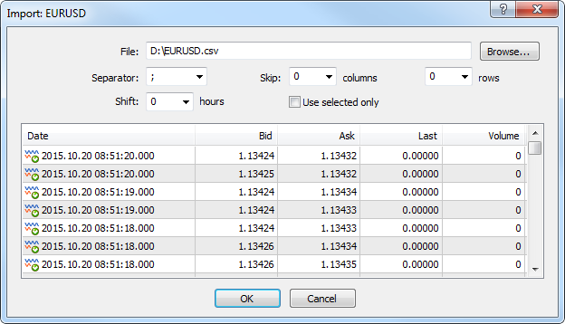
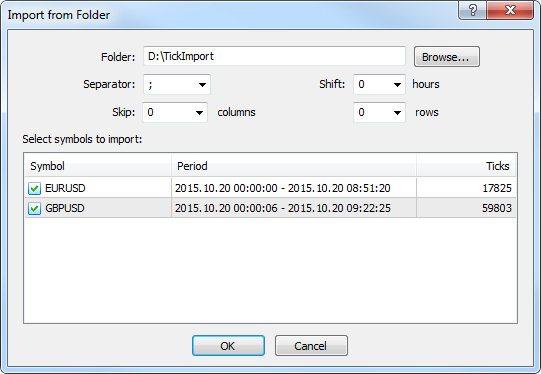

[🏠 Document Start](../../../README.md) / [MetaTrader 5 Trading Platform](../../../MetaTrader-5-Trading-Platform.md) / [Platform Setup](../../Platform-Setup.md) / [Bid/Ask/Last Ticks](../BidAskLast-Ticks.md) / Import Tick Data

[Previous](../BidAskLast-Ticks.md) | [Next](Split-Stocks.md)

# Tick Data Import

Tick data import has the following objectives:

  * generating a tick history when a new symbol is added;
  * filling in missing parts of an existing symbol's tick history;
  * correcting individual fragments of a tick history if needed.

Tick data can be imported both from a single file and from multiple files simultaneously (from a folder).

## Import from File

Click " Import from File" in the [context menu (#context)](../BidAskLast-Ticks.md#context) of the "Ticks" section.

The following data should be specified here:

  * File — use the "Browse" button to specify a file to import. You can use history files of different formats: *.tkc — MetaTrader 4 terminal and server tick data; *.csv, *.prn, and *.txt — text files with separators;
  * Separator — element separator in a text file;
  * Skip columns and rows — amount of columns (from left to right) and rows (top to bottom) to be skipped during an import;
  * Shift — time shift by hours. The option is used when importing data from other time zones;
  * Use selected only — import only rows highlighted in the row view area. You can highlight rows with your mouse while holding Ctrl or Shift.

> Data import is performed for a symbol currently selected in the ["Ticks"](../BidAskLast-Ticks.md) section.

## Import from Folder

You can import tick data from multiple files. Click " Import from Folder" in the [context menu (#context)](../BidAskLast-Ticks.md#context) of the "Ticks" section.

The following data should be specified here:

  * Folder — use the "Browse" button to select a folder containing CSV price history files to be imported. File names should match symbol names created in the trade platform. For example, EURUSD.csv, GBPUSD.csv, etc.;
  * Separator — element separator in a text file;
  * Shift — time shift by hours. The option is used when importing data from other time zones;
  * Skip columns and rows — amount of columns (from left to right) and rows (top to bottom) to be skipped during an import.

After selecting a folder, information on the found price data is displayed at the bottom of the window. Tick  the symbols to be imported and click OK.

## 
