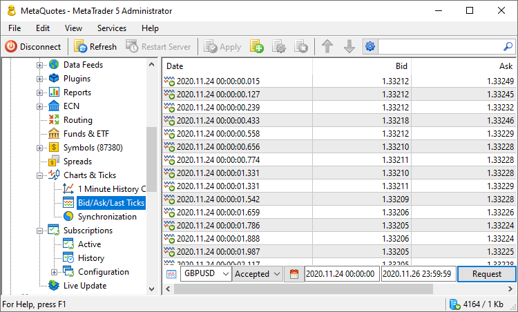
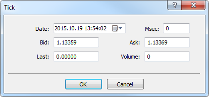

[🏠 Document Start](../../README.md) / [MetaTrader 5 Trading Platform](../../MetaTrader-5-Trading-Platform.md) / [Platform Setup](../Platform-Setup.md) / BidAskLast Ticks

[Previous](1-Minute-History-Charts/Split-Stocks.md) | [Next](Bid-Ask-Last-Ticks/Import-Tick-Data.md)

# Bid/Ask/Last Ticks (#bidasklast-ticks)

This section allows managing tick data of financial instruments. Quotes are received by the history server from [data feeds](Data-Feeds.md) and [gateway](Gateways.md) as a stream of ticks, trade statistics and Market Depth changes. The server passes this data to clients, but only stores the history of tick data. Trade statistics and Market Depth changes are not saved.

It is recommended to find a high-quality deep history of all your financial instruments and [import](Bid-Ask-Last-Ticks/Import-Tick-Data.md) it to the platform. The ability to test Expert Advisors using ticks in the Strategy Tester is an important function for traders. This testing mode is the most precise one while it is close to real market conditions.

## The Features of Tick History Generation (#the-features-of-tick-history-generation)

If a data feed or gateway sends symbol Market Depth changes to a platform, the history server automatically monitors changes of the best Bid and Ask price in it. If the best Bid or Ask price has changed, the history server generates a tick with the values ​​of the best Bid and Ask prices. In this tick, the value of the last trade price and the volume will be zero.

The gateway/datafeed must only send ticks with the filled Last price and volume value. Otherwise, there will be duplicate Bid/Ask ticks (formed by history server and sent by the gateway/datafeed).

  * At the beginning of each quoting session, a Bid/Ask quote is automatically added for symbols with the enabled Market Depth feature. The quote is generated based on the current Market Depth state. The purpose of this quote addition is to ensure that prices in the Market Watch window in client terminals correspond to the Market Depth state. An appropriate message is printed to the History server log in such case, for example: "AUDUSD tick added 0.75761 / 0.75779 due quotes session start". If the Market Depth is enabled, but one of the sides is absent (it has a zero Bid or Ask), a tick is added at the session beginning only if the symbol has the [Exchange calculation type (#calculation)](Symbols/Symbol-Settings/Trade.md#calculation).

  * For the symbols, the charts of which are based on Bid prices, the history server does no accept Last prices and volumes from gateways and datafeeds. These [ticks](BidAskLast-Ticks.md) are not saved and are not delivered to other components of the platform.

  * The history server generates ticks using the best Market Depth prices only if the ["Market depth" (#dom)](Symbols/Symbol-Settings/Common.md#dom) parameter in the appropriate symbol settings is not equal to "disabled".

  
---  
  

Each tick can store the following data:

  * Date — the date and time of tick arrival.
  * Bid — the Bid price.
  * Ask — the Ask price.
  * Last — the price of the last executed trade (for exchange instruments).
  * Volume — the volume of the last executed trade (for exchange instruments).
  * Direction — direction of a deal, as a result of which the tick was generated: Buy or Sell. Data on direction is generally filled by the source of ticks, i.e. a gateway or a data feed. If the data source does not provide such information, the history server fills the direction automatically using the following algorithm:
    * If the Last deal price is greater than or equal to the last Ask price, the price is considered to be the result of a buy deal.
    * If the Last deal price is less than or equal to the last Bid price, the price is considered to be the result of a sell deal.
    * In other cases, it is considered that the direction can't be determined, and both directions, Buy and Sell, are assigned to the tick.
  * Data source — the name of the [datafeed/gateway (#datafeed)](BidAskLast-Ticks.md#datafeed).

> The price data received from gateways and data feeds is stored under [history server installation directory\history]. If the free disk space on the history server drops below 2 gigabytes, no saving of new arriving price data is performed. This prevents data from occupying of all available disk space. Thus, the overall server performance is preserved. If data cannot be written to disk, the following message is added into the history server’s log: "'EURUSD' save skipped due not enough free space on disk", "bars and ticks are not saved due not enough free space on disk", "synchronization was stopped due not enough free space on disk ". In this case, you should immediately increase free disk space on the server.

## Raw and Accepted Ticks (#type)

The trading platform can store two types of ticks: raw and accepted. Raw () are ticks received directly from datafeeds/gateways. Accepted () are the ticks that were filtered and converted in accordance with [symbol settings](Symbols/Symbol-Settings/Quotes.md).

If you need to store raw ticks of a selected symbol on the server, the [appropriate option (#raw-ticks)](Symbols/Symbol-Settings/Quotes.md#raw-ticks) must be enabled in symbol settings. Accepted ticks are always saved on the [history server (#history)](../Platform-Components/History-Server/Structure-of-Directories-and-Files.md#history).

## Trade Statistics (#statistics)

In addition to the basic price data of the trading instrument, the platform allows broadcasting to traders many useful [statistics (#details)](https://www.metatrader5.com/en/terminal/help/trading/market_watch#details), such as session opening and closing prices, the highest and lowest Bid/Ask/Last prices for the day, and much more.

Calculated statistics can be transmitted through data sources and gateways. If ready statistical variables are not available, the appropriate metrics can be calculated on the history server and client terminal side. The statistical variables are calculated as follows:

  * Open Price — the open price of the last (recent) session. If [the symbol chart is built by Bid prices (#charts)](Symbols/Symbol-Settings/Common.md#charts), the Bid price value from the first tick of the session is remembered. If the tick has no Bid, the next tick is used, and so on. Similarly, the Last price is used for the instruments whose charts are based on last deal prices. If the value is provided by a gateway or data feed, exactly this will be used. No extra check or calculation is performed until history server restart.
  * Close Price — the close price of the last (recent) session. If [the symbol chart is built by Bid prices (#charts)](Symbols/Symbol-Settings/Common.md#charts), the Bid price value from the last tick of the session is remembered. If the tick has no Bid, the previous tick is used, and so on. Similarly, the Last price is used for the instruments whose charts are based on last deal prices. If the value is provided by a gateway or data feed, exactly this will be used. No extra check or calculation is performed until history server restart.
  * Price Change — indicates the difference between the last price of the instrument and the close price of the last session in percentage terms. The value is always calculated on the client terminal side. The calculation formula depends on the [symbol charting mode (#charts)](Symbols/Symbol-Settings/Common.md#charts):  
  
By Last prices: ((Last - Last price at session close)/Last price at session close)*100  
By Bid prices: ((Bid - Bid price at session close)/Bid price at session close)*100.  
  
For futures symbols, the clearing price is used instead of the the session close price, if the clearing price is provided by the broker (non-zero):  
  
By Last prices: ((Last - Clearing price)/Clearing price)*100  
By Bid prices: ((Bid - Clearing price)/Clearing price)*100.

## Requesting Data (#request)

To view or edit ticks of a symbol, request them:

  * Choosing a symbol  
In the first field, specify one of financial symbols from the system. The symbol can be specified manually or chosen from the list which opens by clicking on the down arrow.
  * Choosing a type  
Choose the [type of ticks (#type)](BidAskLast-Ticks.md#type) to be requested: All, Accepted or Raw.
  * Choosing a period  
Specify the period, for which you want to request ticks. You can choose one of the predefined periods by clicking on (today, last 3 days, last week, last month, last 3 months, last 6 months or the entire history). You can also specify a custom time interval.
  * Request execution  
To receive ticks, click "Request" or choose the same command from the context menu .

## Analyzing Data Feed (#datafeed)

The information about each tick contains the index of a [data feed (#switching)](Data-Feeds.md#switching) it came from. Index is the position of a data feed in the list at the time of the tick coming. The "Data Feed" column of ticks displays a data feed that currently corresponds to the index written for a tick.

Thus, in most cases the "Data Feed" column will display a data feed that is currently the first one in the list. However, that is not always so.

An error in the operation of a data feed may occur, in that case the translation of quotes will be automatically switched to the next data feed in the list. That exact moment can be traced by analyzing the information displayed in the "Data Feed" column.

Switching of data feeds (or [gateways](Gateways.md) that can also be used as sources of quotes) can be tracked in the [journal of the history server operation](Network-cluster/Journal.md). For example:

"18:32:44 Ticks datafeed 2: EURUSD activation"  
---  
  
This entry tells that at 18:32:44 the flow of quotes from the data feed 2 in the list of configurations has been activated for EURUSD.

> The numeration of gateways and data feeds in the list of configurations starts from 0.

## Adding and Editing Tick Data (#add-edit)

To add a tick, click " Add" button in the [Edit (#add)](../MetaTrader-5-Administrator/User-Interface/Main-Menu/Edit.md#add) menu, on the [Standard](../MetaTrader-5-Administrator/User-Interface/Toolbar/Standard.md) toolbar or in the context menu. To edit a tick, click "Edit" or double-click on it.

The following data can be edited:

  * Date — the date and time of tick arrival.
  * Bid — the Bid price.
  * Ask — the Ask price.
  * Last — the price of the last executed trade (for exchange instruments).
  * Volume — the volume of the last executed trade (for exchange instruments).

## Mass Deletion of Tick Data (#mass-deletion-of-tick-data)

To delete the tick data for a symbol:

  * stop the history server using the [console command](../Platform-Installation/Console-Setup.md) mt5history.exe /stop or by execution the command MetaTrader 5 Platform\History Server\Stop History Server in the Start menu.
  * go to the folder \history\\[symbol name] on the history server and delete files with *.tkc extension. Tick data for each month are stored in a separate file. For example, 201203.tkc contains tick for March 2012.

## Context Menu (#context)

The context menu of this section allows executing the following commands:

  *  Add — add a new tick.
  *  Edit — edit a selected tick.
  *  Delete — delete selected ticks.
  *  Request — request tick data.
  *  Export — [export](General-Information/Data-Export.md) the current requested tick data in a file of CSV, HTM or HTML format.
  *  Import from File — [import](Bid-Ask-Last-Ticks/Import-Tick-Data.md) tick data to the current requested symbol from a file.
  *  Import from Folder — [import](Bid-Ask-Last-Ticks/Import-Tick-Data.md) tick data to the current requested symbol from multiple files.
  *  Split Stock — [transform](Bid-Ask-Last-Ticks/Split-Stocks.md) tick data after splitting stocks.
  *  Find — open the [search](../MetaTrader-5-Administrator/User-Interface/Search.md) window.
  * Auto Arrange — if this option is enabled the size of columns is selected automatically.
  * Grid — this option shows/hides field separators in the table.
  * Columns — select columns to display.

