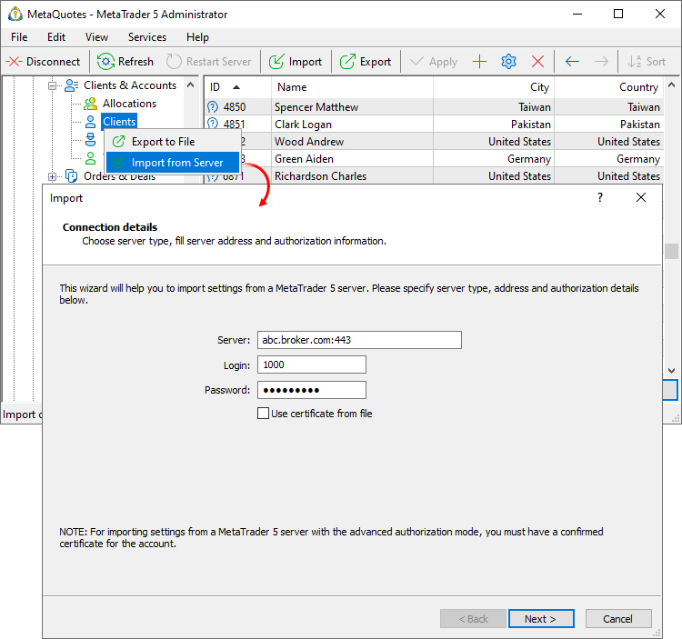
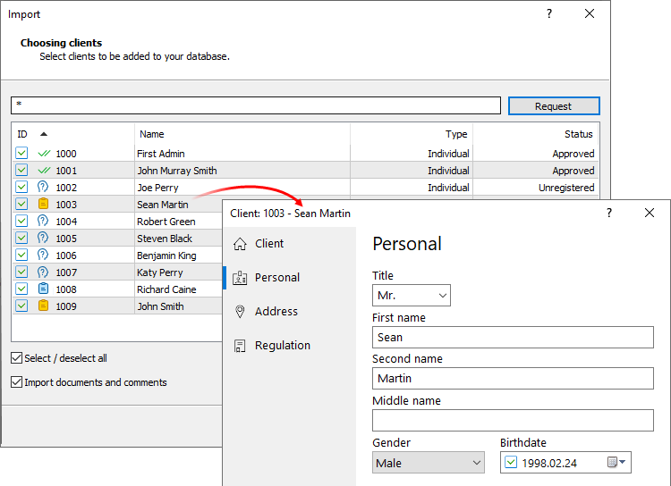
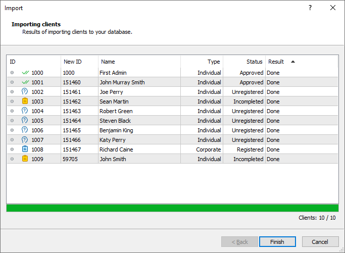

[🏠 Document Start](../../../README.md) / [MetaTrader 5 Trading Platform](../../../MetaTrader-5-Trading-Platform.md) / [Platform Setup](../../Platform-Setup.md) / [Clients](../Clients.md) / Import of from MetaTrader 5

[Previous](../Clients.md) | [Next](../Accounts.md)

# Importing clients from the MetaTrader 5 server

You can easily import your client database from one MetaTrader 5 sever to another. You will need administrator accounts having access to clients on these two servers.

Open the clients section and click "Import from server":

Specify connection parameters:

  * Server — the IP address and port of the MetaTrader 5 server separated by a colon.
  * Login — the number of the manager account for authentication on the server.
  * Password — the account password for authentication on the server.
  * Use certificate from file — [advanced authentication](../../MetaTrader-5-Administrator/Getting-Started/Connect-to-Server/Extended-Authorization.md) can be enabled for the manager account on the source server, from which accounts are imported. A certificate is required in this case. If the certificate has previously been installed in the storage of the operating system, it will be automatically recognized by the import system. If the certificate has not been installed, enable this option and specify the path to the file manually.

  * Certificate File — click "Browse" and specify the pfx-file of the certificate. The certificate file received in the terminal is saved in /terminal data folder/profiles/server name/certificates/.
  * Certificate Password — [the password (#password)](../../MetaTrader-5-Administrator/Getting-Started/Connect-to-Server/Extended-Authorization.md#password) of the certificate.

> To import accounts, you will need an administrator account with [client access permissions (#clients)](../Managers.md#clients) on the source server.

## Requesting accounts

Next, specify a string to request clients from an external server. Records are filtered by the "[Preferred group (#preferred-group)](../Clients.md#preferred-group)" field. The default request is "!demo*,!manager*,!coverage*,!contest*,*". It allows selecting all clients except those from demo and manager accounts, as well as coverage and contest groups.

After the request, the list will display the clients to be imported. Double click on a client to view how it will look like after import. This will open a standard account viewing window.

You can disable import of individual clients from the list. To do this, click on the icon at the beginning of the account row, and then it will change to. You can also select or deselect all clients by using the corresponding option below the list.

If you wish to additionally import client [documents (#documents)](../Clients.md#documents) and [comments (#comments)](../Clients.md#comments), select the appropriate options.

> If the IDs of imported clients match the IDs of existing clients, new IDs will be assigned.

## Result of Import

The total number and the number of imported clients will be shown on the last step:

Import details are also available in the [trade server journal](../Network-cluster/Journal.md).
