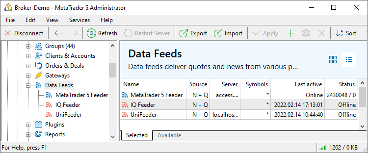

[🏠 Document Start](../../README.md) / [MetaTrader 5 Trading Platform](../../MetaTrader-5-Trading-Platform.md) / [Platform Setup](../Platform-Setup.md) / Data Feeds

[Previous](Gateways/Symbol-and-Price-Translation.md) | [Next](Data-Feeds/Configuration-of.md)

# Data Feeds (#data-feeds)

Data feeds deliver quotes and news from various providers. Use the data feeds to provide the following essential trading tools to your clients:

  * Real-time financial news to assist in making trading decisions
  * Price data from different exchanges and ECNs for analysis and for the development of trading strategies

The platform offers a variety of built-in [turnkey data feeds](../Platform-Components/Data-Feeds.md) for integration with major data providers: Dow Jones, IBTimes, DTN and others. You can test them right away. Additional third-party solutions are featured in the [App Store](https://support.metaquotes.net/en/market/mt5/aggregation). Using the [Gateway API](https://support.metaquotes.net/en/docs/mt5/api/gatewayapi), you can create your own data feeds for integration with any data providers.

In the Data Feeds section, available solutions can be viewed in two modes: product showcase and configuration list. You can switch between them using buttons  and .

The product showcase provides basic information: data feed name, connection status and the amount of transmitted Market Depth and tick data. The Selected tab displays all data feeds for which you have configurations. The Available tab features all data feed modules available on the History server. You can configure them at any time.

The list mode enables the management of existing data feed configurations. It provides quick access to the main parameters:

  * Name — the name of the data feed.
  * Source — data type provided by the data feed, news (N) or quotes/Market Depth (Q).
  * Server — the address and port of the server from which the data feed receives data.
  * Symbols — [symbols (#symbols)](Data-Feeds/Configuration-of.md#symbols) available to the data feed.
  * Last active — data and time of the last successful connection of the data feed to the data provider.
  * State — total transmitted ticks and Market Depth changes/the number of transmitted news items.

Using the context menu, you can adjust the set of displayed data.

## How Data Feeds Work (#how-data-feeds-work)

Data feeds are executable files (*.exe) that run as separate processes. They are stored on the History server, in the "Datafeed" directory. Data feeds interact with the platform through the MT5APIGateway.dll library.

Data feeds connect to an external data source and transmit information to the [History server](Network-cluster/Configuring-Servers/History-Server.md). From this server, data is forwarded to [Access servers ](Network-cluster/Configuring-Servers/Access-Server.md) and terminals. Several sources can be used. If data delivery from one source fails, you can instantly switch to another one.

## Switching between Data Feeds (#switching)

The position of a data feed in the list defines its priority in the delivery of data: the higher the position is, the higher the priority of the feeder is. However, a server is permanently receiving information from all data feeds at once. Such a solution allows to immediately switch to another feed in case of problems. For example, several data feeds deliver quotes of the same symbol from different financial companies - the priority defines what data feed should be used. If the required data are not received from the selected feed for a certain period of time, the server automatically switches to the next data feed that provides information on the same symbol. However, as soon as data from the feed with higher priority are received, the server will switch back to it.

  * The idle timeout of a feed is set up on the history server settings in ["Datafeeds timeout" (#timeout)](Network-cluster/Configuring-Servers/History-Server.md#timeout).
  * For symbols with the depth of market enabled the current data source (a [gateway](Gateways.md) of a data feed) is determined by the first quote that comes after starting the history server.

  * Switching of data feeds for a symbol can be tracked in the ["Ticks" (#datafeed)](BidAskLast-Ticks.md#datafeed) section.

  * Flow of quotes for a symbol coming from a [gateway](Gateways.md) has a higher priority than a flow from a data feed. Switching to quotes from a data feed occurs in case the data flow from the gateway has stopped.
  * Switching of data feeds is performed independently for each symbol.

  
---  
  
To move data feeds use " Move Up" and " Move Down" located in the [Edit](../MetaTrader-5-Administrator/User-Interface/Main-Menu/Edit.md) menu, on the [Standard](../MetaTrader-5-Administrator/User-Interface/Toolbar/Standard.md) toolbar and in the context menu.

The process of activation of a quotes flow from a certain data feed is reflected in the history server [journal](Network-cluster/Journal.md). To find such records, use the keyword "activation".

## Configuration of Data Feeds (#configuration-of-data-feeds)

In order to add or modify a data feed, press " Add" or " Edit", respectively. In order to delete a data feed, press " Delete". These commands are also available in the [Edit](../MetaTrader-5-Administrator/User-Interface/Main-Menu/Edit.md) menu, on the [Standard](../MetaTrader-5-Administrator/User-Interface/Toolbar/Standard.md) toolbar and in the context menu.

To open a data feed [settings](Data-Feeds/Configuration-of.md) or view its [status](Data-Feeds/Status.md), select it in the tree-like list in the "Data Feeds" section on the left.

  * The standard MetaTrader 5 delivery package includes several ready-to-use data feeds for receiving information from the most popular providers. These data feeds are described in [separate sections](../Platform-Components/Data-Feeds.md).
  * To view the journal of operation of data feeds, select in in the tree-like list in the "Data Feeds" section on the left and go to the ["Journal"](Data-Feeds/Journal-of.md) tab.
  * Additional general information about working with configuration records is given in the ["Working with Instructions"](General-Information/Working-with-Instructions.md) section.

  
---  
  

### Possible delay in the delivery of Market Depth prices after switching gateways (#possible-delay-in-the-delivery-of-market-depth-prices-after-switching-gateways)

To consume less resources, the history servers does not store the best prices and Market Depth values for each symbol and each available data source. For the same purpose, the Market Depth is passed from the data feed to the server in the form of changes relative to the previous state. Additionally, the full Market Dept snapshot is sent to the server no more than once every 30 seconds.

Therefore, if the main price feed is stopped and the server switches to the reserve one, the server has to wait for the first Market Depth snapshot from the data feed. During this time (up to 30 seconds), the Market Depth data is not updated.

## Context Menu (#context)

The context menu of the "Data Feed" section contains the following commands:

  *  Add — add a new data feed;
  *  Edit — edit a selected data feed;
  *  Delete — delete a selected data feed;
  *  Move Up — move a selected data feed up relative to others;
  *  Move Down — move a selected data feed down relative to others;
  *  Sort Alphabetically — sort configurations alphabetically. Please note that sorting is done on the server, not in the local terminal.
  *  Enable — enable the selected configuration.
  *  Disable — disable the selected configuration.
  * Automation triggers — create an [automation](Automations.md) task for the selected event or edit an existing one. The menu displays only the triggers and tasks associated with the current section.
  * Automation actions — add an automation action to an existing task or create a new task based on the action. The menu displays only the actions associated with the current section.
  *  Export to File — [export](General-Information/ImportExport-Settings.md) the settings of data feeds to a file.
  *  Import from File — [import (#import)](General-Information/ImportExport-Settings.md#import) the settings of data feeds to a file.
  *  Journal — request [logs](Network-cluster/Journal.md) according to the selected configuration. This will open the trade server logs section, with the name of the selected configuration automatically specified in the query field. You will only need to press the request button.
  *  Find — open the [Search](../MetaTrader-5-Administrator/User-Interface/Search.md) window;
  * Auto Arrange — if this option is enabled the size of columns is selected automatically;
  * Grid — this option shows/hides field separators in the table with the data feeds.

