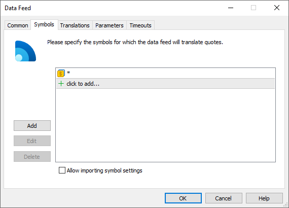
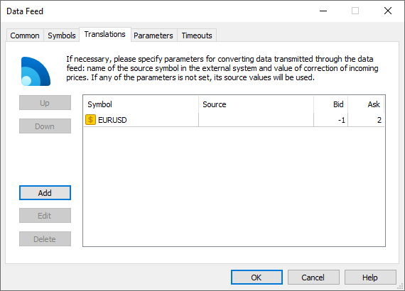
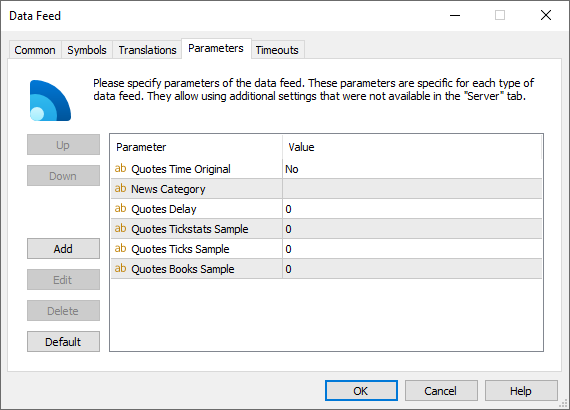
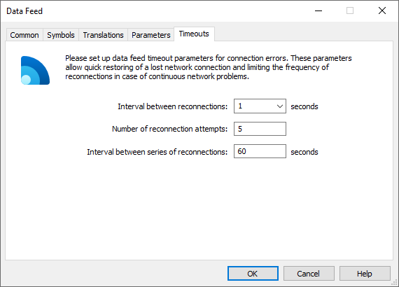

[🏠 Document Start](../../../README.md) / [MetaTrader 5 Trading Platform](../../../MetaTrader-5-Trading-Platform.md) / [Platform Setup](../../Platform-Setup.md) / [Data Feeds](../Data-Feeds.md) / Configuration of

[Previous](../Data-Feeds.md) | [Next](Status.md)

# Configuration of Data Feeds (#configuration-of-data-feeds)

In order to add or modify a data feed, in the [corresponding section](../Data-Feeds.md) press " Add" or " Edit", respectively. In order to delete a data feed, press " Delete". These commands are also available in the [Edit](../../MetaTrader-5-Administrator/User-Interface/Main-Menu/Edit.md) menu, on the [Standard](../../MetaTrader-5-Administrator/User-Interface/Toolbar/Standard.md) toolbar and in the context menu.

## Common (#common)

The main information about the data feed server is specified on this tab:

  * Enable — enable/disable the data feed. Working data feeds are automatically turned off at [non-working hours](../Time.md) of the server. Once the trade server starts working, the data feeds are turned on. For the data feeds running [as a service](Setup-as-Service.md) via the "Remote gateway" module, unchecking "Enable" will lead to disconnection of platform servers from the data feed service, while the service itself will not be stopped.
  * Name — name of the data feed. Use of special characters (?, *, <, > etc.) is not allowed, as this may cause issues while working with the data feed log files.
  * Module — name of the [data feed](../../Platform-Components/Data-Feeds.md) module file, as well the type of translated data (news, quotes, market books).
  * Feed server — address of the data source server.
  * Feed login — login to access the data feed server.
  * Password — password to access the data feed server.

> When you change any of the parameters, the data feed automatically restarts to apply the changes.

### Advanced Network Settings (#additional-network)

Additional network settings include history/trade server to data feed connection parameters. These settings are designed to provide the security of operation between the server and the data feed. In most cases, the settings are hidden and do not require configuration (the history server sets the required address and connection parameters).

These parameters need to be specified in two cases: when working in the [remote datafeed](../../Platform-Components/Data-Feeds/Remote-Datafeed.md) mode, and if the address/port selected for the data feed is busy. In the second case, the following message is written to the log: datafeed address 'Data freed name' already used, please setup another address for datafeed.

  * Gateway sever — address at which the data feed will receive connections from the history server. The system automatically determines available addresses of network interfaces of the history server and displays them in this field. 
  * Gateway login — login that will be used for authorization of the history server on the data feed. Only a positive number can be specified as a login.
  * Password — password that will be used for authorization of the history and trade server on the data feed. The password must fulfill the security requirements (at least 6 characters long with two of three types of symbols: upper case letters, lower case letters and digits).

You can also specify the address 127.0.0.1 or localhost for the gateway server. This is the so-called [Loopback](https://en.wikipedia.org/wiki/Loopback) or a virtual network interface, which is not linked to any hardware. Such addresses are used by default when the data feed, the history server and trade servers operate on the same computer. For such addresses, the platform performs additional checks to ensure proper operation:

  1. The platform receives lists of addresses listened by the history and trade servers
  2. If at least one trade server does not have the same address as the history server, it is considered that at least one platform component is installed on another physical computer.
  3. In this case, the data feed will not be run on localhost (127.0.0.1), but on a set of listening addresses of the history server. The port specified in the "Gateway server" parameter is used for the port. For example, if the address 127.0.0.1:16387 is specified for a data feed, and the server operates on 192.168.0.1:442, the data feed will run on 192.168.0.1:16387.
  4. When connecting to the data feed, the trade server also determines which address to connect to (as in points 1 and 2): Loopback or a set of addresses. The port specified in the "Gateway server" parameter is used for the port. The following addresses are used for the set of addresses (in the order of priority):

  * Public addresses of the history server
  * Local addresses listened by the history server, which coincide with its public points (located on the same subnet).

You can also specify the address as history.server:port. For example, history.server:12345. Peculiarities of using such address:

  *     * The data feed will accept connections on the specified port of all the IP addresses the history server works on (they are specified in the list of listen addresses on the ["Network" (#bind)](../Network-cluster/Configuring-Servers.md#bind) tab of the history sever).
    * The data feed will accept connections from the trade servers on the public access points of the history server (they are specified in the list of public addresses on the ["Network" (#public)](../Network-cluster/Configuring-Servers.md#public) tab of the history server).
    * If the list of list addresses of the history server includes 0.0.0.0, then the data feed will use this address for operation. 0.0.0.0 means listening on all addresses.

  *     * Specifying the address in this way allows automatic [switching the history server (#auto)](../../Platform-Components/Backup-Server/Switching-to.md#auto) with set up local data feeds to a backup server without need to set up the addresses of the data feeds manually.

  *     * An address in this format cannot be used for [remote data feeds](Setup-as-Service.md) since they do not know the platform environment.

> If you install the [data feed as a service](Setup-as-Service.md) on the Loopback address and then move any of the platform components to a different computer, the data feed will become unavailable for that component.

## Symbols (#symbols)

This tab is intended for specifying a list of symbols for translating quotes. For example, if you specify EURUSD, quotes for this symbol only will be received from this data feed.

Click "Add" and select the desired symbol or group of symbols. They can also be specified manually: one or multiple symbols separated by commas.

You can additionally use mask "*" and the negation sign "!". For example, Cboe FX\*,!Cboe FX\EURUSD — all symbols from the Cboe FX group except EURUSD. The exception does not work for a single "*" mask. It always allows all symbols:

  * Forex\*,!Forex\EURUSD — all symbols in the Forex subgroup, except EURUSD.
  * *,!Forex\EURUSD — all symbols. The EURUSD symbol will not be excluded.

For details, please visit the [Specification of Symbols and Groups](../General-Information/Specifying-Symbols-and-Groups.md) section.

If the symbol row in the table is highlighted in red, then this symbol no longer exists. It may have been moved or deleted. Open the entry and edit the symbol path.

> This tab is not displayed for data feeds that transmit news only.

### Allow importing symbol settings (#import)

Using this option, you can enable/disable the import of settings of the [symbols](../Symbols.md) quoted and traded through the data feed. The option will only work if the relevant functionality is supported by the gateway.

Please pay attention to the following features when importing symbol settings via the gateway:

  * If the symbol does not exist in the trading platform, it will be created in the Preliminary [group (#groups)](../Symbols.md#groups).
  * All newly added symbols are imported with the [trading option disabled (#trade-disabled)](../Symbols/Symbol-Settings/Trade.md#trade-disabled). The platform administrator must check all the settings and manually enable trading.

  * If the symbol already exists in the platform, only the symbol settings are updated. Since trading is not executed through data feed, no update can be received for symbol trading parameters, including trading modes, execution and expiration, available order types, volume and margin settings, and options parameters.

Automatic import of symbol settings greatly simplifies the work of the platform administrator. Instead of the manual addition of all settings, you can simply move symbols from the Preliminary group the desired group and allow trading.

When the data feed changes symbol settings, the following log is added to the main trade server [journal](../Network-cluster/Journal.md): "symbol config updated". The name of the data feed is indicated as the IP address of the source in such records (the "IP" field).

> When the "Allow importing symbol settings" option is enabled, the data feed can add and edit any symbols in the Preliminary\* group, even if they are not indicated in the list above.

## Translations (#translation)

Information that is received from data feeds can be transformed:

  * Symbol — name of symbol at the MetaTrader 5 server;
  * Source — name of symbol in the external source (initial name of symbols). This parameter is used for adjusting the names of symbols in external data sources with the names of symbols in the platform;
  * Bid — in this field you can specify a number of points to change the Bid price on.
  * Ask — in this field you can specify a number of points to change the Ask price on.

If a parameter is not specified, default values transmitted by the data feed will be used for it.

If more than one translation settings match the same symbol on the platform side, only the one located higher in the list will be applied. For example, the following settings are available:

  * EURUSD.GW | EURUSD | Bid -1 | Ask +1
  * *.GW | * | Bid -2 | Ask +2

In this case, EURUSD prices will be changed by -1/+1, and the prices of all other symbols will be changed by -2/+2.

  * This tab is not displayed for data feeds that transmit news only.

  * When translating prices, make sure the prices are correct. Usually a negative (or zero) value is indicated for the Bid price, and a positive (or zero) value is indicated for Ask. Otherwise, you may get a negative spread.

  * Translations also affect the depth of market.

  * Find out more in the ["Symbol and Price Translation"](../Gateways/Symbol-and-Price-Translation.md) section.

  
---  
  

## Parameters (#parameters)

This tab allows to specify additional parameters of a data feed that are not implemented at the "Server" tab. Presence of this parameters is stipulated by a necessity of passing additional settings to a data feed for its correct operation. For example, if a data feed receives incoming connections, allowed IP address can be specified in those parameters.

The parameters are described in these fields:

  * Parameter — name of a parameter; 
  * Value — value of a specified parameter.

  * If additional parameters are implemented then while adding a data feed they are automatically specified with default values.
  * The description of possible parameters is given [separately for each data feed](../../Platform-Components/Data-Feeds.md) that is included in the standard delivery of the platform.

  
---  
  
This tab contains the following commands for managing the parameters:

  * Add — add a new parameter. A new line will appear in this window as soon as you press it. In the "Parameter" field enter the name of the parameter, in "Value" - the necessary value to assign to this parameter;
  * Edit — modify a selected parameter. The same action can be performed by double clicking on the selected field;
  * Delete — delete a selected parameter.
  * Default — set default parameters.

### Standard Parameters (#standard-parameters)

All data feeds have a standard set of supported parameters:

  * NewsCategory — the name of the category of news received from this data feed. Further this category name can be used to specify news to be received by separate [groups (#news)](../Groups/Group-Settings.md#news).
  * Quotes Delay — delay of transmitted quotes in seconds. The maximum duration of quotes delay is 20 minutes (1200 seconds). The flow of delayed quotes is neither thinned out, nor changed. A quote is passed to MetaTrader 5 History Server only after the expiration of delay period since the quote has arrived to Gateway API. If the temporary delay parameter is not defined, the quote delay is not used. Changes in depth of market and price statistics are delayed together with the quotes flow. The parameter is not supported for [MetaTrader 4 Feeder](../../Platform-Components/Data-Feeds/MetaTrader-4-Feeder.md) and [MetaTrader 5 Feeder](../../Platform-Components/Data-Feeds/MetaTrader-5-Feeder.md).
  * Quotes Tickstats Sample — the minimum frequency of sending price statistics in milliseconds. This parameter allows thinning out updates of price statistics reducing the traffic.
  * Quotes Ticks Sample — the minimum frequency of sending quotes in milliseconds. This parameter allows thinning out updates of quotes reducing the traffic. It is recommended for use on demo servers only.
  * Quotes Books Sample — the minimum frequency of depth of market updates in milliseconds. This parameter allows thinning out updates of the depth of market reducing the traffic. It is recommended for use on demo servers only.

The parameters for thinning out of price data can be used together with Quotes Delay. Allowed values are from 100 to 3000 milliseconds.

If a parameter value is incorrect, it won't be used.

### News Category and Language (#news-category)

  * Usually, news categories are provided by data feeds. News providers supplement news with the information about categories to which the news belong. The same applies to the news language.
  * A news category can be additionally specified in the [News Category (#parameters)](Configuration-of.md#parameters) parameter of the data feed. This is a standard parameter supported by all data feeds. The parameter is applied as follows:

  * If a data source does not provide news categories, news items will be added to the category specified in this parameter (the category will be specified in the news).
  * If the data source provides a category, then the data feed will add the "News Category" parameter value before the original category name. The resulting category will look like "[value from News Category] \ [category from data source]". The "\" characters in a category name are interpreted as subcategory separators. Therefore, it means that all news items are added to the category specified in the parameter, within which original categories from the data source will be used.

## Timeouts (#timeouts)

This tab describes the behavior of data feeds in case data receipt is stopped.

  * Interval between reconnections — time period between the attempts to reconnect to the data feed;
  * Number of reconnection attempts — a number of reconnection attempts is specified in this field. If a series of reconnection attempts doesn't result in establishing a connection, attempts will be stopped for a time period specified in the field below;
  * Interval between series of reconnections — if a series of specified number of reconnection attempts doesn't result in establishing a connection, attempts will be stopped for a time period specified in this field. After this time period another series of reconnections will be performed.

> An example of working with timeouts of data feeds is given in a [separate section](../../Platform-Components/History-Server/Interaction-with-Quote-Providers.md).
