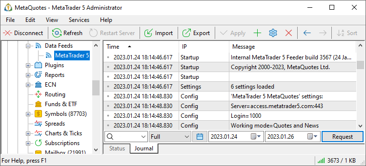

[🏠 Document Start](../../../README.md) / [MetaTrader 5 Trading Platform](../../../MetaTrader-5-Trading-Platform.md) / [Platform Setup](../../Platform-Setup.md) / [Data Feeds](../Data-Feeds.md) / Journal of

[Previous](Status.md) | [Next](Restarting.md)

# Journal of Data Feeds (#journal-of-data-feeds)

In order to view the journal of operation of [data feeds](../Data-Feeds.md), select it in the tree-like list in the left part of the terminal and go to the "Journal" tab.

Working with the journal of data feeds is the same as with the server [journal](../Network-cluster/Journal.md). To request logs, specify a keyword, time period and click "Request".

## Context Menu (#context)

The context menu of the journal of data feeds contains the following commands:

  *  Request — request logs;
  * Copy — this command allows copying information from the journal to the clipboard;
  * Export — export the requested logs in a CSV or HTML file;
  *  Find — search through requested logs;
  * Auto arrange — If this option is enabled, the size of columns is selected automatically;
  * Grid — show/hide grid to separate fields;
  * Columns — show/hide columns of IP and Message in the Journal.

