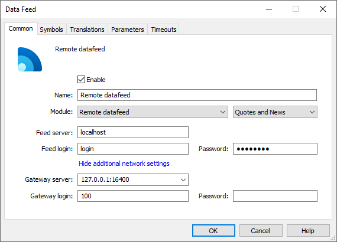

[🏠 Document Start](../../../README.md) / [MetaTrader 5 Trading Platform](../../../MetaTrader-5-Trading-Platform.md) / [Platform Setup](../../Platform-Setup.md) / [Data Feeds](../Data-Feeds.md) / Setup as Service

[Previous](Restarting.md) | [Next](../Plugins.md)

# Data Feed Installation as a Service (#data-feed-installation-as-a-service)

Data feeds can be running on any remote server different from the server where the history server is installed.

In order to configure this data feed, you will need to copy the data feed .exe file and the GatewayAPI64.dll library (available in [history server installation directory]\Datafeed) to the target server. Then launch the executable file and configure connection to the data feed in the [remote mode (#settings)](Setup-as-Service.md#settings).

To avoid the necessity to start the data feed file manually every time when starting the server, you should install the data feed as a service. In that case, the data feed is launched automatically every time the operating system download starts.

> Operation as a service is supported in [all data feeds developed by MetaQuotes](../../Platform-Components/Data-Feeds.md), except for those that are built directly into the platform (do not have a separate executable file), such as MetaTrader 4 Feeder, MetaTrader 5 Feeder and MetaTrader 5 UniFeeder. Support for this mode in third-party data feeds is not guaranteed, while it depends on the gateway developers.

## Service Setup (#service-setup)

Copy the data feed .exe file and the GatewayAPI64.dll library (available in [history server installation directory]\Datafeed) to the target server. Save both files to the same directory.

To install the data feed in the service mode, run the data feed .exe file with the /install key. The following parameters may be additionally specified:

  * /name:<name> — name of the service to be registered in the system.
  * /display:<display_name> — service full name.
  * /desc:<description> — service description.

All parameters are optional. If they are not specified, default values will be used.

Sample setup command:

feeder64.exe /install /name:mt5feeder  
---  
  
Service Start

After the installation, launch the data feed service by launching its .exe file with the /start switch. The data feed launched in such a manner waits for the history server connection. If the history server interrupts connection (for example, in case of a restart), the data feed waits for the next connection. There is no need to restart it.

Sample launch command:

feeder64.exe /start  
---  
  
  * If you need to migrate the data feed to another server, do not forget to additionally migrate the GatewayAPI64.dll library. The data feed will not work without this library.
  * The data feed that runs on the remote server, as well as the GatewayAPI64.dll library, are not updated automatically when new versions of the platform are released. You will need to update these files manually.

  
---  
  

## Configuring the Service (#config)

To configure the data feed service, create a text .cfg settings file having the same name and located in the same directory as the data feed .exe file. For example, if the executable file of the data feed is MetaTrader5Feeder64.exe, the configuration file should be named MetaTrader5Feeder64.cfg. The file should contain the following parameters:

  * name=<name> — the name of the data feed. This name will be shown in the Journal.
  * address=<address>:<port> — address and port where the data feed waits for the history server connection. The address cannot be specified in the format of [history.server:[port]](Configuration-of.md#additional-network) since the remote data feed does not know the platform environment.
  * login=<login> — login used by the history server when connecting to the data feed.
  * password=<password> — password used by the history server when connecting to the data feed.
  * timezone — time zone in minutes. The default time used for the remote data feed log is GMT+00:00. If the trade server is working in a [different time zone (#time-zone)](../Time.md#time-zone), the time of server logs and data feed logs will be different. To avoid this, specify the time zone of the trade server in the data feed settings. The time zone should be specified in minutes. For example, the value of 60 corresponds to GMT +01:00, and -60 corresponds to GMT -01:00.
  * timecorrect — daylight saving time mode: 0 — DST is not used, 1 — enable DST change. It is recommended to set the mode used on the [trade server (#daylight-saving)](../Time.md#daylight-saving).

Sample settings file:

name=My Feeder  
address=10.1.55.159:16100  
login=100  
password=apxjjz3  
---  
  

## Configuring the Data Feed Connection on the Server Side (#settings)

[Create a configuration](Configuration-of.md) of the data feed via the administrator terminal.

Specify the following parameters:

  * Module — Remote datafeed,
  * Gateway server — address and port where the data feed waits for the history server connection (set in the [configuration file (#config)](Setup-as-Service.md#config)). 
  * Gateway login — data feed connection login set in the configuration file.
  * Password — data feed connection password set in the configuration file.

All other parameters are specified the same way as for a data feed running in normal mode.

## Stop and Uninstall (#stop-and-uninstall)

To stop a data feed service, run its executable file with the /stop key. The current connection to the history server is interrupted and the service is stopped. An example:

feeder64.exe /stop  
---  
  
To uninstall the previously installed service, run the data feed .exe file with the /uninstall key and [/name:<name>] parameter. The "name" parameter specifies the name of the service that you want to uninstall. If the service was installed with the default name (without the "name" parameter), the /name parameter is not specified. An example:

feeder64.exe /uninstall /name:dgcx  
---  
  
> If you uncheck "Enable" in a data feed configuration, the platform servers will be disconnected from the data feed service, while the service itself will not be stopped.
