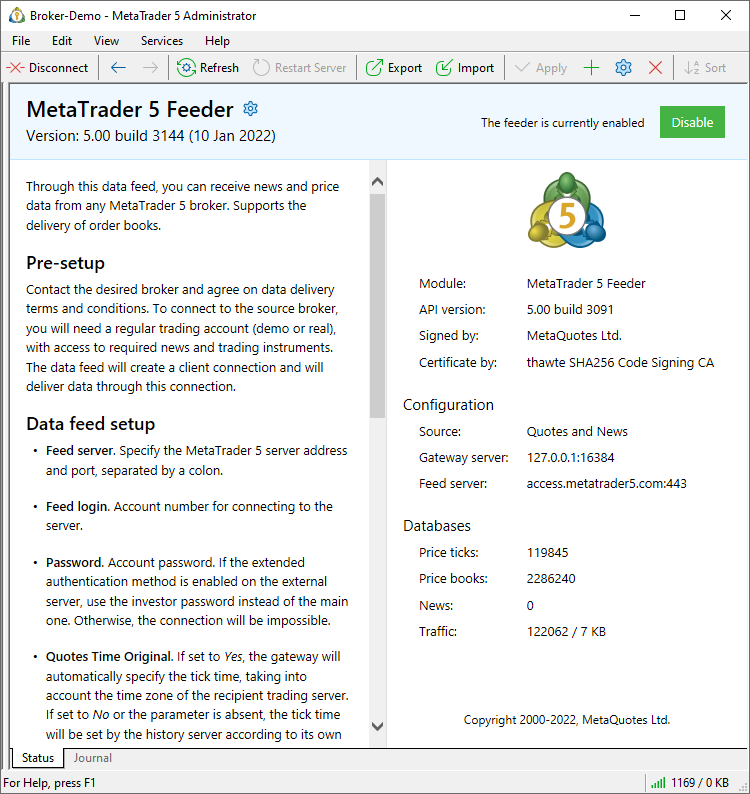

[🏠 Document Start](../../../README.md) / [MetaTrader 5 Trading Platform](../../../MetaTrader-5-Trading-Platform.md) / [Platform Setup](../../Platform-Setup.md) / [Data Feeds](../Data-Feeds.md) / Status

[Previous](Configuration-of.md) | [Next](Journal-of.md)

# Status

This page features general information about the data feed: description, version, settings and statistics. From the same page, you can quickly enable and disable the data feed.

To access this section, select a data feed in the tree or click on it in the product showcase.

## Basic Data

Basic information about the data feed is shown at the top of the window:

  * Module — the name of the data feed executable file.
  * API Version — version and data of the Gateway API, which was used for creating the data feed.
  * Signed by — the company by which the data feed executable is signed.
  * Certificate issued by — the certification authority that issued the certificate to the above company.

## Configuration

The main data feed settings are shown in this block:

  * Source — data transmitted by the data feed (quotes and/or news).
  * Gateway server — the address at which the data feed accepts connections from the history server.
  * Source server — the address of the data source server.

To move to [detailed setup](../Gateways/Configuration-of.md), please click next to the data feed name.

## Databases

Gateway statistics is shown in this block:

  * Price ticks — the number of price changes received from the data source.
  * Price books — the number of Market Depth changes received from the data feed.
  * News — the number of news items received from the data feed.
  * Traffic — incoming and outgoing data feed traffic.

