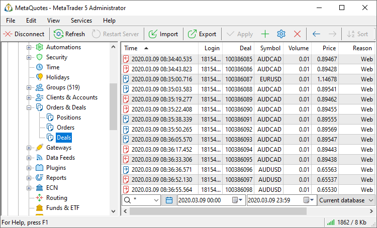
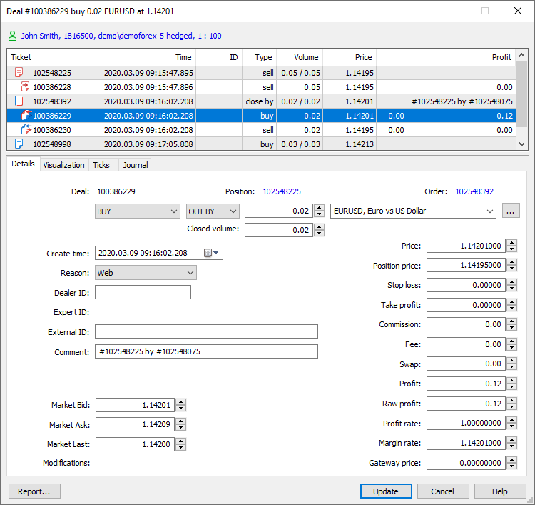
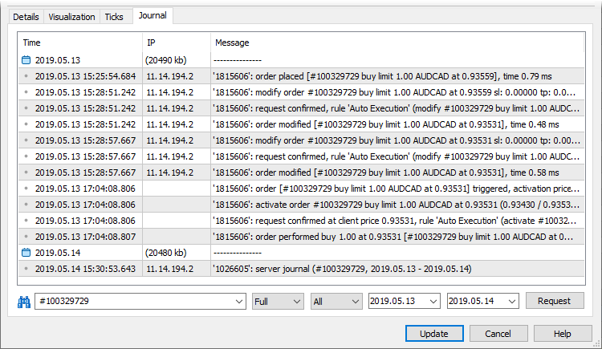
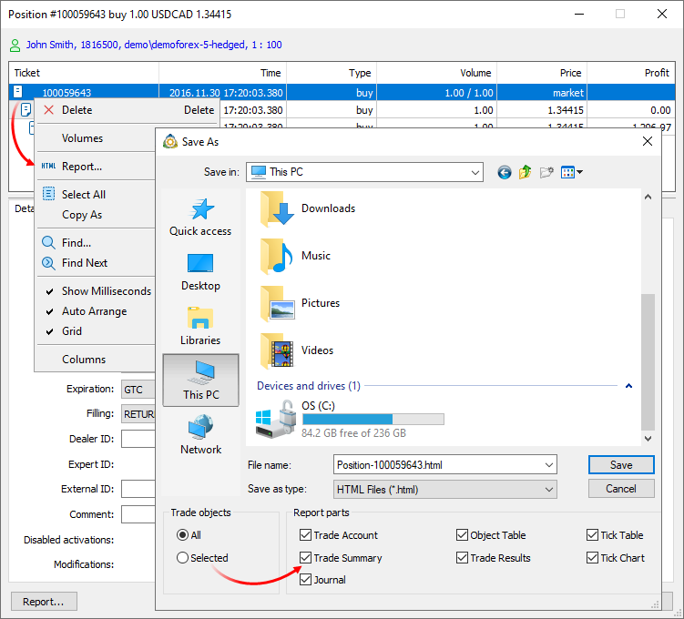
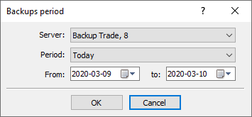

[🏠 Document Start](../../README.md) / [MetaTrader 5 Trading Platform](../../MetaTrader-5-Trading-Platform.md) / [Platform Setup](../Platform-Setup.md) / Deals

[Previous](Orders.md) | [Next](Positions.md)

# Deals (#deals)

This section allows working with the entire history of deals executed by traders' orders, and balance operations.

Depending on points selected in the [context menu (#context)](Deals.md#context), various [information about deals (#view)](Deals.md#view) is shown here. Deals can be sorted out by any field by a left button click on the field name.

## Requesting Deals (#request)

In order to view deals, a request should be constructed. A request can be performed:

  * By groups  
To do it, select a group from the dropdown list.
  * By logins  
Specify one or several account numbers separated by commas.
  * By tickets  
To request deals by their number, specify one or several tickets separated by commas. Before deal tickets the # symbol should be specified.

Further the following request parameters can be specified:

  * Trading instruments for which deals will be requested. One symbol or a group of symbols can be selected from the list. Optionally, you can specify a comma separated list of trading instruments or groups of symbols. For example, Forex\*, CFD\*, Metals\GOLD. Please note that filtering is performed on the server side, and not on the administrator terminal side. To obtain data on other instruments, send another request. The request is performed for all financial instruments by default.
  * You can specify one of predefined request periods using the  button: "Today", "Last 3 days", "Last week", "Last 3 months", "Last 6 months" and "All history".
  * You can set precise time limits of the request. Indicate them manually or using the calendar that is opened at a click on button .
  * Further you can specify from which database deals should be requested: current database or one of [backups (#backup)](Deals.md#backup).

To perform the request, press the "Request" button or execute the " Request" command of the [context menu (#context)](Deals.md#context).

## Viewing a Deal (#view)

To start viewing or editing a deal, double click on the selected deal in the list. The trading operation dialog is a fully-featured tool with a plethora of advanced features, such as the display of the structure of operations, visualization, tick history and logs.

### Account details (#account-details)

The upper part of the dialog features brief information about the account, on which the operation was performed: name, login, groups and leverage. Click on this line to view [account details](Accounts/Editing-Account.md).

### Overview and related operations (#connected-transactions)

This block displays all the related trading operations: the order as a result of which the deal was executed, the position affected by the deal, as well as which initiated the operation, the deals performed as a result of order execution and the final position. Thus you can easily access the entire chain of related actions. Select an operation from the tree and all relevant parameters will be instantly displayed in the bottom part.

### Trading operation details (#details)

The following parameters are indicated for deals:

  * Login — [account](Accounts.md) number the deal has been performed on.
  * Creation time — time of deal execution.
  * Deal — a unique deal number.
  * Order — ticket (number) of the [order](Orders.md) the deal was executed on.
  * Position — ticket of the position that was opened or closed by this deal.
  * Action — deal type, and the direction of the deal relative to the current [position](Positions.md) of the account: in (entry), out (exit), in/out (position reverse) or out by (closing position with an opposite one). There are the following types of deals:
    * Sell — selling a financial instrument.
    * Buy — buying a financial instrument.
    * Balance — top-up of balance via a manager terminal.
    * Credit — crediting via a manager terminal.
    * Charge — other financial operations on the account that do not belong to any of categories.
    * Correction — manual correction of a client's balance.
    * Bonus — accrual of bonuses. Operations of this type affect the credit assets of a client (["Credit" (#personal)](Accounts/Editing-Account.md#personal) field).
    * Commission — accrual of commission.
    * Daily commission — deal of charging [commission](Groups/Commission-Settings/Commission-Calculation.md) at the end of a trading day.
    * Monthly commission — deal of charging commission at the end of a month.
    * Agent commission — deal of charging agent commission (used during an [instant charge (#charge)](Groups/Commission-Settings.md#charge)).
    * Daily agent commission — deal of accruing agent commission at the end of a trading day.
    * Monthly agent commission — deal of accruing agent commission at the end of a month.
    * Interest rate — deal of [accruing annual interest (#interest)](Groups/Group-Settings.md#interest) at the end of a month.
    * Canceled buy and Canceled sell — canceled deal. Such deal types are possible, for example, when working with an external trading system via a [gateway](Gateways.md). A deal can be canceled in an external trading system. In this case, the type of a previously performed deal in the platform (Buy or Sell) is changed to Canceled buy or Canceled sell respectively. At the same time, profit/loss of such a deal is reset. A client's position is then recalculated and an appropriate profit/loss is deposited/withdrawn in a separate balance deal. Deal cancellation does not entail changes in client orders history. Canceled buy and Canceled sell type deals do not participate in an account financial status calculation and are not considered in [positions recalculation (#check-fix)](Accounts/Editing-Account.md#check-fix).
    * Dividend — paying taxable dividends.
    * Franked dividend — paying non-taxable dividends (tax is paid by a company, not a client).
    * Tax — charging a tax.
    * SO Compensation — negative balance [compensation (#compensate)](Groups/Group-Settings.md#compensate) after a Stop Out.
    * SO Credit Compensation — [resetting (#so-credit)](Groups/Group-Settings.md#so-credit) credit funds to zero after the negative balance compensation.
  * Volume — deal volume.
  * Closed volume — position volume closed by this deal. This field enables convenient working with reversal deals. In addition to the total volume of the executed deal, which is opposite to the current position, you can view the closed volume. This ability is especially useful if the initial reversed position is composed of several deals, and its total volume is not explicitly visible.
  * Symbol — [financial instrument](Symbols.md) of the deal.
  * Price — deal price.
  * Value — deal value in client deposit currency. The rate of conversion to deposit currency is shown in the "Margin rate" field. The field is used only for [Exchange* calculation type (#calculation)](Symbols/Symbol-Settings/Trade.md#calculation) symbols and groups with the ["for Stock Exchange, based on margin discount rates" risk management type (#risk)](Groups/Group-Settings.md#risk).  
In case of exchange risk accounting, each deal affects the account balance: the deal value is charged or deducted from the balance. In other words, the system uses the Value field here (not the Profit one, as is the case with OTC accounting). The same applies to [verifying the balance using the trading history (#check-fix)](Accounts/Editing-Account.md#check-fix): the values of deals (rather than their results) are verified. Thus, if you change the deal price for some reason, make sure to update the Value field as well, since it is not recalculated automatically. Otherwise, the value change result is not displayed on the account balance after its verification and correction using the trading history.
  * Stop loss — the Stop Loss level. Stop Loss values for entry and reversal deals are set in accordance with the Stop Loss of orders, which initiated these deals. The Stop Loss values ​​of appropriate positions as of the time of position closing are used for exit deals.
  * Take profit — the Take Profit level. Take Profit values for entry and reversal deals are set in accordance with the Take Profit of orders, which initiated these deals. The Take Profit values ​​of appropriate positions as of the time of position closing are used for exit deals. 
  * Reason — reasons for deal execution:
    * Client — deal performed by a client manually through the client terminal.
    * Expert — deal performed by a client with using an Expert Advisor.
    * Dealer — deal performed by a dealer through the manager terminal.
    * Stop loss — deal performed as a result of Stop Loss activation.
    * Take profit — deal performed as a result of Take Profit activation.
    * Stop out — deal performed when the client reached the [Stop out level (#stopout)](Groups/Group-Settings.md#stopout).
    * Rollover — deal performed when reopening a position for charging [swaps](Symbols/Symbol-Settings/Swaps.md).
    * External Client — deal performed by a client from an external trading system.
    * Variation margin — deal performed for accruing variation margin. Such deals are executed in pairs: one deal closes an existing position in order to register the result (accrue the variation margin), the second deal re-opens the position with the same ticket, but at the new Close price. The position ticket is written to the "Position" field of both deals.
    * Gateway — deal performed by a MetaTrader 5 gateway that had connected to the trading platform.
    * Signal — deal performed as a result of copying a [trade signal](https://www.mql5.com/en/signals) according to a subscription in the client terminal.
    * Settlement — deal performed as a result of performing operations connected with the settlement of a futures contract/option. Not used at the moment.
    * Transfer — deal performed due to transferring a position at the settlement price to a new symbol with the same underlying asset. Not used at the moment.
    * Synchronization — deal performed as a result of [synchronization (#trade-accounts)](Accounts/Editing-Account.md#trade-accounts) of an account's trade state with an external system.
    * External Service — deal performed from an external trading system for technical reasons (for example, to correct the trade state of a client).
    * Mobile — the deal is conducted via the MetaTrader 5 mobile terminal for Android or iPhone.
    * Web — the deal is conducted via the web terminal.
    * Split — the deal is conducted as a result of a symbol split.
    * Corporate action — deal created as a result of a corporate action, such as consolidating or renaming securities, transferring a client to a different account, etc. API applications set this flag for service operations so that the platform does not account for such corporate actions in commission calculations.
    * Migration — deal is created while importing clients' trading operations from the MetaTrader 4 server.
  * Expert ID — the identifier (magic number) of an Expert Advisor that has executed this deal in the client terminal.
  * Commission — commission charged for deal execution. The field is only used for the standard commission charged immediately. [Commission](Groups/Commission-Settings.md) settings are specified for each group separately.
  * Fee — fee charged for deal execution. The field is used for the [Fee (#type)](Groups/Commission-Settings.md#type) commission type.
  * Agent commission — agent commission fees for the deal. Parameters of [agent commissions](Groups/Commission-Settings.md) are specified for each group separately.
  * Swap — charged swap.
  * Profit — profit gained from the deal.
  * Position price — [open price of a position (#open-price)](Positions.md#open-price), which has been closed by this deal. This field is filled for deals that have the "out" or "in/out" type.
  * Gateway price — the field is only used for operations which are forwarded to external trading systems via [gateways](Gateways.md). It shows the actual deal price on the external system side, not taking into account [gateway price transformation settings (#translation)](Gateways/Configuration-of.md#translation).
  * Raw profit — profit/loss of the committed deal. The profit/loss is represented in the [profit currency of the symbol (#profit-currency)](Symbols/Symbol-Settings/Currency.md#profit-currency) the deal is performed by.
  * Comment — a comment to the deal. Additional information can be written in the comment field. For example, a comment indicating an account for whose trades an agent receives the commission is automatically added to the [agent commission](Groups/Commission-Settings.md) deals;
  * External ID — a unique identifier of the deal in external systems.
  * Dealer ID — the number of the [dealer's (#dealing-permission)](Managers.md#dealing-permission) account who processed this deal. "0" specified in this field means that the deal was processed without a dealer.
  * Modifications — if the deal is changed manually, this field displays who implemented the changes:
    * Administrator — deal changed by an administrator.
    * Manager — open price changed by a manager.
    * Position — deal modification data was inherited from the position closed by that deal.
    * Restore — deal restored.
    * Admin API — deal changed via Manager API administrator interface.
    * Manager API — deal changed via Manager API manager interface.
    * Server API — deal changed via Server API.
    * Gateway API — deal changed via Gateway API.

  * Deals that close [positions (#modification)](Positions.md#modification) fully or partially inherit their modification flags. After closing, no separate entry about the position remains in the database. In order not to lose data on modifications, the flags are copied to the deal closing the position. In this case, the additional Position modification flag is added to the deal meaning that the flags were inherited from the position. When inheriting, the deal modification flags are not lost. Instead, they are added to the position flags.
  * The deals changed by an administrator or manager, as well as restored deals are highlighted in the list in red.
  * Use [Trade Modification Report](Reports/Trade-Modifications.md) to obtain information about all modified trade operations.

  
---  
  
  * Profit rate — exchange rate of the deal profit currency to the trader's group [deposit currency (#currency)](Groups/Group-Settings.md#currency);
  * Margin rate — exchange rate of the margin currency to the trader's deposit currency. The value depends on the deal direction. For buy deals, it is the rate of margin currency selling for the deposit currency; for Buy deals it is the rate of currency margin buying for the deposit currency.
  * Market Bid — the market Bid price as at the time of deal execution by the server. The field is only filled for the deals which were created after the platform was updated to build 2890 or higher. For earlier deals, the value will be zero.
  * Market Ask — the market Ask price as at the time of deal execution by the server. The field is only filled for the deals which were created after the platform was updated to build 2890 or higher. For earlier deals, the value will be zero.
  * Market Last — the market Last price as at the time of deal execution by the server. The field is only filled for the deals which were created after the platform was updated to build 2890 or higher. For earlier deals, the value will be zero.

If a manager's account has permissions to ["Change orders" (#dealing-permission)](Managers.md#dealing-permission), any field in this window can be edited. After all changes have been made, press "Save".

### Visualization (#visualization)

In this section, execution of a trading operation is visualized on the tick chart of the appropriate symbol.

### Nearest ticks before and after the operation (#ticks)

When examining disputable situations with traders, it is often necessary to analyze quotes which were broadcasted at the trading operation execution time. The relevant quote data can be obtained in a couple of clicks. Open operation details and navigate to the "Ticks" section. The terminal will automatically request the quote history from the server for the entire day on which the operation was performed. The nearest quote to operation execution time will be automatically selected in the list of received quotes.

### Operation journal (#journal)

This is another tool to assist during the follow-up operation examination. There is no need to manually request [logs from the server](Network-cluster/Journal.md) and to filter its records. Open operation details, navigate to the "Journal" section and the terminal will automatically request the necessary logs from the server, using ticket and time interval filters (from the operation date to the current day).

### Trading operation report (#report)

The trading operation details available in the editing dialogs can be saved as a report. The report contains the entire chain of operations from an order to a position, visualization on a tick chart, extract from the server log and the trading account overall status.

To generate a file, click "Report" in the context menu in the "[Overview and related operations (#connected-transactions)](Deals.md#connected-transactions)" section. Next, select data to be saved: account state, trading totals, logs, tick chart, etc.

Select the path on the disk and click "Save".

## Backup Databases of Deals (#backup)

[Backup copies (#file)](../Platform-Components/Backup-Server/Backup-Features.md#file) are copies of the deal database at certain points in time. They are created daily on the [backup server (#enable-backups)](Network-cluster/Configuring-Servers/Backup-Server.md#enable-backups). To get the list of available backup copies, select "More backups..." and specify a time period:

After specifying a period the additional items will appear in the field of choosing database — all the backups made for the specified period of time. Then you should [request (#request)](Deals.md#request) deals from the selected database. Any deal can be restored to the current database using the " Restore" command of the context menu.

> Restored deals are not deleted from the backup databases.

## Context Menu (#context)

The context menu of the "Deals" section contains the following commands:

  *  Edit — modify a selected order;
  *  Delete — delete a selected order;
  *  Request — execute a [request (#request)](Deals.md#request);
  *  Restore — restore a selected deal from a backup database to the current one. This command is active only if a backup database is currently requested;
  * Copy As — copy deals selected in the list:

  *  Lines — copy entire selected information.
  * List of Logins — copy the list of logins only.
  * List of Tickets — copy the list of tickets only.
  *  Export — [export](General-Information/Data-Export.md) requested orders as a *.HTM, *.HTML file or as a *.CSV file;
  *  Journal — request the [journal](Network-cluster/Journal.md) entries by a selected deal;
  *  Find — open the [search](../MetaTrader-5-Administrator/User-Interface/Search.md) window;
  * Show Milliseconds — show the time of trade operations with a millisecond precision;
  * Auto Arrange — if this option is enabled the size of columns is selected automatically;
  * Grid — this option shows/hides field separators in the table with deals;
  * Columns — using this sub-menu, one can choose which [details of deals (#view)](Deals.md#view) will be displayed in the list.

