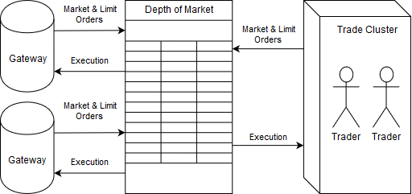
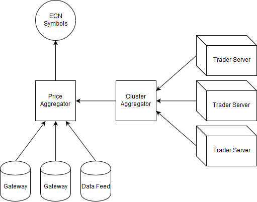
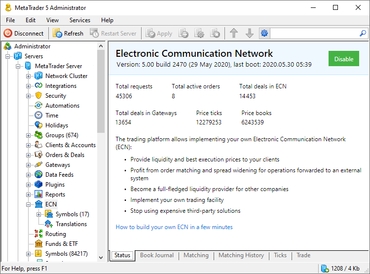

[🏠 Document Start](../../README.md) / [MetaTrader 5 Trading Platform](../../MetaTrader-5-Trading-Platform.md) / [Platform Setup](../Platform-Setup.md) / ECN

[Previous](Ultency/Become-a-Provider.md) | [Next](ECN/Forming-Market-Depth.md)

# Electronic Communication Network

The trading platform allows you to implement your own Electronic Communication Network (ECN). The ECN allows you to:

  * Provide liquidity and best execution prices to your clients.
  * Profit from the matching of orders and spread widening when forwarding operations to an external system.
  * Become a full-fledged liquidity provider for other companies.
  * Implement your own trading facility.
  * Avoid using expensive third-party solutions.

## Market Depth formation algorithm

The ECN allows combining data from an unlimited number of external sources and this form a single quotes stream and the Market Depth feature for symbols.

The system receives Market Depth data from [gateways](../Platform-Components/Gateways.md) and [data feeds](Data-Feeds.md), aggregates them and uploads to ordinary [symbols](Symbols.md). The entire operation is performed within the framework of a standard scheme of price data delivery to the platform, so no additional integration is required for the ECN.

Price data aggregation is flexibly configurable. The broker selects data sources and data to be collected. For example, you may choose to use Buy requests from one ECN gateway and Sell requests from a different one. Data can be additionally filtered by request volume, time, etc.

In addition to data aggregation from external sources, the ECN can collect orders placed by clients within a trading cluster. Thus, the broker's clients can see their own market and limit orders in the Market Depth. Separate settings are provided in the ECN for the aggregation of internal orders. The broker determines orders from specific groups or even individual clients which can be added to the Market Depth.

Price data in the ECN are aggregated using the special Price Aggregator engine. It directly connects to gateways and data feeds, and collects Market Depth changes from them in accordance with [translation settings (#price-rules)](ECN/Forming-Market-Depth.md#price-rules).

Another engine — Cluster Aggregator — collects price data from traders within the cluster. During server start, the engine collects the list of all open orders on all trade servers within the cluster and then maintains this data up to date in accordance with all trade transactions performed on servers. Cluster Aggregator notifies Price Aggregator about changes in order status. Based on such notifications, Price Aggregator maintains the Market Depth feature in an up-to-date state.

All received data is recorded in ECN symbols.

## Enabling of ECN and operation statistics

The ECN can be enabled or disabled under the Status section. The same section contains general system operating statistics:

  * Total requests — the total number of requests received by the ECN for processing. These include not only market operation requests, but also requests to modify or delete orders.
  * Total active orders — the number of orders currently waiting to be matched (which are currently being processed).
  * Total deals in ECN — the total number of deals, which have been created as a result of order matching within the cluster.
  * Total deals in Gateways — the total number of deals, which have been created as a result of order matching with external liquidity providers.
  * Price ticks — the number of ticks which have been generated by the ECN. In fact, these are the ticks which are created during deal execution (they reflect the Last price changes).
  * Price books — the number of order book changes which have been generated by the ECN as a result of aggregation.

  * In case of server restart, the existing ECN operation statistics is reset and collection of statistics starts from scratch.

  * When disconnected, the ECN does not collect any price data and it does not process orders, which are forwarded to the ECN in accordance with routing rules.

  
---
