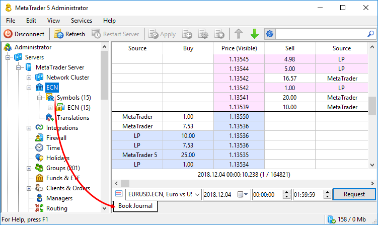

[🏠 Document Start](../../../README.md) / [MetaTrader 5 Trading Platform](../../../MetaTrader-5-Trading-Platform.md) / [Platform Setup](../../Platform-Setup.md) / [ECN](../ECN.md) / Market Depth Journal

[Previous](Forming-Market-Depth.md) | [Next](Order-Matching.md)

# Market Depth Journal

The trading platform stores the Marked Depth formation history, showing what levels from what providers were accepted, what levels were rejected or merged. Since the history volume is large, the special log visualizer tool is provided for history analysis.

Select the symbol, day and time, for which you want to view the history, and click "Request". After that, you will see the Market Depth status as of the initial request time. To view Market Depth changes over time, use the slider below.

> Due to the large amount of information, you can request history for only one symbol and for one day at a time.

The time of the presented Market Depth state is shown below, as well as the ordinal number of the Market Depth change and the total number of changes for the selected time period.

The following Market Depth information is provided in the Journal:

  * Source — liquidity provider from which the Buy/Sell level was received. The source is the gateway configuration name. When you hover over it, a tooltip appears featuring the provider's basic information, such as the used module, the default name, the gateway ID, version of the gateway and used Gateway API.
  * Buy/Sell — the lot volume of buy/sell orders at the specified price.
  * Price — the price of Buy and Sell orders. In the "Full book" mode, the column may contain an additional price shown in brackets. This price appears if the original price was modified, for example due to [minimum spread (#minimal-spread)](Forming-Market-Depth.md#minimal-spread) settings or due to [different number of decimal places (#digits)](Forming-Market-Depth.md#digits) used in the trading platform and by the liquidity provider. This is the price, which was visible to clients.
  * Flags — additional data on the price level:

  * Liquid — the level is liquid, a trading operation (order matching) can be performed at this level.
  * Visible — the level is visible in the internal ECN order book. This flag is set only based on [price rules (#price-rules)](Forming-Market-Depth.md#price-rules) and does not mean that the level will be visible to traders. It means that the level can be visible to traders under certain conditions, such as compliance with the [minimum spread (#minimal-spread)](Forming-Market-Depth.md#minimal-spread) and [market depth limitation (#dom)](../Symbols/Symbol-Settings/Common.md#dom) requirements. For details, please visit the [Availability of Market Depth (order book) for clients](Forming-Market-Depth.md) section.
  * Tick — the level is formed at the best prices. Such a flag is provided in case the data source, for whatever reason, starts broadcasting only the best prices, without the Market Depth information.

Use the context menu to manage the Market Depth appearance. You can change the Market Depth type, choose volume mode (lots and units), as well as show and hide columns and grid. The following commands are also available in the context menu:

  * Invisible levels — show price levels, which are hidden from clients in accordance with [aggregation settings (#price-rules)](Forming-Market-Depth.md#price-rules). 
  * Full book — show all levels, which were passed to the ECN symbol from gateways and the trading cluster in accordance with the aggregation settings.
  * Aggregated book — show the Market Depth, which is actually displayed to clients. [Minimum spread (#minimal-spread)](Forming-Market-Depth.md#minimal-spread) settings are applied to this Market Depth state, while invisible levels are hidden from it.

