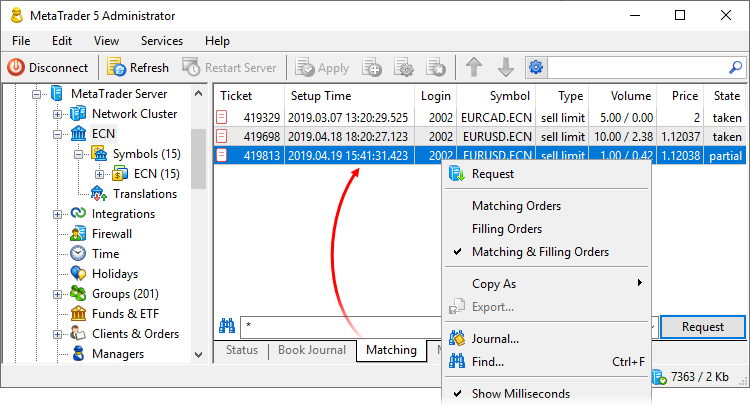
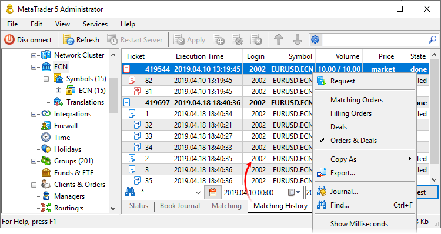

[🏠 Document Start](../../../README.md) / [MetaTrader 5 Trading Platform](../../../MetaTrader-5-Trading-Platform.md) / [Platform Setup](../../Platform-Setup.md) / [ECN](../ECN.md) / Matching History

[Previous](Price-Translations.md) | [Next](../Routing.md)

# Current Matching State and Matching History (#current-matching-state-and-matching-history)

A separate tool is provided to control the order matching in ECN. You can query the current status of the pending requests queue, as well as the entire history of matching.

## Current Matching State (#current-matching-state)

Navigate to "ECN \ Matching", specify the groups of accounts, for which you want to view data, and click "Request".

Data can be presented in three modes. Use context menu to switch between them.

  * Matching Orders — source client requests, which were sent to ECN.
  * Filling Orders — service orders created within the ECN to execute client requests. They are formed on the basis of client orders and liquidity provider bids for execution at the respective gateway.
  * Matching Orders and Filling Orders — a tree view of the source and execution orders, which allows you to view how requests are processed in the ECN.

The required basic data is available for each order type:

### Matching Orders (#matching-orders)

  * Setup Time — time of order setup in the ECN.
  * Login — client login.
  * Order — order ticket in the platform.
  * Server — the name of the trade server, on which the order was placed.
  * Group — the group to which the client account belongs.
  * Symbol — the name of the financial symbol for which the order is placed.
  * Type — type of an order placed to ECN market depth: buy, sell, buy limit or sell limit.
  * Order Volume — the volume of the order which was created in the ECN to execute the client order: the initial operation volume requested by the client in the order and the current filled volume in the ECN. The volume value is displayed in lots.
  * Client Volume — the volume of the order which was created by the client: source volume and currently executed volume. The volume value is displayed in lots.
  * Order Price — the price of the order which was created in the ECN to execute the client order.
  * Client Price — the price specified in the original client order.
  * Order Filling  — [order filling policy (#fill-policy)](../Symbols/Symbol-Settings/Trade.md#fill-policy).
  * Order Expiration — [order expiration mode (#gtc)](../Symbols/Symbol-Settings/Trade.md#gtc).
  * State — current [order state (#order-state)](../General-Information/Trading-System.md#order-state) in the ECN.

If necessary, you can manually delete orders to be matched from the ECN. This operation might be necessary, for example, if the source trader order was canceled but the gateway did not sent the relevant transaction due to an error. To do this, execute the "Delete" command in the context menu. The command is only available for users with the "Manager" and "Edit orders, positions, and deals" [permissions (#permissions)](../Managers.md#permissions).

### Filling Orders (#filling-orders)

  * Setup Time — time of order creation in the external system.
  * Login — client login in the MetaTrader 5 platform.
  * Order — order ticket in the MetaTrader 5 platform.
  * ID — order ID in the external system. The ID is filled by the gateway through which the order is sent for execution.
  * Server — the name of the trade server, on which the order was placed.
  * Symbol — the name of the financial symbol for which the filling order is created.
  * Type — the type of the order which was created for sending to the external system: buy, sell, buy limit or sell limit.
  * Volume — the volume of the order that was created in the external system system to execute the client order: requested and current filled volume. The volume value is displayed in lots.
  * Order Price — the price in the order on the external system side.
  * Client Price — the price specified in the original client order.
  * Deviation — allowable deviation for order execution. It is specified in [filling settings (#filling)](Order-Matching.md#filling).
  * Filling — [fill policy (#fill-policy)](../General-Information/Trading-System.md#fill-policy) applicable to the order. It is determined by the original client order.
  * Expiration — [expiration mode (#gtc)](../Symbols/Symbol-Settings/Trade.md#gtc) of the filling order.
  * State — the current state of the filling order.
  * Provider — the gateway which is used to forward the order to the external system.
  * Comment — additional information.

## Matching History (#history)

ECN stores the full operation history and thus you can access complete information related to order execution, such as execution providers and volumes. To obtain this data, navigate to the "ECN\Matching History" section, set the filter by group and dates and execute the query.

Similarly to the current matching state, orders can be presented in several modes:

  * Matching orders — traders' source orders.
  * Filling Orders — service orders created within ECN to execute client requests at gateways. The fields "Matching Login" and "Matching Order" in this mode are filled only for orders matched within the cluster (not sent to external providers)
  * Deals — the deals which were performed as a result of order execution at the gateways. These deals contain data on execution at the corresponding gateway and the client order execution parameters taking into account slippage settings.
  * Orders and deals — a tree view of all order processing stages: the initial client order, the order in ECN, the resulting deal.  
One and the same client order can be executed in parts with different liquidity providers. It means that multiple filling orders can be created based on one order, as well multiple deals can be executed via different gateways.

Detailed information is available for each trading operation type:

### Matching Orders (#matching-orders)

This presentation mode provides information about original client orders as well as filling orders, i.e. service orders created within ECN to execute client requests at gateways.

  * Setup Time — time of order setup in the ECN.
  * Execution time — order execution time in the ECN.
  * Login — client login.
  * Order — order ticket in the platform.
  * Server — the name of the trade server, on which the order was placed.
  * Order Symbol — the name of the financial symbol for which the order in the ECN was placed.
  * Client Symbol — the name of the financial symbol for which the client order was placed.
  * Order Type — the type of the order which was placed in the ECN: buy, sell, buy limit or sell limit.
  * Client Type — type of the order placed by the client.
  * Order Volume — the volume of the order which was created in the ECN to execute the client order: the initial operation volume requested by the client in the order and the current filled volume in the ECN. The volume value is displayed in lots.
  * Client Volume — the volume of the order which was created by the client: source volume and currently executed volume. The volume value is displayed in lots.
  * Order Price — the price of the order which was created in the ECN to execute the client order.
  * Client Price — the price specified in the original client order.
  * Order Filling — [the fill policy of the order (#fill-policy)](../Symbols/Symbol-Settings/Trade.md#fill-policy), which was created in the ECN.
  * Client Filling — [the fill policy of the order (#fill-policy)](../Symbols/Symbol-Settings/Trade.md#fill-policy), specified in the original client order.
  * Order Expiration — [expiration mode of the order (#gtc)](../Symbols/Symbol-Settings/Trade.md#gtc) which was created in the ECN.
  * Client Expiration— [expiration mode of the order (#gtc)](../Symbols/Symbol-Settings/Trade.md#gtc), which is specified in the original client order.
  * State — current [order state (#order-state)](../General-Information/Trading-System.md#order-state) in the ECN.

### Filling Orders (#filling-orders)

  * Setup Time — time of order creation in the external system.
  * Execution time — order execution time in the external system.
  * Login — client login.
  * Order — order ticket in the MetaTrader 5 platform.
  * Matching Login — the login of the client, who placed an opposite order which is being used to fill the current order. It is filled in only if the order is matched within the cluster, with the counter order of another client in MetaTrader 5.
  * Matching Order — the ticket of the matching order which is used to execute the current order. It is only filled if the order is matched within the cluster, with the counter order of another client in MetaTrader 5.
  * Gateway Order — executing order ticket, only used within the ECN.
  * ID — order ID in the external system. The ID is filled by the gateway through which the order is sent for execution.
  * Server — the name of the trade server, on which the order was placed.
  * Symbol — the name of the financial symbol for which the filling order is created.
  * Type — the type of the order which was created for sending to the external system: buy, sell, buy limit or sell limit.
  * Volume — the volume of filling orders: the original volume created by the client and the current filled volume. The volume value is displayed in lots.
  * Order Price — price in the filling order.
  * Trigger — the actual price at which the order was executed in the external system.
  * Deviation — allowed deviation during order execution. It is specified in [filling settings (#filling)](Order-Execution.md#filling).
  * Filling — [fill policy (#fill-policy)](../General-Information/Trading-System.md#fill-policy) applicable to the order. It is determined by the original client order.
  * Expiration — [expiration mode (#gtc)](../Symbols/Symbol-Settings/Trade.md#gtc) of the filling order.
  * State — the current [state of the filling order (#order-state)](../General-Information/Trading-System.md#order-state).
  * Provider — the gateway through which the order was forwarded to the external system.
  * Comment — additional information.

### Deals (#deals)

  * Time — deal execution time at the gateway.
  * Login — client login.
  * Order — the ticket of the source client order in the platform.
  * Gateway Order — the internal ticket of the execution order; it is only used in ECN for internal purposes.
  * Gateway Deal — the internal ticket of the deal; it is only used in ECN for internal purposes.
  * ID — ID of a deal in an external system. The ID is filled by the gateway through which the order is sent for execution.
  * Server — the name of the trade server, on which the source order was placed.
  * Symbol — the name of the financial symbol for which the deal was executed.
  * Type — deal type: buy or sell.
  * Volume — the executed deal volume in lots.
  * Deal Price — the price at which the deal was executed at the platform side, taking into account [price translation settings (#general)](Price-Translations.md#general).
  * Gateway Price — the price at which the deal was actually executed at the external system side.
  * Commission — commission charged by the external system for the deal. The value is filled by gateways.
  * Provider — the gateway via which the deal was executed.

### Orders and Deals (#orders-deals)

  * Ticker — order/deal ticket. Depending on the operation type, the ticket of the source client order, of the filling order and of the internal deal (used only in ECN) is shown.
  * Setup Time — time of order creation by the client and of filling order creation in the ECN.
  * Execution time — order execution time.
  * Login — client login.
  * ID — operation ID in the external system. The ID is filled by the gateway through which the order is sent for execution.
  * Symbol — name of a trading symbol.
  * Type — trading operation type.
  * Price — depending on the operation type, this shows the price of the source order, of the filling order or of the executed deal.
  * AW Price — average weighted order execution price by external liquidity providers. This value is used when an order was executed partially with different providers, otherwise it is equal to the Price field. It is calculated as (execution price at gateway 1 * volume of deal 1 + ... + execution price at gateway N * volume of deal N) / (volume of deal 1 + ... + volume of deal N).
  * State — [order state (#order-state)](../General-Information/Trading-System.md#order-state).
  * Commission — commission charged by the external system for the deal. The value is filled by gateways.
  * Provider — the gateway via which the order was executed.
  * Comment — additional information.

