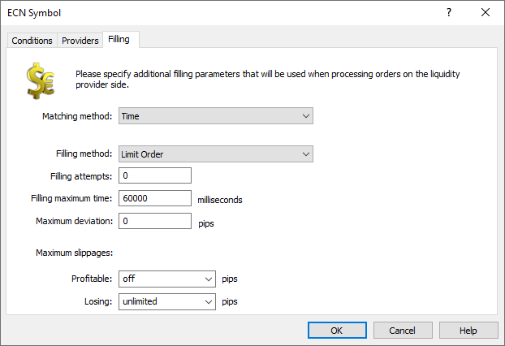
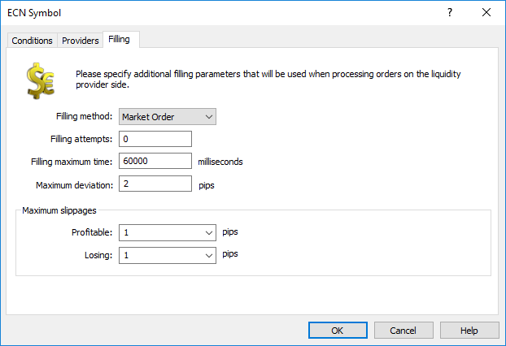

[🏠 Document Start](../../../README.md) / [MetaTrader 5 Trading Platform](../../../MetaTrader-5-Trading-Platform.md) / [Platform Setup](../../Platform-Setup.md) / [ECN](../ECN.md) / Order Execution

[Previous](Order-Matching.md) | [Next](Price-Translations.md)

# Order Filling (#order-filling)

As a result of [matching](Order-Matching.md), an opposite order of another client from within the MetaTrader 5 cluster or an order from an external system (liquidity provider) can be selected for a client order execution.

## Order execution within the trade cluster (#cluster)

When two orders are matched within the trade cluster, two opposite deals are created to fill these orders. In this case:

  * The deal volume is equal to the lowest volume of the two orders (taking into account the remaining unfilled order volume). For example, when matching orders Buy 2.00/1.00 and Sell 2.00/0.00, the volume of the deals will be equal to 1 lot.
  * The price of the deals depends on the type of the matched orders:

  * If both are limit orders, the prices of both deals will be equal to the price of the order which was placed in the ECN earlier.
  * If only one of the orders is of the limit type, its price will be used for both deals.

## Order execution at external liquidity providers (#providers)

Once an order is matched with the price level of an external liquidity provider, it is forwarded to that provider for execution. For this, the ECN module creates a trade request to place a new order in accordance with [symbol settings in the external system](https://support.metaquotes.net/en/docs/mt5/api/imtgatewayapi/imtgatewayapi_gateway_symbols), which were received from the gateway, as well as [filling parameters (#filling)](Order-Execution.md#filling) specified in the triggered matching rules.

Trading requests generated by ECN for liquidity providers are added to the request queue and are processed by the gateways similarly to regular requests from trade servers in the cluster. There are some specific features connected with the [MetaTrader 5 Gateway API](https://support.metaquotes.net/en/docs/mt5/api/gatewayapi), which should be taken into account when developing gateways for the platform:

  1. Instead of the [login of the client](https://support.metaquotes.net/en/docs/mt5/api/reference_trading/trading_request/imtrequest/imtrequest_login) who created the request, the ECN specifies its own dealer identifier, which is equal to the UINT64_MAX constant.
  2. The ECN [does not pass](https://support.metaquotes.net/en/docs/mt5/api/imtgatewaysink/imtgatewaysink_ondealerlock) information related to the [client](https://support.metaquotes.net/en/docs/mt5/api/reference_user/imtuser), [trading account](https://support.metaquotes.net/en/docs/mt5/api/reference_trading/user_account/imtaccount), [order](https://support.metaquotes.net/en/docs/mt5/api/reference_trading/trading_order/imtorder) and [position](https://support.metaquotes.net/en/docs/mt5/api/reference_trading/trading_position/imtposition) when sending a trade request.
  3. The gateway must not use the source [ECN symbol configuration in the platform](../Symbols.md) to check a request or make any decisions, since the ECN generates requests which are not linked to the platform and it takes into account [the symbol configuration in the external system](https://support.metaquotes.net/en/docs/mt5/api/imtgatewayapi/imtgatewayapi_gateway_symbols).

> The ECN does not store information about MetaTrader 5-side client positions. Any operation which the ECN forwards to an external liquidity provider is a regular Buy or Sell order. It does not matter which action the client performs: enters or exits the market. Therefore, we recommended using only netting accounts to connect gateways to external systems. In this case, all individual operations on the same symbol forwarded to an external system will be treated as one cumulative position. If you use a hedging account, new positions will be created for each order, while old positions will not be closed.

### Execution settings (#filling)

Set up execution parameters to be applied with liquidity providers using [matching rules (#settings)](Order-Matching.md#settings):

Matching method

The ECN supports two methods for selecting the second side of a deal in matching: time-based and Round-Robin. In the first case, the side is selected according to the age of orders: preference is given to the orders which were placed in the Market Depth earlier. Within the Roound-Robin algorithm, the second part for matched orders is determined evenly among all available liquidity providers. This algorithm ignores the opposite order creation time. The system matches bids and asks in a circular order, among all available providers, without time priority.

For more details on matching please visit the [appropriate section (#second-side)](Order-Matching.md#second-side).

Filling method

In the "Filling method" field, you should specify the type of requests to be forwarded to the external liquidity provider:

  * Limit orders — operations will be forwarded as limit orders with an expiration as per the "Filling maximum time" setting. The price will be equal to the one specified in the client order or the current market price (depends on the [execution mode](../Symbols/Symbol-Settings/Execution.md) selected for the ECN symbol). This mode helps in avoiding large slippage.
  * Market orders — operations will be forwarded as orders with the Market Execution mode.
  * Source order type — the type of orders forwarded to an external system will be selected in accordance with the initial order type: market orders will be forwarded as market operations, and limit orders will be sent as limit orders.

Filling attempts

Here you specify the maximum number of attempts to fill an order in accordance with this rule.

Matching of trading orders can fail. For example, an external system may offer for the operation the price that exceeds [maximum deviation (#deviation)](Order-Execution.md#deviation). In this case, the source order is returned to the Market Depth and its filling attempts counter is increased.

If the limit of attempts is exceeded, ECN will switch to processing the next rule, which is suitable for the given order.

  * 0 means no limitations.
  * If only one matching rule is set, the number of filling attempts is actually unlimited. Upon the limit excess, the ECN will always proceed to the same matching rule processing.

  
---  
  
Filling maximum time

This is the maximum time, within which the external system (provider) is allowed to fill the matched trade request. If the order remains unfilled in the external system after the specified time, a command is sent to the external system to delete the order. After order cancellation in the external system, the remaining volume is returned to the Marked Depth for further matching. The [filling attempts (#attempts)](Order-Execution.md#attempts) counter of the source ECN order (the client request for which matching is performed) is increased by one in this case.

Deviation

This parameter is used only when operations are sent as Instant Execution and Request Execution orders.

In case of an instant execution, an acceptable deviation is specified in the request sent to the external system.

When a requote from an external system is received, ECN checks if the new price is within the specified deviation. If the deviation is not exceeded, the ECN sends to the provider a new request at the requoted prices. If the provider accepts the prices, the request is executed. In case of a repeated requote, the deviation will be checked according to the first request (i.e. the price of the original order).

If the deviation is exceeded, the execution is terminated. In this case, the order is returned to the Market Depth and an error is written to the log:

2018.12.05 15:40:57.714 ECN '2002': filling order #417689 on 'MetaTrader 5 Gateway ECN' - confirm prices 1.50740 / 1.50766 deviation 4 is greater than maximum 1   
[instant sell 1.00 EURCAD.ECN at 1.50744]  
---  
  
The number of [filling attempts (#attempts)](Order-Execution.md#attempts) is increased by one. Then, the ECN will try to resend the order.

During request execution, the ECN first requests prices from the external system. After receiving the price, the ECN checks if the price is within the allowed deviation. If the deviation is not exceeded, the ECN sends to the provider an order at the requoted prices.

If the deviation is exceeded, the execution is terminated. In this case, the order is returned to the Market Depth and an error is written to the log:

2018.12.05 15:49:08.370 ECN '2002': filling order #417690 on 'MetaTrader 5 Gateway ECN' - confirm prices 1.50789 / 1.50817 deviation 2 is greater than maximum 1  
[prices for EURCAD.ECN 4.00]  
---  
  
The number of [filling attempts (#attempts)](Order-Execution.md#attempts) is increased by one. Then, the ECN will try to resend the order.

Maximum slippages

Specify here  the maximum deviation of the execution price provided by the external system from the requested price.

  * Profitable — the number of points by which the price may deviate from the requested one, in the profitable direction for the client.
  * Losing — the number of points by which the price may deviate from the requested one, in the unprofitable direction for the client.

After the actual deal execution in the external system, the ECN compares its price with the initially requested one ([taking into account translation settings (#general)](Price-Translations.md#general)). If the price is within the allowed deviation, the deal will be executed on the platform side at the requested price. If deviation is exceeded, the ECN executes the deal at the price of actual execution on the external provider side. 

Suppose, the values of 5 are set both for the profitable and losing slippage. The ECN passes to the external system the Buy Limit order at the price of 1.14053, and the system executes a deal at the price of 1.1405, i.e. at a 2-point better price. Such slippage is acceptable. On the platform side, the order will be executed at the initial price of 1.14053.

If the deal price exceeded the deviation, the ECN would execute the order in the platform at that specific price (1.14051).

### Execution rules for symbols having different price accuracy on the platform and external system side (#digits)

If the accuracy of security prices on the external system side differs from that in the trading platform, this difference will be taken into account when creating trading requests to be sent to gateways and when processing deals from external systems.

Lower accuracy in the platform

If the accuracy on the platform side is lower, decimal places are added to the prices sent to the external system. Consider the following example. The price accuracy on the platform side is 4 decimal places, while the external system provides prices with 5 decimal places. When sending an order with the price of 1.1329, the price will be converted to 1.13290.

The following rules apply for deal price rounding:

  * Buy deal prices are rounded up to the symbol accuracy on the platform side.
  * Sell deal prices are rounded down to the symbol accuracy on the platform side.

Thus, the broker can only have a positive balance discrepancy with the external system, in contrast to rounding performed by the common rules.

Higher accuracy in the platform

If the accuracy in the platform is higher, during order sending to an external system the prices will be rounded according to the following rules:

  * Buy orders are rounded down to the symbol accuracy on the platform side.
  * Sell orders are rounded up to the symbol accuracy on the platform side.

Thus clients' limit orders will always be filled on the provider's side and in MetaTrader 5 at a price which is not worse than that specified in the order. This is not possible when rounding according to common rules.

Consider the following example. The price accuracy on the platform side is 5 decimal places, while the external system provides prices with 4 decimal places. When executing a client Sell order at the price of 1.12919, an order with the price of 1.1291 (rounded down) will be placed in the external system. A similar Buy request would be placed as an order with the price of 1.1292 (rounded up).

> Check of the [maximum deviation (#deviation)](Order-Execution.md#deviation) of the execution price in the "Instant" and "Request" modes as well as of the price [slippage (#slippage)](Order-Execution.md#slippage) is performed based on the symbol accuracy set in the MetaTrader 5 trading platform (whenever applicable, the prices are rounded according to the above rules).

Examples: Lower accuracy in the platform

The accuracy of EURCAD.ECN in the MetaTrader 5 trading platform is equal to 4 decimal places. The liquidity provider has a 5-digit accuracy. The symbol execution mode is Instant.

Maximum deviation is 2 points, maximum profitable/losing slippage = 1/1.

1\. The client places an order: #418239 buy limit 0.10 EURCAD.ECN at 1.4977, ECN matches it with 'MetaTrader 5 Gateway ECN':

2019.02.12 11:35:27.553 ECN '2002': request received (#418239 buy limit 0.10 EURCAD.ECN at 1.4977)   
2019.02.12 11:35:27.553 ECN '2002': order #418239 buy limit 0.10 EURCAD.ECN at 1.4977 added   
2019.02.12 11:35:27.556 ECN '2002': request answered - Placed (#418239 buy limit 0.10 EURCAD.ECN at 1.4977)   
2019.02.12 11:35:27.561 ECN '2002': execution sent - request new order #418239   
2019.02.12 11:35:27.561 ECN '2002': execution sent - added order #418239, buy limit 0.10 at 1.4977 [based on order '']   
2019.02.12 11:35:27.561 ECN '2002': matched 0.10 at 1.49764, #418239 buy limit 0.10 EURCAD.ECN at 1.4977 vs sell limit 10.00 at 1.49764 on 'MetaTrader 5 Gateway ECN', by rule 'MetaTrader 5 Gateway ECN'  
---  
  
The Instant request with the price of 1.49770 is formed for the gateway, which then returns a re-quote with the price of 1.49754:

2019.02.12 11:35:27.588 ECN '2002': filling order #418239 on 'MetaTrader 5 Gateway ECN' - request added (instant buy 0.10 EURCAD.ECN at 1.49770)   
2019.02.12 11:35:27.588 ECN '2002': filling order #418239 on 'MetaTrader 5 Gateway ECN' - request taken (instant buy 0.10 EURCAD.ECN at 1.49770)   
2019.02.12 11:35:41.393 ECN '2002': filling order #418239 on 'MetaTrader 5 Gateway ECN' - request confirmed: Requote (1.49736/1.49754) (instant buy 0.10 EURCAD.ECN at 1.49770)  
---  
  
ECN rounds the potential buy deal price of 1.49754 up to 4-digit accuracy — 1.4976. The deviation from initial price (1 point) is within the allowed deviation of 2 points and thus a new Instant request for the gateway is formed using new prices:

2019.02.12 11:35:41.393 ECN '2002': filling order #418239 on 'MetaTrader 5 Gateway ECN' - returned for confirm, price corrected from 1.4977 to 1.4976, client deviation: 2 (instant buy 0.10 EURCAD.ECN at 1.49770)(1.49736 / 1.49754)   
2019.02.12 11:35:41.395 ECN '2002': filling order #418239 on 'MetaTrader 5 Gateway ECN' - request added (instant buy 0.10 EURCAD.ECN at 1.49754)   
2019.02.12 11:35:41.396 ECN '2002': filling order #418239 on 'MetaTrader 5 Gateway ECN' - request taken (instant buy 0.10 EURCAD.ECN at 1.49754)   
2019.02.12 11:35:43.191 ECN '2002': filling order #418239 on 'MetaTrader 5 Gateway ECN' - request confirmed: Done at 1.49754 (instant buy 0.10 EURCAD.ECN at 1.49754)  
---  
  
The gateway confirms the buy request at a new price of 1.49754. The ECN rounds up the deal price in MetaTrader 5 to 4 decimal places: 1.4976. The resulting profitable slippage from the order price of 1.4977 (1 point) is within the allowed value of 1 point, so the order is filled at the initial price of 1.4977.

2019.02.12 11:35:43.191 ECN '2002': order filled 0.10 at 1.4977 on 'MetaTrader 5 Gateway ECN', #418239 buy limit 0.10 EURCAD.ECN at 1.4977   
2019.02.12 11:35:43.193 ECN '2002': execution sent - filled order #418239, buy 0.10 EURCAD.ECN at 1.4977 [based on deal '']  
---  
  
2\. The client places an order: #418242 instant sell 1.00 EURCAD.ECN at 1.4967, ECN matches it with 'MetaTrader 5 Gateway ECN':

2019.02.12 12:04:31.961 ECN '2002': request received (#418242 instant sell 1.00 EURCAD.ECN at 1.4967)   
2019.02.12 12:04:31.961 ECN '2002': order #418242 sell limit 1.00 EURCAD.ECN at 1.4967 added   
2019.02.12 12:04:31.964 ECN '2002': request answered - Placed (#418242 instant sell 1.00 EURCAD.ECN at 1.4967)   
2019.02.12 12:04:31.964 ECN '2002': execution sent - request new order #418242   
2019.02.12 12:04:31.965 ECN '2002': execution sent - added order #418242, sell 1.00 at 1.4967 [based on order '']   
2019.02.12 12:04:31.965 ECN '2002': matched 1.00 at 1.49679, #418242 sell limit 1.00 EURCAD.ECN at 1.4967 vs buy limit 10.00 at 1.49679 on 'MetaTrader 5 Gateway ECN', by rule 'MetaTrader 5 Gateway ECN'  
---  
  
The Instant request with the price of 1.49670 is formed for the gateway, which then returns a re-quote with the price of 1.49679:

2019.02.12 12:04:31.965 ECN '2002': filling order #418242 on 'MetaTrader 5 Gateway ECN' - request added (instant sell 1.00 EURCAD.ECN at 1.49670)   
2019.02.12 12:04:31.966 ECN '2002': filling order #418242 on 'MetaTrader 5 Gateway ECN' - request taken (instant sell 1.00 EURCAD.ECN at 1.49670)   
2019.02.12 12:04:31.968 ECN '2002': filling order #418242 on 'MetaTrader 5 Gateway ECN' - request confirmed: Requote (1.49679/1.49707) (instant sell 1.00 EURCAD.ECN at 1.49670)  
---  
  
ECN rounds the potential buy deal price of 1.49679 down, to 4-digit accuracy — 1.4967. There is no deviation from the initial order price of 1.4967, so Instant request with the new prices is formed for the gateway. This request is again requoted with the price of 1.49701:

2019.02.12 12:04:31.968 ECN '2002': filling order #418242 on 'MetaTrader 5 Gateway ECN' - returned for confirm, price corrected from 1.4967 to 1.4967, client deviation: 2 (instant sell 1.00 EURCAD.ECN at 1.49670)(1.49679 / 1.49707)   
2019.02.12 12:04:31.969 ECN '2002': filling order #418242 on 'MetaTrader 5 Gateway ECN' - request added (instant sell 1.00 EURCAD.ECN at 1.49679)   
2019.02.12 12:04:31.969 ECN '2002': filling order #418242 on 'MetaTrader 5 Gateway ECN' - request taken (instant sell 1.00 EURCAD.ECN at 1.49679)   
2019.02.12 12:04:42.768 ECN '2002': filling order #418242 on 'MetaTrader 5 Gateway ECN' - request confirmed: Requote (1.49701/1.49703) (instant sell 1.00 EURCAD.ECN at 1.49679)  
---  
  
ECN rounds the potential buy deal price of 1.49701 down, to 4-digit accuracy — 1.4970. The deviation from the original order price of 1.4967 is 3 points, which is greater than the allowed value of 2 points. The order is returned to the Market Depth and is then totally canceled, since its fill policy us Fill or Kill:

2019.02.12 12:04:48.350 ECN '2002': filling order #418242 on 'MetaTrader 5 Gateway ECN' - confirm prices 1.49701 / 1.49703 deviation 3 is greater than maximum 2 [instant sell 1.00 EURCAD.ECN at 1.49679]   
2019.02.12 12:04:48.352 ECN '2002': failed to fill 1.00 at 1.49679 on MetaTrader 5 Gateway ECN (5), #418242 sell limit 1.00 EURCAD.ECN at 1.4967 (attempts 1)   
2019.02.12 12:04:48.353 ECN '2002': order #418242 sell limit 1.00 EURCAD.ECN at 1.4967 returned to book, remaind canceled   
2019.02.12 12:04:48.354 ECN '2002': order #418242 sell limit 1.00 EURCAD.ECN at 1.4967 canceled  
---  
  
Examples: Higher accuracy in the platform

The accuracy of EURCAD.ECN in the MetaTrader 5 trading platform is equal to 6 decimal places. The liquidity provider has a 5-digit accuracy. The symbol execution mode is Instant.

Maximum deviation is 9 points, maximum profitable/losing slippage = 5/5.

1\. The client places an order: #418249 buy limit 0.50 EURCAD.ECN at 1.497566, ECN matches it with 'MetaTrader 5 Gateway ECN':

2019.02.12 12:42:29.148 ECN '2002': request received (#418249 buy limit 0.50 EURCAD.ECN at 1.497566)   
2019.02.12 12:42:29.148 ECN '2002': order #418249 buy limit 0.50 EURCAD.ECN at 1.497566 added   
2019.02.12 12:42:29.150 ECN '2002': request answered - Placed (#418249 buy limit 0.50 EURCAD.ECN at 1.497566)   
2019.02.12 12:42:29.151 ECN '2002': execution sent - request new order #418249   
2019.02.12 12:42:29.151 ECN '2002': execution sent - added order #418249, buy limit 0.50 at 1.497566 [based on order '']   
2019.02.12 12:42:51.141 ECN '2002': matched 0.50 at 1.49756, #418249 buy limit 0.50 EURCAD.ECN at 1.497566 vs sell limit 10.00 at 1.49756 on 'MetaTrader 5 Gateway ECN', by rule 'MetaTrader 5 Gateway ECN'  
---  
  
An Instant request is formed for the gateway with the rounded down price of 1.49756. The gateway confirms it at this price:

2019.02.12 12:42:51.142 ECN '2002': filling order #418249 on 'MetaTrader 5 Gateway ECN' - request added (instant buy 0.50 EURCAD.ECN at 1.49756)   
2019.02.12 12:42:51.145 ECN '2002': filling order #418249 on 'MetaTrader 5 Gateway ECN' - request taken (instant buy 0.50 EURCAD.ECN at 1.49756)   
2019.02.12 12:43:12.878 ECN '2002': filling order #418249 on 'MetaTrader 5 Gateway ECN' - request confirmed: Done at 1.49756 (instant buy 0.50 EURCAD.ECN at 1.49756)  
---  
  
The price converted to 6 decimal places 1.497560 provides a positive slippage of 6 points from the initial price of 1.497566. It is beyond the maximum profitable slippage of 5 points and the order is executed at the price of 1.497560:

2019.02.12 12:43:12.878 ECN '2002': order filled 0.50 at 1.497560 on 'MetaTrader 5 Gateway ECN', #418249 buy limit 0.50 EURCAD.ECN at 1.497566   
2019.02.12 12:43:12.879 ECN '2002': execution sent - filled order #418249, buy 0.50 EURCAD.ECN at 1.497560 [based on deal '']  
---  
  
2\. The client placed an order: #418259 instant sell 0.50 EURCAD.ECN at 1.496100, ECN matched it with 'MetaTrader 5 Gateway ECN':

2019.02.12 13:23:46.316 ECN '2002': request received (#418259 instant sell 0.50 EURCAD.ECN at 1.496100)   
2019.02.12 13:23:46.316 ECN '2002': order #418259 sell limit 0.50 EURCAD.ECN at 1.496100 added   
2019.02.12 13:23:46.326 ECN '2002': request answered - Placed (#418259 instant sell 0.50 EURCAD.ECN at 1.496100)   
2019.02.12 13:23:46.333 ECN '2002': execution sent - request new order #418259   
2019.02.12 13:23:46.334 ECN '2002': execution sent - added order #418259, sell 0.50 at 1.496100 [based on order '']   
2019.02.12 13:23:46.338 ECN '2002': matched 0.50 at 1.49610, #418259 sell limit 0.50 EURCAD.ECN at 1.496100 vs buy limit 30.00 at 1.49610 on 'MetaTrader 5 Gateway ECN', by rule 'MetaTrader 5 Gateway ECN'  
---  
  
An Instant request is formed for the gateway with the rounded up price of 1.496106. The gateway sends a re-quote of 1.49611:

2019.02.12 13:23:51.373 ECN '2002': filling order #418259 on 'MetaTrader 5 Gateway ECN' - request added (instant sell 0.50 EURCAD.ECN at 1.49610)   
2019.02.12 13:23:51.373 ECN '2002': filling order #418259 on 'MetaTrader 5 Gateway ECN' - request taken (instant sell 0.50 EURCAD.ECN at 1.49610)   
2019.02.12 13:23:51.378 ECN '2002': filling order #418259 on 'MetaTrader 5 Gateway ECN' - request confirmed: Requote (1.49611/1.49638) (instant sell 0.50 EURCAD.ECN at 1.49610)  
---  
  
The potential deal price is converted to 6 decimal places — 1.496110. Deviation from the original order price 1.496100 is 10 points, which is greater than the allowed value of 9 points. The order is returned to the Market Depth and is then totally canceled, since its fill policy us Fill or Kill:

2019.02.12 13:23:51.380 ECN '2002': filling order #418259 on 'MetaTrader 5 Gateway ECN' - confirm prices 1.49611 / 1.49638 deviation 10 is greater than maximum 9 [instant sell 0.50 EURCAD.ECN at 1.49610]   
2019.02.12 13:23:51.384 ECN '2002': failed to fill 0.50 at 1.49610 on MetaTrader 5 Gateway ECN (5), #418259 sell limit 0.50 EURCAD.ECN at 1.496100 (attempts 1)   
2019.02.12 13:23:51.394 ECN '2002': order #418259 sell limit 0.50 EURCAD.ECN at 1.496100 returned to book, remaind canceled   
2019.02.12 13:23:51.397 ECN '2002': order #418259 sell limit 0.50 EURCAD.ECN at 1.496100 canceled  
---
