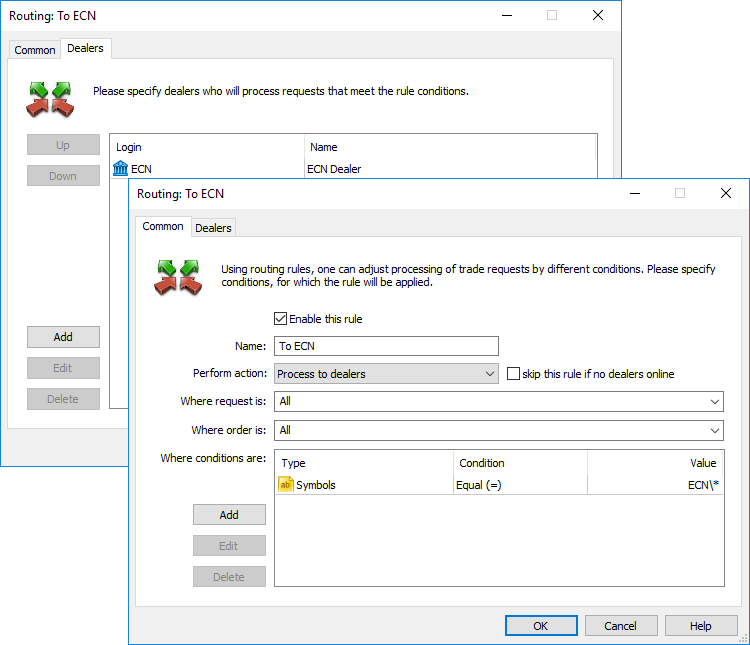
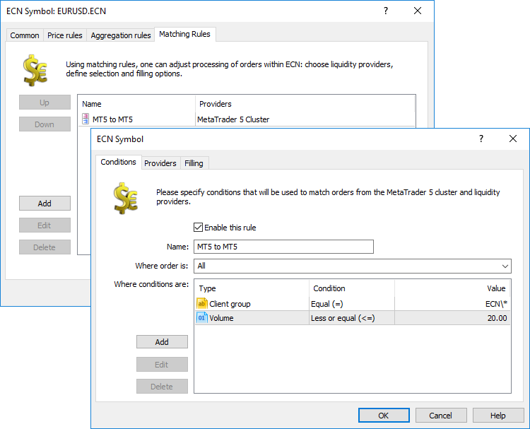
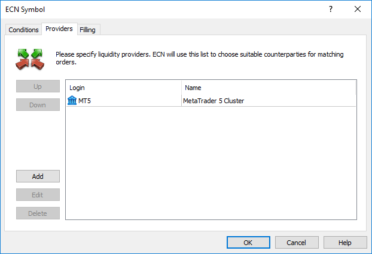
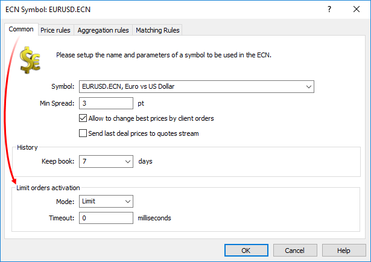
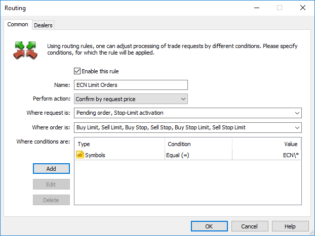
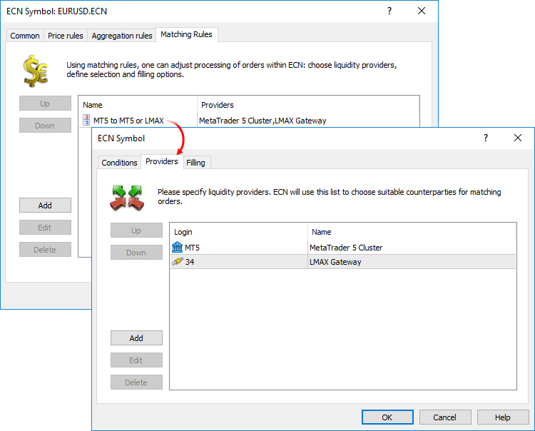
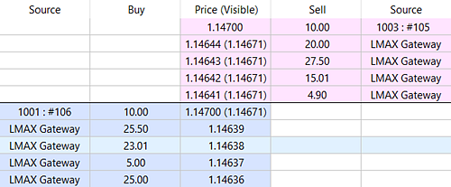
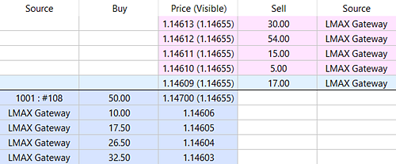
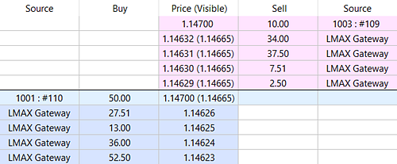
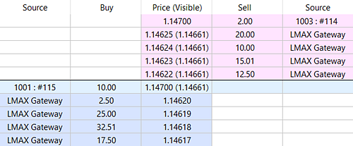

[🏠 Document Start](../../../README.md) / [MetaTrader 5 Trading Platform](../../../MetaTrader-5-Trading-Platform.md) / [Platform Setup](../../Platform-Setup.md) / [ECN](../ECN.md) / Order Matching

[Previous](Market-Depth-Journal.md) | [Next](Order-Execution.md)

# Order Matching (#order-matching)

The ECN feature allows matching of client orders placed from within the trading cluster. For example, if a client wants to buy a symbol at a certain price, the ECN will match an opposite order with an offer to sell the symbol at the specified price, and perform a trade. A counterparty in such a trade is either another client within the cluster or an external liquidity provider.

The ECN maintains a list of trading orders waiting to be matched. The list of orders is formed in accordance with individual ECN symbol settings. Orders can be selected based on the direction, client group, time, volume and other parameters. Once an opposite order is found for an order from the list, the ECN will match these orders.

> Matching is only allowed for operations with ECN symbol.

## Trade request routing in ECN (#routing)

To forward client requests to ECN for matching, set the appropriate [routing rule](../Routing.md). In general settings, specify which requests should be sent to ECN. For example, you may specify here all requests for ECN* symbols. The action to be applied to requests should be set to "Process to dealers". Next, on the "Dealers" tab select "ECN".

Requests forwarded to ECN in accordance with the routing rules, will be processed according to matching rules.

## Matching rules (#settings)

Matching settings are specified separately for each ECN symbol.

### Conditions (#conditions)

Add a new rule and set the conditions for selecting operations to be matched.

Select the operation type in the "Where order is" field: Buy, Sell. If you select both options, the ECN will match market Buy and Sell orders.

Set the conditions that the order must meet in order to be added to the matching list:

  * Date and time — processing orders received on the specific day and time.
  * Time — processing orders received at a specific time.
  * Day of week — processing orders received on a particular day of the week.
  * Client login — processing orders from the specific client.
  * Client group — processing orders placed by clients from the specific client group.
  * Volume — processing orders depending on their volume.

In the above example, Buy and Sell orders with the volume of 20 lots or less, placed by clients from ECN\* groups will be added to the matching list.

### Providers (#providers)

In the "Providers" tab, select providers who can serve as counterparties in client trades. You can select here clients from within the cluster, as well as external liquidity providers. Matching of orders with external providers is performed via [gateways](../Gateways.md), so you can select gateway configurations existing in the trading platform for external providers.

To match client orders within the cluster, select the 'MT5' option.

Within one rule, all providers have the same priority, while their position in the list does not matter. The procedure for choosing a provider during matching is described in the [relevant section (#second-side)](Order-Matching.md#second-side).

### Filling (#filling)

In the "Filling" section, set additional rules to forward orders to external liquidity providers. Please view the ["Order Filling" (#providers)](Order-Execution.md#providers) section for more details concerning these settings.

## Activation of limit orders and Take Profit levels (#limit-activation)

In common settings of the ECN symbol, you should specify the execution mode for limit orders which have not been [previously sent to the ECN (#limit-processing)](Order-Matching.md#limit-processing), as well as the Take Profit activation handling mode.

Set two parameters:

  * Mode — the type of the order which will be sent to ECN upon the activation of Take Profit orders, as well as limit orders which have not been previously sent to ECN. The mode can be "Limit" or "Market".
  * Timeout — the lifetime of an order sent to the ECN, in milliseconds. If the order is not executed within this time, this order should be canceled. In case of the re-activation of a limit order or the Take Profit level, a new order with the specified timeout will be sent to the ECN.

Limit orders sent to the ECN have the default timeout of 5 seconds.

> The settings in this section do not affect the activation of Stop Losses. They are always sent as market orders.

### Processing limit orders outside ECN (#limit-processing)

You can configure the ECN operation so as not to forward limit orders from within the cluster to be matched in the ECN before the activation of such orders. This can be done through the configuration of appropriate [routing rules (#routing)](Order-Matching.md#routing).

Add a rule to process placing of limit and stop limit orders, as well as the stop limit order activation without forwarding to a dealer (ECN). Note that the rules are processed in the top-down order. For example, if you have a general rule according to which all requests are sent to ECN, then a new rule for processing limit orders should be located above the general one in the list.

## Request matching algorithm (#rules)

The requests which can be matched via ECN are determined for each ECN symbol in accordance with the [matching rules (#conditions)](Order-Matching.md#conditions). The matching process is launched whenever the Market Depth is changed, i.e. when prices from a gateway are received, when a new order is placed, when symbol settings are changed, etc.

Before the matching is launched, the best liquid Bid and Ask prices are received from a non-aggregated Market Depth. If the prices are not received, it means that the Market Depth is empty, and the matching process is completed.

> The non-aggregated Market Depth contains all levels (including [hidden (#hidden)](Forming-Market-Depth.md#hidden) ones), which were passed to the ECN symbol from gateways and the trading cluster in accordance with the [aggregation settings](Forming-Market-Depth.md). [Minimum spread (#minimal-spread)](Forming-Market-Depth.md#minimal-spread) settings are not applied to this Market Depth state.

### Defining the request to be executed first (#defining-the-request-to-be-executed-first)

The system receives 4 element queues from the current non-aggregated Market Depth:

  * A queue of Market Buy orders
  * A queue of Market Sell orders
  * A queue of Limit Buy orders
  * A queue of Limit Sell orders

Orders in these queues are sorted in the price worsening order: Buy orders are sorted by price in descending order, Sell orders are sorted in ascending order. Limit orders within the same price level, as well as all market orders are sorted by age: those submitted earlier are located first.

ECN tries to execute market orders first. To do this, the system receives one oldest deal from each of the market order queues. If both orders are received, the oldest of them will be executed.

If there are no market orders, the system takes one oldest order with the best price from each limit order queue. Suppose, this is the order #1 Buy Limit with the price A and order #2 Sell Limit with the price B.

  * Distance of order #1 Buy Limit from the market price is calculated, i.e. at how many points above the market the client is ready to buy the financial instrument: ΔA = |A - Ask|.
  * Distance of order #2 Sell Limit from the market price is calculated, i.e. at how many points below the market the client is ready to Sell the financial instrument: ΔB = |B - Bid|.
  * If ΔA > ΔB, order #1 will be executed first.
  * If ΔB > ΔA, order #2 will be executed first.
  * If ΔA==ΔB, the order placed earlier will be executed first.

If neither a market nor a limit order could be received, the current matching cycle ends. A new cycle will be launched after the next change in the Market Depth state.

### Determining the second party of the deal (#second-side)

The second side of a deals can be determined using the following two algorithms: time-based and Round-Robin. The version to be used should be specified in [matching rules (#matching)](Order-Execution.md#matching). In the first case, the side is selected according to the age of orders: preference is given to the orders which were placed in the Market Depth earlier. Within the Roound-Robin algorithm, the second part for matched orders is determined evenly among all available liquidity providers. This algorithm ignores the opposite order creation time. The system matches bids and asks in a circular order, among all available providers, without time priority.

The system checks the [matching rules (#conditions)](Order-Matching.md#conditions) for the specified symbol and finds the first one suitable for the order, which has been selected for execution. If there is no such a rule, ECN will select the next oldest order from the queues in accordance with the earlier described algorithm.

  * If the 'Fill or Kill' (FOK) or 'Immediate or Cancel' (IOC) policy is used for the order for which no rule was found, such an order will be canceled at the next matching iteration, and "No liquidity" comment will be added. The above policies require immediate execution. If such an execution is not possible, the appropriate order must be canceled.
  * If the order has the 'Return' policy, such an order will stay in the Market Depth until the matching rule appears or until [expiration (#expiration)](../Symbols/Symbol-Settings/Trade.md#expiration) (if such an expiration is specified in the order), or until it is used as the second party for another order's deal.

The system receives a list of liquidity providers from the selected matching rule. The following actions are performed for each provider:

Time | Round-robin  
---|---  
A provider with the highest priority is determined — the one that offers the best execution price is selected. Arrays of opposite orders are checked in the order of age, the oldest order is taken first. The price is additionally checked for limit orders — an order with the best price is always used for them. The following is checked to make sure that the order can be used:

  * The system checks if the prices of the two orders match. The price is not checked for market orders.
  * The provider's order volume is additionally checked during the execution of a FOK order. It must be greater than or equal to the requested volume, so that the order can be completely filled in accordance with the policy. This check is not performed for 'Immediate or Cancel' and 'Return' orders.
  * If the provider's order has the FOK policy, its volume must be less than or equal to the current order, which is being executed.
  * If any of the checks fails, the next provider's order is selected.

If all checks have passed successfully, the selected order will be used for executing the source order. The current unfilled volume of the executed order will be reduced by the provider's order volume. The system will further go through the provider's orders till his or her last order, or until the matched order is fully executed. If after all the provider's orders the matched order is still not filled:

  * For IOC and Return orders, the system switches to the next provider to fill the required volume.
  * For FOK orders, the system resets the list of selected suitable orders and switches to the next provider. The policy requires immediate execution in the full volume, that is why all opposite orders belong to the same provider.

After going though all providers, the system checks if a proper list of orders has been collected for the execution of the source order: partial filling is enough for IOC and Return orders, while the full execution is required for FOK orders. If the list has been successfully compiled, it is sent to corresponding liquidity provider for execution. | The system checks arrays of opposite orders and selects orders with the best price among all providers. If one and the same best price in the Market Depth is represented by orders from several providers, the system selects all of them. The selected orders are sorted by the volumes of deals that were previously executed under the same contract through the relevant providers:

  * When matching orders, the ECN keeps an internal record of deal volumes executed via each of the provider. The volumes are accounted separately for each financial asset, for the entire period of the instrument circulation. Buy and sell deal volumes are accounted separately.
  * Orders of the providers, which have smaller volumes of previously matched deals the provider has, are more preferable for current matching.
  * For example, to match a Buy order, the system selects three sell orders with the best price of 1.0001, from three different providers. Earlier, 50 buy lots were matched to the first provider, 20 lots were matched to the second one, and 30 lots were matched to the third provider. Since the second provider has the smallest volume of matched orders, this provider's order will be selected as the second side for matching. This algorithm provides even distribution of matched orders between all providers.

The following is checked to make sure that the order can be used:

  * The system checks if the prices of the two orders match. The price is not checked for market orders.
  * The provider's order volume is additionally checked during the execution of a FOK order. It must be greater than or equal to the requested volume, so that the order can be completely filled in accordance with the policy. This check is not performed for 'Immediate or Cancel' and 'Return' orders.
  * If the provider's order has the FOK policy, its volume must be less than or equal to the current order, which is being executed.
  * If any of the checks fails, the next provider's order is selected.

  * If all checks have passed successfully, the selected order will be used for executing the source order. The current unfilled volume of the executed order will be reduced by the provider's order volume.

The system will further go through the providers till their last order, or until the matched order is fully executed. If after all the providers the matched order is still not filled:

  * For IOC and Return orders, the system switches to the next provider to fill the required volume. If there are no more providers, the system switches to the next price level. Again, the ECN sorts available orders by previously matched volume through these providers.
  * For FOK orders, the system resets the list of selected suitable orders of the current level and switches to the next one. The policy requires immediate execution in full volume, that is why all opposite orders must belong to the same provider and have the same price.

After going though all providers, the system checks if a proper list of orders has been collected for the execution of the source order: partial filling is enough for IOC and Return orders, while the full execution is required for FOK orders. If the list has been successfully compiled, it is sent to corresponding liquidity provider for execution.  
  

### Prices used for matching (#prices-used-for-matching)

When two orders are matched, the deal price can be equal to:

  * The price of the opposite limit order if one of the orders is a market order.
  * The price of the older order (the one placed earlier) if both orders are of the Limit type.

### Execution of further orders (#execution-of-further-orders)

Selection and filling of further orders is performed in accordance with the above algorithm until an iteration happens, during which no pair of orders is received for matched execution.

After the matching cycle, the system once again goes through all orders in ECN. Among them the system selects all market and limit orders with the IOC and FOK fill policy, which is currently not used in matching. These orders are canceled with the "No liquidity" comment, since their fill policy requires instant execution.

### Examples (#examples)

One matching rule is specified. Two providers are specified in it: the MetaTrader 5 cluster itself and the [LMAX gateway](../../Platform-Components/Gateways/LMAX-Global.md) ECN orders can be matched with these providers.

Let us consider a few market situations.

Normal execution through the first provider | Execution using several orders of the same provider  
---|---  
 The best liquid price is bid=1.14700, ask=1.14641. Since bid>ask, the matching process is launched. |  The best liquid price is bid=1.14700, ask=1.14609. Since bid>ask, the matching process is launched.  
The following queues of ECN orders are formed from the Market Depth:

  * Market Buy: empty
  * Market Sell: empty
  * Limit Buy: [#106 10.00 at 1.14700]
  * Limit Sell: [#105 10.00 at 1.14700]

| The following queues of ECN orders are formed from the Market Depth:

  * Market Buy: empty
  * Market Sell: empty
  * Limit Buy: [#108 50.00 at 1.14700]
  * Limit Sell: empty

  
Since there are no market orders, the system uses the limit order queues and receives the oldest orders with the best price:

  * #105 sell limit 10.00 at 1.14700
  * #106 buy limit 10.00 at 1.14700

| The only available order to be executed is selected — #108 50.00 at 1.14700.  
To choose between two orders, their distance from the market is calculated:

  * ΔA = |#105.price - bid| = |1.14700 - 1.14700| = 0 points
  * ΔB = |#106.price - ask| = |1.14700 - 1.14641| = 59 points

ΔB > ΔA, order #106 is selected for execution.  
The only matching rule 'MT5 to MT5 or LMAX' corresponds to order #106. The system starts checking providers in this rule. | The only matching rule 'MT5 to MT5 or LMAX' corresponds to order #108. The system starts checking providers in this rule.  
The MT5 provider is processed. The system searches for the provider's orders in the opposite Market Depth side and finds the order #105. | The MT5 provider is processed. The system searches for the provider's orders in the opposite Market Depth side. There are no such requests, and the system switches to the LMAX provider. The following requests are found for executing the 50-lot order:

  * sell limit 17.00 at 14609
  * sell limit 5.00 at 14610
  * sell limit 15.00 at 14611
  * sell limit 54.00 at 1.14612

  
Matching is performed and the following entry is added to the log:   
matched 10.00 at 1.14700, #106 buy limit 10.00 EURUSD.ECN at 1.14700  
vs #105 sell limit 10.00 at 1.14700 on '1003', by rule 'MT5 to MT5 or LMAX' | Matching is performed and the following entries are added to the log:   
matched 17.00 at 1.14609, #108 buy limit 50.00 EURUSD.ECN at 1.14700  
vs sell limit 17.00 at 1.14609 on 'LMAX Gateway', by rule 'MT5 to MT5 or LMAX'   
matched 5.00 at 1.14610, #108 buy limit 50.00 EURUSD.ECN at 1.14700  
vs sell limit 5.00 at 1.14610 on 'LMAX Gateway', by rule 'MT5 to MT5 or LMAX'   
matched 15.00 at 1.14611, #108 buy limit 50.00 EURUSD.ECN at 1.14700  
vs sell limit 15.00 at 1.14611 on 'LMAX Gateway', by rule 'MT5 to MT5 or LMAX'   
matched 13.00 at 1.14612, #108 buy limit 50.00 EURUSD.ECN at 1.14700  
vs sell limit 54.00 at 1.14612 on 'LMAX Gateway', by rule 'MT5 to MT5 or LMAX'  
  
Execution using several orders of different providers | Execution of a FOK order  
---|---  
 The best liquid price: bid=1.14700, ask=1.14629. Since bid>ask, the matching process is launched. |  The best liquid price: bid=1.14700, ask=1.14622. Since bid>ask, the matching process is launched.  
The following queues of ECN orders are formed from the Market Depth:

  * Market Buy: empty
  * Market Sell: empty
  * Limit Buy: [#110 50.00 at 1.14700]
  * Limit Sell: [#109 10.00 at 1.14700]

| The following queues of ECN orders are formed from the Market Depth:

  * Market Buy: empty
  * Market Sell: empty
  * Limit Buy: [#115 10.00 at 1.14700 (FOK)]
  * Limit Sell: [#114 2.00 at 1.14700]

  
Since there are no market orders, the system uses the limit order queues and receives the oldest orders with the best price:

  * #109 sell limit 10.00 at 1.14700
  * #110 buy limit 50.00 at 1.14700

| Since there are no market orders, the system uses the limit order queues and receives the oldest orders with the best price:

  * #114 sell limit 2.00 at 1.14700
  * #115 buy limit 10.00 at 1.14700 (FOK)

  
To choose between two orders, their distance from the market is calculated:

  * ΔA = |#109.price - bid| = |1.14700 - 1.14700| = 0 points
  * ΔB = |#110.price - ask| = |1.14700 - 1.14629| = 71 points

ΔB > ΔA, order #110 is selected for execution. | To choose between two orders, their distance from the market is calculated:

  * ΔA = |#114.price - bid| = |1.14700 - 1.14700| = 0 points
  * ΔB = |#115.price - ask| = |1.14700 - 1.14622| = 78 points

ΔB > ΔA, order #115 is selected for execution.  
The only matching rule 'MT5 to MT5 or LMAX' corresponds to order #110. The system starts checking providers in this rule. | The only matching rule 'MT5 to MT5 or LMAX' corresponds to order #115. The system starts checking providers in this rule.  
The MT5 provider is processed. The system searches for the provider's orders in the opposite Market Depth side and finds the order #109. | The MT5 provider is processed. The system searches for the provider's orders in the opposite Market Depth side and finds the order #114. Since the order #115 has the FOK fill type, and the opposite order volume is not enough for execution, the system switches to the LMAX provider and finds the order 'sell limit 12.50 at 14622'.  
Matching is performed and the following entry is added to the log:   
matched 10.00 at 1.14700, #110 buy limit 50.00 EURUSD.ECN at 1.14700  
vs #109 sell limit 10.00 at 1.14700 on '1003', by rule 'MT5 to MT5 or LMAX' | Matching is performed and the following entries are added to the log:   
matched 10.00 at 1.14622, #115 buy limit 10.00 EURUSD.ECN at 1.14700  
vs sell limit 12.50 at 1.14622 on 'LMAX Gateway', by rule 'MT5 to MT5 or LMAX'  
Since the source order is not fully executed after matching, the system switches to the next provider. The following requests are found for executing the remaining 40 lots:

  * sell limit 2.50 at 14629
  * sell limit 7.51 at 14630
  * sell limit 37.50 at 14631

  
Matching is performed and the following entries are added to the log:   
matched 2.50 at 1.14629, #110 buy limit 50.00 EURUSD.ECN at 1.14700  
vs sell limit 2.50 at 1.14629 on 'LMAX Gateway', by rule 'MT5 to MT5 or LMAX'   
matched 7.51 at 1.14630, #110 buy limit 50.00 EURUSD.ECN at 1.14700  
vs sell limit 7.51 at 1.14630 on 'LMAX Gateway', by rule 'MT5 to MT5 or LMAX'   
matched 29.99 at 1.14631, #110 buy limit 50.00 EURUSD.ECN at 1.14700  
vs sell limit 37.50 at 1.14631 on 'LMAX Gateway', by rule 'MT5 to MT5 or LMAX'  
  

###  (#)
